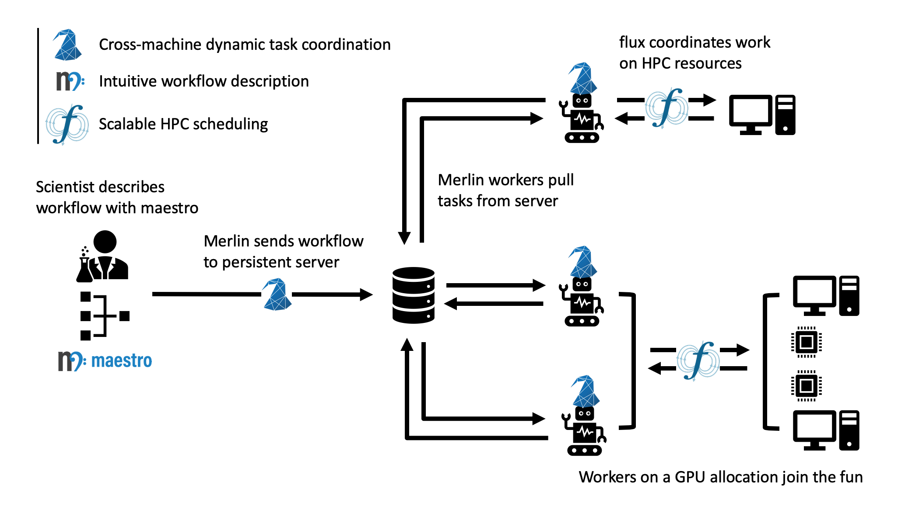

## A brief introduction to Merlin
Merlin is a tool for running machine learning based workflows. The goal of
Merlin is to make it easy to build, run, and process the kinds of large
scale HPC workflows needed for cognitive simulation.

At its heart, Merlin is a distributed task queuing system, designed to allow complex
HPC workflows to scale to large numbers of simulations 
(we've done 100 Million on the Sierra Supercomputer).

Why would you want to run that many simulations?
To become your own Big Data generator.

Data sets of this size can be large enough to train deep neural networks
that can mimic your HPC application, to be used for such
things as design optimization, uncertainty quantification and statistical
experimental inference. Merlin's been used to study inertial confinement
fusion, extreme ultraviolet light generation, structural mechanics and
atomic physics, to name a few.

How does it work?

In essence, Merlin coordinates complex workflows through a persistent
external queue server that lives outside of your HPC systems, but that
can talk to nodes on your cluster(s). As jobs spin up across your ecosystem,
workers on those allocations pull work from a central server, which
coordinates the task dependencies for your workflow. Since this coordination
is done via direct connections to the workers (i.e. not through a file
system), your workflow can scale to very large numbers of workers,
which means a very large number of simulations with very little overhead.

Furthermore, since the workers pull their instructions from the central
server, you can do a lot of other neat things, like having multiple
batch allocations contribute to the same work (think surge computing), or
specialize workers to different machines (think CPU workers for your
application and GPU workers that train your neural network). Another
neat feature is that these workers can add more work back to central
server, which enables a variety of dynamic workflows, such as may be
necessary for the intelligent sampling of design spaces or reinforcement
learning tasks.

Merlin does all of this by leveraging some key HPC and cloud computing
technologies, building off open source components. It uses
[maestro]( https://github.com/LLNL/maestrowf) to
provide an interface for describing workflows, as well as for defining
workflow task dependencies. It translates those dependencies into concrete
tasks via [celery](https://docs.celeryproject.org/), 
which can be configured for a variety of backend
technologies ([rabbitmq](https://www.rabbitmq.com) and
[redis](https://redis.io) are currently supported). Although not
a hard dependency, we encourage the use of
[flux](http://flux-framework.org) for interfacing with
HPC batch systems, since it can scale to a very large number of jobs.

The integrated system looks a little something like this:

In this example, here's how it all works:

1. The scientist describes her HPC workflow as a maestro DAG (directed acyclic graph)
"spec" file `workflow.yaml`
2. She then sends it to the persistent server with  `merlin run workflow.yaml` .
Merlin translates the file into tasks.
3. The scientist submits a job request to her HPC center. These jobs ask for workers via
the command `merlin run-workers workflow.yaml`.
4. Coffee break.
5. As jobs stand up, they pull work from the queue, making calls to flux to get the 
necessary HPC resources.
5. Later, workers on a different allocation, with GPU resources connect to the 
server and contribute to processing the workload.

The central queue server deals with task dependencies and keeps the workers fed.

For more details, check out the rest of the [documentation](https://merlin.readthedocs.io/).

Need help? <merlin@llnl.gov>

## Quick Start

Note: Merlin supports Python 3.6+.

To install Merlin and its dependencies, run:

    $ pip3 install merlin
    
Create your application config file:

    $ merlin config

That's it.

To run something a little more like what you're interested in,
namely a demo workflow that has simulation and machine learning,
first generate an example workflow:

    $ merlin example feature_demo

Then install the workflow's dependencies:

    $ pip install -r feature_demo/requirements.txt

Then process the workflow and create tasks on the server:

    $ merlin run feature_demo/feature_demo.yaml

And finally, launch workers that can process those tasks:

    $ merlin run-workers feature_demo/feature_demo.yaml

## Documentation
[**Full documentation**](http://merlin.readthedocs.io/) is available, or
run:

    $ merlin --help

(or add `--help` to the end of any sub-command you
want to learn more about.)

## Code of Conduct
Please note that Merlin has a
[**Code of Conduct**](.github/CODE_OF_CONDUCT.md). By participating in
the Merlin community, you agree to abide by its rules.

## License
Merlin is distributed under the terms of the [MIT LICENSE](https://github.com/LLNL/merlin/blob/main/LICENSE).

LLNL-CODE-797170
