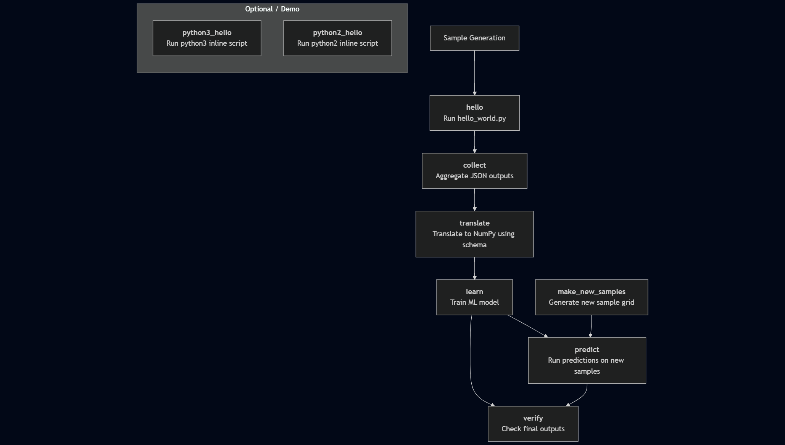

# Feature Demo Example

This page provides an overview of the `feature_demo` example workflow in Merlin. You can download all necessary files by running:

```bash
merlin example feature_demo
```

This command creates a directory named `feature_demo/` containing all the files required for the example. The directory structure will look like this:

```bash
feature_demo/
├── feature_demo.yaml
├── requirements.txt
└── scripts/
    ├── features.json
    ├── hello_world.py
    └── pgen.py
```

## File Descriptions

- `feature_demo.yaml` – The Merlin specification file that defines the entire workflow.
- `requirements.txt` – Lists the Python packages required to run the workflow.
- `scripts/features.json` – A schema file used during the feature translation stage to define which data to extract.
- `scripts/hello_world.py` – A simple Python script that simulates processing a sample; used as the core computation step.
- `scripts/pgen.py` – A [Parameter Generator](https://maestrowf.readthedocs.io/en/latest/Maestro/parameter_specification.html#parameter-generator-pgen) script used to programmatically generate parameter sets.

## Script Files

As mentioned above, there are three script files in this example. This section will dive into more detail on the contents of each file. You'll see exactly how each of these files are used in the [Spec Breakdown](#spec-breakdown) and [Running the Study](#running-the-study) sections below.

### The Features Schema File

The `features.json` file defines a schema for selecting which features to extract from the simulation outputs during the `translate` step. This file is passed to the `spellbook translate` command and ensures that only the specified inputs and outputs are retained in the final feature vector used for training and prediction.

```json title="features.json"
{
  "inputs": {
    "X": 0.0,
    "Z": 0.0
  },
  "outputs": {
    "X+Y+Z": 0.0
  }
}
```

This schema instructs Merlin to retain only:

- The `X` and `Z` values from the inputs section of the simulation output JSON
- The `X+Y+Z` result from the outputs section

This allows you to filter out unneeded fields like `Y` and `X*Y*Z` from downstream processing.

### The Hello World Python Script

The `hello_world.py` script is a lightweight simulation script that emulates a computational task. It accepts three numerical arguments (`X`, `Y`, and `Z`) via the command line, computes two derived outputs, and writes the results to a JSON file. The outputs are used by downstream stages like `collect`, `translate`, and `learn`.

This script is executed for each sample in the `hello` step of the workflow.

??? Example "Example Output File"

    ```json
    {
      "inputs": {"X": 1.0, "Y": 2.0, "Z": 3.0},
      "outputs": {
        "X+Y+Z": 6.0,
        "X*Y*Z": 6.0
      }
    }
    ```

#### Code Overview

```python
import argparse
import json
import sys
```

Imports standard Python modules for argument parsing, JSON writing, and error handling.

The `process_args` function:

```python
def process_args(args):
    results = {
        "inputs": {"X": args.X, "Y": args.Y, "Z": args.Z},
        "outputs": {
            "X+Y+Z": args.X + args.Y + args.Z,
            "X*Y*Z": args.X * args.Y * args.Z,
        },
    }

    with open(args.outfile, "w") as f:
        json.dump(results, f)
```

- Computes two derived quantities:

    - `X + Y + Z`
    - `X * Y * Z`

- Writes the results to a file (JSON format) named by `-outfile` argument (default: `hello_world_output.json`).

The `setup_argparse` function:

```python
def setup_argparse():
    parser = argparse.ArgumentParser(description="Process some integers.")
    parser.add_argument("X", metavar="X", type=float, help="The x dimension of the sample.")
    parser.add_argument("Y", metavar="Y", type=float, help="The y dimension of the sample.")
    parser.add_argument("Z", metavar="Z", type=float, help="The z dimension of the sample.")
    parser.add_argument("-outfile", help="Output file name", default="hello_world_output.json")
    return parser
```

- Defines the CLI arguments expected by the script.
- `X`, `Y`, `Z` are required positional arguments.
- `-outfile` is an optional keyword argument for the output filename.

The `main` function:

```python
def main():
    try:
        parser = setup_argparse()
        args = parser.parse_args()
        process_args(args)
        sys.exit()
    except Exception as ex:
        print(ex)
        sys.exit(1)
```

- Sets up argument parsing
- Runs the `process_args()` function
- Exits cleanly on success, or with an error message if something goes wrong

The bottom `if` statement:

```python
if __name__ == "__main__":
    main()
```

Ensures the script can be run as a standalone program.

### The Parameter Generator File

The `pgen.py` file defines a custom parameter generator using the [Maestro ParameterGenerator interface](https://maestrowf.readthedocs.io/en/latest/Maestro/parameter_specification.html#parameter-generator-pgen). It programmatically specifies a set of parameter values to be used when generating global parameters in the workflow.

This file gives you fine-grained control over how parameters are defined and varied across workflow runs—much more flexible than a static list in the YAML spec.

#### Code Overview

```python
from maestrowf.datastructures.core import ParameterGenerator
```

Imports the `ParameterGenerator` class from Maestro.

The `get_custom_generator` function:

```python
def get_custom_generator(env, **kwargs):
    p_gen = ParameterGenerator()
```

- Defines a function that returns a custom `ParameterGenerator` object.
- This function signature is required by Maestro.

```python
    params = {
        "X2": {"values": [1 / i for i in range(3, 6)], "label": "X2.%%"},
        "N_NEW": {"values": [2**i for i in range(1, 4)], "label": "N_NEW.%%"},
    }
```

- Two parameters are defined:

    - `X2` takes values `[1/3, 1/4, 1/5]`
    - `N_NEW` takes values `[2, 4, 8]`

- Labels use a string formatting token (`%%`) to name directories like `X2.0.3333`, `N_NEW.8`, etc.

```python
    for key, value in params.items():
        p_gen.add_parameter(key, value["values"], value["label"])

    return pgen
```

- Adds each parameter to the generator with its list of values and label pattern.
- Returns the fully constructed parameter generator to the calling workflow engine.

## Spec Breakdown

The `feature_demo` example showcases every major block that a Merlin spec file supports. Each block defines a piece of the workflow's behavior—from high-level descriptions and environment variables to specific workflow steps and parameter settings. Below, we break down what each block does and how it contributes to the overall workflow.

### Block: `description`

```yaml
description:
  name: $(NAME)
  description: Run 10 hello worlds.
```

[The `description` block](../user_guide/specification.md#the-description-block) gives your study a name and a short summary. Here, the name is set via the `NAME` environment variable (`feature_demo`), and the description gives a concise overview of the goal: to run 10 "hello world" simulations.

### Block: `env`

```yaml
env:
  variables:
    OUTPUT_PATH: ./studies
    N_SAMPLES: 10
    WORKER_NAME: demo_worker
    VERIFY_QUEUE: default_verify_queue
    NAME: feature_demo
    SCRIPTS: $(MERLIN_INFO)/scripts
    HELLO: $(SCRIPTS)/hello_world.py
    FEATURES: $(SCRIPTS)/features.json
```

[The `env` block](../user_guide/specification.md#the-env-block) sets up environment variables used throughout the spec. These values can be referenced using the `$(...)` syntax in later blocks. Key variables include:

- `N_SAMPLES`: Number of samples to generate
- `HELLO`: Path to the main processing script
- `FEATURES`: Path to the translation schema

This allows the spec to remain modular and DRY (Don't Repeat Yourself).

### Block: `batch`

```yaml
batch:
  type: local
```

[The `batch` block](../user_guide/specification.md#the-batch-block) specifies where and how the workflow will be executed. In this case, `type: local` tells Merlin to run all tasks on the local machine rather than submitting to an external scheduler (e.g., Slurm or Flux).

### Block: `user`

```yaml
user:
  study:
    run:
      hello: &hello_run
        cmd: python3 $(HELLO) -outfile hello_world_output_$(MERLIN_SAMPLE_ID).json $(X0) $(X1) $(X2)
        max_retries: 1
  python3:
    run: &python3_run
      cmd: |
        print("OMG is this in python?")
        print("Variable X2 is $(X2)")
      shell: /usr/bin/env python3
  python2:
    run: &python2_run
      cmd: |
        print "OMG is this in python2? Change is bad."
        print "Variable X2 is $(X2)"
      shell: /usr/bin/env python2
```

[The `user` block](../user_guide/specification.md#the-user-block) defines reusable `run` templates. These are essentially macros that can be referenced by later stages in the `study` block.

- `hello`: Runs the main script for a single sample
- `python3_run`: Demonstrates a simple command block using Python 3
- `python2_run`: Same idea, but with Python 2 for legacy comparison

Using anchors (`&...`) and references (`<<: *...`) avoids repeating commands multiple times.

### Block: `study`

[The `study` block](../user_guide/specification.md#the-study-block) defines the workflow pipeline—a series of stages, each with a name, description, and run command. These stages run in a directed order based on dependencies (via the depends field) and form the core of what the workflow does.

**Step 1: `hello`**

```yaml
- name: hello
  description: |
     process a sample with hello world
  run:
    <<: *hello_run
    task_queue: hello_queue
```

- **Purpose**: Runs `hello_world.py` on each sample in the sample file for each parameter set
- **Command** (via `*hello_run`):

    ```bash
    python3 $(HELLO) -outfile hello_world_output_$(MERLIN_SAMPLE_ID).json $(X0) $(X1) $(X2)
    ```

- **Output**: A JSON file for each sample containing computed values
- **Parallelization**: This step is executed independently for each sample using Celery workers

**Step 2: `collect`**

```yaml
- name: collect
  description: |
     process the output of the hello world samples, extracting specific features;
  run:
     cmd: |
         echo $(MERLIN_GLOB_PATH)
         echo $(hello.workspace)
         ls $(hello.workspace)/X2.$(X2)/$(MERLIN_GLOB_PATH)/hello_world_output_*.json > files_to_collect.txt
         spellbook collect -outfile results.json -instring "$(cat files_to_collect.txt)"
     depends: [hello_*]
     task_queue: collect_queue
```

- **Purpose**: Aggregates output JSONs from the `hello` step into one file
- **Input**: Output files from all `hello` sample runs
- **Output**: `results.json` file containing merged simulation outputs
- **Depends on**: All individual `hello` runs (denoted by `hello_*`)

**Step 3: `translate`**

```yaml
- name: translate
  description: |
     process the output of the hello world samples some more
  run:
     cmd: spellbook translate -input $(collect.workspace)/results.json -output results.npz -schema $(FEATURES)
     depends: [collect]
     task_queue: translate_queue
```

- **Purpose**: Filters and transforms the aggregated results into a NumPy `.npz` file using `features.json`
- **Input**: `results.json`, `features.json`
- **Output**: `results.npz` (a structured numeric array)
- **Depends on**: `collect`

**Step 4: `learn`**

```yaml
- name: learn
  description: |
     train a learner on the results
  run:
     cmd: spellbook learn -infile $(translate.workspace)/results.npz
     depends: [translate]
     task_queue: learn_queue
```

- **Purpose**: Trains a machine learning model (e.g., a random forest regressor) on the translated results
- **Input**: `results.npz`
- **Output**: `random_forest_reg.pkl`
- **Depends on**: `translate`

**Step 5: `make_new_samples`**

```yaml
- name: make_new_samples
  description: |
     make a grid of new samples to pass to the predictor
  run:
     cmd: spellbook make-samples -n $(N_NEW) -sample_type grid -outfile grid_$(N_NEW).npy
     task_queue: make_samples_queue
```

- **Purpose**: Creates a grid of new input samples to use for prediction
- **Input**: Uses `N_NEW` to define how many new samples to create
- **Output**: `grid_$(N_NEW).npy`
- **Independent**: No dependencies; runs in parallel with earlier stages

**Step 6: `predict`**

```yaml
- name: predict
  description: |
     make a new prediction from new samples
  run:
     cmd: spellbook predict -infile $(make_new_samples.workspace)/grid_$(N_NEW).npy -outfile prediction_$(N_NEW).npy -reg $(learn.workspace)/random_forest_reg.pkl
     depends: [learn, make_new_samples]
     task_queue: predict_queue
```

- **Purpose**: Uses the trained model to predict outputs for the new samples
- **Input**:

    - Trained model (`random_forest_reg.pkl`)
    - New sample grid (`grid_$(N_NEW).npy`)

- **Output**: `prediction_$(N_NEW).npy`
- **Depends on**: Both `learn` and `make_new_samples`

**Step 7: `verify`**

```yaml
- name: verify
  description: |
     if learn and predict succeeded, output a dir to signal study completion
  run:
     cmd: |
        if [[ -f $(learn.workspace)/random_forest_reg.pkl && -f $(predict.workspace)/prediction_$(N_NEW).npy ]]
        then
            touch FINISHED
            exit $(MERLIN_SUCCESS)
        else
            exit $(MERLIN_SOFT_FAIL)
        fi
     depends: [learn, predict]
     task_queue: $(VERIFY_QUEUE)
```

- **Purpose**: Verifies that the workflow succeeded by checking for key output files
- **Logic**: If both the model and prediction files exist, it creates a `FINISHED` flag
- **Output**: Touches a `FINISHED` file or fails gracefully with `MERLIN_SOFT_FAIL`
- **Depends on**: `learn` and `predict`

**Extra Stages: `python3_hello` and `python2_hello`**

```yaml
- name: python3_hello
  run:
    <<: *python3_run
    task_queue: pyth3_q

- name: python2_hello
  run:
    <<: *python2_run
    task_queue: pyth2_hello
```

- Not part of the main pipeline
- **Purpose**: Demo stages to show command execution with different Python shells
- **Useful for**: Illustrating advanced features like custom shells, template reuse, or debugging

### Block: `global.parameters`

```yaml
global.parameters:
  X2:
    values : [0.5]
    label  : X2.%%
  N_NEW:
    values : [10]
    label  : N_NEW.%%
```

[The `global.parameters` block](../user_guide/specification.md#the-globalparameters-block) defines parameters that affect the entire study. These values are used to sweep over combinations, create directory structures, and influence workflow logic. If you use the [`pgen.py` script](#the-parameter-generator-file) these values will be replaced with the generated parameters.

In this example:

- `X2` is used in the `hello` run
- `N_NEW` controls how many new samples are generated in `make_new_samples` and predicted in `predict`

This block supports parameter sweeps and works in tandem with the `merlin.samples` block (below).

### Block: `merlin`

```yaml
merlin:
  resources:
    task_server: celery
    overlap: False
    workers:
      $(WORKER_NAME):
        args: -l INFO --concurrency 3 --prefetch-multiplier 1 -Ofair
  samples:
    generate:
      cmd: |
        cp -r $(SPECROOT)/scripts $(SCRIPTS)
        spellbook make-samples -n $(N_SAMPLES) -outfile=$(MERLIN_INFO)/samples.npy
    file: $(MERLIN_INFO)/samples.npy
    column_labels: [X0, X1]
    level_max_dirs: 25
```

[The `merlin` block](../user_guide/specification.md#the-merlin-block) configures runtime resources (like workers) and sample management.

- `resources`:

    - Sets the `task_server` to Celery for distributed execution
    - Defines a worker (`demo_worker`) and passes it arguments for concurrency and task distribution

- `samples`:

    - Generates a `.npy` file containing samples of `X0` and `X1`
    - Specifies labels for sample columns and directory organization

This block is essential for defining how the workflow scales, executes, and organizes its data.

### The DAG and Full Spec

Below is the DAG generated by this `feature_demo` workflow.

<figure markdown>
  
  <figcaption>DAG of the Feature Demo Workflow</figcaption>
</figure>

By combining all of the blocks discussed above, our full spec file becomes:

???+ abstract "Full Hello Spec"

    ```yaml title="feature_demo.yaml"
    description:
        name: $(NAME)
        description: Run 10 hello worlds.

    batch:
        type: local

    env:
        variables:
            OUTPUT_PATH: ./studies
            N_SAMPLES: 10
            WORKER_NAME: demo_worker
            VERIFY_QUEUE: default_verify_queue
            NAME: feature_demo

            SCRIPTS: $(MERLIN_INFO)/scripts
            HELLO: $(SCRIPTS)/hello_world.py
            FEATURES: $(SCRIPTS)/features.json

    user:
        study:
            run:
                hello: &hello_run
                    cmd: |
                    python3 $(HELLO) -outfile hello_world_output_$(MERLIN_SAMPLE_ID).json $(X0) $(X1) $(X2)
                    max_retries: 1
        python3:
            run: &python3_run
                cmd: |
                print("OMG is this in python?")
                print("Variable X2 is $(X2)")
                shell: /usr/bin/env python3
        python2:
            run: &python2_run
                cmd: |
                print "OMG is this in python2? Change is bad."
                print "Variable X2 is $(X2)"
                shell: /usr/bin/env python2

    study:
        - name: hello
        description: |
            process a sample with hello world
        run:
            <<: *hello_run
            task_queue: hello_queue

        - name: collect
        description: |
            process the output of the hello world samples, extracting specific features;
        run:
            cmd: |
                echo $(MERLIN_GLOB_PATH)
                echo $(hello.workspace)
                ls $(hello.workspace)/X2.$(X2)/$(MERLIN_GLOB_PATH)/hello_world_output_*.json > files_to_collect.txt
                spellbook collect -outfile results.json -instring "$(cat files_to_collect.txt)"
            depends: [hello_*]
            task_queue: collect_queue

        - name: translate
        description: |
            process the output of the hello world samples some more
        run:
            cmd: spellbook translate -input $(collect.workspace)/results.json -output results.npz -schema $(FEATURES)
            depends: [collect]
            task_queue: translate_queue

        - name: learn
        description: |
            train a learner on the results
        run:
            cmd: spellbook learn -infile $(translate.workspace)/results.npz
            depends: [translate]
            task_queue: learn_queue

        - name: make_new_samples
        description: |
            make a grid of new samples to pass to the predictor
        run:
            cmd: spellbook make-samples -n $(N_NEW) -sample_type grid -outfile grid_$(N_NEW).npy
            task_queue: make_samples_queue

        - name: predict
        description: |
            make a new prediction from new samples
        run:
            cmd: spellbook predict -infile $(make_new_samples.workspace)/grid_$(N_NEW).npy -outfile prediction_$(N_NEW).npy -reg $(learn.workspace)/random_forest_reg.pkl
            depends: [learn, make_new_samples]
            task_queue: predict_queue

        - name: verify
        description: |
            if learn and predict succeeded, output a dir to signal study completion
        run:
            cmd: |
                if [[ -f $(learn.workspace)/random_forest_reg.pkl && -f $(predict.workspace)/prediction_$(N_NEW).npy ]]
                then
                    touch FINISHED
                    exit $(MERLIN_SUCCESS)
                else
                    exit $(MERLIN_SOFT_FAIL)
                fi
            depends: [learn, predict]
            task_queue: $(VERIFY_QUEUE)

        - name: python3_hello
        description: |
            do something in python
        run:
            <<: *python3_run
            task_queue: pyth3_q

        - name: python2_hello
        description: |
            do something in python2, because change is bad
        run:
            <<: *python2_run
            task_queue: pyth2_hello

    global.parameters:
        X2:
            values : [0.5]
            label  : X2.%%
        N_NEW:
            values : [10]
            label  : N_NEW.%%

    merlin:
        resources:
            task_server: celery
            overlap: False
            workers:
                $(WORKER_NAME):
                    args: -l INFO --concurrency 3 --prefetch-multiplier 1 -Ofair
        samples:
            generate:
                cmd: |
                    cp -r $(SPECROOT)/scripts $(SCRIPTS)

                    spellbook make-samples -n $(N_SAMPLES) -outfile=$(MERLIN_INFO)/samples.npy
            # can be a file glob of numpy sample files.
            file: $(MERLIN_INFO)/samples.npy
            column_labels: [X0, X1]
            level_max_dirs: 25
    ```

## Running the Study

To run this study we first need to send the tasks to the central server with:

```bash
merlin run feature_demo.yaml
```

If this ran successfully, you should see something similar to the following:

???+ success "Output From Sending Tasks to the Server"

    ```
           *      
       *~~~~~                                       
      *~~*~~~*      __  __           _ _       
     /   ~~~~~     |  \/  |         | (_)      
         ~~~~~     | \  / | ___ _ __| |_ _ __  
        ~~~~~*     | |\/| |/ _ \ '__| | | '_ \ 
       *~~~~~~~    | |  | |  __/ |  | | | | | |
      ~~~~~~~~~~   |_|  |_|\___|_|  |_|_|_| |_|
     *~~~~~~~~~~~                                    
       ~~~*~~~*    Machine Learning for HPC Workflows                                 
              

     v. 1.13.0b2

    [2025-07-02 13:36:44: INFO] Loading specification from path: /path/to/feature_demo/feature_demo.yaml
    [2025-07-02 13:36:44: INFO] Made dir(s) to output path '/path/to/feature_demo/studies'.
    [2025-07-02 13:36:44: INFO] OUTPUT_PATH: studies
    [2025-07-02 13:36:44: INFO] Study workspace is '/path/to/feature_demo/studies/feature_demo_20250702-133644'.
    [2025-07-02 13:36:44: INFO] Study with name 'feature_demo' does not yet have an entry in the database. Creating one.
    [2025-07-02 13:36:44: INFO] Logical worker with name 'demo_worker' and queues '{'[merlin]_predict_queue', '[merlin]_make_samples_queue', '[merlin]_hello_queue', '[merlin]_default_verify_queue', '[merlin]_pyth3_q', '[merlin]_collect_queue', '[merlin]_learn_queue', '[merlin]_pyth2_hello', '[merlin]_translate_queue'}' does not yet have an entry in the database. Creating one.
    [2025-07-02 13:36:45: INFO] Generating samples...
    [2025-07-02 13:36:50: INFO] Generating samples complete!
    [2025-07-02 13:36:50: INFO] Loading samples from 'samples.npy'...
    [2025-07-02 13:36:50: INFO] 10 samples loaded.
    [2025-07-02 13:36:50: INFO] Calculating task groupings from DAG.
    [2025-07-02 13:36:50: INFO] Converting graph to tasks.
    [2025-07-02 13:36:50: INFO] Launching tasks.
    WARNING:celery.backends.redis:
    Setting ssl_cert_reqs=CERT_NONE when connecting to redis means that celery will not validate the identity of the redis broker when connecting. This leaves you vulnerable to man in the middle attacks.
    ```

Now to execute these tasks, start the workers:

```bash
merlin run-workers feature_demo.yaml
```

The workers will immediately start processing the tasks that we sent to the server with the `merlin run` command.

Once successfully ran you should see ouptut similar to the following with some additional messages from Celery about task execution:

???+ success "Output From Running Workers"

    ```bash                                          
           *      
       *~~~~~                                       
      *~~*~~~*      __  __           _ _       
     /   ~~~~~     |  \/  |         | (_)      
         ~~~~~     | \  / | ___ _ __| |_ _ __  
        ~~~~~*     | |\/| |/ _ \ '__| | | '_ \ 
       *~~~~~~~    | |  | |  __/ |  | | | | | |
      ~~~~~~~~~~   |_|  |_|\___|_|  |_|_|_| |_|
     *~~~~~~~~~~~                                    
       ~~~*~~~*    Machine Learning for HPC Workflows                                 


      v. 1.13.0b2

    [2025-07-02 13:41:59: INFO] Loading specification from path: /usr/WS1/gunny/examples/feature_demo/feature_demo.yaml
    [2025-07-02 13:41:59: INFO] Launching workers from '/usr/WS1/gunny/examples/feature_demo/feature_demo.yaml'
    [2025-07-02 13:41:59: INFO] Logical worker with name 'demo_worker' and queues '{'[merlin]_pyth2_hello', '[merlin]_default_verify_queue', '[merlin]_make_samples_queue', '[merlin]_translate_queue', '[merlin]_pyth3_q', '[merlin]_learn_queue', '[merlin]_hello_queue', '[merlin]_collect_queue', '[merlin]_predict_queue'}' already has an entry in the database.
    [2025-07-02 13:41:59: INFO] Starting workers
    (merlin_py_3_13) (merlin3_12) [gunny@ruby963:feature_demo]$ [2025-07-02 13:42:02,276: WARNING] 
    Setting ssl_cert_reqs=CERT_NONE when connecting to redis means that celery will not validate the identity of the redis broker when connecting. This leaves you vulnerable to man in the middle attacks.

    
    -------------- celery@demo_worker.%ruby963 v5.5.2 (immunity)
    --- ***** ----- 
    -- ******* ---- Linux-4.18.0-553.56.1.1toss.t4.x86_64-x86_64-with-glibc2.28 2025-07-02 13:42:02
    - *** --- * --- 
    - ** ---------- [config]
    - ** ---------- .> app:         merlin:0x1554d70fe120
    - ** ---------- .> transport:   rediss://:**@cz-gunny-redismerlin.apps.czapps.llnl.gov:30070/0
    - ** ---------- .> results:     rediss://:**@cz-gunny-redismerlin.apps.czapps.llnl.gov:30070/0
    - *** --- * --- .> concurrency: 3 (prefork)
    -- ******* ---- .> task events: OFF (enable -E to monitor tasks in this worker)
    --- ***** ----- 
    -------------- [queues]
                    .> [merlin]_collect_queue exchange=[merlin]_collect_queue(direct) key=[merlin]_collect_queue
                    .> [merlin]_default_verify_queue exchange=[merlin]_default_verify_queue(direct) key=[merlin]_default_verify_queue
                    .> [merlin]_hello_queue exchange=[merlin]_hello_queue(direct) key=[merlin]_hello_queue
                    .> [merlin]_learn_queue exchange=[merlin]_learn_queue(direct) key=[merlin]_learn_queue
                    .> [merlin]_make_samples_queue exchange=[merlin]_make_samples_queue(direct) key=[merlin]_make_samples_queue
                    .> [merlin]_predict_queue exchange=[merlin]_predict_queue(direct) key=[merlin]_predict_queue
                    .> [merlin]_pyth2_hello exchange=[merlin]_pyth2_hello(direct) key=[merlin]_pyth2_hello
                    .> [merlin]_pyth3_q exchange=[merlin]_pyth3_q(direct) key=[merlin]_pyth3_q
                    .> [merlin]_translate_queue exchange=[merlin]_translate_queue(direct) key=[merlin]_translate_queue

    [tasks]
    . merlin.common.tasks.add_merlin_expanded_chain_to_chord
    . merlin.common.tasks.condense_status_files
    . merlin.common.tasks.expand_tasks_with_samples
    . merlin.common.tasks.merlin_step
    . merlin:chordfinisher
    . merlin:mark_run_as_complete
    . merlin:queue_merlin_study
    . merlin:shutdown_workers
    ```

Even after all tasks finish, the workers will remain running. This is expected—Celery workers persist until explicitly stopped. To verify that the workflow is done, look for a success message such as:

```bash
[2025-07-02 13:42:09,924: INFO] Task merlin:mark_run_as_complete[dc764be7-85ab-4a12-8417-348a34629dbc] succeeded in 0.03240930500032846s: 'Run Completed'
```

Additionally, to view the status of your workflow, you can use the `status` command:

```bash
merlin status feature_demo.yaml
```

If the workflow has finished processing this study then the workers are ready to be stopped:

```bash
merlin stop-workers
```

## Expected Output

After running the study, Merlin generates a structured output directory that captures all executed commands and their results for every step in the workflow.

To inspect the full directory structure, use:

```bash
tree studies/feature_demo_<timestamp>
```

You should see something similar to the following:

!!! success "Successful Directory Structure"

    ```bash
    studies/feature_demo_<timestamp>/
    ├── collect/
    │   └── X2.0.5/
    │       ├── collect_X2.0.5.sh     # Auto-generated script for the collect step
    │       ├── collect_X2.0.5.out    # Standard output log
    │       ├── collect_X2.0.5.err    # Standard error log
    │       ├── files_to_collect.txt  # Input file list for feature collection
    │       ├── results.json          # Collected features output
    │       ├── MERLIN_FINISHED       # Indicates task success
    │       ├── MERLIN_STATUS.json    # Task metadata and status
    │       └── status.lock           # Internal control file
    ├── hello/
    │   └── X2.0.5/
    │       ├── 00/ through 09/       # One subfolder per sample
    │       │   ├── hello_X2.0.5.sh
    │       │   ├── hello_X2.0.5.out
    │       │   ├── hello_X2.0.5.err
    │       │   ├── hello_world_output_<id>.json
    │       │   └── MERLIN_FINISHED
    │       ├── MERLIN_STATUS.json
    │       └── status.lock
    ├── learn/
    │   └── X2.0.5/
    │       ├── learn_X2.0.5.sh
    │       ├── learn_X2.0.5.out
    │       ├── learn_X2.0.5.err
    │       ├── random_forest_reg.pkl # Trained model file
    │       ├── MERLIN_FINISHED
    │       ├── MERLIN_STATUS.json
    │       └── status.lock
    ├── make_new_samples/
    │   └── N_NEW.10/
    │       ├── make_new_samples_N_NEW.10.sh
    │       ├── make_new_samples_N_NEW.10.out
    │       ├── make_new_samples_N_NEW.10.err
    │       ├── grid_10.npy           # New sample grid
    │       ├── MERLIN_FINISHED
    │       ├── MERLIN_STATUS.json
    │       └── status.lock
    ├── merlin_info/
    │   ├── cmd.sh, cmd.out, cmd.err         # Logs from sample generation
    │   ├── feature_demo.orig.yaml           # Original spec file
    │   ├── feature_demo.expanded.yaml       # Fully expanded spec with resolved variables
    │   ├── feature_demo.partial.yaml        # Spec after early evaluation
    │   ├── run_metadata.json                # Study-level metadata
    │   ├── samples.npy                      # Initial parameter samples
    │   └── scripts/
    │       ├── features.json
    │       ├── hello_world.py
    │       └── pgen.py
    ├── predict/
    │   └── N_NEW.10.X2.0.5/
    │       ├── predict_N_NEW.10.X2.0.5.sh
    │       ├── predict_N_NEW.10.X2.0.5.out
    │       ├── predict_N_NEW.10.X2.0.5.err
    │       ├── prediction_10.npy            # Output prediction
    │       ├── MERLIN_FINISHED
    │       ├── MERLIN_STATUS.json
    │       └── status.lock
    ├── python2_hello/
    │   └── X2.0.5/
    │       ├── python2_hello_X2.0.5.*
    │       ├── MERLIN_FINISHED
    │       ├── MERLIN_STATUS.json
    │       └── status.lock
    ├── python3_hello/
    │   └── X2.0.5/
    │       ├── python3_hello_X2.0.5.*
    │       ├── MERLIN_FINISHED
    │       ├── MERLIN_STATUS.json
    │       └── status.lock
    ├── translate/
    │   └── X2.0.5/
    │       ├── translate_X2.0.5.*
    │       ├── results.npz                 # Translated data in binary format
    │       ├── MERLIN_FINISHED
    │       ├── MERLIN_STATUS.json
    │       └── status.lock
    └── verify/
        └── N_NEW.10.X2.0.5/
            ├── verify_N_NEW.10.X2.0.5.*
            ├── prediction_10.npy
            ├── FINISHED                   # Final success marker for the entire study
            ├── MERLIN_FINISHED
            ├── MERLIN_STATUS.json
            └── status.lock
    ```

Each top-level directory (e.g., `hello`, `collect`, `translate`, etc.) corresponds to a step in the workflow defined in the `study` block of the spec file. Within each of these step directories, you’ll see a hierarchy based on parameter values (such as `X2.0.5` or `N_NEW.10`) used during that run.

Here’s what to look for in the output:

**Step Directories (`hello/`, `collect/`, etc.)**

Each of these directories contains:

- A subdirectory named after the parameter combination (e.g., `X2.0.5`) used for that step.
- Inside each subdirectory, you’ll find files for:

    - `MERLIN_FINISHED`: Indicates the task completed successfully.
    - `MERLIN_STATUS.json`: Contains metadata and status information for the task.
    - `status.lock`: Used internally to manage step execution.
    - `*.sh`: The generated shell script that was run.
    - `*.out` and `*.err`: Standard output and error logs.
    - Step-specific outputs (e.g., `hello_world_output_#.json`, `results.json`, `prediction_10.npy`, etc.).

**`merlin_info/` Directory**

This directory stores metadata about the study and a copy of the spec:

- `cmd.sh`, `cmd.out`, `cmd.err`: Logs from sample generation (`merlin.samples.generate.cmd`).
- `feature_demo.*.yaml`: Versions of the spec file (original, expanded, and partial).
- `samples.npy`: The generated parameter samples used in the study.
- `scripts/`: A copy of the original scripts used (e.g., `hello_world.py`, `pgen.py`, `features.json`).
- `run_metadata.json`: Metadata about the study run.

### Understanding Task Groupings

Some steps (like `hello`) are run for every sample (e.g., 10 runs in `00`–`09` subdirectories), while others like `learn`, `predict`, and `verify` are run once per parameter combination. Merlin handles this automatically based on the dependency graph and the sample configuration.

### Verifying Workflow Completion

If all tasks finished successfully, each step directory will contain the `MERLIN_FINISHED` flag, and the `verify/` directory will include the final `FINISHED` file. This is Merlin’s signal that the study completed all tasks correctly.

To confirm that everything ran as expected:

- Look for `MERLIN_FINISHED` in every terminal step.
- Verify `FINISHED` is present in the `verify/` subdirectory.
- Optionally, check `MERLIN_STATUS.json` files for detailed execution metadata (e.g., run time, retries, return codes).