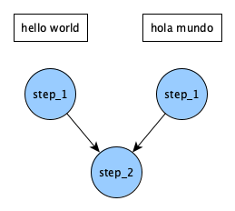
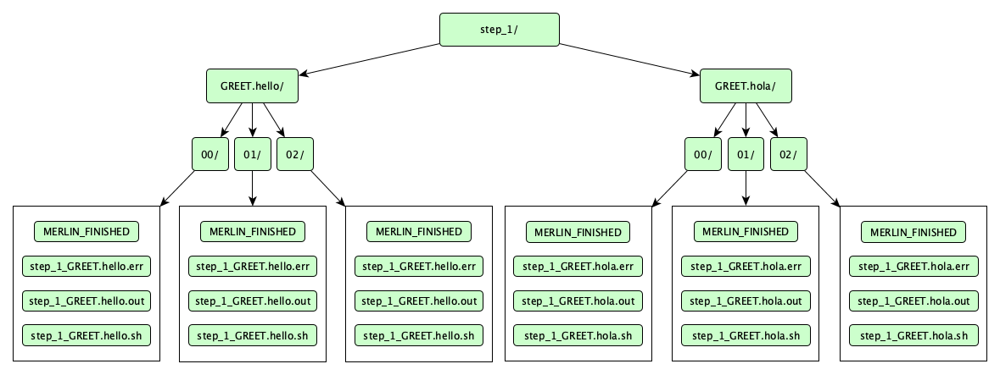

# Hello World Examples

In this page we'll cover everything related to the [Hello](#the-hello-example) and [Hello Samples](#the-hello-samples-example) examples. You can obtain all of the files related to these examples by running:

=== "hello"
    ```bash
    merlin example hello
    ```

=== "hello samples"
    ```
    merlin example hello_samples
    ```

After running either of those commands, a folder called `hello/` should be created which contains all of the files related to these examples. The directory structure should look like:

```bash
    hello
    |-- hello_samples.yaml
    |-- hello.yaml
    |-- make_samples.py
    |-- my_hello.yaml
    `-- requirements.txt
```

Here, `hello.yaml` is the spec file for a simple "hello world" workflow. Similarly, `hello_samples.yaml` also represents a "hello world" workflow but it adds additional complexity by introducing samples. The last workflow here called `my_hello.yaml` is a skeleton workflow that is intended to be filled out by following [Step 3 of the Tutorial](../tutorial/3_hello_world.md).

## The Hello Example

The hello example is a simple workflow that runs an echo command two times in order to say hello in two different languages. We can break this example down by looking at each block in the spec file.

### Spec Breakdown

For this example, we'll only need three blocks for our spec file: `description`, `global.parameters`, and `study`. Let's dive into what each of these blocks are.

#### Block: `description`

The `description` block always contains the `name` and a `description` of your study. This block is required in Merlin so you'll need it in every spec file you create.

```yaml
description:
    name: hello
    description: a very simple merlin workflow
```

#### Block: `global.parameters`

!!! info

    You can replace the `global.parameters` block by using the Parameter Generator (pgen) functionality. You can see the [Feature Demo](./feature_demo.md) for an instance of this or you can view [Maestro's Documentation on pgen](https://maestrowf.readthedocs.io/en/latest/Maestro/parameter_specification.html#parameter-generator-pgen) for more information on this feature.

The `global.parameters` block is where we place all of the parameters we'd like to vary in a study. Here we have two parameters named `GREET` and `WORLD` that each contain two values and a label. It's important to note that each variable must contain the same number of values.

The %% format used with each label will correspond to the values as they're processed. For instance, on the first iteration of any step using these parameters, the labels will be `GREET.hello` and `WORLD.world`. Then on the second iteration they'd change to `GREET.hola` and `WORLD.mundo`.

```yaml
global.parameters:
    GREET:
        values : ["hello","hola"]
        label  : GREET.%%
    WORLD:
        values : ["world","mundo"]
        label  : WORLD.%%
```

#### Block: `study`

The final block to look at here is the `study` block, which contains the definitions of how to run each step in our workflow.

Each step is denoted by a hyphen and must contain 3 keys: `name`, `description`, and `run`. The `name` and `description` keys always represent the name and description of the step. Here, the `run` key defines the command to run for this step, as well as any steps that this step depends on and the shell to use for running this step.

When Merlin reads in this block, it will generate a directed acyclic graph (DAG) by interpreting which steps depend on which other steps. This will determine the order that steps are ran.

```yaml
study:
    - name: step_1
        description: say hello
        run:
            cmd: echo "$(GREET), $(WORLD)!"

    - name: step_2
        description: print a success message
        run:
            cmd: print("Hurrah, we did it!")
            depends: [step_1_*]
            shell: /usr/bin/env python3
```

In `step_1`, we provide a command to run that will echo a message based on the parameters we defined in the `global.parameters` block. Since there are two values in each parameter (i.e. 2 parameter sets), this step will be run twice in total.

In `step_2`, we show that you don't have to use `/bin/bash` as your shell for a step. Here, we choose to use Python 3 as our shell instead. Notice we now have to use `print` rather than `echo` to achieve essentially the same functionality as in `step_1`.

In `step_2` we also provide another key `depends` that will tell Merlin to not run this step until the previous step(s) have finished. Notice how we add the `_*` to `step_1` here. What could that be doing? Well, if we omitted this and instead said `depends: [step_1]`, we'd be telling `step_2` to run for each parameter set, which in this case seems redundant. If you're more of a visual learner then what this means is that the DAG generated by our step definitions would be:

<figure markdown>
  
  <figcaption>2-Step DAG without "_*"</figcaption>
</figure>

By adding on the `_*` we're telling `step_2` to wait for both parameterized versions of `step_1` to complete before running. Our DAG now funnels so that `step_2` is only ran once:

<figure markdown>
  
  <figcaption>2-Step DAG with "_*"</figcaption>
</figure>

#### The Full Spec

By combining the three blocks discussed above, our full spec file becomes:

???+ abstract "Full Hello Spec"

    ```yaml title="hello.yaml"
    description:
        name: hello
        description: a very simple merlin workflow

    global.parameters:
        GREET:
            values : ["hello","hola"]
            label  : GREET.%%
        WORLD:
            values : ["world","mundo"]
            label  : WORLD.%%

    study:
        - name: step_1
        description: say hello
        run:
            cmd: echo "$(GREET), $(WORLD)!"

        - name: step_2
        description: print a success message
        run:
            cmd: print("Hurrah, we did it!")
            depends: [step_1_*]
            shell: /usr/bin/env python3
    ```

### Running the Study

When running a study we can either run it locally or in a distributed manner.

#### Running Locally

To run the study locally, we can use the command:

```bash
merlin run --local hello.yaml
```

If everything ran properly, your output at the command line will look something like this:

???+ success

    ```
           *      
       *~~~~~                                       
      *~~*~~~*      __  __           _ _       
     /   ~~~~~     |  \/  |         | (_)      
         ~~~~~     | \  / | ___ _ __| |_ _ __  
        ~~~~~*     | |\/| |/ _ \ '__| | | '_ \ 
       *~~~~~~~    | |  | |  __/ |  | | | | | |
      ~~~~~~~~~~   |_|  |_|\___|_|  |_|_|_| |_|
     *~~~~~~~~~~~                                    
       ~~~*~~~*    Machine Learning for HPC Workflows                                 
              


    [2023-12-19 17:41:02: INFO] Loading specification from path: /path/to/hello.yaml
    [2023-12-19 17:41:02: WARNING] Workflow specification missing 
    encouraged 'merlin' section! Run 'merlin example' for examples.
    Using default configuration with no sampling.
    [2023-12-19 17:41:02: INFO] OUTPUT_PATH: hello
    [2023-12-19 17:41:02: INFO] Study workspace is '/path/to/hello_20231219-174102'.
    [2023-12-19 17:41:02: INFO] Reading app config from file /path/to/.merlin/app.yaml
    [2023-12-19 17:41:02: INFO] Overriding default celery config with 'celery.override' in 'app.yaml':
            visibility_timeout:     86400
    [2023-12-19 17:41:02: INFO] Calculating task groupings from DAG.
    [2023-12-19 17:41:02: INFO] Converting graph to tasks.
    [2023-12-19 17:41:02: INFO] Launching tasks.
    WARNING:celery.backends.redis:
    Setting ssl_cert_reqs=CERT_NONE when connecting to redis means that celery will not validate the identity of the redis broker when connecting. This leaves you vulnerable to man in the middle attacks.

    [2023-12-19 17:41:02: INFO] Executing step 'step_1_GREET.hello.WORLD.world' in '/path/to/hello_20231219-174102/step_1/GREET.hello.WORLD.world'...
    [2023-12-19 17:41:02: INFO] Execution returned status OK.
    [2023-12-19 17:41:02: INFO] Step 'step_1_GREET.hello.WORLD.world' in '/path/to/hello_20231219-174102/step_1/GREET.hello.WORLD.world' finished successfully.
    [2023-12-19 17:41:02: INFO] Executing step 'step_1_GREET.hola.WORLD.mundo' in '/path/to/hello_20231219-174102/step_1/GREET.hola.WORLD.mundo'...
    [2023-12-19 17:41:02: INFO] Execution returned status OK.
    [2023-12-19 17:41:02: INFO] Step 'step_1_GREET.hola.WORLD.mundo' in '/path/to/hello_20231219-174102/step_1/GREET.hola.WORLD.mundo' finished successfully.
    [2023-12-19 17:41:02: INFO] Executing step 'step_2' in '/path/to/hello_20231219-174102/step_2'...
    [2023-12-19 17:41:02: INFO] Execution returned status OK.
    [2023-12-19 17:41:02: INFO] Step 'step_2' in '/path/to/hello_20231219-174102/step_2' finished successfully.
    ```

See the [Expected Output](#expected-output) section below for details on the file tree that was created by running this.

#### Running in a Distributed Manner

To run your workflow in a distributed manner, first make sure running `merlin info` doesn't show any errors. If it does, you'll need to setup your [Configuration](../user_guide/configuration/index.md).

Once your configuration is setup properly, we'll need to accomplish two things to run our study: sending tasks to the external server and starting workers to manage and run those tasks. Let's send the tasks to the server first:

```bash
merlin run hello.yaml
```

This command will process the steps defined in the `study` block in order to create the DAG that will determine the order that steps need to run in. Additionally, as mentioned before, it will queue tasks in the central server that our workers will pull from once we start them. If this ran properly you should see similar output to this:

???+ success "Output From Sending Tasks to the Server"

    ```
           *
       *~~~~~
      *~~*~~~*      __  __           _ _
     /   ~~~~~     |  \/  |         | (_)
         ~~~~~     | \  / | ___ _ __| |_ _ __
        ~~~~~*     | |\/| |/ _ \ '__| | | '_ \
       *~~~~~~~    | |  | |  __/ |  | | | | | |
      ~~~~~~~~~~   |_|  |_|\___|_|  |_|_|_| |_|
     *~~~~~~~~~~~
       ~~~*~~~*    Machine Learning for HPC Workflows


    [2023-12-19 17:45:36: INFO] Loading specification from path: /path/to/hello.yaml
    [2023-12-19 17:45:36: WARNING] Workflow specification missing 
    encouraged 'merlin' section! Run 'merlin example' for examples.
    Using default configuration with no sampling.
    [2023-12-19 17:45:36: INFO] OUTPUT_PATH: hello
    [2023-12-19 17:45:36: INFO] Study workspace is '/path/to/hello_20231219-174536'.
    [2023-12-19 17:45:36: INFO] Reading app config from file /path/to/.merlin/app.yaml
    [2023-12-19 17:45:36: INFO] Overriding default celery config with 'celery.override' in 'app.yaml':
            visibility_timeout:     86400
    [2023-12-19 17:45:36: INFO] Calculating task groupings from DAG.
    [2023-12-19 17:45:36: INFO] Converting graph to tasks.
    [2023-12-19 17:45:36: INFO] Launching tasks.
    WARNING:celery.backends.redis:
    Setting ssl_cert_reqs=CERT_NONE when connecting to redis means that celery will not validate the identity of the redis broker when connecting. This leaves you vulnerable to man in the middle attacks.
    ```

Now that our tasks are queued we need to start a worker to complete them. First, open a new terminal window. When we start the workers the process will run continuously until we tell the workers to stop. In order to be able to run commands to interact with these workers, we'll need to have two terminal windows: one with the workers running and another for whatever else we need to do.

Once we run the next command and the worker spins up, it will immediately start processing the tasks that we sent to the queue with `merlin run`. Let's start the workers now:

```bash
merlin run-workers hello.yaml
```

If this ran properly, you should see the following output plus additional log statements from celery to show that tasks are being processed:

???+ success "Output From Running Workers"
    ```
           *
       *~~~~~
      *~~*~~~*      __  __           _ _
     /   ~~~~~     |  \/  |         | (_)
         ~~~~~     | \  / | ___ _ __| |_ _ __
        ~~~~~*     | |\/| |/ _ \ '__| | | '_ \
       *~~~~~~~    | |  | |  __/ |  | | | | | |
      ~~~~~~~~~~   |_|  |_|\___|_|  |_|_|_| |_|
     *~~~~~~~~~~~
       ~~~*~~~*    Machine Learning for HPC Workflows


    [2023-12-19 17:46:46: INFO] Loading specification from path: /path/to/hello.yaml
    [2023-12-19 17:46:46: WARNING] Workflow specification missing 
    encouraged 'merlin' section! Run 'merlin example' for examples.
    Using default configuration with no sampling.
    [2023-12-19 17:46:46: INFO] Launching workers from '/path/to/hello.yaml'
    [2023-12-19 17:46:46: INFO] Starting workers
    [2023-12-19 17:46:46: INFO] Reading app config from file /path/to/.merlin/app.yaml

    
    -------------- celery@worker_name.%machine770 v5.3.4 (emerald-rush)
    --- ***** -----
    -- ******* ---- Linux-4.18.0-513.9.1.1toss.t4.x86_64-x86_64-with-glibc2.28 2023-12-19 17:46:49
    - *** --- * ---
    - ** ---------- [config]
    - ** ---------- .> app:         merlin:0x2aaab20619e8
    - ** ---------- .> transport:   amqps://user:**@server:5671//user
    - ** ---------- .> results:     redis://user:**@server:6379/0
    - *** --- * --- .> concurrency: 36 (prefork)
    -- ******* ---- .> task events: OFF (enable -E to monitor tasks in this worker)
    --- ***** -----
    -------------- [queues]
                    .> [merlin]_merlin  exchange=[merlin]_merlin(direct) key=[merlin]_merlin


    [tasks]
    . merlin.common.tasks.add_merlin_expanded_chain_to_chord
    . merlin.common.tasks.expand_tasks_with_samples
    . merlin.common.tasks.merlin_step
    . merlin:chordfinisher
    . merlin:queue_merlin_study
    . merlin:shutdown_workers

    [2023-12-19 17:46:47,549: INFO] Connected to amqps://user:**@server:5671//user
    [2023-12-19 17:46:47,599: INFO] mingle: searching for neighbors
    [2023-12-19 17:46:48,807: INFO] mingle: sync with 2 nodes
    [2023-12-19 17:46:48,807: INFO] mingle: sync complete
    [2023-12-19 17:46:48,835: INFO] celery@worker_name.%machine770 ready.
    ```

After all of the tasks in the workflow finish processing it will look like the celery workers are still up and running, and that's because they are. However, that doesn't mean that they're still processing tasks. To check if there are still tasks running, you can use the `status` command:

```bash
merlin status hello.yaml
```

If there are no tasks in the queues then our workers are done processing this study and are ready to be stopped:

```bash
merlin stop-workers
```

!!! note

    This is always necessary unless you'd like to keep your celery workers alive and listening for tasks constantly.

### Expected Output

Running a study will always produce an output directory containing the commands that were run in each step and the outputs produced. To view the entire output directory structure you can use:

```bash
tree hello_<timestamp>
```

The result should look like so:

!!! success "Successful Directory Structure"

    ```bash
    hello_<timestamp>/
        |-- merlin_info
        |   |-- hello.expanded.yaml
        |   |-- hello.orig.yaml
        |   `-- hello.partial.yaml
        |-- step_1
        |   |-- GREET.hello.WORLD.world
        |   |   |-- MERLIN_FINISHED
        |   |   |-- step_1_GREET.hello.WORLD.world.err
        |   |   |-- step_1_GREET.hello.WORLD.world.out
        |   |   `-- step_1_GREET.hello.WORLD.world.sh
        |   `-- GREET.hola.WORLD.mundo
        |       |-- MERLIN_FINISHED
        |       |-- step_1_GREET.hola.WORLD.mundo.err
        |       |-- step_1_GREET.hola.WORLD.mundo.out
        |       `-- step_1_GREET.hola.WORLD.mundo.sh
        `-- step_2
            |-- MERLIN_FINISHED
            |-- step_2.err
            |-- step_2.out
            `-- step_2.sh
    ```

The `merlin_info` directory contains three different forms of the spec file we provided:

1. `hello.expanded.yaml`: The entire spec with all the variables expanded
2. `hello.orig.yaml`: An exact copy of the spec we ran
3. `hello.partial.yaml`: A copy of the original spec plus all of the default values for each block that Merlin will fill in for you if omitted.

In the `step_1` directory notice that a subdirectory is created for each parameter set. Within each parameter set, and similarly for `step_2`, you'll find four files:

- A `MERLIN_FINISHED` file which is created at the time the step completes. If this file isn't there then either your step hasn't finished or there was a problem running this step and you should check the `.err` file.
- A `.sh` file containing the command that was run for this step
- A `.out` file containing the stdout generated from the command
- A `.err` file containing any errors generated from the command (hopefully none). This is one of the most useful places to look for debugging.

Let's check the outputs from our study:

```bash
cat hello_<timestamp>/step_1/*/*.out hello_<timestamp>/step_2/*.out
```

If everything ran properly, the output should look like so:

!!! success

    ```bash
    hello, world!
    hola, mundo!
    Hurrah, we did it!
    ```

Congratulations you've successfully run a Merlin study! The next section will cover how to add samples to this example.

## The Hello Samples Example

!!! note

    Before running this example, make sure to install the requirements with:

    ```bash
    pip install -r requirements.txt
    ```

The `hello samples` example is very similar to the `hello` example discussed above, but it has one key difference: the use of samples. While parameters are static, samples are generated dynamically and can be more complex data types. 

For this example, instead of echoing variations of "hello world", this time we'll say hello to a couple friends! We'll generate our friends' names (our samples) using the `make_samples.py` script.

### The Sample Generation Script

The `make_samples.py` script will be used in this example to generate a list of sample names and write them to a csv file for use in our workflow. This section will serve as a section-by-section breakdown of what this script entails.

```py title="generate_simulation_inputs.py" linenums="1"
import argparse

import names
import numpy as np
```

This first section is just handling the imports of the libraries that we'll need.

- The `argparse` library will handle how we pass arguments to this script

- The `names` library will be what we use to generate names

- The `numpy` library will be used to randomize our selection of generated names. We'll alias this library as `np` which is standard practice.

```py linenums="7"
# argument parsing
parser = argparse.ArgumentParser(description="Make some samples (names of people).")
parser.add_argument("--number", type=int, action="store", help="the number of samples you want to make")
parser.add_argument("--filepath", type=str, help="output file")
args = parser.parse_args()
```

The second section is where we utilize the `argparse` library to set up our arguments. The arguments to this script will be `--number` to represent the number of names to generate and `--filepath` to set the name of the file to store these samples in. This will make the usage of this script become:

```bash
python make_samples.py [-h] [--number NUMBER] [--filepath FILEPATH]
```

```py linenums="13"
# sample making
all_names = np.loadtxt(names.FILES["first:female"], dtype=str, usecols=0)
selected_names = np.random.choice(all_names, size=args.number)
```

The third section is where we use the `names` and `numpy` libraries to generate our sample names and randomly select them.

```py linenums="17"
result = ""
name_list = list(selected_names)
result = "\n".join(name_list)

with open(args.filepath, "w") as f:
    f.write(result)
```

The final section is where we concatenate the names that we've selected into a string where one name is on each line. We then take this string and write it to our file.

### Spec Breakdown

There are 3 big differences between this spec and the spec used for the hello example:

1. Switching the `WORLD` variable from a parameter to a column label
2. The addition of the `env` block
3. The addition of the `merlin` block

We need to remove the `WORLD` parameter from the `global.paremeters` block here since we're going to make it a sample column label instead. Since our samples here are randomly-generated names, the value of `WORLD` will go from being "world" or "mundo" to a name.

Removing the `WORLD` parameter makes our `global.parameters` block become:

```yaml
global.parameters:
    GREET:
        values : ["hello","hola"]
        label  : GREET.%%
```

Now let's take a look at the two new blocks that we're introducing: `env` and `merlin`.

#### Block: `env`

The `env` block is where we define values that will be substituted into the workflow. In the case of this example we define one variable `N_SAMPLES` to represent the number of samples to generate.

```yaml
env:
    variables:
        N_SAMPLES: 3
```

#### Block: `merlin`

The `merlin` block is where we can define sample generation and celery worker specifics. Each sample that we generate and use will be run for each parameter set (if used together). In this example we'll just use the default worker, so we can ignore the celery worker specifics and just focus on sample generation:

```yaml
merlin:
    samples:
        generate:
            cmd: python3 $(SPECROOT)/make_samples.py --filepath=$(MERLIN_INFO)/samples.csv --number=$(N_SAMPLES)
        file: $(MERLIN_INFO)/samples.csv
        column_labels: [WORLD]
``` 

In the command to generate the samples, we run our Python script and provide it with an output filepath to store the samples we generate. Additionally, we hand it the number of samples to generate. We then use the `file` key to tell Merlin where the generated samples will exist and the `column_labels` key to label the samples we just created.

!!! note

    For simplicity we left the column label as `WORLD`, just like in [The Hello Example](#the-hello-example). Best practice would likely be to rename this `NAME` and modify the `$(WORLD)` statement in `step_1` to be `$(NAME)`, but we'll keep it as `WORLD` here.

The `SPECROOT` and `MERLIN_INFO` variables are reserved variables in Merlin. To see more about them, consult the [Reserved Variables](../user_guide/variables.md#reserved-variables) section of the user guide.

#### The DAG and Full Spec

The introduction of samples will make the DAG generated by this workflow be slightly more complex than the `hello` example. Every sample that's generated in Merlin will run for each parameter set. So, since we have one parameter `GREET` with two values `hello` and `hola` (two parameter sets), and three sample names, we'll get six different runs of `step_1`:

<figure markdown>
  
  <figcaption>DAG With Samples</figcaption>
</figure>

With the modifications to the `global.parameters` block and the additions of the `env` and `merlin` blocks the full `hello_samples.yaml` spec becomes:

???+ abstract "Full Hello Samples Spec"

    ```yaml title="hello_samples.yaml"
    description:
        name: hello_samples
        description: a very simple merlin workflow, with samples

    env:
        variables:
            N_SAMPLES: 3

    global.parameters:
        GREET:
            values : ["hello","hola"]
            label  : GREET.%%

    study:
        - name: step_1
        description: say hello
        run:
            cmd: echo "$(GREET), $(WORLD)!"

        - name: step_2
        description: print a success message
        run:
            cmd: print("Hurrah, we did it!")
            depends: [step_1_*]
            shell: /usr/bin/env python3

    merlin:
        samples:
            generate:
                cmd: python3 $(SPECROOT)/make_samples.py --filepath=$(MERLIN_INFO)/samples.csv --number=$(N_SAMPLES)
            file: $(MERLIN_INFO)/samples.csv
            column_labels: [WORLD]
    ```

### Running the Study

As with the `hello` example (and any Merlin workflow), this study can be ran locally. However, here we'll be running in a distributed manner as that's the most common way to run Merlin workflows. Just as with the `hello` example, we'll need to queue up our tasks on the server and start up workers to manage these tasks.

To queue up the tasks:

```bash
merlin run hello_samples.yaml
```

If this ran successfully, you should see the following output:

???+ success "Output From Sending Tasks to the Server"

    ```
           *      
       *~~~~~                                       
      *~~*~~~*      __  __           _ _       
     /   ~~~~~     |  \/  |         | (_)      
         ~~~~~     | \  / | ___ _ __| |_ _ __  
        ~~~~~*     | |\/| |/ _ \ '__| | | '_ \ 
       *~~~~~~~    | |  | |  __/ |  | | | | | |
      ~~~~~~~~~~   |_|  |_|\___|_|  |_|_|_| |_|
     *~~~~~~~~~~~                                    
       ~~~*~~~*    Machine Learning for HPC Workflows                                 
              


    [2023-12-07 09:26:35: INFO] Loading specification from path: <path to example>/hello/hello_samples.yaml
    [2023-12-07 09:26:35: INFO] OUTPUT_PATH: hello
    [2023-12-07 09:26:35: INFO] Study workspace is '<path to example>/hello/hello_samples_<timestamp>'.
    [2023-12-07 09:26:35: INFO] Reading app config from file <path to configuration>/app.yaml
    [2023-12-07 09:26:35: INFO] Overriding default celery config with 'celery.override' in 'app.yaml':
            visibility_timeout:     86400
    [2023-12-07 09:26:36: INFO] Generating samples...
    [2023-12-07 09:26:36: INFO] Generating samples complete!
    [2023-12-07 09:26:36: INFO] Loading samples from 'samples.csv'...
    [2023-12-07 09:26:36: INFO] 3 samples loaded.
    [2023-12-07 09:26:36: INFO] Calculating task groupings from DAG.
    [2023-12-07 09:26:36: INFO] Converting graph to tasks.
    [2023-12-07 09:26:36: INFO] Launching tasks.
    WARNING:celery.backends.redis:
    Setting ssl_cert_reqs=CERT_NONE when connecting to redis means that celery will not validate the identity of the redis broker when connecting. This leaves you vulnerable to man in the middle attacks.
    ```

Now, just like with the `hello` example, we'll want to make sure a second terminal window is open for when we start our workers. Once you have a second window open, we can start the workers with:

```bash
merlin run-workers hello_samples.yaml
```

The workers will immediately start processing the tasks that we sent to the server with the `merlin run` command.

Once successfully ran you should see ouptut similar to the following with some additional messages from Celery about task execution:

???+ success "Output From Running Workers"

    ```
           *      
       *~~~~~                                       
      *~~*~~~*      __  __           _ _       
     /   ~~~~~     |  \/  |         | (_)      
         ~~~~~     | \  / | ___ _ __| |_ _ __  
        ~~~~~*     | |\/| |/ _ \ '__| | | '_ \ 
       *~~~~~~~    | |  | |  __/ |  | | | | | |
      ~~~~~~~~~~   |_|  |_|\___|_|  |_|_|_| |_|
     *~~~~~~~~~~~                                    
       ~~~*~~~*    Machine Learning for HPC Workflows                                 
              


    [2023-12-07 10:21:30: INFO] Loading specification from path: <path to example>/hello/hello_samples.yaml
    [2023-12-07 10:21:30: INFO] Launching workers from '<path to example>/hello/hello_samples.yaml'
    [2023-12-07 10:21:30: INFO] Starting workers
    [2023-12-07 10:21:30: INFO] Reading app config from file <path to configuration>/app.yaml
    [2023-12-07 10:21:33,446: WARNING] Setting ssl_cert_reqs=CERT_NONE when connecting to redis means that celery will not validate the identity of the redis broker when connecting. This leaves you vulnerable to man in the middle attacks.

    
    -------------- celery@default_worker.%ruby965 v5.3.4 (emerald-rush)
    --- ***** ----- 
    -- ******* ---- Linux-4.18.0-477.27.1.1toss.t4.x86_64-x86_64-with-glibc2.28 2023-12-07 10:21:33
    - *** --- * --- 
    - ** ---------- [config]
    - ** ---------- .> app:         merlin:0x15553ee391e0
    - ** ---------- .> transport:   amqps://<user>:**@<broker server>:<port>/<vhost>
    - ** ---------- .> results:     rediss://:**@<results backend server>:<port>/<db_num>
    - *** --- * --- .> concurrency: 56 (prefork)
    -- ******* ---- .> task events: OFF (enable -E to monitor tasks in this worker)
    --- ***** ----- 
    -------------- [queues]
                    .> [merlin]_merlin  exchange=[merlin]_merlin(direct) key=[merlin]_merlin
                    

    [tasks]
    . merlin.common.tasks.add_merlin_expanded_chain_to_chord
    . merlin.common.tasks.expand_tasks_with_samples
    . merlin.common.tasks.merlin_step
    . merlin:chordfinisher
    . merlin:queue_merlin_study
    . merlin:shutdown_workers
    ```

After all of the tasks in the workflow finish processing it will look like the celery workers are still up and running, and that's because they are. However, that doesn't mean that they're still processing tasks. To check if there are still tasks running, you can use the `status` command:

```bash
merlin status hello.yaml
```

If there are no tasks in the queues then our workers are done processing this study and are ready to be stopped:

```bash
merlin stop-workers
```

!!! note

    This is always necessary unless you'd like to keep your celery workers alive and listening for tasks constantly.

### Expected Output

Since we introduced samples in this example, the output directory structure will contain slightly more files than the `hello` example. The differences will be shown in `merlin_info/` and `step_1/`; `step_2` was not modified and therefore will have the same behavior as in the `hello` example.

Let's start by investigating the differences in the `merlin_info/` directory:

```bash
tree hello_samples_<timestamp>/merlin_info/
```

If everything ran properly, you should see an output directory structure like so:

!!! success "Successful `merlin_info/` Directory Structure"

    ```bash
    hello_samples_<timestamp>/merlin_info/
    ├── cmd.err
    ├── cmd.out
    ├── cmd.sh
    ├── hello_samples.expanded.yaml
    ├── hello_samples.orig.yaml
    ├── hello_samples.partial.yaml
    └── samples.csv
    ```

Similarly to the `hello` example from before, we have the 3 forms of our spec file in the `merlin_info/` directory. However, now we have 4 new files:

1. `cmd.sh`: This is the file containing the bash commands necessary for generating our samples. The contents of this file come directly from the `samples` section of the `merlin` block in our spec file.
2. `cmd.out`: This file will contain any stdout generated by the `cmd.sh` script.
3. `cmd.err`: This file will contain any stderr generated by the `cmd.sh` script (hopefully none). If your workflow had trouble generating samples then this should be the first place you look for more information on why an error occurred.
4. `samples.csv`: This is the file containing the samples that we generated. We provided this file name in the `samples` section of the `merlin` block in our spec file.

Now let's take a look at the `step_1` directory. If successfully ran, the directory should look like so:

<figure markdown>
  
  <figcaption>Successful Step 1 Directory Structure</figcaption>
</figure>

Numerically-named directories like `00/`, `01/`, and `02/` are sample directories. Notice that each sample ran for both of our parameter sets. In other words, the parameter set where `GREET=hello` and the parameter set where `GREET=hola` both ran all 3 samples that we generated.

Finally, let's check the outputs of our study:

```bash
cat hello_samples_<timestamp>/step_1/*/*/*.out hello_<timestamp>/step_2/*.out
```

The outputs should look similar to this (the names presented here will vary):

!!! success

    ```bash
    hello, TILDA!
    hello, EUN!
    hello, LOVE!
    hola, TILDA!
    hola, EUN!
    hola, LOVE!
    Hurrah, we did it!
    ```

Congratulations you've successfully run a Merlin study using samples! See the other examples for more features that Merlin offers.
