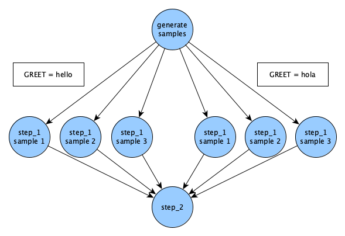
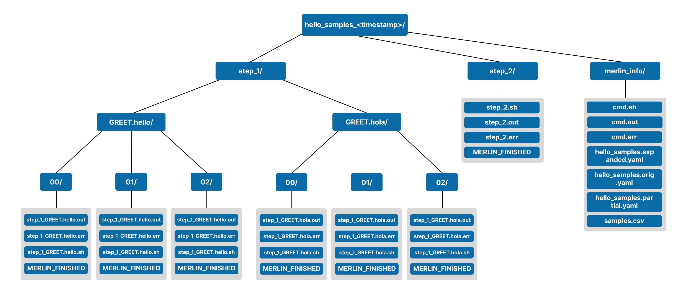

---
hide:
  - navigation
---

{ width="75%" id="landing-page-image" }

----

# Merlin

Empower your projects with Merlin, a cloud-based workflow manager designed to facilitate scalable and reproducible workflows, particularly suited for running many simulations and iterative procedures.

[On GitHub :fontawesome-brands-github:](https://github.com/LLNL/merlin){: .md-button .md-button--primary }

----

## Why Merlin?

Workflows, applications and machines are becoming more complex, but subject matter experts need to devote time and attention to their applications and often require fine command-line level control. Furthermore, they rarely have the time to devote to learning workflow systems.

With the expansion of data-driven computing, the HPC scientist needs to be able to run more simulations through complex multi-component workflows.

**Merlin targets HPC workflows that require many simulations**.[^1]

## Goals and Motivations

Merlin was created with the intention of providing flexible and reproducible workflows to users at a scale that could be much larger than [Maestro](https://maestrowf.readthedocs.io/en/latest/). Since Merlin is built as an extension of Maestro, we wanted to maintain [Maestro's Goals and Motivations](https://maestrowf.readthedocs.io/en/latest/#maestros-goals-and-motivations) while at the same time providing users the ability to become their own big-data generator.

In the pursuit of flexible and reproducible worflows, Merlin places a paramount emphasis on workflow provenance. We recognize the importance of understanding how workflows evolve, ensuring that every decision, parameter adjustment, and execution is meticulously documented. Workflow provenance is not just a feature for us; it's a fundamental element that contributes to the reliability and trustworthiness of your studies.

Merlin understands the dynamic nature of your work, especially when dealing with large-scale simulations. Our goal is to provide a platform that seamlessly scales to accommodate the computational demands of extensive simulations, ensuring that your workflows remain efficient and effective, even in the face of substantial computational requirements.

## Getting Started

### Install Merlin

Merlin can be [installed](./user_guide/installation.md) via pip in your own virtual environment.

1. First, create a virtual environment:

    ```bash
    python -m venv merlin_venv
    ```

2. Now activate the virtual environment:

    === "bash"

        ```bash
        source merlin_venv/bin/activate
        ```
    
    === "csh"

        ```csh
        source merlin_venv/bin/activate.csh
        ```

3. Finally, install Merlin with pip:

    ```bash
    pip install merlin
    ```

### Create a Containerized Server

First, let's create a folder to store our server files and our examples. We'll also move into this directory:

```bash
mkdir merlin_examples ; cd merlin_examples/
```

Now let's set up a [containerized server](./user_guide/configuration/containerized_server.md) that Merlin can connect to.

1. Initialize the server files:

    ```bash
    merlin server init
    ```

2. Start the server:

    ```bash
    merlin server start
    ```

3. Copy the `app.yaml` configuration file from `merlin_server/` to your current directory:

    ```bash
    cp merlin_server/app.yaml .
    ```

4. Check that your server connection is working properly:

    ```bash
    merlin info
    ```

    Your broker and results server should both look like so:

    !!! success

        ```bash
        .
        .
        .
        Checking server connections:
        ----------------------------
        broker server connection: OK
        results server connection: OK
        .
        .
        .
        ```

### Run an Example Workflow

Let's download Merlin's built-in ["Hello, World!" example](./examples/hello.md):

```bash
merlin example hello
```

Now that we've downloaded the example, enter the `hello/` directory:

```bash
cd hello/
```

In this directory there are files named `hello.yaml` and `hello_samples.yaml`. These are what are known as Merlin [specification (spec) files](./user_guide/specification.md). The `hello.yaml` spec is a very basic example that will also work with [Maestro](https://maestrowf.readthedocs.io/en/latest/). We'll focus on `hello_samples.yaml` here as it has more Merlin specific features:

```yaml
description:  # (1)
    name: hello_samples
    description: a very simple merlin workflow, with samples

env:
    variables:  # (2)
        N_SAMPLES: 3

global.parameters:
    GREET:  # (3)
        values : ["hello","hola"]
        label  : GREET.%%

study:
    - name: step_1
      description: say hello
      run:  # (4)
          cmd: |
            echo "$(GREET), $(WORLD)!"

    - name: step_2
      description: print a success message
      run:  # (5)
          cmd: print("Hurrah, we did it!")
          depends: [step_1_*]  # (6)
          shell: /usr/bin/env python3

merlin:
    resources:
        workers:  # (7)
            demo_worker:
                args: -l INFO --concurrency=1
                steps: [all]
    samples:  # (8)
        generate:
            cmd: python3 $(SPECROOT)/make_samples.py --filepath=$(MERLIN_INFO)/samples.csv --number=$(N_SAMPLES)
        file: $(MERLIN_INFO)/samples.csv
        column_labels: [WORLD]
```

1. Mandatory name and description fields to encourage well documented workflows
2. Define single valued variable tokens for use in your workflow steps
3. Define parameter tokens of the form `$(NAME)` and lists of values to use in your steps such that Merlin can parameterize them for you
4. Here, `cmd` is a multline string written in bash to harness the robust existing ecosystem of tools users are already familiar with
5. Here, `cmd` is a single line string written in python. Merlin allows users to modify the `shell` that `cmd` uses to execute a step
6. Specify step dependencies using steps' `name` values to control execution order
7. Define custom workers to process your workflow in the most efficient manner
8. Generate samples to be used throughout your workflow. These can be used similar to parameters; use the [`$(SAMPLE_NAME)` syntax](./user_guide/variables.md#token-syntax) (as can be seen in `step_1`)

We have two ways to run the `hello_samples.yaml` example:

=== "In a Distributed Manner"

    Send tasks to the broker:

    ```bash
    merlin run hello_samples.yaml
    ```

    Start the workers to execute the tasks:

    ```bash
    merlin run-workers hello_samples.yaml
    ```

=== "Locally"

    Execute the tasks locally without needing to comminucate with the containerized server we just established:

    ```bash
    merlin run --local hello_samples.yaml
    ```

Running the workflow will first convert your steps into a task execution graph and then create a workspace directory with the results of running your study.

The directed acyclic graph (DAG) that's created for the `hello_samples.yaml` example will look like so:



If ran successfully, a workspace for your run should've been created with the name `hello_samples_<timestamp>/`. Below shows the expected contents of this workspace:

!!! success "Contents of `hello_samples_<timestamp>`"

    <!--  -->
    

## Release

Merlin is released under an MIT license. For more information, please see the [LICENSE](https://github.com/LLNL/merlin/blob/develop/LICENSE).

``LLNL-CODE-797170``

[^1]: See [*Enabling Machine Learning-Ready HPC Ensembles with Merlin*](https://arxiv.org/abs/1912.02892) for a paper that mentions a study with up to 40 million simulations.