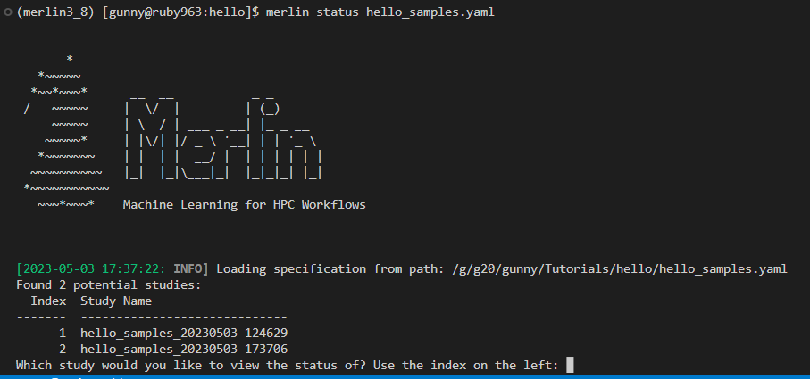
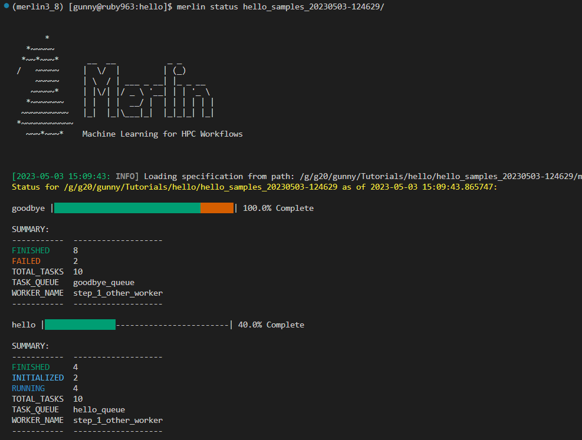
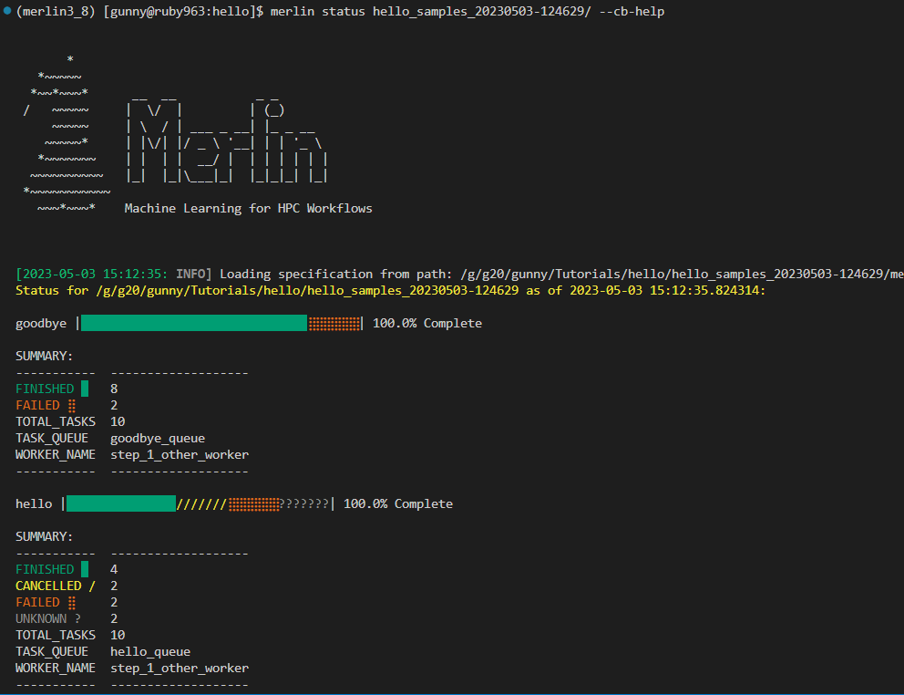
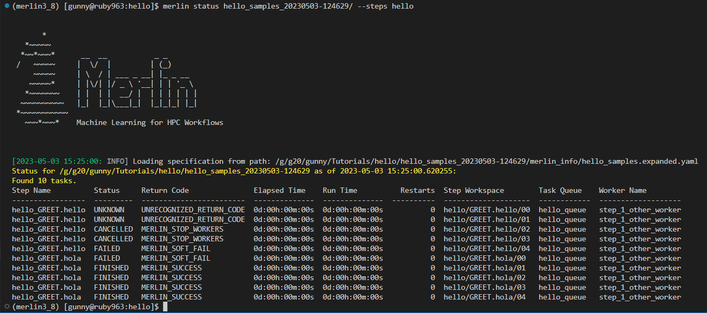
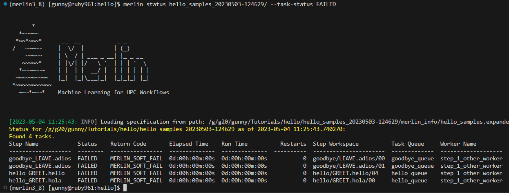
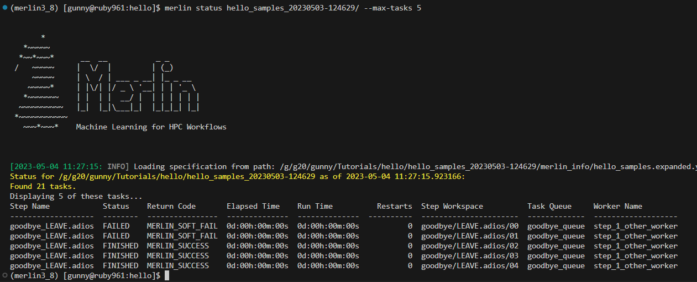
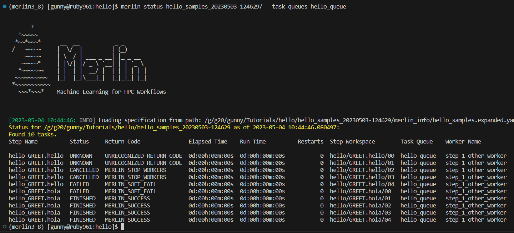
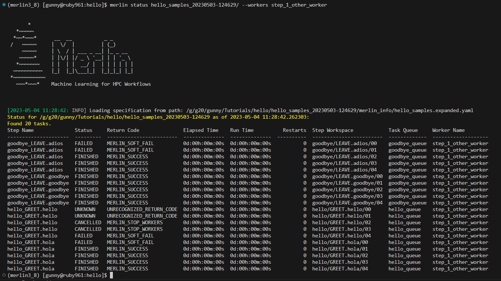

Command line
============

The merlin executable defines a number of commands to create tasks,
launch workers to run the tasks and remove tasks from the task server.
The tasks are communicated to a task server, or broker, that are then
requested by workers on an allocation to run. The celery python module
is used to implement the tasks and worker functionality.

Help (``merlin --help``)
------------------------

Descriptions of the Merlin commands are outputted when the ``-h`` or
``--help`` commands are used.

.. code:: bash

    $ merlin [<command name>] --help

Version (``merlin --version``)
------------------------------

See the version by using the ``--version`` or ``-v`` flag.

.. code:: bash

    $ merlin --version

Log Level (``merlin -lvl debug``)
---------------------------------
More information, generally pertaining to bugs, can be output by increasing the logging level
using the ``-lvl`` or ``--level`` argument.

Options for the level argument are: debug, info, warning, error.

.. code:: bash

    $ merlin -lvl debug run <input.yaml>

Create the Config File (``merlin config``)
------------------------------------------

Create a default config file in the ${HOME}/.merlin directory using the ``config`` command. This file
can then be edited for your system configuration.

.. code:: bash

    $ merlin config [--task_server]  [--output_dir <dir>] [--broker <rabbitmq|redis>]

The ``--task_server`` option will select the appropriate configuration for the
given task server. Currently only celery is implemented.

The ``--output_dir`` or ``-o`` will output the configuration in the given directory.
This file can then be edited and copied into ${HOME}/.merlin.

The ``--broker`` command will write the initial ``app.yaml`` config file
for a ``rabbitmq`` or ``redis`` broker. The default is ``rabbitmq``.
The backend will be ``redis`` in
both cases. The redis backend in the ``rabbitmq`` config shows the
use on encryption for the backend.

Generate working examples (``merlin example``)
----------------------------------------------

If you want to run an example workflow, use Merlin's ``merlin example``:

.. code:: bash

    $ merlin example list

This will list the available example workflows and a description for each one. To
select one:

.. code:: bash

    $ merlin example <example_name>

This will copy the example workflow to the current working directory. It is
possible to specify another path to copy to.

.. code:: bash

    $ merlin example <example_name> -p path/to/dir

If the specified directory does not exist Merlin will automatically create it.

This will generate the example workflow at the specified location, ready to be run.

Information (``merlin info``)
-----------------------------

Information about your merlin and python configuration can be printed out by using the 
``info`` command. This is helpful for debugging. Included in this command
is a server check which will check for server connections. The connection
check will timeout after 60 seconds.

.. code:: bash

    $ merlin info

Monitor (``merlin monitor``)
----------------------------
Batch submission scripts may not keep the batch allocation alive
if there is not a blocking process in the submission script. The
``merlin monitor`` command addresses this by providing a blocking process that
checks for tasks in the queues every (sleep) seconds. When the queues are empty, the 
blocking process will exit and allow the allocation to end.

.. code:: bash

    $ merlin monitor <input.yaml> [--steps <steps>] [--vars <VARIABLES=<VARIABLES>>] [--sleep <duration>][--task_server celery]

Use the ``--steps`` option to identify specific steps in the specification that you want to query.

The ``--vars`` option will specify desired Merlin variable values to override
those found in the specification. The list is space-delimited and should be given after
the input yaml file.
``Example: --vars LEARN=path/to/new_learn.py EPOCHS=3``

The ``--sleep`` argument is the duration in seconds between checks
for workers. The default is 60 seconds.

The only currently available option for ``--task_server`` is celery, which is the default when this flag is excluded.

The ``monitor`` function will check for celery workers for up to
10*(sleep) seconds before monitoring begins. The loop happens when the 
queue(s) in the spec contain tasks, but no running workers are detected.
This is to protect against a failed worker launch.

Purging Tasks (``merlin purge``)
--------------------------------

Once the merlin run command succeeds, the tasks are now on the task server
waiting to be run by the workers. If you would like to remove the tasks from
the server, then use the purge command.

.. attention::

    Any tasks reserved by workers will not be purged from the queues. All
    workers must be first stopped so the tasks can be returned to the task
    server and then they can be purged.

    You probably want to use ``merlin stop-workers`` first.

To purge all tasks in all queues defined by the workflow yaml file from the
task server, run:

.. code:: bash

    $ merlin purge <input.yaml> [-f] [--steps <steps>] [--vars <VARIABLES=<VARIABLES>>]

This will ask you if you would like to remove the tasks, you can use the
``-f`` option if you want to skip this.

If you have different queues in your workflow yaml file, you can
choose which queues are purged by using the ``--steps`` argument and
giving a space-delimited list of steps.

.. code:: bash

    $ merlin purge <input.yaml> --steps step1 step2

The ``--vars`` option will specify desired Merlin variable values to override
those found in the specification. The list is space-delimited and should be given after
the input yaml file.
``Example: --vars QUEUE_NAME=new_queue EPOCHS=3``

.. _query-workers:

Searching for any workers (``merlin query-workers``)
----------------------------------------------------

If you want to see all workers that are currently connected to
the task server you can use:

.. code:: bash

    $ merlin query-workers

This will broadcast a command to all connected workers and print
the names of any that respond and the queues they're attached to.
This is useful for interacting with workers, such as via
``merlin stop-workers --workers``.

The ``--queues`` option will look for workers associated with the
names of the queues you provide here. For example, if you want to
see the names of all workers attached to the queues named ``demo``
and ``merlin`` you would use:

.. code-block::

    merlin query-workers --queues demo merlin

The ``--spec`` option will query for workers defined in the spec
file you provide. For example, if ``simworker`` and ``nonsimworker``
are defined in a spec file called ``example_spec.yaml`` then to query
for these workers you would use:

.. code-block::

    merlin query-workers --spec example_spec.yaml

The ``--workers`` option will query for workers based on the worker
names you provide here. For example, if you wanted to query a worker
named ``step_1_worker`` you would use:

.. code-block::

    merlin query-workers --workers step_1_worker

This flag can also take regular expressions as input. For instance,
if you had several workers running but only wanted to find the workers
whose names started with ``step`` you would use:

.. code-block::

    merlin query-workers --workers ^step

Restart the workflow (``merlin restart``)
-----------------------------------------

To restart a previously started merlin workflow, use the  ``restart`` command
and the path to root of the merlin workspace that was generated during the
previously run workflow. This will define the tasks and queue
them on the task server also called the broker.

.. code:: bash

    $ merlin restart [--local] <path/to/workspace_timestamp>

Merlin currently writes file called ``MERLIN_FINISHED`` to the directory of each
step that was finished successfully. It uses this to determine which steps to
skip during execution of a workflow.

The ``--local`` option will run tasks sequentially in your current shell.

Run the workflow (``merlin run``)
---------------------------------

To run the merlin workflow use the  ``run`` command and the path to the
input yaml file ``<input.yaml>``. This will define the tasks and queue
them on the task server also called the broker.

.. code:: bash

    $ merlin run [--local] <input.yaml> [--vars <VARIABLES=<VARIABLES>>] [--samplesfile <SAMPLES_FILE>] [--dry]

The ``--local`` option will run tasks sequentially in your current shell.

The ``--vars`` option will specify desired Merlin variable values to override
those found in the specification. The list is space-delimited and should be given after
the input yaml file.
``Example: --vars LEARN=path/to/new_learn.py EPOCHS=3``

The  ``--samplesfile`` will allow the  user to specify a file containing samples. Valid choices: .npy,
.csv, .tab. Should be given after the input yaml file.

The ``--no-errors`` option is used for testing, it will silence the errors thrown
when flux is not present.

Dry Run
^^^^^^^

'Dry run' means telling workers to create a study's workspace and all of its necessary
subdirectories and scripts (with variables expanded) without actually executing
the scripts.

To dry-run a workflow, use ``--dry``:

.. code:: bash

    $ merlin run --local --dry <input.yaml>

In a distributed fashion:

.. code:: bash

    $ merlin run --dry <input.yaml> ; merlin run-workers <input.yaml>

You can also specify dry runs from the workflow specification file:

.. code:: yaml

    batch:
        dry_run: True

If you wish to execute a workflow after dry-running it, simply use ``restart``.

Run the Workers (``merlin run-workers``)
----------------------------------------

The tasks queued on the broker are run by a collection of workers. These
workers can be run local in the current shell or in parallel on a batch
allocation.
The workers are launched using the
``run-workers`` command which reads the configuration for the worker launch
from the ``<input.yaml>`` file.
The batch and merlin resources section are both used to configure the
worker launch.
The top level batch section can be overridden in the merlin
workers resource section.
Parallel workers should be scheduled using the system's batch scheduler.
Once the workers are running, tasks from the broker will be processed.

To launch workers for your workflow:

.. code:: bash

    $ merlin run-workers [--echo]  <input.yaml> [--worker-args <worker args>] [--steps <WORKER_STEPS>] [--vars <VARIABLES=<VARIABLES>>]

The ``--echo`` option will echo the celery workers run command to stdout and not run any workers.

The ``--worker-args`` option will pass the values, in quotes, to the celery workers. Should be given
after the input yaml file.

The ``--steps`` option is the specific steps in the input yaml file you want to run the corresponding workers.
The default is 'all' steps. Should be given after the input yaml file.

The ``--vars`` option will specify desired Merlin variable values to override
those found in the specification. The list is space-delimited and should be given after
the input yaml file.
``Example: --vars LEARN=path/to/new_learn.py EPOCHS=3``

An example of launching a simple celery worker using srun:

.. code:: bash

    $ srun -n 1 celery -A merlin worker -l INFO

A parallel batch allocation launch is configured to run a single worker
process per node. This worker process will then launch a number of worker
threads to process the tasks. The number of threads can be configured by
the users and will be the number of parallel jobs that can be run at once
on the allocation plus threads for any non-parallel tasks.
If there are 36 cores on a
node and all the tasks are single core, the user may want to start 36
threads per node. If the parallel jobs uses 8 tasks, then the user should run
4 or 5 threads. For the celery workers the number of threads is set using
the ``--concurrency`` argument, see the :ref:`celery-config` section.

A full SLURM batch submission script to run the workflow on 4 nodes is
shown below.

.. code:: bash

  #!/bin/bash
  #SBATCH -N 4
  #SBATCH -J Merlin
  #SBATCH -t 30:00
  #SBATCH -p pdebug
  #SBATCH --mail-type=ALL
  #SBATCH -o merlin_workers_%j.out

  # Assumes you are run this in the same dir as the yaml file.
  YAML_FILE=input.yaml

  # Source the merlin virtualenv
  source <path to merlin venv>/bin/activate

  # Remove all tasks from the queues for this run.
  #merlin purge -f ${YAML_FILE}

  # Submit the tasks to the task server
  merlin run  ${YAML_FILE}

  # Print out the workers command
  merlin run-workers  ${YAML_FILE} --echo

  # Run the workers on the allocation
  merlin run-workers  ${YAML_FILE}

  # Delay until the workers cease running
  merlin monitor

Status (``merlin status``)
--------------------------
.. code:: bash

    $ merlin status <input.yaml OR output_study/> [--cb-help] [--steps <step(s)>] [--task-queues <task queue(s)>] [--workers <worker(s)>] [--max-tasks <max num tasks to display>] [--task-status <task status(es)>] [--no-prompts] [--queue-info] [--csv <csv file>] [--task_server celery]

Summary View
^^^^^^^^^^^^

The ``merlin status`` command can take either a yaml spec file or an output study directory as input. For example, ``hello_world.yaml`` and
``hello_world_20230503-105137/`` are both valid inputs so long as the file or output directory exists. If you choose to provide a spec file as input and
there are multiple output directories associated with that spec file, then you will be prompted to select which study you'd like to view the status of:

Upon selecting a study to view you will be shown a high-level summary of the status for each step in the study:

To implement the use of symbols for colorblind assistance, use the ``--cb-help`` option:

Task-by-Task View
^^^^^^^^^^^^^^^^^
    
To see more detailed information about the tasks ran for each step use any of the following 5 filters: ``--steps``, ``--task-status``, ``--max-tasks``,
``--task-queues``, and/or ``--workers``.

.. warning::
    The ``--no-prompts`` option should be used with caution as you may accidentally output thousands of task statuses to the terminal.
    It's recommended to use this flag when writing status to an output file rather than viewing through the terminal.

If there are a large amount of task statuses to display (which is very likely) and the ``--max-tasks`` option is not provided, Merlin will prompt for
filters and use pagination to display 50 statuses at a time to ensure we don't overload the terminal. If you'd like to disable these prompts, use the
``--no-prompts`` option. If this option is provided with a spec file as input (e.g ``merlin status hello_samples.yaml --no-prompts``), then Merlin will
select the most recent study associated with the spec file to check the status of.

The ``--steps`` filter allows you to view information about each task that was ran for a step. This flag can take one or multiple steps
as input and will output a table of task info.

The ``--task-status`` filter allows you to search for tasks with a certain status. This filter can take one or more statuses as input.
Valid inputs include: INITIALIZED, RUNNING, FINISHED, FAILED, CANCELLED, DRY_RUN, and UNKNOWN.

The ``--max-tasks`` filter allows you to limit how many tasks are displayed in the output. This filter takes in an integer as input
which represents the maximum number of tasks you'd like to display.

The ``--task-queues`` filter allows you to search for tasks that are in or were in certain task queues. This filter can take one or more
queues as input. If a queue provided cannot be found, that queue will be removed from the filter.

The ``--workers`` filter allows you to search for tasks that are being run or were ran by certain celery workers. This filter can take
one or more worker names as input. If a worker provided cannot be found, that worker will be removed from the filter.

Non-View Related Options
^^^^^^^^^^^^^^^^^^^^^^^^

There are 4 additional options to be used with the ``merlin status`` command that won't directly trigger the summary or task-by-task views:
``queue-info``, ``--vars``, ``--csv``, and ``--task_server``.

The ``--queue-info`` option displays the status of the celery queues for your study. It will display the queue name, the number of tasks
currently in the queue, and the number of workers assigned to the queue. This is the same functionality as the ``merlin status`` command
prior to v1.11.0.

.. BRIAN MAKE THE ABOVE VERSION ACCURATE WHEN YOU KNOW THE RIGHT VERSION TO PUT THERE

The ``--vars`` option will specify desired Merlin variable values to override
those found in the specification. The list is space-delimited and should be given after
the input yaml file.
``Example: --vars OUTPUT_PATH=./studies``

The ``--csv`` option takes in a filename, to dump task-by-task status reports to.

The only currently available option for ``--task_server`` is celery, which is the default when this flag is excluded.

.. _stop-workers:

Stopping workers (``merlin stop-workers``)
------------------------------------------

To send out a stop signal to some or all connected workers, use:

.. code:: bash

    $ merlin stop-workers [--spec <input.yaml>] [--queues <queues>] [--workers <regex>] [--task_server celery]

The default behavior will send a stop to all connected workers across all workflows,
having them shutdown softly.

The ``--spec`` option targets only workers named in the ``merlin`` block of the spec file.

The ``--queues`` option allows you to pass in the names of specific queues to stop. For example:

.. code:: bash

    # Stop all workers on these queues, no matter their name
    $ merlin stop-workers --queues queue1 queue2

The ``--workers`` option allows you to pass in regular expressions of names of workers to stop:

.. code:: bash

    # Stop all workers whose name matches this pattern, no matter the queue
    # Note the ".*" convention at the start, per regex
    $ merlin stop-workers --workers ".*@my_other_host*"

The only currently available option for ``--task_server`` is celery, which is the default when this flag is excluded.

.. attention::

   If you've named workers identically (you shouldn't)
   only one might get the signal. In this case, you can send it
   again.

Hosting Local Server (``merlin server``)
----------------------------------------

To create a local server for merlin to connect to. Merlin server creates and configures a server on the current directory.
This allows multiple instances of merlin server to exist for different studies or uses.

The ``init`` subcommand initalizes a new instance of merlin server.

The ``status`` subcommand checks to the status of the merlin server.

The ``start`` subcommand starts the merlin server.

The ``stop`` subcommand stops the merlin server.

The ``restart`` subcommand performs stop command followed by a start command on the merlin server.

The ``config`` subcommand edits configurations for the merlin server. There are multiple flags to allow for different configurations.

- The ``-ip IPADDRESS, --ipaddress IPADDRESS`` option set the binded IP address for merlin server.
- The ``-p PORT, --port PORT`` option set the binded port for merlin server.
- The ``-pwd PASSWORD, --password PASSWORD`` option set the password file for merlin server.
- The ``--add-user USER PASSWORD`` option add a new user for merlin server.
- The ``--remove-user REMOVE_USER`` option remove an exisiting user from merlin server.
- The ``-d DIRECTORY, --directory DIRECTORY`` option set the working directory for merlin server.
- The ``-ss SNAPSHOT_SECONDS, --snapshot-seconds SNAPSHOT_SECONDS`` option set the number of seconds before each snapshot.
- The ``-sc SNAPSHOT_CHANGES, --snapshot-changes SNAPSHOT_CHANGES`` option set the number of database changes before each snapshot.
- The ``-sf SNAPSHOT_FILE, --snapshot-file SNAPSHOT_FILE`` option set the name of snapshots.
- The ``-am APPEND_MODE, --append-mode APPEND_MODE`` option set the appendonly mode. Options are always, everysec, no.
- The ``-af APPEND_FILE, --append-file APPEND_FILE`` option set the filename for server append/change file.

More information can be found on :doc:`Merlin Server <./merlin_server>`

