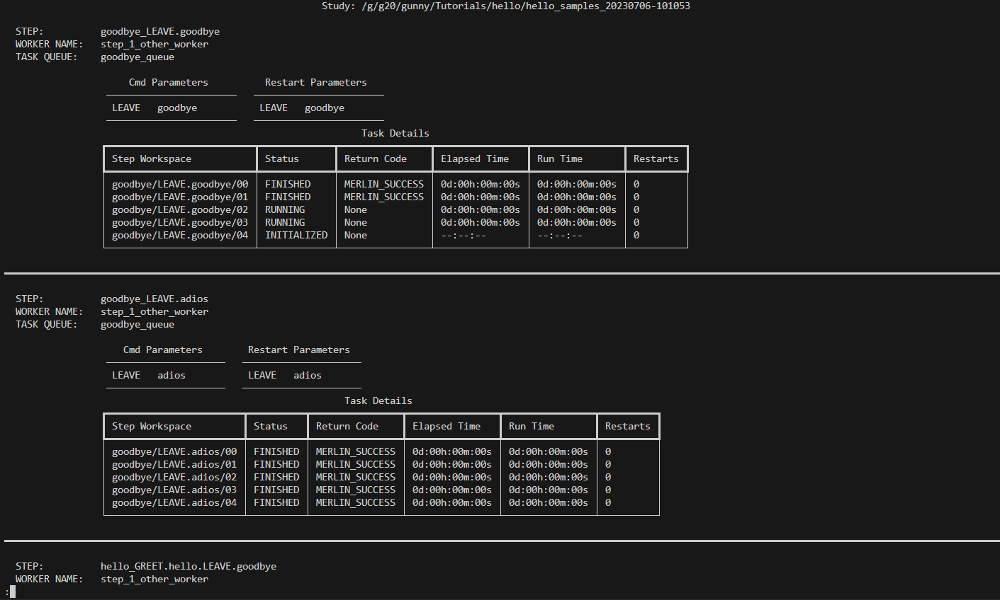
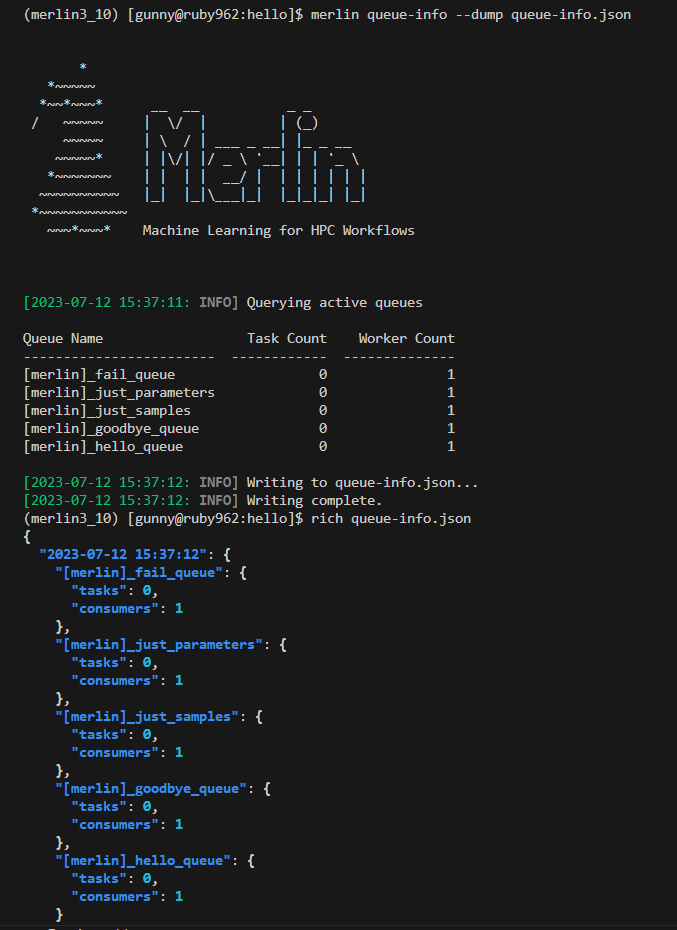

Monitoring Studies
==================

Merlin provides users with several commands to assist with monitoring studies:

* There are two commands to monitor the status of your studies (see :ref:`The Status Commands`)

  * ``merlin status`` (see :ref:`Status`)

  * ``merlin detailed-status`` (see :ref:`Detailed Status`)

* ``merlin queue-info`` (see :ref:`Queue Information`)

The Status Commands
^^^^^^^^^^^^^^^^^^^

There are two commands to help monitor the status of your studies: ``merlin status`` and ``merlin detailed-status``. The
:ref:`Status` command provides a status summary of your entire study, whereas the :ref:`Detailed Status` command will show status information
on a task-by-task basis and can be filtered further.

How They Work
+++++++++++++

As your study is progressing, Merlin will create MERLIN_STATUS.json files for each step behind the scenes. When states are modified, so are the
MERLIN_STATUS.json files.

For steps that contain samples, a MERLIN_STATUS.json file is created for each sample that's ran. As sets of samples finish running, Merlin will
condense all of the MERLIN_STATUS.json files in that set of samples into one MERLIN_STATUS.json file. This helps to save space in the file system
for all of the other important outputs that your studies provide.

.. _status-file-format:

The format of a MERLIN_STATUS.json file is as follows:

.. code-block:: json

    {
        "Step Name": {
            "Cmd Parameters": "TOKEN1:value1;TOKEN2:value2;...",
            "Restart Parameters": "TOKEN1:value1;TOKEN2:value2;...",
            "Task Queue": "name_of_queue",
            "Worker Name": "name_of_worker",
            "sub_workspace": {
                "Status": "<One of the 7 possible statuses>",
                "Return Code": "<One of the 8 possible return codes>",
                "Elapsed Time": "xd:xxh:xxm:xxs",
                "Run Time": "xd:xxh:xxm:xxs",
                "Restarts": 0
            }
        }
    }

Here, the "Cmd Parameters" are parameters used in the cmd section of a step and "Restart Parameters" are parameters used in the restart
section of a step. Both of these values may be null. Additionally, if you run your study :ref:`locally<merlin-run>` there will not be any
entries for "Task Queue" and "Worker Name".

If your step uses samples, a "sub_workspace" entry for each sample will be created. In other words, you will have multiple "sub_workspace"
entries of the form "sub_workspace/00", "sub_workspace/01", "sub_workspace/02", etc.

The ``merlin status`` and ``merlin detailed-status`` will read from these MERLIN_STATUS.json files and format the output in an easy-to-analyze
manner.

Possible Statuses
+++++++++++++++++

During the execution process of your step, there are 7 possible statuses that a task may hold:

.. role:: red

.. role:: orange

.. role:: yellow

.. role:: green

.. role:: blue

.. role:: light-blue

.. role:: grey

.. list-table:: Possible Statuses
    :widths: 20 40 20 20
    :header-rows: 1

    * - Status
      - Description
      - Color
      - Colorblind Symbol
    * - INITIALIZED
      - Tasks in the INITIALIZED state have been queued but have not began processing yet
      - :light-blue:`light-blue (#56b3e9)`
      - N/A
    * - RUNNING
      - Tasks in the RUNNING state have began executing but have not yet entered a finished state
      - :blue:`blue (#0072b2)`
      - N/A
    * - FINISHED
      - Tasks in the FINISHED state have successfully completed without any problems
      - :green:`green (#009e74)`
      - █
    * - CANCELLED
      - Tasks in the CANCELLED state have exited with the $(MERLIN_STOP_WORKERS) exit code (see :ref:`Step return variables`)
      - :yellow:`yellow (#f0e442)`
      - /
    * - FAILED
      - Tasks in the FAILED state have exited with the $(MERLIN_SOFT_FAIL) or $(MERLIN_HARD_FAIL) exit codes (see :ref:`Step return variables`)
      - :red:`red (#d55e00)`
      - ⣿
    * - DRY_RUN
      - Tasks in the DRY_RUN state have successfully run in the :ref:`Dry Run` mode
      - :orange:`orange (#e69f00)`
      - \\
    * - UNKNOWN
      - Tasks in the UNKNOWN state have exited with an unknown return code
      - :grey:`grey (#666666)`
      - ?

Possible Return Codes
+++++++++++++++++++++

Once a task has completed running, there are 8 possible return codes that it could have:

.. list-table:: Possible Return Codes
    :widths: 25 75
    :header-rows: 1

    * - Return Code
      - Description
    * - MERLIN_SUCCESS
      - This task finished successfully
    * - MERLIN_SOFT_FAIL
      - This task failed but not badly enough to stop the workflow entirely
    * - MERLIN_HARD_FAIL
      - This task failed and we now need to stop the entire workflow
    * - MERLIN_RESTART
      - This task needs restarted; Next run will run the "restart" command in the step unless it's undefined
    * - MERLIN_RETRY
      - This task needs to be retried; Will automatically re-run the "cmd" for the step
    * - MERLIN_STOP_WORKERS
      - This task exited with a code to stop the workers
    * - MERLIN_DRY_SUCCESS
      - This task successfully completed in the :ref:`Dry Run` mode
    * - MERLIN_UNRECOGNIZED
      - This task finished with an unrecognized return code

See :ref:`Step return variables` for more information about return codes.

Inputs
++++++

Both the ``merlin status`` and the ``merlin detailed-status`` command can take either a yaml spec file or an output study directory as input.
For example, ``hello_world.yaml`` and ``hello_world_20230503-105137/`` are both valid inputs so long as the file or output directory exists.

Status Usage:

.. code-block:: bash

  merlin status <spec or output directory>

Detailed Status Usage:

.. code-block:: bash

  merlin detailed-status <spec or output directory>

If you choose to provide an output study directory as input, Merlin will pull information from the expanded spec file located in the
``merlin_info/`` directory.

If you choose to provide a spec file as input, Merlin will search the ``OUTPUT_PATH`` for possible studies associated with this
spec. If there are multiple output directories associated with your spec file, then you will be prompted to select which study you'd
like to view the status of:

.. figure:: ../images/status/multiple-studies.png
  :alt: the prompt to select a study when multiple studies are found

  The prompt to select a study when multiple studies are found

If you'd like to ignore this prompt, you can use the ``--no-prompts`` option. This will automatically select the most recent study for you.

Usage:

.. code-block:: bash

  merlin status <spec file> --no-prompts

Status
++++++

The ``merlin status`` command is designed to help you see the overall status of your entire study. It provides you a step-by-step view with
progress bars and summary tables that will show you exactly how many tasks are in each state, how many tasks in total there are for a step,
and which workers and task queues each step is associated with (if applicable).

This command requires you to select a study to view the status of. For more information on inputs to this command see :ref:`Inputs` above.

Upon selecting a study to view you will be shown a summary of the status for each step in the study:

  The output of the status command

To help assist with colorblindness, Merlin provides the ``--cb-help`` option for the status command. This option will add symbols to the progress
bar for different task statuses.

Usage:

.. code-block:: bash

  merlin status <spec or output directory> --cb-help

Example: 

  The output of the status command with colorblind assistance

Detailed Status
+++++++++++++++

The ``merlin detailed-status`` command is designed to help you see an in-depth status breakdown of each step in your study. It provides a task-by-task
view with each task's workspace, status, return code, elapsed time, run time, and number of restarts available for you to see.

This command requires you to select a study to view the status of. For more information on inputs to this command see :ref:`Inputs` above.

.. _manpager-note:

.. note::
    If the output of the detailed-status command looks something like this:

    .. figure:: ../images/detailed-status/ascii-error.png
      :alt: ASCII error with pager functionality

      ASCII error with detailed-status pager functionality

    Then there are a couple things you can try to fix this problem:

    1. Set the MANPAGER or PAGER environment variable to be "less -r" (e.g. export MANPAGER="less -r") and run again

    2. If the error isn't fixed after 1. above, then:

        a. You can disable the theme with the ``--disable-theme`` option (see :ref:`disable theme<disable-theme>` below).

        b. If you'd rather not disable the theme, the error usually stems from using the pager functionality, so you can
        try disabling that with the ``--disable-pager`` option (see :ref:`disable pager<disable-pager>` below).
        Caution: you may end up outputting a lot of information to the shell all at once when using this option.

By default, the ``merlin detailed-status`` command will pull up a pager window containing the status information that was requested. Merlin uses this pager
functionality to ensure we don't overload the shell by displaying too many task statuses at one time.

Usage:

.. code-block:: bash

  merlin detailed-status <spec or output directory>

Example:

  The output of detailed-status inside the pager

To see all of the options that can be used with the pager, press ``h``. To exit the pager, press ``q``.

Once you close the pager, the statuses you requested will not appear and you'll be redirected back to your normal
shell view:

  The output of detailed-status once the pager is closed

Display Options
---------------

The merlin status command comes equipped with four options to help modify the display output: ``--disable-pager``, ``--disable-theme``,
``--layout``, and ``--no-prompts``. These options can all be used together or by themselves.

.. _disable-pager:

.. warning::

  The ``--disable-pager`` option could cause you to unintentionally output thousands of task statuses to stdout, which may overload the shell with output.
  Merlin tries to help prevent this with :ref:`prompts for additional filters<disable-pager-prompts>` but you should still use caution.

The ``--disable-pager`` option allows you to turn off the pager functionality that is on by default. This will redirect the detailed-status output
to stdout rather than the pager.

Usage:

.. code-block:: bash

  merlin detailed-status <spec or output directory> --disable-pager

Example:

.. figure:: ../images/detailed-status/disable-pager.png
  :alt: the output of detailed-status command with the disable-pager option enabled

  Output of detailed-status with the disable-pager option enabled

.. _disable-pager-prompts:

When using this option you may unintentionally output a lot of information to the shell which could cause problems.
To help prevent issues from too much information being printed, Merlin will prompt you to further filter your output if there are more than 250 task statuses
to display:

  The prompt that's displayed when too many tasks are found with disable-pager enabled

If you'd like to cancel the filter and the display entirely, press ``c``. If you don't wish to filter and just want to display your tasks, press ``n`` (again, 
BE CAUTIOUS when using this option). If you decide that filtering your tasks would be a better option, press ``y`` and you'll see the following filter options:

  The prompt asking for you to provide filters

.. note::

  If you put "E" or "EXIT" anywhere in the prompt, no filters will be applied and you'll be returned to the original prompt. For example, entering "FAILED, 
  E, CANCELLED" will return you to the original prompt without filtering anything.

Here, the filters are equivalent to certain :ref:`Filter Options`:

* Limiting the number of tasks to display = ``--max-tasks``

* Filtering by status = ``--task-status``

* Filtering by return code = ``--return-code``

It's possible to combine different filter types here. For example, a valid filter could be "FAILED, STOP_WORKERS" which would show any tasks with a "FAILED"
status AND any tasks with a "STOP_WORKERS" return code.

If you put "MAX_TASKS" anywhere in your filter, you'll receive another prompt asking you for an integer greater than 0 to set as the limit on the number of
tasks to display:

  The prompt asking you to provide a max-tasks limit

To avoid any of the prompts discussed above, use the ``--no-prompts`` option. Again, BE CAUTIOUS using this option with the ``--disable-pager`` option.

Usage:

.. code-block:: bash

  merlin detailed-status <spec or output directory> --disable-pager --no-prompts

.. _disable-theme:

The ``--disable-theme`` option allows you to disable the color scheme used in the output of the detailed-status command:

Usage:

.. code-block:: bash

  merlin detailed-status <spec or output directory> --disable-theme

Example:

  The output of the detailed-status command with the disable-theme option enabled

By default, the ``merlin detailed-status`` command separates tasks on a step-by-step basis. To change this and group all of the tasks together, you can use
the ``--layout table`` option.

Usage:

.. code-block:: bash

  merlin detailed-status <spec or output directory> --layout <table or default>

Example:

  The output of the detailed-status command with the table layout

Filter Options
--------------

There are six filter options with the detailed-status command: ``--max-tasks``, ``--return-code``, ``--steps``,
``--task-queues``, ``--task-status``, and ``--workers``. These filters can be used together or by themselves.

.. note::

  In the following images below, the ``--disable-pager`` filter is used. This is simply to show all of the output of the detailed-status
  filters in one place. It is NOT required when using the filter options.

  If you don't use the ``--disable-pager`` option but you get weird output with the pager, see the :ref:`note<manpager-note>` above for
  instructions on how to fix that.

The ``--max-tasks`` filter allows you to limit how many tasks are displayed in the output. This filter takes in an integer as input
which represents the maximum number of tasks you'd like to display.

Usage:

.. code-block:: bash

  merlin detailed-status <spec or output directory> --max-tasks <integer greater than 0>

Example:

  The output of the detailed-status command with the max-tasks set to 5

The ``--return-code`` filter allows you to search for tasks with a certain return code. This filter can take one or more return codes as
input. Valid inputs include: SUCCESS, SOFT_FAIL, HARD_FAIL, STOP_WORKERS, RESTART, RETRY, DRY_SUCCESS, and UNRECOGNIZED.

Usage:

.. code-block:: bash

  merlin detailed-status <spec or output directory> --return-code <one or more of the valid inputs listed above>

Example:

  The output of the detailed-status command when filtering by the SOFT_FAIL return code

The ``--steps`` filter allows you to view status information about each task that was ran for a step. This flag can take one or multiple
steps as input. If a step provided cannot be found, that step will be removed from the filter.

Usage:

.. code-block:: bash

  merlin detailed-status <spec or output directory> --steps <step name(s)>

Example:

  The output of the detailed-status command when filtering by two steps named "just_samples" and "failed_step"

The ``--task-queues`` filter allows you to search for tasks that are assigned to certain task queues. This filter can take one or more
queues as input. If a queue provided cannot be found, that queue will be removed from the filter.

Usage:

.. code-block:: bash

  merlin detailed-status <spec or output directory> --task-queues <queue name(s)>

Example:

  The output of the detailed-status command when filtering by a task queue named "hello_queue"

The ``--task-status`` filter allows you to search for tasks with a certain status. This filter can take one or more statuses as input.
Valid inputs include: INITIALIZED, RUNNING, FINISHED, FAILED, CANCELLED, DRY_RUN, and UNKNOWN.

Usage:

.. code-block:: bash

  merlin detailed-status <spec or output directory> --task-status <one or more of the valid inputs listed above>

Example:

  The output of the detailed-status command when filtering by the UNKNOWN and CANCELLED task statuses

The ``--workers`` filter allows you to search for tasks that are being run or were ran by certain celery workers. This filter can take
one or more worker names as input. If a worker provided cannot be found, that worker will be removed from the filter.

Usage:

.. code-block:: bash

  merlin detailed-status <spec or output directory> --workers <worker name(s)>

Example:

  The output of the detailed-status command when filtering by a worker with the name "failed_step_worker"

Dumping Status Info to Output Files
+++++++++++++++++++++++++++++++++++

Both status commands in Merlin allow you to dump to an output file. This output file must be either a .csv or a .json file.

Example JSON dump:

.. code-block:: bash

  merlin status my_study_output/ --dump status.json

When dumping to a file that DOES NOT yet exist, Merlin will create that file for you and populate it with the requested status info.

When dumping to a file that DOES exist, Merlin will append the requested status information to that file. You can differentiate between separate
dump calls by looking at the timestamps of the dumps. For CSV files this timestamp exists in the "Time of Status" column (see
:ref:`Status CSV Dump Format` below) and for JSON files this timestamp will be the top level key to the status entry (see
:ref:`Status JSON Dump Format` below).

If you use the ``--dump`` option with ``merlin detailed-status`` and DON'T provide any filters, this will provide the same output in the
file you're dumping to as it would if you used ``--dump`` with ``merlin status``.

If you use the ``--dump`` option with ``merlin detailed-status`` and you DO provide filters, only the statuses that match your filters
will be written to the dump file.

Status CSV Dump Format
----------------------

The format of a CSV dump file for statuses is as follows:

.. code-block::

  Time of Status,Step Name,Step Workspace,Status,Return Code,Elapsed Time,Run Time,Restarts,Cmd Parameters,Restart Parameters,Task Queue,Worker Name

The image below shows an example of dumping the status info of tasks with FAILED task statuses to a csv file, and then displaying that csv file using
the `rich-cli library <https://github.com/Textualize/rich-cli>`_:

  An example showcasing how to do a filtered csv dump and view it's contents

Status JSON Dump Format
-----------------------

The format of a JSON dump file for statuses is almost exactly the same as the :ref:`format of the MERLIN_STATUS.json files<status-file-format>`.
The only difference is that each entry begins with a date:

.. code-block:: json

  { 
    "YYYY-MM-DD HH:MM:SS": {
      "Step Name": {
        "Cmd Parameters": "TOKEN1:value1;TOKEN2:value2;...",
        "Restart Parameters": "TOKEN1:value1;TOKEN2:value2;...",
        "Task Queue": "name_of_queue",
        "Worker Name": "name_of_worker",
        "sub_workspace": {
            "Status": "<One of the 7 possible statuses>",
            "Return Code": "<One of the 8 possible return codes>",
            "Elapsed Time": "xd:xxh:xxm:xxs",
            "Run Time": "xd:xxh:xxm:xxs",
            "Restarts": 0
        }
      }
    }
  }

The image below shows an example of dumping the status info of tasks with FAILED task statuses to a json file, and then displaying that json file using
the `rich-cli library <https://github.com/Textualize/rich-cli>`_:

.. figure:: ../images/detailed-status/dump-json.png
  :alt: example of dumping to a json file and outputting it's contents

  An example showcasing how to do a filtered json dump and view it's contents

Vars and Task Server Options
++++++++++++++++++++++++++++

Much like other :ref:`Merlin commands<Command line>`, you can use the ``--vars`` option to modify variables in your study from the command line with both status
commands. The list is space-delimited and should be given after the input yaml file. For example, to modify the ``OUTPUT_PATH`` variable from
the command line, you can use:

.. code-block:: bash
  
  merlin status my_spec.yaml --vars OUTPUT_PATH=new_output_path

This will tell Merlin to check ``new_output_path`` for existing study output directories associated with ``my_spec.yaml``.

Additionally, to modify the task server from the command line you can use the ``--task-server`` option. However, the only currently available
option for task server is celery so you most likely will not want to use this option.

Queue Information
^^^^^^^^^^^^^^^^^

Merlin provides users with the ``merlin queue-info`` command to help monitor celery queues. This command will list queue statistics in a table format
where the columns are as follows: queue name, number of tasks in this queue, number of workers connected to this queue.

The default functionality of this command is to display queue statistics for active queues.

Usage:

.. code-block:: bash

  merlin queue-info

Example output with no active queues:

  The output of the queue-info command when no queues are active

Example output with active queues:

  The output of the queue-info command when there are active queues

If you know exactly what queues you want to check on, you can use the ``--specific-queues`` option to list
one or more queues to view.

Usage:

.. code-block:: bash

  merlin queue-info --specific-queues <queue name(s)>

Example:

  The output when using the specific-queues option to query two active queues named "hello_queue" and "goodbye_queue"

If you ask for queue-info of inactive queues with the ``--specific-queues`` option, a table format will still
be output for you.

Example:

  The output when using the specific-queues option to query two inactive queues named "hello_queue" and "goodbye_queue"

To modify the task server from the command line you can use the ``--task-server`` option. However, the only currently available
option for task server is celery so you most likely will not want to use this option.

Specification Options
+++++++++++++++++++++

There are three options that revolve around using a spec file to query queue information: ``--specification``, ``--steps``,
and ``--vars``.

.. note::

  The ``--steps`` and ``--vars`` options MUST be used alongside the ``--specification`` option. They CANNOT be used by themselves.

Using the ``--specification`` option allows you to query queue statistics for queues that only exist in the spec file you provide.
This is the same functionality as the ``merlin status`` command prior to the release of Merlin v1.11.0.

Usage:

.. code-block:: bash

  merlin queue-info --specification <spec file>

Example:

  Output of the queue-info command using the specification option

If you'd like to see queue information for queues that are attached to specific steps in your workflow, use the ``--steps`` option.
This option MUST be used alongside the ``--specification`` option.

Usage:

.. code-block:: bash

  merlin queue-info --specification <spec file> --steps <step name(s)>

Say I have a spec file with steps named ``step_1`` through ``step_4`` and each step is attached to a different queue. In this scenario ``step_1``
and ``step_4`` are attached to ``hello_queue`` and the default Merlin queue respectively. Using the ``--steps`` option for these two steps
gives us:

  Output of the queue-info command using the steps option to query steps named step_1 and step_4 of a workflow

The ``--vars`` option can be used to modify any variables defined in your spec file from the CLI. This option MUST be used alongside the
``--specification`` option. The list is space-delimited and should be given after the input yaml file.

Usage:

.. code-block:: bash

  merlin queue-info --specification <spec file> --vars QUEUE_VAR=new_queue_var_value

Dumping Queue Info to Output Files
++++++++++++++++++++++++++++++++++

Much like the two status commands, the ``queue-info`` command provides a way to dump the queue statistics to an output file.

Example CSV dump:

.. code-block:: bash

  merlin queue-info --dump queue-info.csv

When dumping to a file that DOES NOT yet exist, Merlin will create that file for you and populate it with the queue statistics you requested.

When dumping to a file that DOES exist, Merlin will append the requested queue statistics to that file. You can differentiate between separate
dump calls by looking at the timestamps of the dumps. For CSV files this timestamp exists in the "Time" column (see
:ref:`Queue Info CSV Dump Format` below) and for JSON files this timestamp will be the top level key to the queue info entry (see
:ref:`Queue Info JSON Dump Format` below).

Using any of the ``--specific-steps``, ``--specification``, or ``--steps`` options will modify the output that's written to the output file.

Queue Info CSV Dump Format
--------------------------

The format of a CSV dump file for queue information is as follows:

.. code-block::

  Time,[merlin]_<queue_name>:tasks,[merlin]_<queue_name>:consumers

The <queue_name>:tasks and <queue_name>:consumers columns will be created for each queue that's listed in the queue-info output at the time of
your dump.

The image below shows an example of dumping the queue statistics of active queues to a csv file, and then displaying that csv file using
the `rich-cli library <https://github.com/Textualize/rich-cli>`_:

  An example showcasing how to do a csv dump of active queue statistics and view it's contents

Queue Info JSON Dump Format
---------------------------

The format of a JSON dump file for queue information is as follows:

.. code-block:: json

  { 
    "YYYY-MM-DD HH:MM:SS": {
      "[merlin]_queue_name": {
        "tasks": 0
        "consumers": 1
      }
    }
  }

The values of the "tasks" and "consumers" fields may differ in your output.

The image below shows an example of dumping the queue info to a json file, and then displaying that json file using
the `rich-cli library <https://github.com/Textualize/rich-cli>`_:

  An example showcasing how to do json dump of active queue statistics and view it's contents