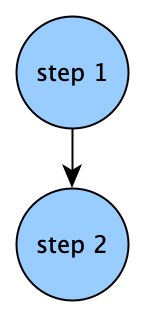
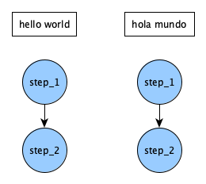
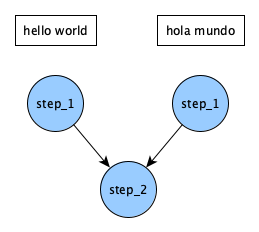
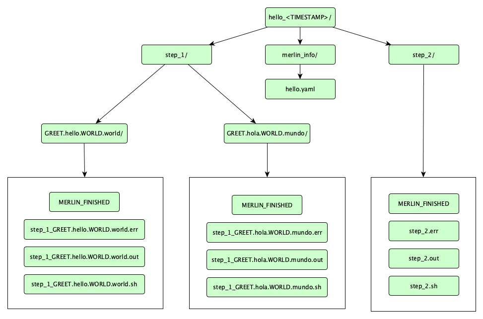
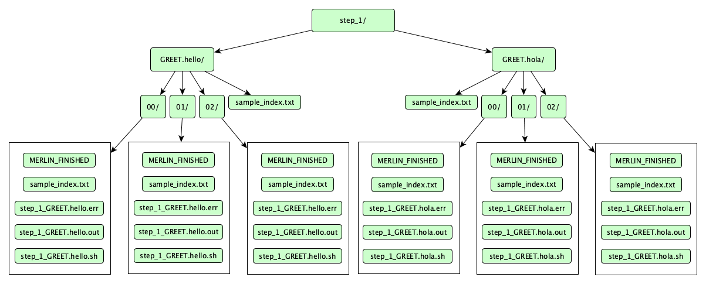

Hello, World!
=============
This hands-on module walks through the steps of building and running a simple merlin workflow.

.. admonition:: Prerequisites

    * :doc:`Module 2: Installation<../installation/installation>`

.. admonition:: Estimated time

      * 30 minutes

.. admonition:: You will learn

      * The components of a merlin workflow specification.
      * How to run a simple merlin workflow.
      * How to interpret the results of your workflow.

.. contents:: Table of Contents:
  :local:

Get example files
+++++++++++++++++
``merlin example`` is a command line tool that makes it easy to get a basic workflow up and running. Run the following commands:

.. code-block:: bash

    $ merlin example hello

.. code-block:: bash

    $ cd hello/

This will create and move into directory called ``hello``, which contains these files:

* ``my_hello.yaml`` -- this spec file is partially blank. You will fill in the gaps as you follow this module's steps.

* ``hello.yaml`` -- this is a complete spec without samples. You can always reference it as an example.

* ``hello_samples.yaml`` -- same as before, but with samples added.

* ``make_samples.py`` -- this is a small python script that generates samples.

* ``requirements.txt`` -- this is a text file listing this workflow's python dependencies.

Specification file
++++++++++++++++++

Central to Merlin is something called a specification file, or a "spec" for short.
The spec defines all aspects of your workflow.
The spec is formatted in yaml.
If you're unfamiliar with yaml, it's worth `reading up on`__ for a few minutes.

__ https://www.tutorialspoint.com/yaml/yaml_quick_guide.htm

.. warning::

    Stray whitespace can break yaml; make sure your indentation is consistent.

Let's build our spec piece by piece. For each spec section listed below, fill in the blank yaml entries of ``my_hello.yaml`` with the given material.

Section: ``description``
~~~~~~~~~~~~~~~~~~~~~~~~
Just what it sounds like. Name and briefly summarize your workflow.

.. code-block:: yaml

    description:
        name: hello world workflow
        description: say hello in 2 languages

Section: ``global.parameters``
~~~~~~~~~~~~~~~~~~~~~~~~~~~~~~
.. better explanation??

Global parameters are constants that you want to vary across simulations.
Steps that contain a global parameter or depend on other steps that contain a global parameter are run for each index over parameter values.
The label is the pattern for a filename that will be created for each value.

.. code-block:: yaml

    global.parameters:
        GREET:
            values : ["hello","hola"]
            label  : GREET.%%
        WORLD:
            values : ["world","mundo"]
            label  : WORLD.%%

.. note::

    ``%%`` is a special token that defines where the value in the label is placed. In this case the parameter labels will be GREET.hello, GREET.hola, etc. The label can take a custom text format, so long as the ``%%`` token is included to be able to substitute the parameter’s value in the appropriate place.

So this will give us 1) an English result, and 2) a Spanish one (you could add as many more languages as you want, as long as both parameters hold the same number of values).

Section: ``study``
~~~~~~~~~~~~~~~~~~
This is where you define workflow steps.
While the convention is to list steps as sequentially as possible, the only factor in determining step order is the dependency DAG created by the ``depends`` field.

.. code-block:: yaml

    study:
        - name: step_1
          description: say hello
          run:
              cmd: echo "$(GREET), $(WORLD)!"

        - name: step_2
          description: print a success message
          run:
              cmd: print("Hurrah, we did it!")
              depends: [step_1]
              shell: /usr/bin/env python3

.. note::

    The ``-`` denotes a list item in YAML. To add elements, simply add new elements prefixed with a hyphen

``$(GREET)`` and ``$(WORLD)`` expand the global parameters separately into their two values.
.. ``$(step_1.workspace)`` gets the path to ``step_1``.
The default value for ``shell`` is ``/bin/bash``. In ``step_2`` we override this to use python instead.
Steps must be defined as nodes in a DAG, so no cyclical dependencies are allowed.
Our step DAG currently looks like this:

Since our global parameters have 2 values, this is actually what the DAG looks like:

It looks like running ``step_2`` twice is redundant. Instead of doing that, we can collapse it back into a single step, by having it wait for both parameterized versions of ``step_1`` to finish. Add ``_*`` to the end of the step name in ``step_1``'s depend entry. Go from this:

.. code-block:: yaml

    depends: [step_1]

...to this:

.. code-block:: yaml

    depends: [step_1_*]

Now the DAG looks like this:

Your full hello world spec ``my_hello.yaml`` should now look like this (an exact match of ``hello.yaml``):

.. literalinclude:: ../../../../merlin/examples/workflows/hello/hello.yaml
   :language: yaml

The order of the spec sections doesn't matter.

.. note::

    At this point, ``my_hello.yaml`` is still maestro-compatible. The primary difference is that maestro won't understand anything in the ``merlin`` block, which we will still add later. If you want to try it, run: ``$ maestro run my_hello.yaml``

Try it!
+++++++

First, we'll run merlin locally. On the command line, run:

.. code-block:: bash

    $ merlin run --local my_hello.yaml

If your spec is bugless, you should see a few messages proclaiming successful step completion, like this (for now we'll ignore the warning):

.. literalinclude :: local_out.txt
    :language: text

Great! But what happened? We can inspect the output directory to find out.

Look for a directory named ``hello_<TIMESTAMP>``. That's your output directory.
Within, there should be a directory for each step of the workflow, plus one called ``merlin_info``.
The whole file tree looks like this:

A lot of stuff, right? Here's what it means:

* The 3 yaml files inside ``merlin_info/`` are called the provenance specs. They are copies of the original spec that was run, some showing under-the-hood variable expansions.

* ``MERLIN_FINISHED`` files indicate that the step ran successfully.

* ``.sh`` files contain the command for the step.

* ``.out`` files contain the step's stdout. Look at one of these, and it should contain your "hello" message.

* ``.err`` files contain the step's stderr. Hopefully empty, and useful for debugging.

.. Assuming config is ready

Run distributed!
++++++++++++++++

.. important::

    Before trying this, make sure you've properly set up your merlin config file ``app.yaml``. Run ``$ merlin info`` for information on your merlin configuration.

Now we will run the same workflow, but in parallel on our task server:

.. code-block:: bash

    $ merlin run my_hello.yaml

If your merlin configuration is set up correctly, you should see something like this:

.. literalinclude :: run_out.txt
   :language: text

That means we have launched our tasks! Now we need to launch the workers that will complete those tasks. Run this:

.. code-block:: bash

    $ merlin run-workers my_hello.yaml

Here's the expected merlin output message for running workers:

.. literalinclude :: run_workers_out.txt
   :language: text

Immediately after that, this will pop up:

.. literalinclude :: celery.txt
   :language: text

The terminal you ran workers in is now being taken over by Celery, the powerful task queue library that merlin uses internally. The workers will continue to report their task status here until their tasks are complete.

Workers are persistent, even after work is done. Send a stop signal to all your workers with this command:

.. code-block:: bash

    $ merlin stop-workers

...and a successful worker stop will look like this, with the name of specific worker(s) reported:

.. literalinclude :: stop_workers.txt
    :language: text

.. _Using Samples:

Using samples
+++++++++++++
It's a little boring to say "hello world" in just two different ways. Let's instead say hello to many people!

To do this, we'll need samples. Specifically, we'll change ``WORLD`` from a global parameter to a sample. While parameters are static, samples are generated dynamically, and can be more complex data types. In this case, ``WORLD`` will go from being "world" or "mundo" to being a randomly-generated name.

First, we remove the global parameter ``WORLD`` so it does not conflict with our new sample. Parameters now look like this:

.. code-block:: yaml

    global.parameters:
        GREET:
            values : ["hello", "hola"]
            label  : GREET.%%

Now add these yaml sections to your spec:

.. code-block:: yaml

    env:
        variables:
            N_SAMPLES: 3

This makes ``N_SAMPLES`` into a user-defined variable that you can use elsewhere in your spec.

.. code-block:: yaml

    merlin:
        samples:
            generate:
                cmd: python3 $(SPECROOT)/make_samples.py --filepath=$(MERLIN_INFO)/samples.csv --number=$(N_SAMPLES)
            file: $(MERLIN_INFO)/samples.csv
            column_labels: [WORLD]

This is the merlin block, an exclusively merlin feature. It provides a way to generate samples for your workflow. In this case, a sample is the name of a person.

For simplicity we give ``column_labels`` the name ``WORLD``, just like before.

It's good practice to shift larger chunks of code to external scripts. At the same location of your spec, make a new file called ``make_samples.py``:

.. literalinclude :: ../../../../merlin/examples/workflows/hello/make_samples.py
   :language: text

Since our environment variable ``N_SAMPLES`` is set to 3, this sample-generating command should churn out 3 different names.

Before we can run this, we must install the script's external python library dependencies (``names``: a simple package that generates random names, and ``numpy``: a scientific computing package):

.. code-block:: bash

    $ pip3 install -r requirements.txt

Here's our DAG with samples:

.. image:: dag4.png
    :width: 400
    :align: center

Here's your new and improved ``my_hello.yaml``, which now should match ``hello_samples.yaml``:

.. literalinclude:: ../../../../merlin/examples/workflows/hello/hello_samples.yaml
   :language: yaml

Run the workflow again!

Once finished, this is what the insides of ``step_1`` look like:

* Numerically-named directories like ``00``, ``01``, and ``02`` are sample directories. Instead of storing sample output in a single flattened location, merlin stores them in a tree-like sample index, which helps get around file system constraints when working with massive amounts of data.

Lastly, let's flex merlin's muscle a bit and scale up our workflow to 1000 samples. To do this, you could internally change the value in the spec from 3 to 1000. OR you could just run this:

.. code-block:: bash

    $ merlin run my_hello.yaml --vars N_SAMPLES=1000

.. code-block:: bash

    $ merlin run-workers my_hello.yaml

Once again, to send a warm stop signal to your workers, run:

.. code-block:: bash

    $ merlin stop-workers

Congratulations! You concurrently greeted 1000 friends in English and Spanish!
