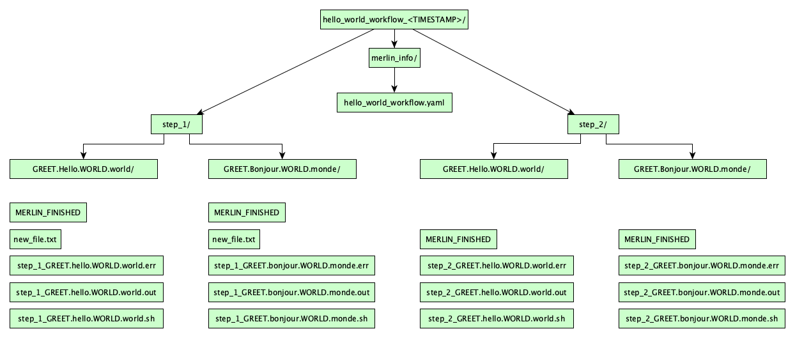

Hello, World!
=============
.. admonition:: Prerequisites

    * :doc:`Module 2: Installation<installation>`

.. admonition:: Estimated time

      * 30 minutes
    
.. admonition:: You will learn

      * The components of a merlin workflow specification.
      * How to run a simple merlin workflow.
      * How to interpret the results of your workflow.

.. contents::
  :local:

Stuff inside a specification
++++++++++++++++++++++++++++

Central to Merlin is something called a specifiation file, or a "spec" for short.
The spec defines all aspects of your workflow.
The spec is formatted in yaml (if you're unfamilar with yaml, it's worth reading up on for a few minutes). 

Let's build our spec piece by piece.

description
~~~~~~~~~~~
Just what it sounds like. Name and briefly summarize your workflow.

.. code:: yaml

    description:
        name: hello world workflow
        description: say hello in 3 languages

global.parameters
~~~~~~~~~~~~~~~~~
.. better explanation??
Global parameters are constants that you want to vary across simulations.
The whole workflow is run for index of parameter values.

.. code:: yaml

    global.parameters:
        GREET:
            values : ["hello","ola"]
            label  : GREET.%%
        WORLD:
            values : ["world","mundo"]
            label  : WORLD.%%

So this will give us an English result, and a Portuguese one. (you could add as many more langauges as you want, as long as both parameters hold the same number of values).

study
~~~~~
This is where you define worfklow steps.

.. code:: yaml

    study:
        - name: step_1
          description: step 1
          run:
              cmd: |
                  touch "$(GREET), world!"

        - name: step_2
          description: look at the files in step_1
          run:
              cmd: |
                  ls $(step_1.workspace)
              depends: [step_1]

``$(GREET)`` expands the global parameter ``GREET`` seperately into its two values.
``$(step_1.workspace)`` gets the path to step_1.
Steps must be defined as a DAG, so no cyclical dependencies are allowed.
Our step DAG currently looks like this:

.. image:: dag1.png
    :width: 100
    :align: center

Since our global parameters have 2 values, this is actually what the DAG looks like:

.. image:: dag2.png
    :width: 300
    :align: center

It looks like running ``step_2`` twice is redundant. Instead of doing that, we can collapse it back into a single step, by having it wait for both parameterized versions of ``step_1`` to finish. Add ``_*`` to the end of the step name in ``step_1``'s depend entry. Go from this:

.. code:: yaml

    depends: [step_1]

...to this:

.. code:: yaml

    depends: [step_1_*]

Now the DAG looks like this:

.. image:: dag3.png
    :width: 300
    :align: center

Your full hello world spec should now look like this:

.. literalinclude:: hello.yaml
   :language: yaml

We'll name it ``hello.yaml``.
The order of the spec sections doesn't matter.

.. note::

    At this point, our spec is still merlin- and maestro-compatible. The primary difference is that maestro won't understand anything in the ``merlin`` block, which we will still add later. If you want to try it, run: ``$ maestro run hello.yaml``

Try it!
+++++++

First, we'll run merlin locally. On the command line, run:

.. code:: bash

    $ merlin run --local hello.yaml

If your spec is bugless, you should see a few messages proclaiming successful step completion, like this (for now we'll ignore the warning):

.. literalinclude :: local_out.txt
    :language: text

Great! But what happened? We can inspect the output directory to find out.

Look for a directory named ``hello_world_workflow_<TIMESTAMP>``. That's your output directory.
Within, there should be a directory for each step of the workflow, plus one called ``merlin_info``.
The whole file tree looks like this:

A lot of stuff, right? Here's what it means:

* ``new_file.txt`` is the name of the file we wrote in ``step_1``.

* The yaml file inside ``merlin_info/`` is called the provenance spec. It's a copy of the original spec that was run.

* ``MERLIN_FINISHED`` files indicate that the step ran successfully.

* ``.sh`` files contain the command for the step.

* ``.out`` files contain the step's stdout.

* ``.err`` files contain the step's stderr.

.. Assuming config is ready
Run distributed!
++++++++++++++++

.. important::

    Before trying this, make sure you've properly set up your merlin config file ``app.yaml``. Run ``$ merlin info`` for information on your merlin configuration.

Now we will run the same workflow, but in parallel on our task server:

.. code:: bash

    $ merlin run hello.yaml

If your merlin configuration is set up correctly, you should see something like this:

.. literalinclude :: run_out.txt
   :language: text

That means we have launched our tasks! Now we need to launch the workers that will complete those tasks. Run this:

.. code:: bash

    $ merlin run-workers hello.yaml
    
Here's the expected merlin output message for running workers:

.. literalinclude :: run_workers_out.txt
   :language: text

Immediately after that, this will pop up:

.. literalinclude :: celery.txt
   :language: text

The terminal you ran workers in is now being taken over by Celery, the powerful task queue library that merlin uses internally. The workers will continue to report their task status here until their tasks are complete.

Using samples
+++++++++++++
It's a little boring to say "hello world" in just two different ways. Let's instead say hello to many people!

To do this, we'll change ``WORLD`` from a paramter to a sample. While parameters are static, samples are generated dynamically, and can be more complex data types. In this case, ``WORLD`` will go from being "world" or "mundo" to being a randomly-generated name.

First, we remove the global parameter `WORLD`.

Now add these yaml sections to your spec:

.. code:: yaml

    env:
        variables:
            NUM_SAMPLES: 3

.. code:: yaml

    merlin:
        samples:
            generate:
                cmd: |
                    pip install faker
                    foreach i in $(NUM_SAMPLES): echo -e faker --name > $(MERLIN_INFO)/samples.csv
            file: $(MERLIN_INFO)/samples.csv
            column_labels: [WORLD]

This is the merlin block, an exclusively merlin feature. It provides a way to generate samples for your workflow. In this case, a sample is the name of a person.

For simplicity we name it ``WORLD``, just like before.

Since our environment variable ``NUM_SAMPLES`` is set to 3, this sample-generating command should churn out 3 different names.

Here's our DAG with samples:

.. image:: dag4.png
    :width: 400
    :align: center

Here's the new spec:

.. literalinclude:: hello_samples.yaml
   :language: yaml

Run the workflow again!

Lastly, let's flex merlin's muscle and scale up our workflow to 1000 samples. To do this, you could interally change thevalue in the spec from 3 to 1000. OR you could just this run this:

.. code:: bash

    $ merlin run --vars NUM_SAMPLES=1000 hello.yaml

    $ merlin run-workers hello.yaml

Congratulations! You concurrently greeted 1000 friends in English and Portuguese!

Miscellany
++++++++++

.. ?
< merlin stop-workers > 

< merlin --help >
