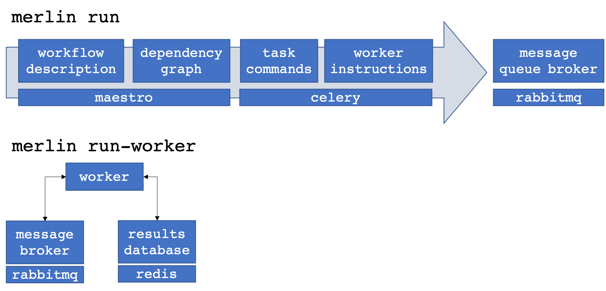

Introduction
============
.. admonition:: Prerequisites

      * Curiosity

.. admonition:: Estimated time

      * 20 minutes

.. admonition:: You will learn

      * What Merlin is and why you might consider it
      * Why it was built and what are some target use cases
      * How it is designed and what the underlying tech is

What is Merlin?
+++++++++++++++

.. admonition:: Summary

    Merlin is a toolkit designed to enable HPC-focused simulation workflows
    with distributed cloud compute technologies. This helps simulation workflows
    push to immense scale. (Like `100 million`__.)

__ https://arxiv.org/abs/1912.02892

At its core, Merlin translates a text-based, command-line focused workflow
description into a set of discrete tasks. These tasks live on a centralized
broker (e.g. a separate server) that persists outside of your HPC
batch allocation. Autonomous workers in different allocations (even
on different machines) can then connect
to this server, pull off and execute these tasks asynchronously.

*Why Merlin? What's the need?*

So what? Why would you care to do this?

The short answer: machine learning

The longer answer: machine learning and data science are becoming
an integral part of scientific inquiry. The problem is that machine learning
models are data hungry; it takes lots and lots of simulations to train machine
learning models on their outputs. Unfortunately HPC systems were designed to execute
a few large hero simulations, not many smaller simulations. Naively pushing
standard HPC workflow tools to hundreds of thousands and millions of simulations
can lead to some serious problems.

*How does Merlin help solve this?*

The good news is that distributed cloud compute technology has really pushed the
frontier of scalability. Merlin helps bring this tech to traditional scientific HPC.

Traditionally, HPC workflow systems tie workflow steps to HPC resources and
coordinate the execution of tasks and management of resources one of two ways:

   
.. table:: Traditional HPC Workflow Philosophies

   +------------------------------+-------------------------------------------------------+
   | External Coordination        + - Separate batch jobs for each task                   |                  
   | |ext-img|                    + - External daemon tracks dependencies and jobs        |
   |                              + - Progress monitored with periodic polling            |
   |                              +   (of files or batch system)                          | 
   +------------------------------+-------------------------------------------------------+
   + Internal Coordination        + - Multiple tasks bundled into larger batch jobs       |
   + |int-img|                    + - Internal daemon tracks dependencies and resources   |
   +                              + - Progress monitored via polling                      |
   +                              +   (of filesystem or message passing)                  |
   +------------------------------+-------------------------------------------------------+

**External coordination** ties together independent batch jobs each executing workflow 
sub-tasks with an external monitor. This monitor could be a daemon
or human that monitors either the batch or file system via periodic polling and orchestrates task launch dependencies.
   
External coordination can tailor the resources to the task, but cannot easily
run lots of concurrent simulations (since batch systems usually limit the number
of jobs a user can queue at once).

**Internal coordination** puts the monitor with a larger batch job that allocates
resources inside that job for the specific tasks at hand.

Internal coordination can run many more
concurrent tasks by bundling smaller jobs into larger jobs, but cannot tailor the
resources to the task at hand. This precludes workflows that, for instance, require
one step on CPU hardware and another on a GPU machine.

Instead of tying resources to tasks, Merlin does this:

.. table:: Merlin's Workflow Philosophy 

   +------------------------------+-----------------------------------------------+
   + Centralized Coordination     + - Batch jobs and workers decoupled from tasks +
   + of Producers & Consumers     + - Centralized queues visible to multiple jobs +
   + |cent-img|                   + - Progress and dependencies handled via       +
   +                              +   direct worker connections to central        +
   +                              +   message server and results database         +
   +------------------------------+-----------------------------------------------+

Merlin decouples workflow tasks from workflow resources.

Merlin avoids a command-and-control approach to HPC resource
management for a workflow. Instead of having the workflow coordinator
ask for and manage HPC resources and tasks, the Merlin coordinator just manages
tasks. Task-agnostic resources can then independently connect (and
disconnect) to the coordinator. 

In Merlin, this *producer-consumer* workflow happens through two commands:

``merlin run <workflow file>`` (producer) and
``merlin run-worker <workflow file>`` (consumer).

The ``merlin run`` command populates the central queue(s) with work to do
and the ``merlin run-worker`` command drains the queue(s) by executing the
task instructions. Each new instance of ``merlin run-worker`` creates a new
consumer. These consumers can exist on different machines in different
batch allocations, anywhere that can see the central server. Likewise
``merlin run`` can populate the queue from any system that can see the
queue server, including other workers. In principle, this means a
research can push new work onto an already running batch allocation of workers,
or re-direct running jobs to work on higher-priority work.

.. admonition:: The benefits of producer-consumer workflows

   The increased flexibility that comes from
   decoupling *what* HPC simulations you run from *where* you run them
   can be extremely enabling. In particular Merlin allows you to

   * Scale to very large number of simulations by avoiding common HPC bottlenecks
   * Automatically take advantage of free nodes to process your workflow faster
   * Create iterative workflows, like as needed for active machine learning
   * Dynamically add more tasks to already-running jobs
   * Have cross-machine and cross-batch-job workflows, with different steps
     executing on different resources, but still coordinated

The producer-consumer approach to workflows
allows for increased flexibility and scalability. For this
reason it has become a mainstay of cloud-compute microservices, which
allow for extremely distributed asynchronous computing.

Many asynchronous task and workflow systems exist, but the majority are
focused around this microservices model, where a system is set up (and
managed) by experts that build a single workflow that gets tested and hardened
and exists as a service for their users (e.g. an event on a website
triggers a discrete set of tasks.) HPC, and in particular *scientific* HPC
brings its own set of challenges that make a direct application of microservices
to HPC workflows challenging.

These challenges include:

- Workflows can change from day-to-day as researchers explore new simulations,
  configurations, and questions.
  *Workflows need to be dynamic, not static.*
- Workflow components are usually different executables, 
  pre- and post-processing scripts and data aggregation steps 
  written in different languages. 
  *Workflows need to intuitively support multiple languages.*
- These components often need command-line-level control of task instructions.
  *Workflows need to support shell syntax and environment variables.*
- They frequently require calls to a batch system scheduler for parallel job
  execution.
  *Workflows need a natural way to launch parallel jobs that use more resources
  then a single worker.*
- Tasks can independently create large quantities of data.
  *Dataflow models could be bottlenecks. Workflows should take advantage of
  parallel file systems.*
- HPC systems (in particular leadership class machines) can experience unforeseen
  outages. *Workflows need to be able to restart, retry and rerun failed steps without
  needing to run the entire workflow.*

**So what exactly does Merlin do?**

Merlin wraps a heavily tested and well used asynchronous task queueing library in
a skin and syntax that is natural for HPC simulations. In essence, we extend
`maestro <https://github.com/LLNL/maestrowf>`_ by hooking it up to
`celery <https://docs.celeryproject.org/en/latest/index.html>`_. We leverage
maestro's HPC-friendly workflow description language and translate it to
discrete celery tasks. 

Why not just plain celery?

Celery is extremely powerful, but this power can be a barrier for many
subject matter experts, who might not be python coders. While this may not be
an issue for web developers, it presents a serious challenge to many scientists
who are used to running their code from a shell command line. By wrapping celery
commands in maestro steps, we not only create a familiar environment for users
(since maestro steps look like shell commands), but we also create structure
around celery dependencies. Maestro also has interfaces to common batch schedulers
(e.g. `flux <http://flux-framework.org>`_ and
`slurm <https://slurm.schedmd.com/documentation.html>`_) for parallel job
control.

So why Merlin and not just plain maestro?

The main reason: to run lots of simulations for machine learning
applications. Basically **Merlin scales maestro.**

Maestro follows an external coordinator model. Maestro workflow DAGs
(directed acyclic graphs) need to be unrolled (concretized)
ahead of time, so that batch dependencies can be calculated and managed.
This graph problem becomes very expensive as the number of tasks approaches
a few hundred. (Not to mention most batch systems will prevent a user
from queuing more than a few hundred concurrent batch jobs.) In other words,
using maestro alone to run thousands of simulations is not practical.

But with celery, we can *dynamically* create additional
tasks. This means that the DAG can get unrolled by the very
same workers that will execute the tasks, offering a natural parallelism
(i.e. much less waiting before starting the work).
Furthermore, this ability to dynamically add tasks to the queue means
that workflows can become more flexible and responsive. A worker executing
a step can launch additional workflows without having to stand up resources
to execute and monitor the execution of those additional steps.

Here's an example of how Merlin, maestro and flux can all work together
to launch a workflow on multiple machines.

.. image:: ../../images/merlin_arch.png

The 

*Benefit*

*Competition*

Why was it built?
+++++++++++++++++

* More Data, More Problems

  ML & data-driven science are data hungry, but HPC systems typically
  target single large jobs, not many smaller jobs. Naively pushing existing
  solutions to large scales can lead to serious issues.

* Do more with less

  Workflows, applications and machines are becoming more complex.
  SMEs need to devote time and attention to their applications
  and often require fine command-line level control. Furthermore,
  they rarely have the time to devote to learning workflow systems.

* Bring distributed compute to HPC

  Current WF systems target one or the other, but not both

How is it designed?
+++++++++++++++++++

* Tech under the hood

* Components and reasoning

