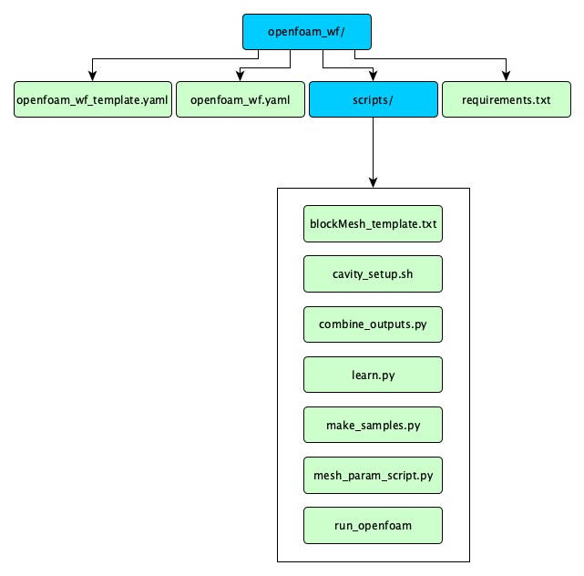
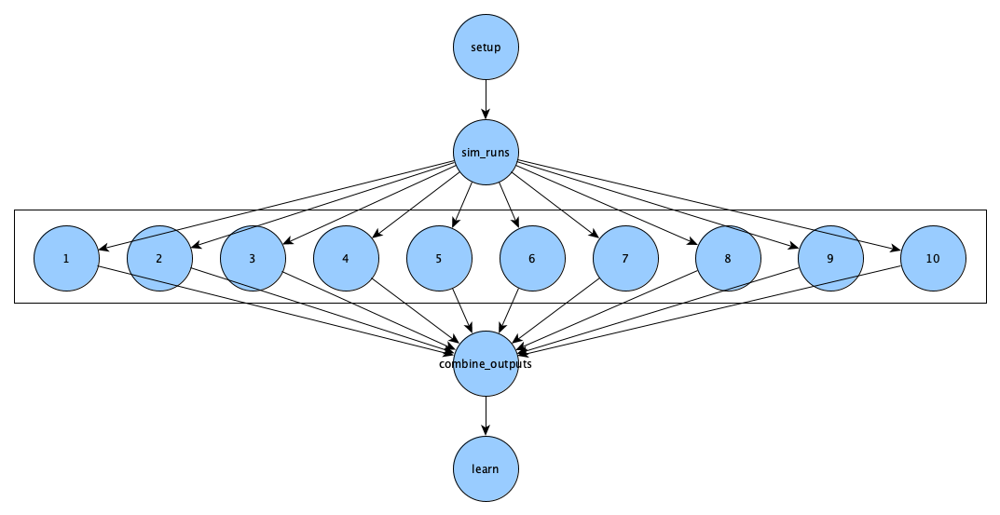
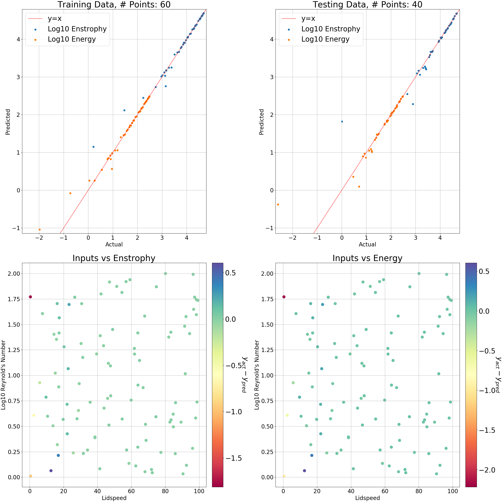

Run a Real Simulation
=====================

.. admonition:: Summary

  This module aims to do a parameter study on a well-known benchmark problem for
  viscous incompressible fluid flow.

.. admonition:: Prerequisites

      * :doc:`Module 0: Before you come<../before>`
      * :doc:`Module 2: Installation<../installation/installation>`
      * :doc:`Module 3: Hello World<../hello_world/hello_world>`

.. admonition:: Estimated time

      * 60 minutes

.. admonition:: You will learn

      * How to run the simulation OpenFOAM, using merlin.
      * How to use machine learning on OpenFOAM results, using merlin.

.. contents:: Table of Contents:
  :local:

Introduction
++++++++++++

We aim to do a parameter study on the lid-driven cavity problem.

.. list-table::

    * - .. figure:: setup.png

           Fig 1. Lid-driven cavity problem setup

      - .. figure:: lid-driven-stable.png

           Fig 2. Example of a flow in steady state

In this problem, we have a viscous fluid within a square cavity that has three non-slip
walls and one moving wall (moving lid).
We are interested in learning how varying the viscosity and lid speed affects
the average enstrophy and kinetic energy of the fluid after it reaches steady state.
We will be using the velocity squared as a proxy for kinetic energy.

This module will be going over:

 * Setting up our inputs using the merlin block
 * Running multiple simulations in parallel
 * Combining the outputs of these simulations into a an array
 * Predictive modeling and visualization

Before moving on,
~~~~~~~~~~~~~~~~~

check that the virtual environment with merlin installed is activated
and that redis server is set up using this command:

.. code:: bash

  $ merlin info

This is covered more in depth here: :ref:`Verifying installation`

Then use the ``merlin example`` to get the necessary files for this module.

.. code-block:: bash

    $ merlin example openfoam_wf

    $ cd openfoam_wf/

In the ``openfoam_wf`` directory you should see the following:

   Fig 3. openfoam_wf directory structure

* ``openfoam_wf.yaml`` -- this spec file is partially blank. You will fill in the gaps as you follow this module's steps.

* ``openfoam_wf_template.yaml`` -- this is a complete spec file. You can always reference it as an example.

* ``scripts`` -- This directory contains all the necessary scripts for this module.

  * We'll be exploring these scripts as we go with the tutorial.

* ``requirements.txt`` -- this is a text file listing this workflow's python dependencies.

**To start, open** ``openfoam_wf.yaml`` **using your favorite text editor.**

It should look something like this:

.. literalinclude:: ../../../../merlin/examples/workflows/openfoam_wf/openfoam_wf.yaml
   :language: yaml
   :caption: openfoam_wf.yaml

Specification file
++++++++++++++++++

We are going to build a spec file that produces this DAG:

    Fig 4. Module 4 DAG

Variables
~~~~~~~~~
First we specify some variables to make our life easier. Locate the ``env`` block
in our yaml spec

.. code-block:: yaml

  env:
      variables:
          OUTPUT_PATH: ./openfoam_wf_output

          SCRIPTS:
          N_SAMPLES:

The ``OUTPUT_PATH`` variable is set to tell merlin where you want your output directory to be.
The default is ``<spec_name>_<TIMESTAMP>`` which in our case would simply be ``openfoam_wf_<TIMESTAMP>``

We'll fill out the next two variables as we go.

Samples and scripts
~~~~~~~~~~~~~~~~~~~
One merlin best practice is to copy any scripts your workflow may use from your ``SPECROOT`` directory into the ``MERLIN_INFO``
directory. This is done to preserve the original scripts in case they are modified during the time merlin is running.
We will do that first.
We will put this in the merlin sample generation section, since it runs before anything else.

Edit the merlin block to look like the following:

.. code-block:: yaml

  merlin:
      samples:
          generate:
              cmd: |
                  cp -r $(SPECROOT)/scripts $(MERLIN_INFO)/

                  # Generates the samples
                  python $(MERLIN_INFO)/scripts/make_samples.py -n 10 -outfile=$(MERLIN_INFO)/samples
          file: $(MERLIN_INFO)/samples.npy
          column_labels: [LID_SPEED, VISCOSITY]

We will be using the scripts directory a lot so we'll set the variable ``SCRIPTS``
to ``$(MERLIN_INFO)/scripts`` for convenience. We would also like to have a more central control over
the number of samples generated so we'll create an ``N_SAMPLES`` variable:

.. code-block:: yaml

  env:
      variables:
          OUTPUT_PATH: ./openfoam_wf_output
          SCRIPTS: $(MERLIN_INFO)/scripts
          N_SAMPLES: 10

and update the merlin block to be:

.. code-block:: yaml

  merlin:
      samples:
          generate:
              cmd: |
                  cp -r $(SPECROOT)/scripts $(MERLIN_INFO)/

                  # Generates the samples
                  python $(SCRIPTS)/make_samples.py -n N_SAMPLES -outfile=$(MERLIN_INFO)/samples
          file: $(MERLIN_INFO)/samples.npy
          column_labels: [LID_SPEED, VISCOSITY]

Just like in the :ref:`Using Samples` step of the hello world module, we
generate samples using the merlin block. We are only concerned with how the
variation of two initial conditions, lidspeed and viscosity, affects outputs of the system.
These are the ``column_labels``.
The ``make_samples.py`` script is designed to make log uniform random samples.
Now, we can move on to the steps of our study block.

Setting up
~~~~~~~~~~
Our first step in our study block is concerned with making sure we have all the
required python packages for this workflow. The specific packages are found in
the ``requirements.txt`` file.

We will also need to copy the lid driven cavity deck from the OpenFOAM docker
container and adjust the write controls. This last part is scripted already for
convenience.

Locate the ``setup`` step in the study block and edit it to look like the following:

.. code-block:: yaml

  study:
    - name: setup
      description: |
                Installs necessary python packages and imports the cavity directory
                from the docker container
      run:
        cmd: |
          pip install -r $(SPECROOT)/requirements.txt

          # Set up the cavity directory in the MERLIN_INFO directory
          source $(SCRIPTS)/cavity_setup.sh $(MERLIN_INFO)

This step does not need to be parallelized so we will assign it to lower
concurrency (a setting that controls how many workers can be running at the same time)

Locate the ``resources`` section in the ``merlin`` block and edit the concurrency and add the setup step:

.. code-block:: yaml

  resources:
      workers:
          nonsimworkers:
              args: -l INFO --concurrency 1
              steps: [setup]

Running the simulation
~~~~~~~~~~~~~~~~~~~~~~

Moving on to the ``sim_runs`` step, we want to:

  1. Copy the cavity deck from the ``MERLIN_INFO`` directory into each of the current step's subdirectories
  2. Edit the default input values (lidspeed and viscosity) in these cavity decks using the ``sed`` command
  3. Run the simulation using the ``run_openfoam`` executable through the OpenFOAM docker container
  4. Post-process the results (also using the ``run_openfoam`` executable)

This part should look like:

.. code-block:: yaml

  - name: sim_runs
    description: |
                Edits the Lidspeed and viscosity then runs OpenFOAM simulation
                using the icoFoam solver
    run:
        cmd: |
            cp -r $(MERLIN_INFO)/cavity cavity/
            cd cavity

            ## Edits default values for viscosity and lidspeed with
            #  values specified by samples section of the merlin block
            sed -i '' "18s/.*/nu              [0 2 -1 0 0 0 0] $(VISCOSITY);/" constant/transportProperties
            sed -i '' "26s/.*/        value           uniform ($(LID_SPEED) 0 0);/" 0/U

            cd ..
            cp $(SCRIPTS)/run_openfoam .

            # Creating a unique OpenFOAM docker container for each sample and using it to run the simulation
            CONTAINER_NAME='OPENFOAM_ICO_$(MERLIN_SAMPLE_ID)'
            docker container run -ti --rm -v $(pwd):/cavity -w /cavity --name=${CONTAINER_NAME} cfdengine/openfoam ./run_openfoam $(LID_SPEED)
            docker wait ${CONTAINER_NAME}
        depends: [setup]
        task_queue: simqueue

This step runs many simulations in parallel so it would run faster if we assign it
a worker with a higher concurrency. Navigate back to the ``resources`` section in the ``merlin`` block

.. code-block:: yaml

  resources:
      workers:
          nonsimworkers:
              args: -l INFO --concurrency 1
              steps: [setup]
          simworkers:
              args: -l INFO --concurrency 10 --prefetch-multiplier 1 -Ofair
              steps: [sim_runs]

The quantities of interest are the average enstrophy and kinetic energy at each cell.
The enstrophy is calculated through an OpenFOAM post processing function of the the flow
fields while the kinetic energy is approximated by calculated using the square of
the velocity vector at each grid point. The velocity field is normally
outputted normally as a result of running the default solver for this
particular problem.

The ``run_openfoam`` executable calculates the appropriate timestep ``deltaT`` so that we
have a Courant number of less than 1. It also uses the ``icoFoam`` solver on the
cavity decks and gives us VTK files that are helpful for visualizing the flow fields
using visualization tools such as VisIt or ParaView.

Combining outputs
~~~~~~~~~~~~~~~~~
Navigate to the next step in our ``study`` block ``combine_outputs``. The purpose
of this step is to extracts the data from each of the simulation runs from
the previous step (``sim_runs``) and combines it for future use.

The ``combine_outputs.py`` script in the ``$(SCRIPTS)`` directory is provided for
convenience. It takes two inputs. The first informs it of the base directory of the
``sim_runs`` directory and the second specifies the subdirectories for each run.
The script then goes into each of the directories and combines the velocity and
enstrophy for each timestep of each run in a .npz file.

.. code-block:: yaml

 - name: combine_outputs
   description: Combines the outputs of the previous step
   run:
       cmd: |
           python $(SCRIPTS)/combine_outputs.py -data $(sim_runs.workspace) -merlin_paths $(MERLIN_PATHS_ALL)
       depends: [sim_runs_*]

This step depends on all the previous step's simulation runs which is why we
have the star. However, it does not need to be parallelized so we assign it to
the ``nonsimworkers`` in the ``workers`` section of the merlin block.

.. code-block:: yaml

  workers:
      nonsimworkers:
          args: -l INFO --concurrency 1
          steps: [setup, combine_outputs]

Machine Learning and visualization
~~~~~~~~~~~~~~~~~~~~~~~~~~~~~~~~~~
In the ``learn`` step, we want to:

  1. Post-process the .npz file from the previous step.
  2. Learn the mapping between our inputs and chosen outputs
  3. Graph important features

The provided ``learn.py`` script does all the above and outputs the trained
sklearn model and a png of the graphs plotted in the current directory.

.. code-block:: yaml

 - name: learn
   description: Learns the output of the openfoam simulations using input parameters
   run:
       cmd: |
           python $(SCRIPTS)/learn.py -workspace $(MERLIN_WORKSPACE)
       depends: [combine_outputs]

This step is also dependent on the previous step for the .npz file and will only need
one worker therefore we will:

.. code-block:: yaml

  nonsimworkers:
      args: -l INFO --concurrency 1
      steps: [setup, combine_outputs, learn]

Putting it all together
~~~~~~~~~~~~~~~~~~~~~~~
By the end, your ``openfoam_wf.yaml`` should look like the template version in the same directory:

.. literalinclude:: ../../../../merlin/examples/workflows/openfoam_wf/openfoam_wf_template.yaml
   :language: yaml
   :caption: openfoam_wf_template.yaml

Run the workflow
++++++++++++++++
Now that you are done with the Specification file, use the following commands from inside
the ``openfoam_wf`` directory to run the workflow on our task server.

.. note::

    Running with fewer samples is the one of the best ways to debug

.. code-block:: bash

    $ merlin run openfoam_wf.yaml

    $ merlin run-workers openfoam_wf.yaml

But wait! We realize that 10 samples is not enough to train a good model. We would like
to restart with 100 samples instead of 10 (should take about 6 minutes):

After sending the workers to start on their queues, we need to first stop the workers:

.. code-block:: bash

  $ merlin stop-workers --spec openfoam_wf.yaml

.. Why does it continue running even after merlin stop-workers?

.. note::

  * The --spec flag only stops workers from a specific YAML spec

We stopped these tasks from running but if we were to run the workflow again
(with 100 samples instead of 10), we would continue running the 10 samples first!
This is because the queues are still filled with the previous attempt's tasks.
We need to purge these queues first in order to repopulate them with the appropriate
tasks. This is where we use the ``merlin purge`` command:

.. code-block:: bash

  $ merlin purge openfoam_wf.yaml

Now we are free to repopulate the queues with the 100 samples:

.. code-block:: bash

    $ merlin run openfoam_wf.yaml --vars N_SAMPLES=100

    $ merlin run-workers openfoam_wf.yaml

To see your results, look inside the ``learn`` output directory. You should see a png that looks like this:

.. admonition:: Related articles

    * https://cfd.direct/openfoam/user-guide/v6-cavity/
    * https://www.cfdengine.com/blog/how-to-install-openfoam-anywhere-with-docker/
