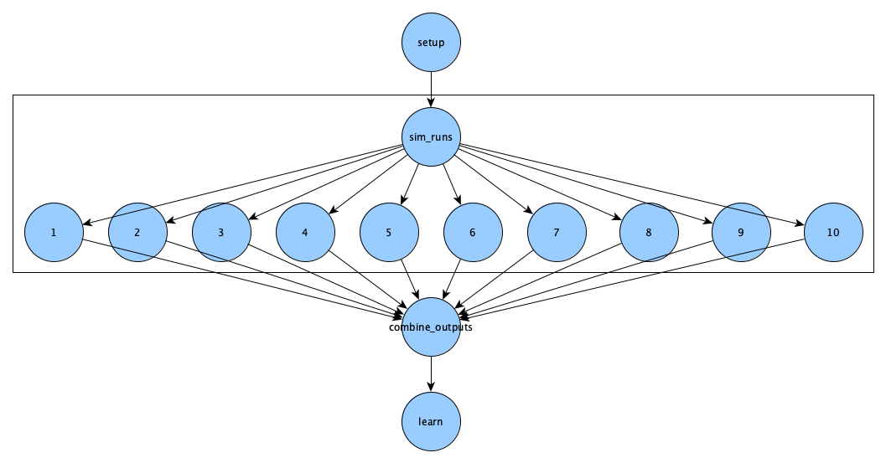
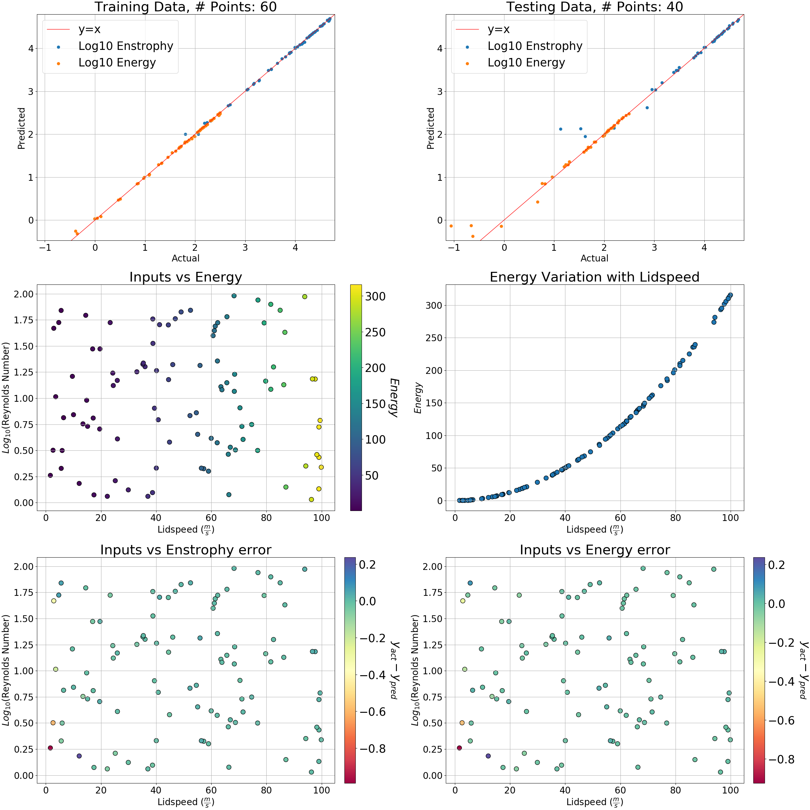

Run a Real Simulation
=====================

.. admonition:: Summary

  This module aims to do a parameter study on a well-known benchmark problem for
  viscous incompressible fluid flow.

.. admonition:: Prerequisites

      * :doc:`Module 0: Before you come<../before>`
      * :doc:`Module 2: Installation<../installation/installation>`
      * :doc:`Module 3: Hello World<../hello_world/hello_world>`

.. admonition:: Estimated time

      * 60 minutes

.. admonition:: You will learn

      * How to run the simulation OpenFOAM, using merlin.
      * How to use machine learning on OpenFOAM results, using merlin.

.. contents:: Table of Contents:
  :local:

Introduction
++++++++++++

We aim to do a parameter study on the lid-driven cavity problem. We are specifically
interested in predicting the average velocity squared (as a proxy for energy) as well
as the average enstrophy of the fluid in steady state from the initial conditions
lidspeed and fluid viscosity.

**TODO: insert image/image with important details**

We will be going over:

 * Setting up our inputs
 * Running multiple simulations in parallel
 * Combining the outputs of these simulations into a an array
 * Predictive modeling and visualization

Before moving on,
~~~~~~~~~~~~~~~~~

check that the virtual environment with merlin installed is activated
and that redis server is set up using this command:

.. code:: bash

  merlin info

This is covered more in depth here: :ref:`Verifying installation`

Specification file
++++++++++++++++++

We are going to build a spec file that produces this DAG:

Use the ``merlin example`` to get the necessary files for this module.

.. code-block:: bash

    merlin example openfoam_wf
    cd openfoam_wf/

In the ``openfoam_wf`` directory you should see the following:

**TODO: insert directory graph**

* ``openfoam_wf.yaml`` -- this spec file is partially blank. You will fill in the gaps as you follow this module's steps.

* ``openfoam_wf_template.yaml`` -- this is a complete spec file. You can always reference it as an example.

* ``scripts`` -- This directory contains all the necessary scripts for this module.

  * We'll be exploring these scripts as we go with the tutorial.

* ``requirements.txt`` -- this is a text file listing this workflow's python dependencies.

To start, open ``openfoam_wf.yaml`` using your favorite text editor.

It should look something like this:

.. literalinclude:: ../../../../merlin/examples/workflows/openfoam_wf/openfoam_wf.yaml
   :language: yaml

Variables
~~~~~~~~~
First we specify some variables to make our life easier. Locate the ``env`` block
in our yaml spec

.. code-block:: yaml

  env:
      variables:
          OUTPUT_PATH: ./openfoam_wf_output

          SCRIPTS:
          N_SAMPLES:

The ``OUTPUT_PATH`` variable is set to tell merlin where you want your output directory to be.
The default is ``<spec_name>_<TIMESTAMP>`` which in our case would simply be ``openfoam_wf_<TIMESTAMP>``

We'll fill out the next two variables as we go.

Samples and scripts
~~~~~~~~~~~~~~~~~~~
One merlin best practice is to copy any scripts your workflow may use from your ``SPECROOT`` directory into the ``MERLIN_INFO``
directory. This is done to preserve the original scripts in case they are modified during the time merlin is running.
We will do that first.
We will put this in the merlin sample generation section, since it runs before anything else.

Edit the merlin block to look like the following:

.. code-block:: yaml

  merlin:
      samples:
          generate:
              cmd: |
                  cp -r $(SPECROOT)/scripts $(MERLIN_INFO)/

                  # Generates the samples
                  python $(MERLIN_INFO)/scripts/make_samples.py -n 10 -outfile=$(MERLIN_INFO)/samples
          file: $(MERLIN_INFO)/samples.npy
          column_labels: [LID_SPEED, VISCOSITY]

We will be using the scripts directory a lot so we'll set the variable ``SCRIPTS``
to ``$(MERLIN_INFO)/scripts`` for convenience. We would also like to have a more central control over
the number of samples generated so we'll create an ``N_SAMPLES`` variable:

.. code-block:: yaml

  env:
      variables:
          OUTPUT_PATH: ./openfoam_wf_output
          SCRIPTS: $(MERLIN_INFO)/scripts
          N_SAMPLES: 10

and update the merlin block to be:

.. code-block:: yaml

  merlin:
      samples:
          generate:
              cmd: |
                  cp -r $(SPECROOT)/scripts $(MERLIN_INFO)/

                  # Generates the samples
                  python $(SCRIPTS)/scripts/make_samples.py -n N_SAMPLES -outfile=$(MERLIN_INFO)/samples
          file: $(MERLIN_INFO)/samples.npy
          column_labels: [LID_SPEED, VISCOSITY]

Just like in the :ref:`Using Samples` step of the hello world module, we
generate samples using the merlin block. We are only concerned with how the
variation of two initial conditions, lid-speed and viscosity, affects outputs of the system.
These are the ``column_labels``.
The ``make_samples.py`` script is designed to make log uniform random samples.
Now, we can move on to the steps of our study block.

Setting up
~~~~~~~~~~
Our first step in our study block is concerned with making sure we have all the
required python packages for this workflow. The specific packages are found in
the ``requirements.txt`` file.

We will also need to copy the lid driven cavity deck from the OpenFOAM docker
container and adjust the write controls. This last part is scripted already for
convenience.

Locate the ``setup`` step in the study block and edit it to look like the following:

.. code-block:: yaml

  study:
    - name: setup
      description: |
                Installs necessary python packages and imports the cavity directory
                from the docker container
      run:
        cmd: |
          pip install -r $(SPECROOT)/requirements.txt

          # Set up the cavity directory in the MERLIN_INFO directory
          source $(SCRIPTS)/cavity_setup.sh $(MERLIN_INFO)

This step does not need to be parallelized so we will assign it to lower
concurrency (a setting that controls how many workers can be running at the same time)

Locate the ``resources`` section in the ``merlin`` block and edit the concurrency and add the setup step:

.. code-block:: yaml

  resources:
      workers:
          nonsimworkers:
              args: -l INFO --concurrency 1
              steps: [setup]

Running the simulation
~~~~~~~~~~~~~~~~~~~~~~
In this step we specify the input parameters and run each of the simulations.
For OpenFOAM, we simply need to change the values in each of the files related
to lid-speed and viscosity. We then utilize the OpenFOAM docker container to run each
of these input parameters locally.

The quantities of interest are the average enstrophy and kinetic energy at each cell.
The enstrophy is calculated through an OpenFOAM post processing function of the the flow
fields while the kinetic energy is approximated by calculated using the square of
the velocity vector at each grid point. The velocity field is normally
outputted normally as a result of running the default openfoam solver for this
particular problem.

The ``run_openfoam`` executable calculates the appropriate ``deltaT`` so that we
have a Courant number of less than 1. It also uses the ``icoFoam`` solver on the
cavity decks and gives us VTK files that are helpful for visualizing the flow fields
using visualization tools such as VisIt or ParaView.

This part should look like:

.. code-block:: yaml

  - name: sim_runs
    description: |
                Edits the Lidspeed and viscosity then runs OpenFOAM simulation
                using the icoFoam solver
    run:
        cmd: |
            cp -r $(MERLIN_INFO)/cavity cavity/
            cd cavity

            ## Replaces default values for viscosity and lidspeed with
            #  values specified by samples section of the merlin block
            sed -i '' "18s/.*/nu              [0 2 -1 0 0 0 0] $(VISCOSITY);/" constant/transportProperties
            sed -i '' "26s/.*/        value           uniform ($(LID_SPEED) 0 0);/" 0/U

            cd ..
            cp $(SCRIPTS)/run_openfoam .

            CONTAINER_NAME='OPENFOAM_ICO_$(MERLIN_SAMPLE_ID)'
            docker container run -ti --rm -v $(pwd):/cavity -w /cavity --name=${CONTAINER_NAME} cfdengine/openfoam ./run_openfoam $(LID_SPEED)
            docker wait ${CONTAINER_NAME}
        depends: [setup]
        task_queue: simqueue

This step runs many simulations in parallel so it would run faster if we assign it
a worker with a higher concurrency.

.. code-block:: yaml

  merlin:
      resources:
          workers:
              nonsimworkers:
                  args: -l INFO --concurrency 1
                  steps: [setup]
              simworkers:
                  args: -l INFO --concurrency 10 --prefetch-multiplier 1 -Ofair
                  steps: [sim_runs]

Combining outputs
~~~~~~~~~~~~~~~~~
The script in this step extracts the data from each of the simulation runs from
the previous step and combines it for future use.

Simply run the combine outputs script to save the data as a .npz file in the
current step workspace.

.. code-block:: yaml

 - name: combine_outputs
   description: Combines the outputs of the previous step
   run:
       cmd: |
           python $(SCRIPTS)/combine_outputs.py -data $(sim_runs.workspace) -merlin_paths $(MERLIN_PATHS_ALL)
       depends: [sim_runs_*]

This step depends on all the previous step's simulation runs which is why we
have the star. However, it does not need to be parallelized so we assign it to
the nonsimworkers

.. code-block:: yaml

  merlin:
      resources:
          workers:
              nonsimworkers:
                  args: -l INFO --concurrency 1
                  steps: [setup, combine_outputs]
              simworkers:
                  args: -l INFO --concurrency 10 --prefetch-multiplier 1 -Ofair
                  steps: [sim_runs]

Machine Learning and visualization
~~~~~~~~~~~~~~~~~~~~~~~~~~~~~~~~~~
In this step we do some post processing of the data collected in the previous step,
use the RandomForestRegressor from the sklearn python package to predict enstrophy
and kinetic energy from lid-speed and viscosity, and finally, visualize the fit
of this regressor and the input regions with the highest error.

.. code-block:: yaml

 - name: learn
   description: Learns the output of the openfoam simulations using input parameters
   run:
       cmd: |
           python $(SCRIPTS)/learn.py -workspace $(MERLIN_WORKSPACE)
       depends: [combine_outputs]

This step is also dependent on the previous step for the .npz file and will only need
one worker therefore we will:

.. code-block:: yaml

  merlin:
      resources:
          workers:
              nonsimworkers:
                  args: -l INFO --concurrency 1
                  steps: [setup, combine_outputs, learn]
              simworkers:
                  args: -l INFO --concurrency 10 --prefetch-multiplier 1 -Ofair
                  steps: [sim_runs]

Putting it all together
~~~~~~~~~~~~~~~~~~~~~~~
By the end, your ``openfoam_wf.yaml`` should look like the template version in the same directory:

.. literalinclude:: ../../../../merlin/examples/workflows/openfoam_wf/openfoam_wf_template.yaml
   :language: yaml

Setup redis
+++++++++++

We will need to set up the redis server using a docker container.
This removes the hassle of downloading and making the redis tar file.
Run:

.. code-block:: bash

    docker run --detach --name my-redis -p 6379:6379 redis

Now configure merlin for redis with:

.. code-block:: bash

    merlin config --broker redis

Run the workflow
++++++++++++++++
Now that you know what is inside the OpenFOAM specification, run this command to get a full copy of the workflow with the scripts it needs:

.. code-block:: bash

    $ merlin example openfoam_wf

Now, run the workflow:

.. code-block:: bash

    $ merlin run openfoam_wf/openfoam_wf.yaml

    $ merlin run-workers openfoam_wf/openfoam_wf.yaml

With 100 samples instead of 10 (should take about 6 minutes):

.. code-block:: bash

    $ merlin run openfoam_wf/openfoam_wf.yaml --vars N_SAMPLES=100

To see your results, look inside the ``learn`` output directory. You should see a png that looks like this:

.. admonition:: Related articles

    * https://cfd.direct/openfoam/user-guide/v6-cavity/
    * https://www.cfdengine.com/blog/how-to-install-openfoam-anywhere-with-docker/
