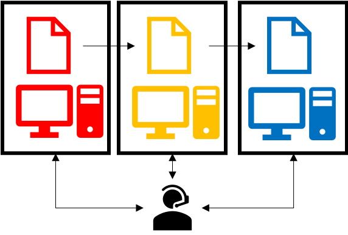
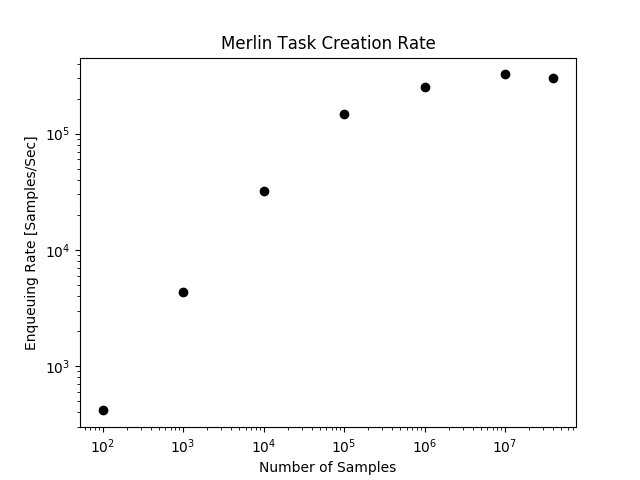
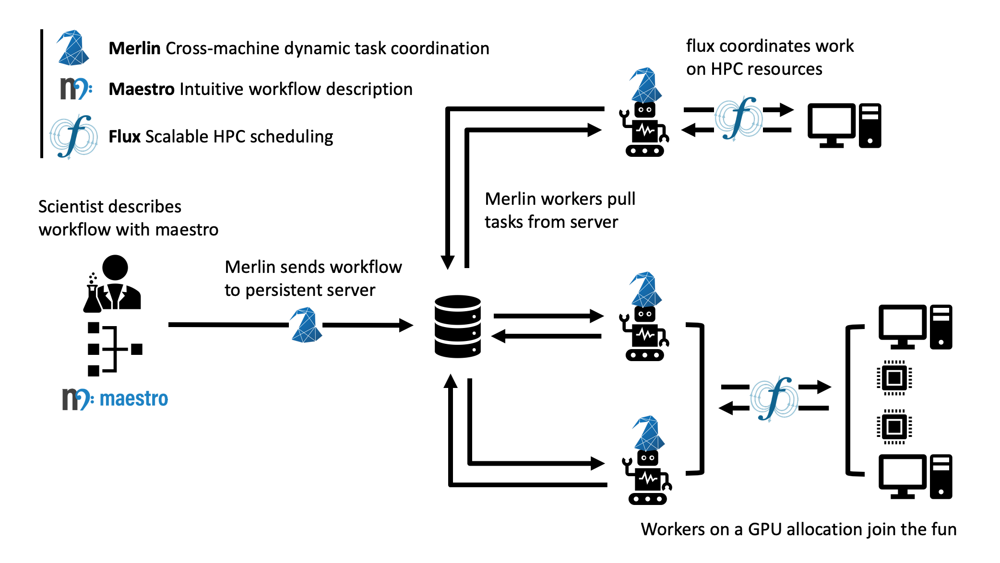
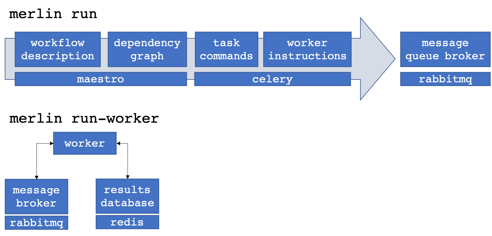

# Introduction

This module introduces you to Merlin, some of the technology behind it, and how it works.

!!! info "Estimated Time"

    20 minutes

!!! abstract "You Will Learn"

    - What Merlin is and why you might consider it
    - Why it was built and what are some target use cases
    - How it is designed and what the underlying tech is

## What is Merlin?

!!! abstract "Summary"

    Merlin is a toolkit designed to enable HPC-focused simulation workflows with distributed cloud compute technologies. This helps simulation workflows push to immense scale. (Like [100 million](https://arxiv.org/abs/1912.02892))

At its core, Merlin translates a text-based, command-line focused workflow description into a set of discrete tasks. These tasks live on a centralized broker (e.g. a separate server) that persists outside of your HPC batch allocation. Autonomous workers in different allocations (even on different machines) can then connect to this server, pull off and execute these tasks asynchronously.

## Why Merlin? What's the Need?

That sounds complicated. Why would you care to do this?

The short answer: machine learning

The longer answer: machine learning and data science are becoming an integral part of scientific inquiry. The problem is that machine learning models are data hungry: it takes lots and lots of simulations to train machine learning models on their outputs. Unfortunately HPC systems were designed to execute a few large hero simulations, not many smaller simulations. Naively pushing standard HPC workflow tools to hundreds of thousands and millions of simulations can lead to some serious problems.

Workflows, applications and machines are becoming more complex, but subject matter experts need to devote time and attention to their applications and often require fine command-line level control. Furthermore, they rarely have the time to devote to learning workflow systems.

With the expansion of data-driven computing, the HPC scientist needs to be able to run more simulations through complex multi-component workflows.

**Merlin targets HPC workflows that require many simulations**. These include:

| Simulation Type         | Description             |
| ----------------------- | ----------------------- |
| Emulator Building       | Running enough simulations to build an emulator (or "surrogate model") of an expensive computer code, such as needed for uncertainty quantification |
| Iterative Sampling      | Executing some simulations and then choosing new ones to run based on the results obtained thus far |
| Active Learning         | Iteratively sampling coupled with emulator building to efficiently train a machine learning model |
| Design Optimization     | Using a computer code to optimize a model design, perhaps robustly or under uncertainty |
| Reinforcement Learning  | Building a machine learning model by subsequently exposing it to lots of trials, giving it a reward/penalty for the outcomes of those trials |
| Hierarchical Simulation | Running low-fidelity simulations to inform which higher fidelity simulations to execute |
| Heterogeneous Workflows | Workflows that require different steps to execute on different hardware and/or systems |

Many scientific and engineering problems require running lots of simulations. But accomplishing these tasks effectively in an unstable bleeding edge HPC environment can be dicey. The tricks that work for 100 simulations won't work for [10 thousand](https://doi.org/10.1063/1.4977912), let alone [100 million](https://arxiv.org/abs/1912.02892).

We made Merlin to make high-frequency extreme scale computing easy.

## How Can Merlin Run so Many Simulations?

The good news is that distributed cloud compute technology has really pushed the frontier of scalability. Merlin helps bring this tech to traditional scientific HPC.

Traditionally, HPC workflow systems tie workflow steps to HPC resources and coordinate the execution of tasks and management of resources one of two ways:

+--------------------------------------------------------------------------------------------+-------------------------------------------------------+
| External Coordination                                                                      + - Separate batch jobs for each task                   |
|  + - External daemon tracks dependencies and jobs        |
|                                                                                            + - Progress monitored with periodic polling            |
|                                                                                            +   (of files or batch system)                          |
+--------------------------------------------------------------------------------------------+-------------------------------------------------------+
| Internal Coordination                                                                      + - Multiple tasks bundled into larger batch jobs       |
|  + - Internal daemon tracks dependencies and resources   |
|                                                                                            + - Progress monitored via polling                      |
|                                                                                            +   (of filesystem or message passing)                  |
+--------------------------------------------------------------------------------------------+-------------------------------------------------------+

**External coordination** ties together independent batch jobs each executing workflow sub-tasks with an external monitor. This monitor could be a daemon or human that monitors either the batch or file system via periodic polling and orchestrates task launch dependencies.

External coordination can tailor the resources to the task, but cannot easily run lots of concurrent simulations (since batch systems usually limit the number of jobs a user can queue at once).

**Internal coordination** puts the monitor within a larger batch job that allocates resources inside that job for the specific tasks at hand.

Internal coordination can run many more concurrent tasks by bundling smaller jobs into larger jobs, but cannot tailor the resources to the task at hand. This precludes workflows that, for instance, require one step on CPU hardware and another on a GPU machine.

Instead of tying resources to tasks, Merlin does this:

+------------------------------------------------------------------------------------------+-----------------------------------------------+
| Centralized Coordination of Producers & Consumers                                        + - Batch jobs and workers decoupled from tasks |
|  + - Centralized queues visible to multiple jobs |
|                                                                                          + - Progress and dependencies handled via       |
|                                                                                          +   direct worker connections to central        |
|                                                                                          +   message server and results database         |
+------------------------------------------------------------------------------------------+-----------------------------------------------+

Merlin decouples workflow tasks from workflow resources.

Merlin avoids a command-and-control approach to HPC resource management for a workflow. Instead of having the workflow coordinator ask for and manage HPC resources and tasks, the Merlin coordinator just manages tasks. Task-agnostic resources can then independently connect (and disconnect) to the coordinator.

In Merlin, this **producer-consumer workflow** happens through two commands:

=== "Producer"
    ```bash
    merlin run SPECIFICATION
    ```

=== "Consumer"
    ```bash
    merlin run-workers SPECIFICATION
    ```

The `merlin run` command populates the central queue(s) with work to do and the `merlin run-worker` command drains the queue(s) by executing the task instructions. Each new instance of `merlin run-worker` creates a new consumer. These consumers can exist on different machines in different batch allocations, anywhere that can see the central server. Likewise `merlin run` can populate the queue from any system that can see the queue server, including other workers. In principle, this means a researcher can push new work onto an already running batch allocation of workers, or re-direct running jobs to work on higher-priority work.

!!! info "The Benefits of Producer-Consumer Workflows"
    
    The increased flexibility that comes from decoupling *what* HPC applications you run from *where* you run them can be extremely enabling.
    
    Merlin allows you to

    - Scale to very large number of simulations by avoiding common HPC bottlenecks
    - Automatically take advantage of free nodes to process your workflow faster
    - Create iterative workflows, like as needed for active machine learning
    - Dynamically add more tasks to already-running jobs
    - Have cross-machine and cross-batch-job workflows, with different steps executing on different resources, but still coordinated

The producer-consumer approach to workflows allows for increased flexibility and scalability. For this reason it has become a mainstay of cloud-compute microservices, which allow for extremely distributed asynchronous computing.

Many asynchronous task and workflow systems exist, but the majority are focused around this microservices model, where a system is set up (and managed) by experts that build a single workflow. This static workflow gets tested and hardened and exists as a service for their users (e.g. an event on a website triggers a discrete set of tasks). HPC, and in particular *scientific* HPC brings its own set of challenges that make a direct application of microservices to HPC workflows challenging.

Some challenges for bringing microservices to scientific HPC workflows include:

| Challenge | Requirement |
| --------- | ----------- |
| Workflows can change from day-to-day as researchers explore new simulations, configurations, and questions | *Workflows need to be dynamic, not static* |
| Workflow components are usually different executables, pre- and post-processing scripts and data aggregation steps written in different languages | *Workflows need to intuitively support multiple languages* |
| These components often need command-line-level control of task instructions | *Workflows need to support shell syntax and environment variables* |
| Components frequently require calls to a batch system scheduler for parallel job execution | *Workflows need a natural way to launch parallel jobs that use more resources than a single worker* |
| Tasks can independently create large quantities of data | *Dataflow models could be bottlenecks. Workflows should take advantage of parallel file systems* |
| HPC systems (in particular leadership class machines) can experience unforeseen outages | *Workflows need to be able to restart, retry and rerun failed steps without needing to run the entire workflow* |

Merlin was built specifically to address the challenges of porting microservices to HPC simulations.

## So What Exactly Does Merlin Do?

Merlin wraps a heavily tested and well used asynchronous task queuing library in a skin and syntax that is natural for HPC simulations. In essence, we extend [Maestro](https://maestrowf.readthedocs.io/en/latest/) by hooking it up to [Celery](https://docs.celeryproject.org/en/latest/index.html). We leverage Maestro's HPC-friendly workflow description language and translate it to discrete Celery tasks.

Why not just plain Celery?

Celery is extremely powerful, but this power can be a barrier for many science and engineering subject matter experts, who might not be python coders. While this may not be an issue for web developers, it presents a serious challenge to many scientists who are used to running their code from a shell command line. By wrapping Celery commands in Maestro steps, we not only create a familiar environment for users (since Maestro steps look like shell commands), but we also create structure around Celery dependencies. Maestro also has interfaces to common batch schedulers (e.g. [Slurm](https://slurm.schedmd.com/documentation.html) and [Flux](http://flux-framework.org))[^1] for parallel job control.

So why Merlin and not just plain Maestro?

The main reason: to run lots of simulations for machine learning applications. Basically **Merlin scales Maestro.**

Maestro follows an external coordinator model. Maestro workflow DAGs (directed acyclic graphs) need to be unrolled (concretized) ahead of time, so that batch dependencies can be calculated and managed. This graph problem becomes very expensive as the number of tasks approaches a few hundred. (Not to mention most batch systems will prevent a user from queuing more than a few hundred concurrent batch jobs.) In other words, using Maestro alone to run thousands of simulations is not practical.

But with Celery, we can *dynamically* create additional tasks. This means that the DAG can get unrolled by the very same workers that will execute the tasks, offering a natural parallelism (i.e. much less waiting before starting the work).

What does this mean in practice?

*Merlin can quickly queue a lot of simulations.*

How quickly? The figure below shows task queuing rates when pushing [a simple workflow](3_hello_world.md) on the [Quartz Supercomputer](https://hpc.llnl.gov/hardware/platforms/Quartz) to 40 million samples. This measures how quickly simulation ensembles of various sample sizes can get enqueued.



As you can see, by exploiting Celery's dynamic task queuing (tasks that create tasks), Merlin can enqueue hundreds of thousands of simulations per second. These jobs can then be consumed in parallel, at a rate that depends on the number of workers you have.

Furthermore, this ability to dynamically add tasks to the queue means that workflows can become more flexible and responsive. A worker executing a step can launch additional workflows without having to stand up resources to execute and monitor the execution of those additional steps.

The only downside to being able to enqueue work this quickly is the inability of batch schedulers to keep up. This is why we recommend pairing Merlin with [Flux](http://flux-framework.org), which results in a scalable but easy-to-use workflow system:

- Maestro describes the workflow tasks
- Merlin orchestrates the task executions
- Flux schedules the HPC resources

Here's an example of how Merlin, Maestro, and Flux can all work together to launch a workflow on multiple machines.



The scientist describes her workflow with a Maestro-like specification. Her workflow consists of two steps:

1. Run many parallel CPU-only jobs, varying her simulation parameters of interest
2. Use a GPU to train a deep learning model on the results of those simulations

She then types `merlin run SPECIFICATION`, which translates that Maestro spec into Celery commands and sends those tasks to two separate queues on a centralized server (one for CPU work and one for GPU work).

She then launches a batch allocation on the CPU machine, which contains the command `merlin run-workers SPECIFICATION --steps 1`. Workers start up under Flux, pull work from the server's CPU queue and call Flux to launch the parallel simulations asynchronously.

She also launches a separate batch request on the GPU machine with `merlin run-workers SPECIFICATION --steps 2`. These workers connect to the central queue associated with the GPU step.

When the simulations in step 1 finish, step 2 will automatically start. In this fashion, Merlin allows the scientist to coordinate a highly scalable asynchronous multi-machine heterogeneous workflow.

This is of course a simple example, but it does show how the producer-consumer philosophy in HPC workflows can be quite enabling. Merlin's goal is to make it easy for HPC-focused subject matter experts to take advantage of the advances in cloud computing.


## How is it Designed?

Merlin leverages a number of open source technologies, developed and battle-hardened in the world of distributed computing. We decided to do this instead of having to build, test and maintain stand-alone customized (probably buggy) versions of software that will probably not be as fully featured.

There are differing philosophies on how much third-party software to rely upon. On the one hand, building our system off ubiquitous open source message passing libraries increases the confidence in our software stack's performance, especially at scale (for instance, Celery is robust enough to [keep Instagram running](https://scaleyourapp.com/instagram-architecture-how-does-it-store-search-billions-of-images/)). However, doing so means that when something breaks deep down, it can be difficult to fix (if at all). Indeed if there's an underlying "feature" that we'd like to work around, we could be stuck. Furthermore, the complexity of the software stack can be quite large, such that our team couldn't possibly keep track of it all. These are valid concerns; however, we've found it much easier to quickly develop a portable system with a small team by treating (appropriately chosen) third party libraries as underlying infrastructure. (Sure you *could* build and use your own compiler, but *should* you?)

Merlin manages the increased risk that comes with relying on software that is out of our control by:

1. Building modular software that can easily be reconfigured / swapped for other tech
2. Participating as developers for those third-party packages upon which rely (for instance we often kick enhancements and bug fixes to Maestro)
3. Using continuous integration and testing to catch more errors as they occur

This section talks about some of those underlying technologies, what they are, and why they were chosen.

*A brief technical dive into some underlying tech*

Merlin extends [Maestro](https://maestrowf.readthedocs.io/en/latest/) with [Celery](https://docs.celeryproject.org/en/latest/index.html), which in turn can be configured to interface with a variety of [message queue brokers and results backends](https://docs.celeryq.dev/en/stable/getting-started/backends-and-brokers/index.html). In practice, we like to use [RabbitMQ](https://www.rabbitmq.com) and [Redis](https://redis.io) for our broker and backend respectively, because of their features and reliability, especially at scale.

| Component | Reasoning |
| --------- | --------- |
| [Maestro](https://maestrowf.readthedocs.io/en/latest/) | Shell-like workflow descriptions, batch system interfaces |
| [Celery](https://docs.celeryproject.org/en/latest/index.html) | Highly scalable, supports multiple brokers and backends |
| [RabbitMQ](https://www.rabbitmq.com) | Resilience, support for multiple users and queues |
| [Redis](https://redis.io) | Database speed, scalability |
| [Cryptography](https://cryptography.io/en/latest/) | Secure Redis results |
| [Flux](http://flux-framework.org) | Portability and scalability of HPC resource allocation |

The different components interact to populate and drain the message queue broker of workflow tasks.



When a call is made to `merlin run`, Maestro turns the workflow description (composed of "steps" with "parameters" and "samples") into a task dependency graph. Merlin translates this graph into discrete Celery tasks[^2].

Calls to `merlin run-worker` cause Celery workers to connect to both the message broker and results database. The workers pull tasks from the broker and begin to execute the instructions therein. When finished, a worker posts the results (task status metadata, such as "SUCCESS" or "FAIL") to the results database and automatically grabs another task from the queue. When additional workers come along (through other explicit calls to `merlin run-worker`), they connect to the broker and help out with the workflow.

*Multiple vs. Single Queues*

RabbitMQ brokers can have multiple distinct queues. To take advantage of this feature, Merlin lets you assign workflow steps and workers to different queues. (Steps must be assigned to a single queue, but workers can connect to multiple queues at once.) The advantage of a single queue is simplicity, both in workflow design and scalability. However, having multiple queues allows for prioritization of work (the express checkout lane at the grocery store) and customization of workers (specialized assembly line workers tailored for a specific task).


## What is in This Tutorial?

This tutorial will show you how to:


- [Install Merlin](2_installation.md) and test that it works correctly
- [Build a basic workflow](3_hello_world.md) and scale it up, introducing you to Merlin's syntax and how it differs from Maestro.
- [Run a "real" physics simulation](4_run_simulation.md) based workflow, with post-processing of results, visualization and machine learning.
- [Use Merlin's advanced features](5_advanced_topics.md) to do things like interface with batch systems, distribute a workflow across machines and dynamically add new samples to a running workflow.
- [Contribute to Merlin](6_contribute.md), through code enhancements and bug reports.
- [Port your own application](7_port_application.md), with tips and tricks for building and scaling up workflows.


[^1]: The Flux and Slurm interfaces used by Merlin differ from the versions bundled with Maestro to decouple job launching from batch submission.
[^2]: Technically Merlin creates Celery tasks that will break up the graph into subsequent tasks (tasks to create tasks). This improves scalability with parallel task creation.
