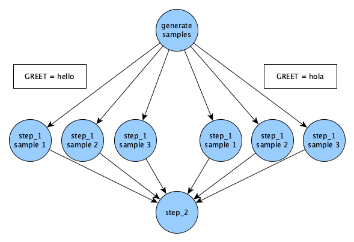

# Hello, World!

This hands-on module walks through the steps of building and running a simple Merlin workflow.

!!! info "Prerequisites"

    [2. Installation](2_installation.md)

!!! info "Estimated Time"

    30 minutes

!!! abstract "You Will Learn"

    - The components of a Merlin workflow specification
    - How to run a simple Merlin workflow.
    - How to interpret the results of your workflow.

## Get Example Files

Merlin comes with a built-in command `merlin example` to easily get a basic workflow up and running. To see a list of all the examples provided with Merlin you can run:

```bash
merlin example list
```

For this tutorial we will be using the [`hello`](../examples/hello.md) example. Run the following commands:

```bash
merlin example hello; cd hello/
```

This will create and move into directory called `hello`, which contains these files:

- `my_hello.yaml` -- this spec file is partially blank. You will fill in the gaps as you follow this module's steps.
- `hello.yaml` -- this is a complete spec without samples. You can always reference it as an example.
- `hello_samples.yaml` -- same as before, but with samples added.
- `make_samples.py` -- this is a small python script that generates samples.
- `requirements.txt` -- this is a text file listing this workflow's python dependencies.

## Specification File

Central to Merlin is something called a specification file, or a "spec" for short. The spec defines all aspects of your workflow. The spec is formatted in yaml. If you're unfamiliar with yaml, it's worth [reading up on](https://www.tutorialspoint.com/yaml/yaml_quick_guide.htm) for a few minutes.

!!! warning

    Stray whitespace can break yaml; make sure your indentation is consistent.

Let's build our spec piece by piece. For each spec section listed below, fill in the blank yaml entries of `my_hello.yaml` with the given material.

### Section: `description`

Just what it sounds like. Name and briefly summarize your workflow.

<!--codeinclude-->
[](../../merlin/examples/workflows/hello/hello.yaml) lines:1-3
<!--/codeinclude-->

### Section: `global.parameters`

Global parameters are constants that you want to vary across simulations. Steps that contain a global parameter or depend on other steps that contain a global parameter are run for each index over parameter values. The label is the pattern for a filename that will be created for each value. For a more in-depth explanation of what parameters are, consult [Maestro's Docs](https://maestrowf.readthedocs.io/en/latest/Maestro/parameter_specification.html).

<!--codeinclude-->
[](../../merlin/examples/workflows/hello/hello.yaml) lines:5-11
<!--/codeinclude-->

!!! note

    `%%` is a special token that defines where the value in the label is placed. In this case the parameter labels will be GREET.hello, GREET.hola, etc. The label can take a custom text format, so long as the `%%` token is included to be able to substitute the parameter’s value in the appropriate place.

So this will give us an English result and a Spanish result. You could add as many more languages as you want, as long as both parameters hold the same number of values.

### Section: `study`

This is where you define workflow steps. While the convention is to list steps as sequentially as possible, the only factor in determining step order is the dependency directed acyclic graph (DAG) created by the `depends` field.

<!-- Not using a codeinclude statment here since we need to demonstrate the depends field -->
```yaml
study:
- name: step_1
    description: say hello
    run:
        cmd: echo "$(GREET), $(WORLD)!"

- name: step_2
    description: print a success message
    run:
        cmd: print("Hurrah, we did it!")
        depends: [step_1]
        shell: /usr/bin/env python3
```

!!! tip

    The `-` denotes a list item in YAML. To add elements, simply add new elements prefixed with a hyphen

`$(GREET)` and `$(WORLD)` expand the global parameters separately into their two values. `$(step_1.workspace)` gets the path to the output workspace of `step_1`. The default value for `shell` is `/bin/bash`. In `step_2` we override this to use python instead. Steps must be defined as nodes in a DAG, so no cyclical dependencies are allowed. Our step DAG currently looks like this:

<figure markdown>
  
  <figcaption>Basic 2-Step DAG</figcaption>
</figure>

Since our global parameters have 2 values, this is actually what the DAG looks like:

<figure markdown>
  
  <figcaption>2-Step DAG with Parameters</figcaption>
</figure>

It looks like running `step_2` twice is redundant. Instead of doing that, we can collapse it back into a single step, by having it wait for both parameterized versions of `step_1` to finish. Add `_*` to the end of the step name in `step_1`'s depend entry. In other words, go from this:

```yaml
depends: [step_1]
```

...to this:

```yaml
depends: [step_1_*]
```

Now the DAG looks like this:

<figure markdown>
  
  <figcaption>2-Step Funnel DAG</figcaption>
</figure>

Your full hello world spec `my_hello.yaml` should now look like this (an exact match of `hello.yaml`):

???+ abstract "Full Hello Spec"

    <!--codeinclude-->
    [hello.yaml](../../merlin/examples/workflows/hello/hello.yaml)
    <!--/codeinclude-->

The order of the spec sections doesn't matter.

!!! note

    At this point, `my_hello.yaml` is still maestro-compatible. The primary difference is that maestro won't understand anything in the `merlin` block, which we will add later. If you want to try it, run: 
    
    ```bash
    maestro run my_hello.yaml
    ```

## Try It!

First, we'll run Merlin locally. On the command line, run:

```bash
merlin run --local my_hello.yaml
```

If your spec is bugless, you should see a few messages proclaiming successful step completion, like this (for now we'll ignore the warning):

???+ success

    ```
           *      
       *~~~~~                                       
      *~~*~~~*      __  __           _ _       
     /   ~~~~~     |  \/  |         | (_)      
         ~~~~~     | \  / | ___ _ __| |_ _ __  
        ~~~~~*     | |\/| |/ _ \ '__| | | '_ \ 
       *~~~~~~~    | |  | |  __/ |  | | | | | |
      ~~~~~~~~~~   |_|  |_|\___|_|  |_|_|_| |_|
     *~~~~~~~~~~~                                    
       ~~~*~~~*    Machine Learning for HPC Workflows                                 
              


    [2023-12-19 17:41:02: INFO] Loading specification from path: /path/to/hello.yaml
    [2023-12-19 17:41:02: WARNING] Workflow specification missing 
    encouraged 'merlin' section! Run 'merlin example' for examples.
    Using default configuration with no sampling.
    [2023-12-19 17:41:02: INFO] OUTPUT_PATH: hello
    [2023-12-19 17:41:02: INFO] Study workspace is '/path/to/hello_20231219-174102'.
    [2023-12-19 17:41:02: INFO] Reading app config from file /path/to/.merlin/app.yaml
    [2023-12-19 17:41:02: INFO] Overriding default celery config with 'celery.override' in 'app.yaml':
            visibility_timeout:     86400
    [2023-12-19 17:41:02: INFO] Calculating task groupings from DAG.
    [2023-12-19 17:41:02: INFO] Converting graph to tasks.
    [2023-12-19 17:41:02: INFO] Launching tasks.
    WARNING:celery.backends.redis:
    Setting ssl_cert_reqs=CERT_NONE when connecting to redis means that celery will not validate the identity of the redis broker when connecting. This leaves you vulnerable to man in the middle attacks.

    [2023-12-19 17:41:02: INFO] Executing step 'step_1_GREET.hello.WORLD.world' in '/path/to/hello_20231219-174102/step_1/GREET.hello.WORLD.world'...
    [2023-12-19 17:41:02: INFO] Execution returned status OK.
    [2023-12-19 17:41:02: INFO] Step 'step_1_GREET.hello.WORLD.world' in '/path/to/hello_20231219-174102/step_1/GREET.hello.WORLD.world' finished successfully.
    [2023-12-19 17:41:02: INFO] Executing step 'step_1_GREET.hola.WORLD.mundo' in '/path/to/hello_20231219-174102/step_1/GREET.hola.WORLD.mundo'...
    [2023-12-19 17:41:02: INFO] Execution returned status OK.
    [2023-12-19 17:41:02: INFO] Step 'step_1_GREET.hola.WORLD.mundo' in '/path/to/hello_20231219-174102/step_1/GREET.hola.WORLD.mundo' finished successfully.
    [2023-12-19 17:41:02: INFO] Executing step 'step_2' in '/path/to/hello_20231219-174102/step_2'...
    [2023-12-19 17:41:02: INFO] Execution returned status OK.
    [2023-12-19 17:41:02: INFO] Step 'step_2' in '/path/to/hello_20231219-174102/step_2' finished successfully.
    ```

Great! But what happened? We can inspect the output directory to find out.

Look for a directory named `hello_<TIMESTAMP>`. That's your output directory. Within, there should be a directory for each step of the workflow, plus one called `merlin_info`. The whole file tree looks like this:

<figure markdown>
  
  <figcaption>File Tree for Hello Example</figcaption>
</figure>

A lot of stuff, right? Here's what it means:

* The 3 yaml files inside `merlin_info/` are called the provenance specs. They are copies of the original spec that was run, some showing under-the-hood variable expansions.

* `MERLIN_FINISHED` files indicate that the step ran successfully.

* `.sh` files contain the command for the step.

* `.out` files contain the step's stdout. Look at one of these, and it should contain your "hello" message.

* `.err` files contain the step's stderr. Hopefully empty, and useful for debugging.

## Run Distributed!

!!! warning "Important Note"

    Before trying this, make sure you've properly set up your Merlin config file. If you can run `merlin info` and see no errors you should be good to go. Otherwise, see either the [Configuring Merlin](./2_installation.md#configuring-and-connecting-to-a-redis-server) section of the installation step in the Tutorial or the [Configuration](../user_guide/configuration/index.md) page for more information.

Now we will run the same workflow, but in parallel on our task server:

```bash
merlin run my_hello.yaml
```

If your Merlin configuration is set up correctly, you should see something like this:

!!! success "Output From Sending Tasks to the Server"

    ```
           *
       *~~~~~
      *~~*~~~*      __  __           _ _
     /   ~~~~~     |  \/  |         | (_)
         ~~~~~     | \  / | ___ _ __| |_ _ __
        ~~~~~*     | |\/| |/ _ \ '__| | | '_ \
       *~~~~~~~    | |  | |  __/ |  | | | | | |
      ~~~~~~~~~~   |_|  |_|\___|_|  |_|_|_| |_|
     *~~~~~~~~~~~
       ~~~*~~~*    Machine Learning for HPC Workflows


    [2023-12-19 17:45:36: INFO] Loading specification from path: /path/to/hello.yaml
    [2023-12-19 17:45:36: WARNING] Workflow specification missing 
    encouraged 'merlin' section! Run 'merlin example' for examples.
    Using default configuration with no sampling.
    [2023-12-19 17:45:36: INFO] OUTPUT_PATH: hello
    [2023-12-19 17:45:36: INFO] Study workspace is '/path/to/hello_20231219-174536'.
    [2023-12-19 17:45:36: INFO] Reading app config from file /path/to/.merlin/app.yaml
    [2023-12-19 17:45:36: INFO] Overriding default celery config with 'celery.override' in 'app.yaml':
            visibility_timeout:     86400
    [2023-12-19 17:45:36: INFO] Calculating task groupings from DAG.
    [2023-12-19 17:45:36: INFO] Converting graph to tasks.
    [2023-12-19 17:45:36: INFO] Launching tasks.
    WARNING:celery.backends.redis:
    Setting ssl_cert_reqs=CERT_NONE when connecting to redis means that celery will not validate the identity of the redis broker when connecting. This leaves you vulnerable to man in the middle attacks.
    ```

That means we have launched our tasks! Now we need to launch the workers that will complete those tasks. Run this:

```bash
merlin run-workers my_hello.yaml
```

Here's the expected Merlin output message for running workers:

!!! success "Output From Running Workers"

    ```
           *
       *~~~~~
      *~~*~~~*      __  __           _ _
     /   ~~~~~     |  \/  |         | (_)
         ~~~~~     | \  / | ___ _ __| |_ _ __
        ~~~~~*     | |\/| |/ _ \ '__| | | '_ \
       *~~~~~~~    | |  | |  __/ |  | | | | | |
      ~~~~~~~~~~   |_|  |_|\___|_|  |_|_|_| |_|
     *~~~~~~~~~~~
       ~~~*~~~*    Machine Learning for HPC Workflows


    [2023-12-19 17:46:46: INFO] Loading specification from path: /path/to/hello.yaml
    [2023-12-19 17:46:46: WARNING] Workflow specification missing 
    encouraged 'merlin' section! Run 'merlin example' for examples.
    Using default configuration with no sampling.
    [2023-12-19 17:46:46: INFO] Launching workers from '/path/to/hello.yaml'
    [2023-12-19 17:46:46: INFO] Starting workers
    [2023-12-19 17:46:46: INFO] Reading app config from file /path/to/.merlin/app.yaml
    ```

Immediately after that, this will pop up:

!!! success "Celery Workers Logs"

    ```
    -------------- celery@worker_name.%machine770 v5.3.4 (emerald-rush)
    --- ***** -----
    -- ******* ---- Linux-4.18.0-513.9.1.1toss.t4.x86_64-x86_64-with-glibc2.28 2023-12-19 17:46:49
    - *** --- * ---
    - ** ---------- [config]
    - ** ---------- .> app:         merlin:0x2aaab20619e8
    - ** ---------- .> transport:   amqps://user:**@server:5671//user
    - ** ---------- .> results:     redis://user:**@server:6379/0
    - *** --- * --- .> concurrency: 36 (prefork)
    -- ******* ---- .> task events: OFF (enable -E to monitor tasks in this worker)
    --- ***** -----
    -------------- [queues]
                    .> [merlin]_merlin  exchange=[merlin]_merlin(direct) key=[merlin]_merlin


    [tasks]
    . merlin.common.tasks.add_merlin_expanded_chain_to_chord
    . merlin.common.tasks.expand_tasks_with_samples
    . merlin.common.tasks.merlin_step
    . merlin:chordfinisher
    . merlin:queue_merlin_study
    . merlin:shutdown_workers

    [2023-12-19 17:46:47,549: INFO] Connected to amqps://user:**@server:5671//user
    [2023-12-19 17:46:47,599: INFO] mingle: searching for neighbors
    [2023-12-19 17:46:48,807: INFO] mingle: sync with 2 nodes
    [2023-12-19 17:46:48,807: INFO] mingle: sync complete
    [2023-12-19 17:46:48,835: INFO] celery@worker_name.%machine770 ready.
    ```

You may not see all of the info logs listed after the Celery C is displayed. If you'd like to see them you can change the Merlin workers' log levels with the `--worker-args` tag:

```bash
merlin run-workers --worker-args "-l INFO" my_hello.yaml
```

The terminal you ran workers in is now being taken over by Celery, the powerful task queue library that Merlin uses internally. The workers will continue to report their task status here until their tasks are complete.

Workers are persistent, even after work is done. Send a stop signal to all your workers with this command:

```bash
merlin stop-workers
```

...and a successful worker stop will look like this, with the name of specific worker(s) reported:

!!! success "Successful Worker Stop Output"
    ```
           *
       *~~~~~
      *~~*~~~*      __  __           _ _
     /   ~~~~~     |  \/  |         | (_)
         ~~~~~     | \  / | ___ _ __| |_ _ __
        ~~~~~*     | |\/| |/ _ \ '__| | | '_ \
       *~~~~~~~    | |  | |  __/ |  | | | | | |
      ~~~~~~~~~~   |_|  |_|\___|_|  |_|_|_| |_|
     *~~~~~~~~~~~
       ~~~*~~~*    Machine Learning for HPC Workflows


    [2020-03-06 09:20:08: INFO] Stopping workers...
    [2020-03-06 09:20:08: INFO] Reading app config from file /path/to/.merlin/app.yaml
    [2020-03-06 09:20:09: INFO] Overriding default celery config with 'celery.override' in 'app.yaml':
        visibility_timeout:     86400
    [2020-03-06 09:20:10: INFO] Sending stop to these workers: ['celery@machine_name.%machine']
    [2020-03-06 09:20:10: WARNING] Got shutdown from remote
    ```

## Using Samples

It's a little boring to say "hello world" in just two different ways. Let's instead say hello to many people!

To do this, we'll need samples. Specifically, we'll change `WORLD` from a global parameter to a sample. While parameters are static, samples are generated dynamically, and can be more complex data types. In this case, `WORLD` will go from being "world" or "mundo" to being a randomly-generated name.

First, we remove the global parameter `WORLD` so it does not conflict with our new sample. Parameters now look like this:

<!--codeinclude-->
[](../../merlin/examples/workflows/hello/hello_samples.yaml) lines:9-12
<!--/codeinclude-->

Next we'll add two new blocks to our spec: the `env` block and the `merlin` block.

### Section: `env`

To set up custom environment variables and other values that can be used throughout our spec we need to introduce a new `env` block to our spec file. Any variable defined here will remain constant throughout the spec.

For this example, we'll add the following `env` block:

<!--codeinclude-->
[](../../merlin/examples/workflows/hello/hello_samples.yaml) lines:5-7
<!--/codeinclude-->

This makes `N_SAMPLES` into a user-defined variable that you can use elsewhere in your spec.

### Section: `merlin`

In addition to the `env` block, we'll also need to add the `merlin` block to our spec:

<!--codeinclude-->
[](../../merlin/examples/workflows/hello/hello_samples.yaml) lines:27-32
<!--/codeinclude-->  

As you may have guessed, the `merlin` block is an exclusively Merlin feature. This block provides a way to generate samples for your workflow. In this case, a sample is the name of a person.

For simplicity we give `column_labels` the name `WORLD`, just like before.

It's also important to note that `$(SPECROOT)` and `$(MERLIN_INFO)` are [Reserved Variables](../user_guide/variables.md#user-variables). The `$(SPECROOT)` variable is a shorthand for the directory path of the spec file and the `$(MERLIN_INFO)` variable is a shorthand for the directory holding the provenance specs and sample generation results. More information on Merlin variables can be found on the [Variables](../user_guide/variables.md) page.

### The `make_samples.py` Script

In the [Get Example Files](#get-example-files) section above we mentioned the `make_samples.py` file. It's good practice to shift larger chunks of code to external scripts and that's exactly what this file is doing for us. This file will handle our sample generation by randomly selecting names using 2 external python libraries: the [Names library](https://pypi.org/project/names/) and the [NumPy library](https://numpy.org/). Let's make sure those libraries are installed now:

```bash
pip3 install -r requirements.txt
```

The `make_samples.py` file should be kept at the same location as your spec file and its contents should look like so:

<!--codeinclude-->
[make_samples.py](../../merlin/examples/workflows/hello/make_samples.py)
<!--/codeinclude-->

Since our environment variable `N_SAMPLES` is set to 3, the sample-generating command that calls this script in our `merlin` block should churn out 3 different names.

### Running With Samples

Before we run our study, let's take a look at our DAG now that we've added samples:

<figure markdown>
  
  <figcaption>DAG With Samples</figcaption>
</figure>

Every sample that's generated in Merlin will run for each parameter set. So, since we have one parameter `GREET` with two values `hello` and `hola` (two parameter sets), and three sample names, we'll get six different runs of `step_1`.

With the modifications to the `global.parameters` block and the additions of the `env` and `merlin` blocks, your new and improved `my_hello.yaml` should now match `hello_samples.yaml`:

???+ abstract "Full Hello Samples Spec"

    <!--codeinclude-->
    [hello_samples.yaml](../../merlin/examples/workflows/hello/hello_samples.yaml)
    <!--/codeinclude-->

Run the workflow again!

Once finished, this is what the insides of `step_1` look like:

<figure markdown>
  
  <figcaption>Successful Step 1 With Samples</figcaption>
</figure>

Numerically-named directories like `00`, `01`, and `02` are sample directories. Instead of storing sample output in a single flattened location, Merlin stores them in a tree-like sample index, which helps get around file system constraints when working with massive amounts of data.

Lastly, let's flex Merlin's muscle a bit and scale up our workflow to 1000 samples. To do this, you could internally change the value of `N_SAMPLES` in the spec from 3 to 1000. OR you could modify the value at the command line like so:

```bash
merlin run my_hello.yaml --vars N_SAMPLES=1000
```

Don't forget to start your workers if they're not still running:

```bash
merlin run-workers my_hello.yaml
```

Once again, to send a warm stop signal to your workers, run:

```bash
merlin stop-workers
```

Congratulations! You concurrently greeted 1000 friends in English and Spanish!
