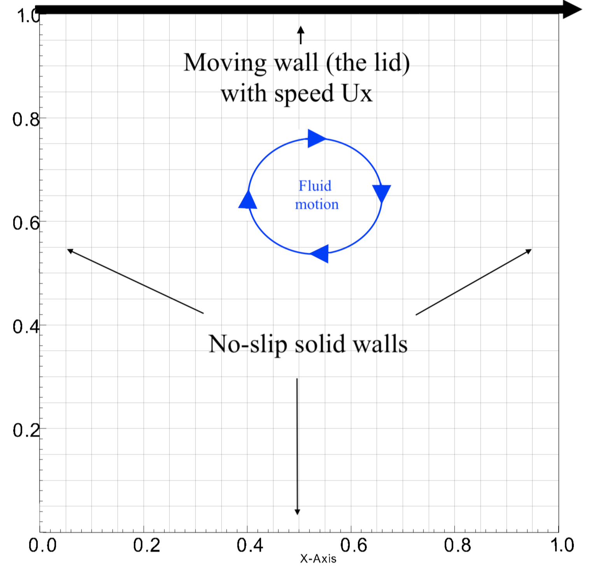
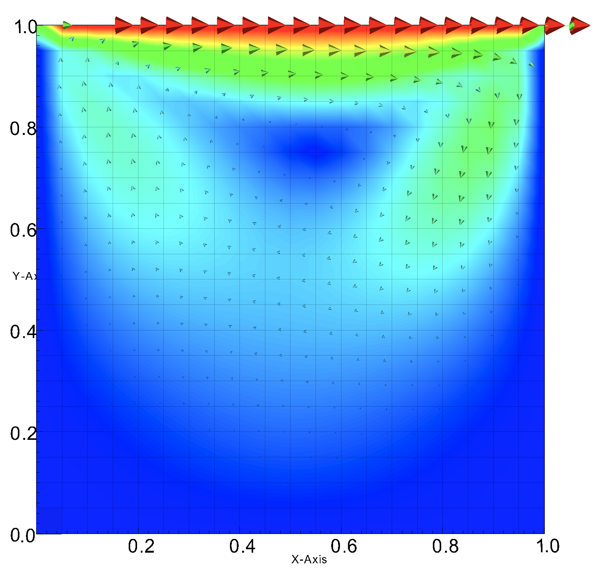
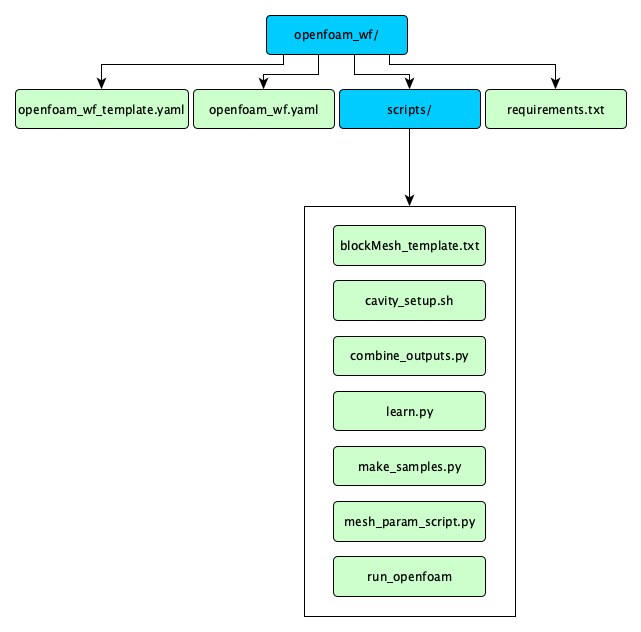
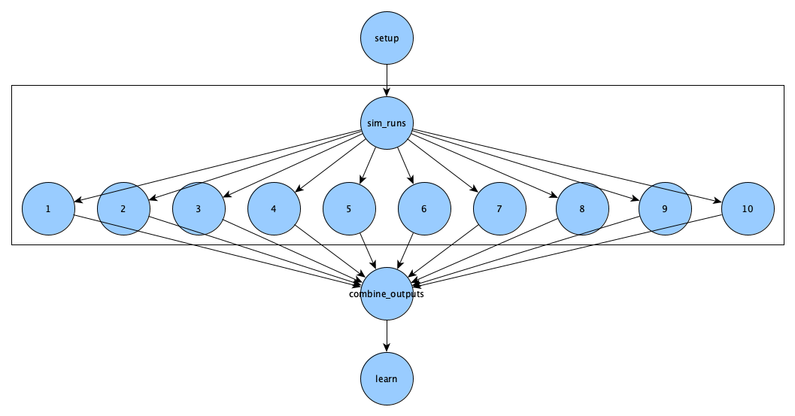
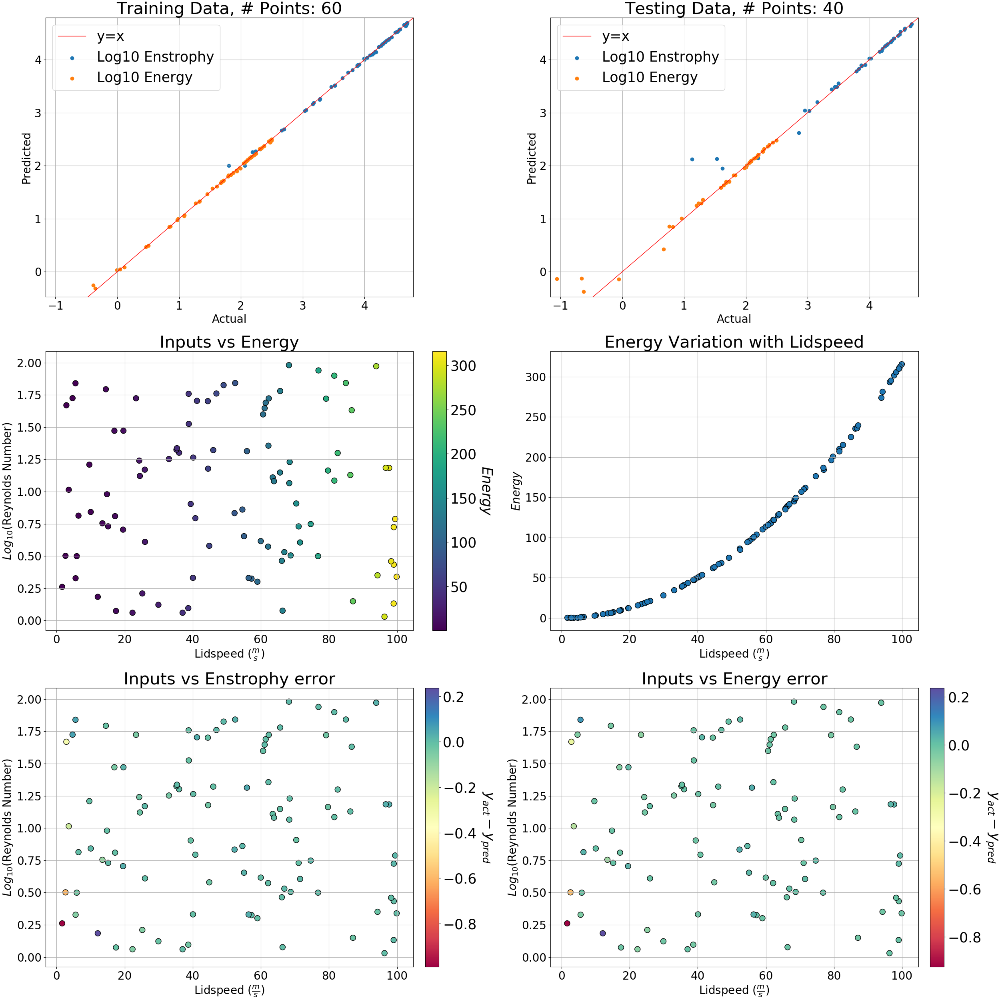

# Run a Real Simulation

!!! abstract "Summary"

    This module aims to do a parameter study on a well-known benchmark problem for viscous incompressible fluid flow.

!!! info "Prerequisites"

    - [0. Before You Start](./0_prerequisites.md)
    - [2. Installation](./2_installation.md)
    - [3. Hello, World!](./3_hello_world.md)

!!! info "Estimated Time"
  
    60 minutes

!!! abstract "You Will learn"

    - How to run the simulation OpenFOAM, using Merlin.
    - How to use machine learning on OpenFOAM results, using Merlin.

## Introduction

We aim to do a parameter study on the lid-driven cavity problem.

+--------------------------------------------------------------------------------------------------+---------------------------------------------------------------------------------------------------------------+
| <figure markdown>                                                                                + <figure markdown>                                                                                             |
|     +    |
|   <figcaption>Fig 1. Lid-driven cavity problem setup</figcaption>                                +   <figcaption>Fig 2. Example of a flow in steady state</figcaption>                                           |
| </figure>                                                                                        + </figure>                                                                                                     |
+--------------------------------------------------------------------------------------------------+---------------------------------------------------------------------------------------------------------------+

In this problem, we have a viscous fluid within a square cavity that has three non-slip walls and one moving wall (moving lid). We are interested in learning how varying the viscosity and lid speed affects the average enstrophy and kinetic energy of the fluid after it reaches steady state. We will be using the velocity squared as a proxy for kinetic energy.

This module will be going over:

 - Setting up our inputs using the `merlin` block
 - Running multiple simulations in parallel
 - Combining the outputs of these simulations into a an array
 - Predictive modeling and visualization

### Before Moving On

Check that the virtual environment with Merlin installed is activated and that your configuration shows no errors:

```bash
merlin info
```

This is covered more in depth in the [Pointing Merlin to the Server](./2_installation.md#pointing-merlin-to-the-server) section of the Installation module and at the [Configuration](../user_guide/configuration/index.md) page.

There are a few ways to do this example, including with singularity and with docker. To go through the version with singularity, get the necessary files for this module by running:

```bash
merlin example openfoam_wf_singularity ; cd openfoam_wf_singularity/
```
    
For the version with docker you should run:

```bash
merlin example openfoam_wf ; cd openfoam_wf/
```

!!! note

    From here on, this tutorial will focus solely on the singularity version of running OpenFOAM. The docker version of this tutorial is almost identical but will require having docker installed. If you're using the docker version of this tutorial you can still follow along but check the openfoam_docker_template.yaml file in each step to see what differs.

In the `openfoam_wf_singularity` directory you should see the following:

<figure markdown>
  
  <figcaption>Fig 3. openfoam_wf Directory Structure</figcaption>
</figure>

- `openfoam_wf_singularity.yaml` -- this spec file is partially blank. You will fill in the gaps as you follow this module's steps.
- `openfoam_wf_singularity_template.yaml` -- this is a complete spec file. You can always reference it as an example.
- `scripts` -- This directory contains all the necessary scripts for this module.
    - We'll be exploring these scripts as we go with the tutorial.
- `requirements.txt` -- this is a text file listing this workflow's python dependencies.

## Specification File

We are going to build a spec file that produces this DAG:

<figure markdown>
  
  <figcaption>Fig 4. OpenFOAM DAG</figcaption>
</figure>

**To start, open** `openfoam_wf_singularity.yaml` **using your favorite text editor.**

It should look something like this:

???+ abstract "Initial Contents of the Spec"

    <!--codeinclude-->
    [openfoam_wf_singularity.yaml](../../merlin/examples/workflows/openfoam_wf_singularity/openfoam_wf_singularity.yaml)
    <!--/codeinclude-->

### Variables

First we specify some variables to make our life easier. Locate the `env` block in our yaml spec:

<!--codeinclude-->
[](../../merlin/examples/workflows/openfoam_wf_singularity/openfoam_wf_singularity.yaml) lines:9-15
<!--/codeinclude-->

The `OUTPUT_PATH` variable is set to tell Merlin where you want your output directory to be written. The default is the current working directory.

We'll fill out the next two variables as we go.

### Samples and Scripts

One Merlin best practice is to copy any scripts your workflow may use from your `SPECROOT` directory into the `MERLIN_INFO` directory. This is done to preserve the original scripts in case they are modified during the time Merlin is running. We will do that first. We'll put this in the Merlin sample generation section, since it runs before anything else.

Edit the `samples` section of the `merlin` block to look like the following:

<!-- Not using a codeinclude statment here since we need haven't defined our N_SAMPLES var yet -->
```yaml
merlin:
    samples:
        generate:
            cmd: |
                cp -r $(SPECROOT)/scripts $(MERLIN_INFO)/

                # Generates the samples
                python $(MERLIN_INFO)/scripts/make_samples.py -n 10 -outfile=$(MERLIN_INFO)/samples
        file: $(MERLIN_INFO)/samples.npy
        column_labels: [LID_SPEED, VISCOSITY]
```

We will be using the scripts directory a lot so we'll set the variable `SCRIPTS` to `$(MERLIN_INFO)/scripts` for convenience. We define `SIF`, our Singularity image of OpenFoam, to be `$(MERLIN_INFO)/openfoam6.sif`. We would also like to have a more central control over the number of samples generated so we'll create an `N_SAMPLES` variable:

<!--codeinclude-->
[](../../merlin/examples/workflows/openfoam_wf_singularity/openfoam_wf_singularity_template.yaml) lines:9-15
<!--/codeinclude-->

and update the `samples` section of the `merlin` block to be:

<!--codeinclude-->
[](../../merlin/examples/workflows/openfoam_wf_singularity/openfoam_wf_singularity_template.yaml) lines:18-27
<!--/codeinclude-->

Just like in the [Using Samples](./3_hello_world.md#using-samples) step of the hello world module, we generate samples using the `merlin` block. We are only concerned with how the variation of two initial conditions, lidspeed and viscosity, affects outputs of the system. These are the `column_labels`. The `make_samples.py` script is designed to make log uniform random samples. Now, we can move on to the steps of our study block.

### Setting Up

Our first step in our study block is concerned with making sure we have all the required python packages for this workflow. The specific packages are found in the `requirements.txt` file.

We will also need to copy the lid driven cavity deck from the OpenFOAM singularity container and adjust the write controls. This last part is scripted already for convenience.

Locate the `setup` step in the study block and edit it to look like the following:

<!--codeinclude-->
[](../../merlin/examples/workflows/openfoam_wf_singularity/openfoam_wf_singularity_template.yaml) lines:38-48
<!--/codeinclude-->

This step does not need to be parallelized so we will assign it to lower concurrency (a setting that controls how many workers can be running at the same time on a single node).

Locate the `resources` section in the `merlin` block, then edit the concurrency and add the setup step:

```yaml
resources:
      workers:
          nonsimworkers:
              args: -l INFO --concurrency 1
              steps: [setup]
```

The `resources` section of the `merlin` block is where you can control the behavior of your workers. Here we're defining one worker named `nonsimworkers` and providing it with some arguments. The `-l INFO` option sets its log level to be `INFO` (the standard log level) and the `--concurrency 1` option means that only one of these workers can spin up per node. 

!!! warning

    If the `--concurrency` option is omitted, the Celery library will default to using however many cores are on the node (see [Celery's docs](https://docs.celeryq.dev/en/stable/userguide/workers.html#concurrency) for more information).

In addition to providing arguments to workers, we're also telling it to manage the tasks that will be produced by the `setup` step. What this *actually* means is that this worker will watch the `task_queue` associated with the `setup` step. Since we didn't provide a `task_queue` value for this step, the `task_queue` value will default to be `merlin` (which you'll be able to see in the `openfoam_wf.expanded.yaml` spec in the `merlin_info/` directory after we run this).

### Running the Simulation

Moving on to the `sim_runs` step, we want to:

1. Copy the cavity deck from the `MERLIN_INFO` directory into each of the current step's subdirectories
2. Edit the default input values (lidspeed and viscosity) in these cavity decks using the `sed` command
3. Run the simulation using the `run_openfoam` executable through the OpenFOAM singularity container
4. Post-process the results (also using the `run_openfoam` executable)

This part should look like:

<!--codeinclude-->
[](../../merlin/examples/workflows/openfoam_wf_singularity/openfoam_wf_singularity_template.yaml) lines:50-76
<!--/codeinclude-->

This step runs many simulations in parallel so it would run faster if we assign it a worker with a higher concurrency. Navigate back to the `resources` section in the `merlin` block

```yaml
resources:
    workers:
        nonsimworkers:
            args: -l INFO --concurrency 1
            steps: [setup]
        simworkers:
            args: -l INFO --concurrency 10 --prefetch-multiplier 1 -Ofair
            steps: [sim_runs]
```

Since we defined a `task_queue` value in the `sim_runs` step, when we tell `simworkers` to watch the `sim_runs` step they will really be watching the `simqueue` queue.

The quantities of interest are the average enstrophy and kinetic energy at each cell. The enstrophy is calculated through an OpenFOAM post processing function of the the flow fields while the kinetic energy is approximated by using the square of the velocity vector at each grid point. The velocity field is normally outputted normally as a result of running the default solver for this particular problem.

The `run_openfoam` executable calculates the appropriate timestep `deltaT` so that we have a Courant number of less than 1. It also uses the `icoFoam` solver on the cavity decks and gives us VTK files that are helpful for visualizing the flow fields using visualization tools such as [VisIt](https://visit-dav.github.io/visit-website/index.html) or [ParaView](https://www.paraview.org/).

### Combining Outputs

Navigate to the next step in our `study` block `combine_outputs`. The purpose of this step is to extract the data from each of the simulation runs from the previous step (`sim_runs`) and combine them for future use.

The `combine_outputs.py` script in the `$(SCRIPTS)` directory is provided for convenience and takes two inputs. The first informs it of the base directory of the `sim_runs` directory and the second specifies the subdirectories for each run. The script then goes into each of the directories and combines the velocity and enstrophy for each timestep of each run in a .npz file.

<!--codeinclude-->
[](../../merlin/examples/workflows/openfoam_wf_singularity/openfoam_wf_singularity_template.yaml) lines:78-83
<!--/codeinclude-->

The `$(MERLIN_PATHS_ALL)` variable is a [Reserved Variable](../user_guide/variables.md#reserved-variables) that denotes a space delimited string of all of the sample paths.

This step depends on all the previous step's simulation runs which is why we have the `_*`. However, it does not need to be parallelized so we assign it to the `nonsimworkers` in the `workers` section of the `merlin` block.

```yaml
workers:
    nonsimworkers:
        args: -l INFO --concurrency 1
        steps: [setup, combine_outputs]
```

### Machine Learning and Visualization

In the `learn` step, we want to:

  1. Post-process the .npz file from the previous step.
  2. Learn the mapping between our inputs and chosen outputs
  3. Graph important features

The provided `learn.py` script does all of the above. It outputs the trained sklearn model and a png of the graphs plotted in the current directory.

<!--codeinclude-->
[](../../merlin/examples/workflows/openfoam_wf_singularity/openfoam_wf_singularity_template.yaml) lines:85-90
<!--/codeinclude-->

This step is also dependent on the previous step for the .npz file and will only need one worker therefore we will assign it to `nonsimworkers`:

```yaml
nonsimworkers:
    args: -l INFO --concurrency 1
    steps: [setup, combine_outputs, learn]
```

### Putting It All Together

By the end, your `openfoam_wf_singularity.yaml` should look like the template version in the same directory:

???+ abstract "Complete Spec File"

    <!--codeinclude-->
    [openfoam_wf_template.yaml](../../merlin/examples/workflows/openfoam_wf_singularity/openfoam_wf_singularity_template.yaml)
    <!--/codeinclude-->

## Run the workflow

Now that you are done with the Specification file, use the following commands from inside the `openfoam_wf_singularity` directory to run the workflow on our task server.

!!! note

    Running with fewer samples is the one of the best ways to debug

Create the DAG and send tasks to the server with:

```bash
merlin run openfoam_wf_singularity.yaml
```

Open a new terminal window, then start the workers that will consume the tasks we just queued by using:

```bash
merlin run-workers openfoam_wf_singularity.yaml
```

But wait! We realize that 10 samples is not enough to train a good model. We would like to restart with 100 samples instead of 10 (should take about 6 minutes):

After sending the workers to start on their queues, we need to first stop the workers:

```bash
merlin stop-workers --spec openfoam_wf_singularity.yaml
```

!!! tip

    Using the `--spec` option with the `merlin stop-workers` command will tell Merlin to only stop workers from a specific YAML spec

We stopped these tasks from running but if we were to run the workflow again (with 100 samples instead of 10), we would continue running the 10 samples first! This is because the queues are still filled with the previous attempt's tasks. This can be seen with:

```bash
merlin status openfoam_wf_singularity.yaml
```

We need to purge these queues first in order to repopulate them with the appropriate tasks. This is where we use the `merlin purge` command:

```bash
merlin purge openfoam_wf_singularity.yaml
```

Now we are free to repopulate the queues with the 100 samples. In our terminal window that's not designated for our workers, we'll queue up tasks again, this time with 100 samples:

```bash
merlin run openfoam_wf_singularity.yaml --vars N_SAMPLES=100
```

Then in our window for workers, we'll execute:

```bash
merlin run-workers openfoam_wf_singularity.yaml
```

To see your results, look inside the `learn` output directory. You should see a png that looks like this:

<figure markdown>
  
  <figcaption>Fig 5. Output</figcaption>
</figure>

!!! info "Related Articles"

    - [OpenFOAM v6 User Guide - 2.1 Lid-driven cavity flow](https://cfd.direct/openfoam/user-guide/v6-cavity/)
    - [The Complete Guide to Docker & OpenFOAM](https://www.cfdengine.com/blog/how-to-install-openfoam-anywhere-with-docker/)
