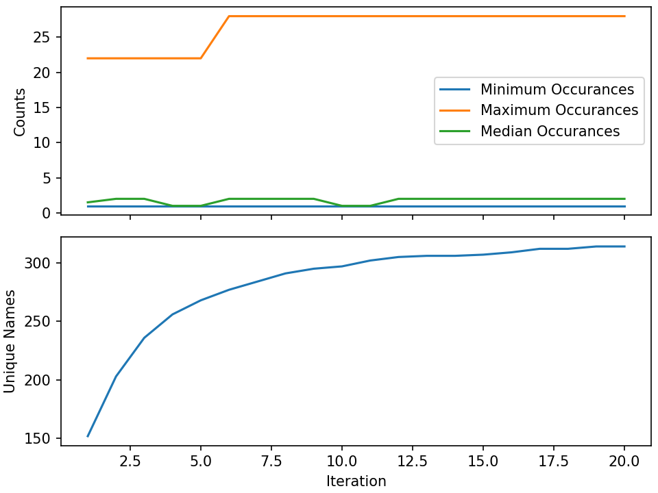

# Advanced Topics

!!! info "Prerequisites"

    - [0. Before You Start](./0_prerequisites.md)
    - [2. Installation](./2_installation.md)
    - [3. Hello, World!](./3_hello_world.md)
    - [4. Run a Real Simulation](./4_run_simulation.md)
    - Python virtual environment containing the following packages
        - merlin
        - pandas
        - faker

!!! info "Estimated Time"

    15 minutes

!!! abstract "You Will Learn"

    - Run workflows using HPC batch schedulers
    - Distribute workflows across multiple batch allocations and machines
    - Setup iterative workflow specs suited for optimization and dynamic sampling applications

<!-- TODO: Change this to match the hello/run_simulation tutorial after modifying the examples structure -->
<!-- TODO: make sure all the yaml specs here have the correct names (like iterative making a call to faker_demo.yaml) -->

## Setup

The code for the following examples can be obtained from command line, invoking:

```bash
merlin example hpc_demo
```

This will copy the three Merlin workflow specifications from this section and the supporting python scripts. Each specification may need some modification to adapt it to the batch scheduler you will be using. In addition, the dynamic sampling workflow will need an additional modification to set the path of the virtual environment, which is set as a variable in the `env` block.

## Interfacing with HPC Systems

Another block is added to the Merlin workflow specification when running on HPC systems—the batch block. This block contains information about the batch scheduler system, such as batch type, batch queue to use, and banks to charge. There are additional optional arguments for addressing any special configurations or launch command arguments, varying based on batch type. In addition, the shell type used by each step's cmd scripts can be specified here. While the number of nodes in a batch allocation can be defined here, it will be overridden in the worker config.

```yaml
batch:
    # Required keys:
    type: flux
    bank: testbank
    queue: pbatch

    # Optional keys:
    flux_path: <optional path to flux bin>
    flux_start_opts: <optional flux start options>
    flux_exec_workers: <optional, flux argument to launch workers on
                        all nodes. (True)>

    launch_pre: <Any configuration needed before the srun or jsrun launch>s
    launch_args: <Optional extra arguments for the parallel launch command>
    worker_launch: <Override the parallel launch defined in merlin>

    shell: <the interpreter to use for the script after the shebang>
            # e.g. /bin/bash, /bin/tcsh, python, /usr/bin/env perl, etc.
    nodes: <num nodes> # The number of nodes to use for all workers
            This can be overridden in the workers config.
            If this is unset the number of nodes will be
            queried from the environment, failing that, the
            number of nodes will be set to 1.
```

Inside the study step specifications are a few additional keys that become more useful on HPC systems: `nodes`, `procs`, and `task_queue`. Adding on the actual study steps to the above batch block specifies the actual resources each steps processes will take.

```yaml
study:
    - name: sim-runs
      description: Run simulations
      run:
        cmd: $(LAUNCHER) echo "$(VAR1) $(VAR2)" > simrun.out
        nodes: 4
        procs: 144
        task_queue: sim_queue

    - name: post-process
      description: Post-Process simulations on second allocation
      run:
        cmd: |
            cd $(runs1.workspace)/$(MERLIN_SAMPLE_PATH)
            $(LAUNCHER) <parallel-post-proc-script>
        nodes: 1
        procs: 36
        depends: [sim-runs]
        task_queue: post_proc_queue
```

In addition to the `batch` block is the `resources` section inside the `merlin` block. This can be used to put together custom celery workers. Here you can override batch types and node counts on a per worker basis to accommodate steps with different resource requirements. In addition, this is where the `task_queue` becomes useful, as it groups the different allocation types, which can be assigned to each worker here by specifying step names.

```yaml
merlin:

    resources:
        task_server: celery

        # Flag to determine if multiple workers can pull tasks
        # from overlapping queues. (default = False)
        overlap: False

        # Customize workers. Workers can have any user-defined name
        #  (e.g., simworkers, learnworkers, ...)
        workers:
            simworkers:
                args: <celery worker args> # <optional>
                steps: [sim-runs]          # <optional> [all] if none specified
                nodes: 4                   # optional
                machines: [host1]          # <optional>
```

Arguments to celery itself can also be defined here with the `args` key. Of particular interest will be:

+-------------------------+---------------+
|     `--concurrency`     +  num_threads  |
+-------------------------+---------------+
| `--prefetch-multiplier` +   num_tasks   |
+-------------------------+---------------+
|        `-0 fair`        +               |
+-------------------------+---------------+

Concurrency can be used to run multiple workers in an allocation, thus is recommended to be set to the number of simulations or step work items that fit into the number of nodes in the batch allocation in which these workers are spawned. 

!!! note

    Some schedulers, such as `flux`, can support more jobs than the node has resources for. This may not impact the throughput, but it can prevent over-subscription errors that might otherwise stop the workflow.

The prefetch multiplier is more related to packing in tasks into the time of the allocation. For long running tasks it is recommended to set this to 1. For short running tasks, this can reduce overhead from talking to the rabbit servers by requesting `<num_threads> x <num_tasks>` tasks at a time from the server.

The `-0 fair` option enables workers running tasks from different queues to run on the same allocation.

The example block below extends the previous with workers configured for long running simulation jobs as well as shorter running post processing tasks that can cohabit an allocation:

```yaml
merlin:

    resources:
        task_server: celery

        overlap: False

        # Customize workers
        workers:
            simworkers:
                args: --concurrency 1
                steps: [sim-runs]
                nodes: 4
                machines: [host1]

            postworkers:
                args: --concurrency 4 --prefetch-multiplier 2
                steps: [post-proc-runs]
                nodes: 1
                machines: [host1]
```

Putting it all together and adding some variables/samples we have an HPC batch enabled study specification. In this demo workflow, `sample_names` generates many single core jobs, with concurrency set to 36 for this particular machine that has 36 cores per node. The `collect` step on the other hand consists of a single job that uses all cores on the node, and is assigned to a queue that has a concurrency of 1.

<!-- Not using a codeinclude statement here since we're only using 1 machine and not a multi-machine setup yet -->
???+ abstract "HPC Batch Enabled Study Spec"

    ```yaml
    description:
        name: hpc_demo
        description: Demo running a workflow on HPC machines

    env:
        variables:
            OUTPUT_PATH: ./name_studies

            # Collect individual sample files into one for further processing
            COLLECT: $(SPECROOT)/sample_collector.py

            # Process single iterations' results
            POST_PROC: $(SPECROOT)/sample_processor.py

            # Process all iterations
            CUM_POST_PROC: $(SPECROOT)/cumulative_sample_processor.py

            # Number of threads for post proc scripts
            POST_NPROCS: 36
            PYTHON: <INSERT PATH TO VIRTUALENV HERE>

    batch:
        type: flux
        bank: testbank
        queue: pdebug
        shell: /bin/bash
        nodes: 1

    ########################################
    # Study definition
    ########################################
    study:
        - name: sample_names
          description: Record samples from the random name generator
          run:
            cmd: |
                $(LAUNCHER) echo "$(NAME)"
                $(LAUNCHER) echo "$(NAME)" > name_sample.out
            nodes: 1
            procs: 1
            task_queue: name_queue

        - name: collect
          description: Collect all samples generated
          run:
            cmd: |
                echo $(MERLIN_GLOB_PATH)
                echo $(sample_names.workspace)

                ls $(sample_names.workspace)/$(MERLIN_GLOB_PATH)/name_sample.out | xargs $(PYTHON) $(COLLECT) -out collected_samples.txt --np $(POST_NPROCS)

            nodes: 1
            procs: 1
            depends: [sample_names_*]
            task_queue: post_proc_queue

        - name: post-process
          description: Post-Process collection of samples, counting occurrences of unique names
          run:
            cmd: |
                $(PYTHON) $(POST_PROC) $(collect.workspace)/collected_samples.txt --results iter_$(ITER)_results.json

            nodes: 1
            procs: 1
            depends: [collect]
            task_queue: post_proc_queue

    ########################################
    # Worker and sample configuration
    ########################################
    merlin:

        resources:
            task_server: celery

            overlap: False

            workers:
                nameworkers:
                    args: --concurrency 36 --prefetch-multiplier 3
                    steps: [sample_names]
                    nodes: 1
                    machines: [quartz]

                postworkers:
                    args: --concurrency 1 --prefetch-multiplier 1
                    steps: [post-process]
                    nodes: 1
                    machines: [quartz]

        ###################################################
        samples:
            column_labels: [NAME]
            file: $(MERLIN_INFO)/samples.csv
            generate:
                cmd: |
                $(PYTHON) $(SPECROOT)/faker_sample.py -n 200 -outfile=$(MERLIN_INFO)/samples.csv
    ```

## Multi-Machine Workflows

Spreading this workflow across multiple machines requires a small modification of the above workflow: simply add additional host names to the `machines` list in the worker config. A caveat for this feature is that all host systems will need to have access to the same workspace/filesystem.

The following resource block demonstrates usage of one host for larger simulation steps, and a second host for the smaller post processing steps. In this case you simply need to get an allocation on each host, then execute `run-workers` on each. The `run` command only needs to be run one time from any host to send the tasks to the central task queue server.

```yaml
########################################
# Worker and sample configuration
########################################
merlin:

    resources:
    task_server: celery

    overlap: False

    # Customize workers
    workers:
        simworkers:
            args: --concurrency 1
            steps: [sim-runs]
            nodes: 4
            machines: [host1]

        postworkers:
            args: --concurrency 4 --prefetch-multiplier 2
            steps: [post-proc-runs]
            nodes: 1
            machines: [host2]
```

## Dynamic Task Queuing and Sampling

Iterative workflows, such as optimization or machine learning, can be implemented in Merlin via recursive workflow specifications that use dynamic task queuing. The example spec below is a simple implementation of this using an iteration counter `$(ITER)` and a predetermined limit `$(MAX_ITER)` to limit the number of times to generate new samples and spawn a new instantiation of the workflow. The iteration counter takes advantage of the ability to override workflow variables on the command line.

???+ abstract "Iterative Spec"

    ```yaml
    description:
        name: dynamic_sampling_demo
        description: Demo dynamic sampling workflow

    env:
        variables:
            OUTPUT_PATH: ./name_studies
            ITER_OUTPUT: $(SPECROOT)/$(OUTPUT_PATH)/iter_outputs # Iteration and cumulative results
            COLLECT: $(SPECROOT)/sample_collector.py
            POST_PROC: $(SPECROOT)/sample_processor.py # Process single iterations' results
            CUM_POST_PROC: $(SPECROOT)/cumulative_sample_processor.py # Process all iterations
            POST_NPROCS: 36          # Number of threads for post proc scripts
            PYTHON: <INSERT PATH TO VIRTUALENV HERE>
            ITER: 1
            MAX_ITER: 10

    batch:
        type: flux
        bank: testbank
        queue: pdebug
        shell: /bin/bash
        nodes: 1

    ########################################
    # Study definition
    ########################################
    study:
        - name: sample_names
        description: Record samples from the random name generator
        run:
            cmd: |
                $(LAUNCHER) echo "$(NAME)"
                $(LAUNCHER) echo "$(NAME)" > name_sample.out
            nodes: 1
            procs: 1
            task_queue: name_queue

        - name: collect
        description: Collect all samples generated 
        run:
            cmd: |
                echo $(MERLIN_GLOB_PATH)
                echo $(sample_names.workspace)

                ls $(sample_names.workspace)/$(MERLIN_GLOB_PATH)/name_sample.out | xargs $(PYTHON) $(COLLECT) -out collected_samples.txt --np $(POST_NPROCS)
                
            nodes: 1
            procs: 1
            depends: [sample_names_*]
            task_queue: post_proc_queue

        - name: post-process
        description: Post-Process collection of samples, counting occurrences of unique names
        run:
            cmd: |
                $(PYTHON) $(POST_PROC) $(collect.workspace)/collected_samples.txt --results $(ITER_OUTPUT)/iter_$(ITER)_results.json
                
            nodes: 1
            procs: 1
            depends: [collect]
            task_queue: post_proc_queue

        - name: run-more-samples
        description: Generate new set of samples and rerun, or generate some descriptive plots/statistics
        run:
            cmd: |
                if [ $(ITER) -ge $(MAX_ITER) ] ; then
                    echo "done"
                    $(PYTHON) $(CUM_POST_PROC) $(ITER_OUTPUT)/iter_*_results.json --np $(POST_NPROCS) --hardcopy $(ITER_OUTPUT)/cumulative_results.png
                else
                    next_iter=$(ITER)
                    ((next_iter=next_iter+1))
                    echo "Starting iteration " $next_iter
                    cd $(SPECROOT)
                    merlin run $(SPECROOT)/faker_demo.yaml --vars ITER=$next_iter
                fi
            nodes: 1
            procs: 1
            depends: [post-process]
            task_queue: post_proc_queue

    ########################################
    # Worker and sample configuration
    ########################################  
    merlin:

        resources:
        task_server: celery

        overlap: False

        # Customize workers  NOTE: abuse this for scaling study: prefetch mult increase
        #   - celery->rabbit query overhead for fast jobs
        workers:
            nameworkers:
                args: --concurrency 36 --prefetch-multiplier 3
                steps: [sample_names]      
                nodes: 1
                machines: [borax, quartz]      

            # NOTE: specifying wrong step leaves orphaned queue -> purge first!
            # also, invalid host name appears to fail silently
            postworkers:
                args: --concurrency 1 --prefetch-multiplier 1
                steps: [post-process]
                nodes: 1 
                machines: [borax, quartz]

        ###################################################
        samples:
        column_labels: [NAME]
        file: $(MERLIN_INFO)/samples.csv
        generate:
            cmd: |
            $(PYTHON) $(SPECROOT)/faker_sample.py -n 200 -outfile=$(MERLIN_INFO)/samples.csv
    ```

This workflow specification is intended to be invoked within an allocation of nodes on your HPC cluster, e.g. within and sxterm. The last step is to queue up new samples for the next iteration, `merlin run faker_demo.yaml ...`. Notice how we don't need another `run-workers` call since the workers from the first instantiation are still alive. Thus the new samples will immediately start processing on the existing allocation.

Another change in this workflow relative to the single stage version is managing the workspaces and outputs. The strategy used here is to create a new directory for collecting each iterations final outputs, `$(ITER_OUTPUT)`, facilitating collective post processing at the end without having to worry about traversing into each iterations' local workspaces.

The workflow itself isn't doing anything practical; it's simply repeatedly sampling from a fake name generator in an attempt to count the number of unique names that are possible. The figure below shows results from running 20 iterations, with the number of unique names faker can generate appearing to be slightly more than 300.

<figure markdown>
  
  <figcaption>Unique Name Results</figcaption>
</figure>

<!-- TODO add in batch script to start workers -->
