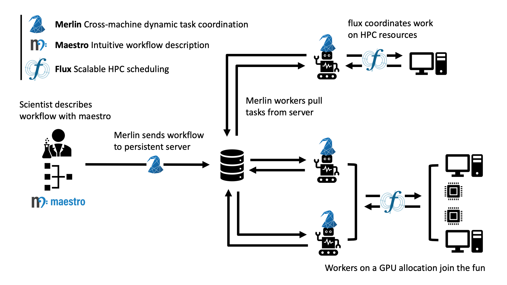

# Merlin User Guide

## What is Merlin?

Merlin is a distributed task queuing system, designed to allow complex HPC workflows to scale to large numbers of simulations (we've done 100 Million on the Sierra Supercomputer).

Why would you want to run that many simulations? To become your own Big Data generator.

Data sets of this size can be large enough to train deep neural networks that can mimic your HPC application, to be used for such things as design optimization, uncertainty quantification and statistical experimental inference. Merlin's been used to study inertial confinement fusion, extreme ultraviolet light generation, structural mechanics and atomic physics, to name a few.

## How Does Merlin Work?

In essence, Merlin coordinates complex workflows through a persistent external queue server that lives outside of your HPC systems, but that can talk to nodes on your cluster(s). As jobs spin up across your ecosystem, workers on those allocations pull work from a central server, which coordinates the task dependencies for your workflow. Since this coordination is done via direct connections to the workers (i.e. not through a file system), your workflow can scale to very large numbers of workers, which means a very large number of simulations with very little overhead.

Furthermore, since the workers pull their instructions from the central server, you can do a lot of other neat things, like having multiple batch allocations contribute to the same work (think surge computing), or specialize workers to different machines (think CPU workers for your application and GPU workers that train your neural network). Another neat feature is that these workers can add more work back to central server, which enables a variety of dynamic workflows, such as may be necessary for the intelligent sampling of design spaces or reinforcement learning tasks.

Merlin does all of this by leveraging some key HPC and cloud computing technologies, building off open source components. It uses [Maestro](https://maestrowf.readthedocs.io/) to provide an interface for describing workflows, as well as for defining workflow task dependencies. It translates those dependencies into concrete tasks via [Celery](https://docs.celeryproject.org/),  which can be configured for a variety of backend technologies ([RabbitMQ](https://www.rabbitmq.com) and [Redis](https://redis.io) are currently supported). Although not a hard dependency, we encourage the use of [Flux](http://flux-framework.org) for interfacing with HPC batch systems, since it can scale to a very large number of jobs.

The integrated system looks a little something like this:

For more details, check out the rest of the user guide.
