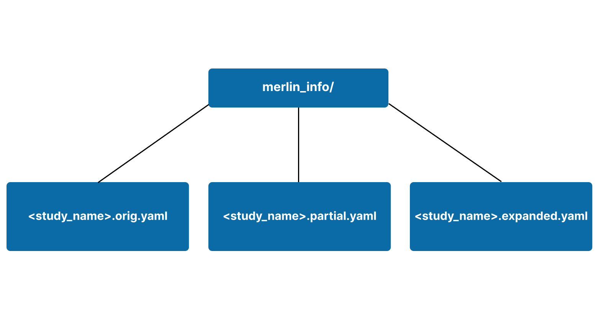
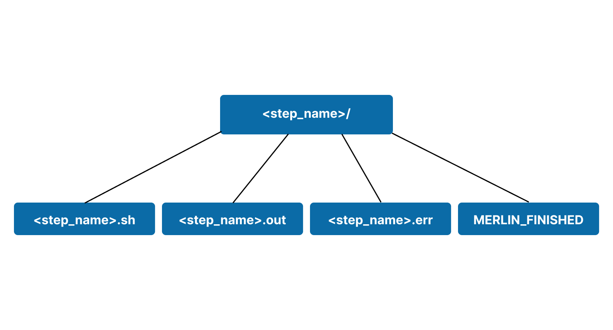
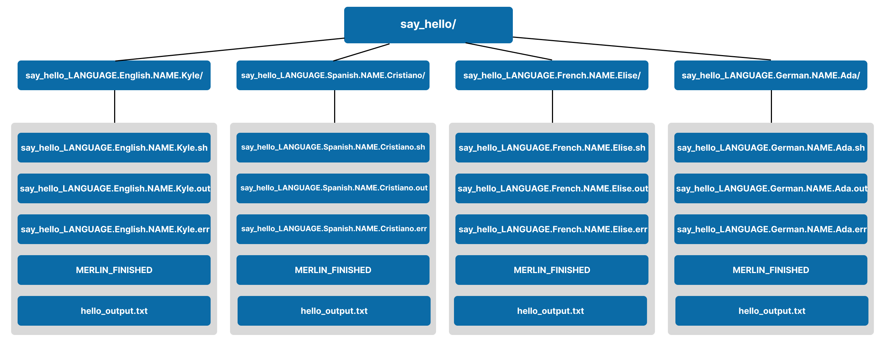
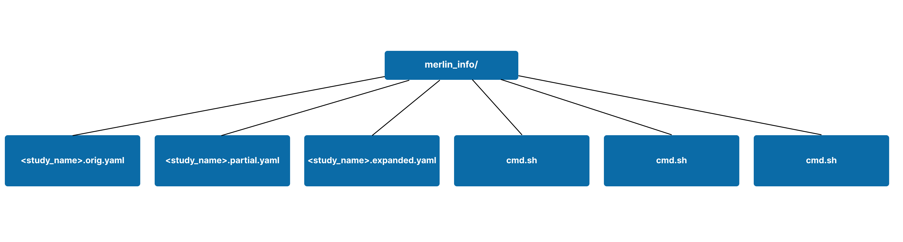
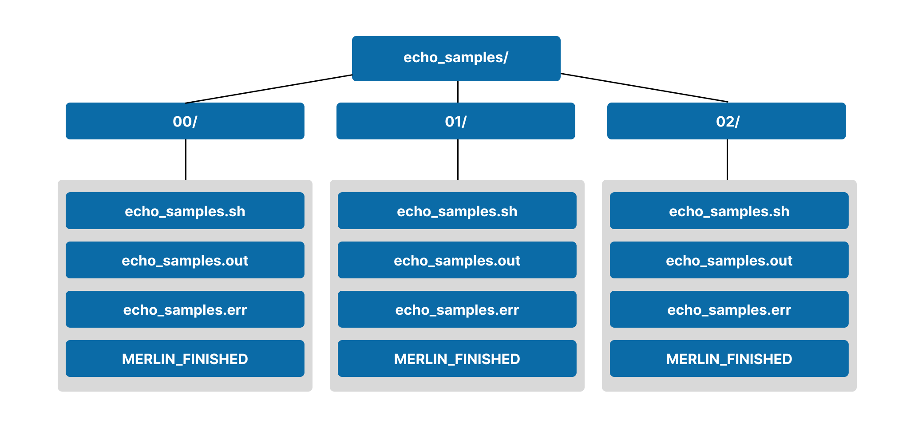
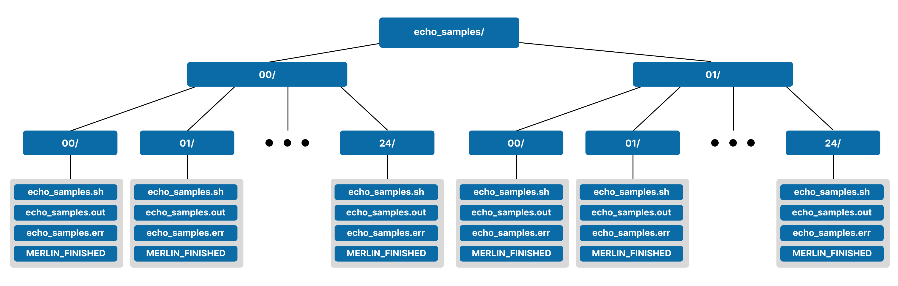
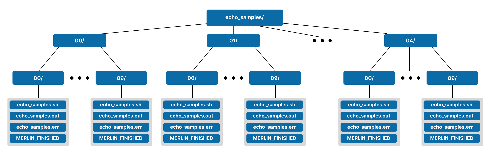
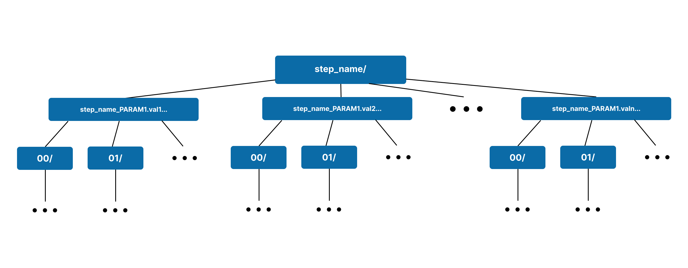

# Interpreting Output

[Running Studies](./running_studies.md) with Merlin results in output workspaces being generated. This module is intended to help users understand the layout of the output workspace and the files contained within.

## The Basics

When a study is ran using Merlin, an output workspace is created. This workpsace is named after the `name` property in [the `description` block](./specification.md#the-description-block) of your spec file and will contain a timestamp of the run.

!!! example

    Say I have a spec file with a `description` block like so:

    ```yaml
    description:
        name: name_of_my_study
        description: This is an example showcasing naming conventions of output workspaces
    ```

    After running this study with [`merlin run`](./command_line.md#run-merlin-run), the output workspace would be named `name_of_my_study_<timestamp>`. Here, `<timestamp>` is a date of the form `YYYYMMDD-HHMMSS`. For example, it could be named `name_of_my_study_20240117-151836`.

The output workspace will hold information about what was executed in your study and the output generated from it. This workspace is intended to help maintain workflow provenance and to provide users with an easy-to-navigate directory containing all of the results from their study.

In this section we'll cover the basics of the output that Merlin generates from studies that are ran. The two main topics for the basics are [the `merlin_info` subdirectory](#the-merlin_info-subdirectory) and [step workspaces](#step-workspaces).

### The `merlin_info` Subdirectory

The `merlin_info/` subdirectory is primarily used for workflow provenance. It's in this directory that you can track the exact specification file that was submitted and how variables were substituted.

You'll find three different versions of your specification file in the `merlin_info/` subdirectory:

1. `.orig.yaml`: An exact copy of the spec that was ran with `merlin run`
2. `.partial.yaml`: A copy of the original spec plus all of the default values for each block that Merlin will fill in for you if omitted. This spec will also show any changes to variables submitted via [Command Line Substitution](./running_studies.md#command-line-substitution)
3. `.expanded.yaml`: The entire spec with all variables expanded and default values filled in

A visual representation of a basic `merlin_info/` subdirectory is shown below.

<figure markdown>
  
  <figcaption>A Basic "merlin_info/" Subdirectory</figcaption>
</figure>

??? example "Example `merlin_info/` Contents"

    Say we have a script `say_hello.py` that says hello in a few different languages:
    
    ```python title="say_hello.py"
    import argparse

    GREETINGS = {
        "english": "Hi",
        "spanish": "Hola",
        "french": "Bonjour",
        "german": "Hallo",
        # Add more languages and greetings if you want
    }

    def greet_in_language(language: str, name: str):
        """
        Try to greet `name` in the language provided by `language`.
        If the language is not supported, raise a KeyError.

        :param language: The language to say hello in
        :param name: The name to say hello to
        """
        # Make sure the name provided is supported by our script
        try:
            # Print the greeting with the provided name
            print(f"{GREETINGS[language.lower()]}, {name}!")
        except KeyError as exc:
            raise KeyError(f"The language '{language.lower()}' is not yet supported by this script. Please choose one of the following languages instead: {GREETINGS.keys()}") from exc

    def main():
        parser = argparse.ArgumentParser(description="Greet someone in a specified language.")
        parser.add_argument("--language", help="Specify the language for the greeting")
        parser.add_argument("--name", help="Specify the name to greet")

        args = parser.parse_args()

        greet_in_language(args.language, args.name)

    if __name__ == "__main__":
        main()
    ```

    We can then create a small spec file `output_workspace_demo.yaml` as a sibling file to `say_hello.py`. This spec file will look like so:

    ```yaml title="output_workspace_demo.yaml"
    description:
        name: $(STUDY_NAME)
        description: An example showcasing the structure and contents of the output workspace

    env:
        variables:
            STUDY_NAME: output_workspace_demo
            OUTPUT_PATH: ./studies

    study:
        - name: say_hello
          description: Run a script to say hello to a name
          run:
            cmd: |
                # Here, "English" and "Kyle" are randomly selected parameter values
                python3 $(SPECROOT)/say_hello.py --language English --name Kyle
    ```

    Running this study with:

    ```bash
    merlin run --local output_workspace_demo.yaml
    ```

    ...will create an output workspace of the form:

    ```bash
    studies/output_workspace_demo_<timestamp>/
    ├── merlin_info
    │   ├── output_workspace_demo.expanded.yaml
    │   ├── output_workspace_demo.orig.yaml
    │   └── output_workspace_demo.partial.yaml
    └── say_hello
        ├── MERLIN_FINISHED
        ├── say_hello.err
        ├── say_hello.out
        └── say_hello.sh
    ```

    We'll discuss the `say_hello/` directory in [Step Workspaces](#step-workspaces) so for now let's take a look at each of the yaml files in the `merlin_info/` directory.

    === "Orig"

        As we can see, the `.orig.yaml` file is an *exact* copy of the `output_workspace_demo.yaml` spec file.

        ```yaml title="output_workspace_demo.orig.yaml"
        description:
            name: $(STUDY_NAME)
            description: An example showcasing the structure and contents of the output workspace

        env:
            variables:
                STUDY_NAME: output_workspace_demo
                OUTPUT_PATH: ./studies

        study:
            - name: say_hello
              description: Run a script to say hello to a name
              run:
                cmd: |
                    # Here, "English" and "Kyle" are randomly selected parameter values
                    python3 $(SPECROOT)/say_hello.py --language English --name Kyle
        ```

    === "Partial"

        In the `.partial.yaml` file we'll see that there are blocks and properties that we didn't initially provide in our original spec file. These are default values that Merlin automatically substitutes into your workflow if you omit them.

        ```yaml title="output_workspace_demo.partial.yaml"
        description:
            name: $(STUDY_NAME)
            description: An example showcasing the structure and contents of the output workspace

        batch:
            type: local
            dry_run: false
            shell: /bin/bash

        env:
            variables:
                STUDY_NAME: output_workspace_demo
                OUTPUT_PATH: ./studies

            sources:

            labels:

            dependencies:

        study:
            - name: say_hello
              description: Run a script to say hello to a name
              run:
                cmd: |
                    # Here, "English" and "Kyle" are randomly selected parameter values
                    python3 $(SPECROOT)/say_hello.py --language English --name Kyle
                task_queue: merlin
                shell: /bin/bash
                max_retries: 30

        global.parameters:

        merlin:
            resources:
                task_server: celery
                overlap: false
                workers:
                    default_worker:
                        steps: [all]
                        nodes:
                        batch:

            samples:

        user:
        ```

    === "Expanded"

        In the `.expanded.yaml` file we'll see similar behavior to the `.partial.yaml` file where default values are substituted in. 
        
        We'll also see the expansion of all variables. For example, we no longer have `$(STUDY_NAME)` as the name of the study; instead it's the substituted variable from the `env` block. Similarly, notice that we no longer see `$(SPECROOT)` in the command given to the `say_hello` step; instead we see the fully expanded path that `SPECROOT` represents (see [Reserved Variables](./variables.md#reserved-variables) for more information on this).

        ```yaml title="output_workspace_demo.expanded.yaml" hl_lines="2 27"
        description:
            name: output_workspace_demo
            description: An example showcasing the structure and contents of the output workspace

        batch:
            type: local
            dry_run: false
            shell: /bin/bash

        env:
            variables:
                STUDY_NAME: output_workspace_demo
                OUTPUT_PATH: ./studies

            sources:

            labels:

            dependencies:

        study:
            - name: say_hello
              description: Run a script to say hello to a name
              run:
                cmd: |
                    # Here, "English" and "Kyle" are randomly selected parameter values
                    python3 /path/to/say_hello.py --language English --name Kyle
                task_queue: merlin
                shell: /bin/bash
                max_retries: 30

        global.parameters:

        merlin:
            resources:
                task_server: celery
                overlap: false
                workers:
                    default_worker:
                        steps: [all]
                        nodes:
                        batch:

            samples:

        user:
        ```

In addition to the files mentioned above, it can be useful to copy the scripts that will be used in your workflow to the `merlin_info/` subdirectory. This helps ensure that everything used for the execution of a workflow remains in one workspace.

??? example "Copying Scripts to `merlin_info/`"

    Let's use the same `say_hello` example as in "Example `merlin_info/` Contents". However, this time we'll add a step to copy scripts to the `merlin_info/` directory:

    ```yaml title="output_workspace_demo.yaml" hl_lines="9 12-17 23 24"
    description:
        name: $(STUDY_NAME)
        description: An example showcasing the structure and contents of the output workspace

    env:
        variables:
            STUDY_NAME: output_workspace_demo
            OUTPUT_PATH: ./studies
            SCRIPTS: $(MERLIN_INFO)/scripts  # (1)

    study:
        - name: copy_scripts
          description: Copy the scripts we need for this workflow to the "merlin_info" directory
          run:
            cmd: |  # (2)
                mkdir $(SCRIPTS)
                cp $(SPECROOT)/say_hello.py $(SCRIPTS)

        - name: say_hello
          description: Run a script to say hello to a name
          run:
            cmd: |  # (3)
                # Here, "English" and "Kyle" are randomly selected parameter values
                python3 $(SCRIPTS)/say_hello.py --language English --name Kyle
            depends: [copy_scripts]  # (4)
    ```

    1. Create a variable to point to where we'll copy our scripts. The `$(MERLIN_INFO)` variable is a [Reserved Variable](./variables.md#reserved-variables) that points to the `merlin_info/` subdirectory for the current run of the workflow.
    2. In this `copy_scripts` step we're creating the `merlin_info/scripts/` directory if it doesn't already exist and then copying our `say_hello.py` script there.
    3. In this command we modify the path to `say_hello.py` from `$(SPECROOT)/say_hello.py` to `$(SCRIPTS)/say_hello.py` for better workflow provenance.
    4. Since we need to wait for the `say_hello.py` script to exist in the `$(SCRIPTS)` path, this step now depends on the `copy_scripts` step.

    Running this study with:

    ```bash
    merlin run --local output_workspace_demo.yaml
    ```

    ...provides us with an output workspace of the form:

    ```bash
    studies/output_workspace_demo_20240118-111426/
    ├── copy_scripts
    │   ├── copy_scripts.err
    │   ├── copy_scripts.out
    │   ├── copy_scripts.sh
    │   └── MERLIN_FINISHED
    ├── merlin_info
    │   ├── output_workspace_demo.expanded.yaml
    │   ├── output_workspace_demo.orig.yaml
    │   ├── output_workspace_demo.partial.yaml
    │   └── scripts
    │       └── say_hello.py
    └── say_hello
        ├── MERLIN_FINISHED
        ├── say_hello.err
        ├── say_hello.out
        └── say_hello.sh
    ```

    What we should take away here is the addition of the `scripts/say_hello.py` folder in the `merlin_info/` directory. With our scripts here we now have everything that was ran in this study in one single output workspace.

    We'll discuss the contents of `copy_scripts` and `say_hello` in the [Step Workspaces](#step-workspaces) section.

The `merlin_info/` subdirectory is also used for tracking the generation of [Samples](./specification.md#samples) in your workflow (if any are used). The files created for sample generation will be discussed further in the [Output With Samples](#output-with-samples) section.

### Step Workspaces

In addition to [The `merlin_info/` Subdirectory](#the-merlin_info-subdirectory), when a study is ran a step workspace is created for each step in your workflow. These step workspaces will use the `name` properties of your steps as the names of the workspaces.

Step workspaces will *always* contain a `<step_name>.sh` file containing the command to run for the step. This file will be generated based on the `run` property of [the `study` block](./specification.md#the-study-block).

In addition to the `.sh` file, three more files will appear for runs that aren't [Dry Runs](./running_studies.md#dry-runs):

1. `<step_name>.out`: contains the stdout generated from executing the `.sh` file.
2. `<step_name>.err`: contains the stderr generated from executing the `.sh` file. This is one of the most useful places to look for debugging failures in your workflow.
3. `MERLIN_FINISHED`: an empty file to help Merlin mark that the step is complete.

    - If there were any errors while executing the `.sh` file, this file will not appear in the step's workspace.
    - The presence of this file in a step workspace directory is useful when it comes to [Restarting Workflows](./running_studies.md#restarting-workflows).

A visual representation of a basic step workspace is shown below.

<figure markdown>
  
  <figcaption>A Basic Step Workspace Hierarchy</figcaption>
</figure>

??? example "Exploring an Example Step Workspace"

    Let's use the `say_hello` spec from the "Copying Scripts to `merlin_info/`" example in [The `merlin_info/` subdirectory](#the-merlin_info-subdirectory) section to demonstrate what's contained in a step workspace. Here's the spec:

    ```yaml title="output_workspace_demo.yaml"
    description:
        name: $(STUDY_NAME)
        description: An example showcasing the structure and contents of the output workspace

    env:
        variables:
            STUDY_NAME: output_workspace_demo
            OUTPUT_PATH: ./studies
            SCRIPTS: $(MERLIN_INFO)/scripts

    study:
        - name: copy_scripts
          description: Copy the scripts we need for this workflow to the "merlin_info" directory
          run:
            cmd: |
                mkdir $(SCRIPTS)
                cp $(SPECROOT)/say_hello.py $(SCRIPTS)

        - name: say_hello
          description: Run a script to say hello to a name
          run:
            cmd: |
                # Here, "English" and "Kyle" are randomly selected parameter values
                python3 $(SCRIPTS)/say_hello.py --language English --name Kyle
            depends: [copy_scripts]
    ```

    Running this study with:

    ```bash
    merlin run --local output_workspace_demo.yaml
    ```

    ...provides us with an output workspace of the form:

    ```bash
    studies/output_workspace_demo_20240118-111426/
    ├── copy_scripts
    │   ├── copy_scripts.err
    │   ├── copy_scripts.out
    │   ├── copy_scripts.sh
    │   └── MERLIN_FINISHED
    ├── merlin_info
    │   ├── output_workspace_demo.expanded.yaml
    │   ├── output_workspace_demo.orig.yaml
    │   ├── output_workspace_demo.partial.yaml
    │   └── scripts
    │       └── say_hello.py
    └── say_hello
        ├── MERLIN_FINISHED
        ├── say_hello.err
        ├── say_hello.out
        └── say_hello.sh
    ```

    Here we'll focus on the `say_hello` step workspace. The `copy_scripts` workspace will be very similar but should have nothing in the `.out` or `.err` files as nothing was printed to stdout or stderr in that step.

    === "say_hello.sh"

        If we look at the `say_hello.sh` file, it should look similar to this:

        ```bash title="say_hello.sh"
        #!/bin/bash

        # Here, "English" and "Kyle" are randomly selected parameter values
        python3 /path/to/studies/output_workspace_demo_<timestamp>/merlin_info/scripts/say_hello.py --language English --name Kyle
        ```

        The first line will specify the shell that we're running in. After that, the script is a direct copy from the `cmd` of the `say_hello` step in our spec file.

        This is exactly what is executed when this step is ran.

    === "say_hello.out"

        Our `say_hello.py` script will print a message to stdout. Merlin will capture this output and store it here in the `say_hello.out` file. We can see this by viewing the contents of this file:

        ```bash title="say_hello.out"
        Hi, Kyle!
        ```

    === "say_hello.err"

        For this example, the `say_hello.err` file should be empty since nothing should've been printed to stderr. However, if we were to re-run this study with a language that our script doesn't support, like Swedish, then the `say_hello.err` file would show us the error that occurred:

        ```bash title="say_hello.err"
        Traceback (most recent call last):
        File "/path/to/studies/output_workspace_demo_<timestamp>/merlin_info/scripts/say_hello.py", line 22, in greet_in_language
            print(f"{GREETINGS[language.lower()]}, {name}!")
        KeyError: 'swedish'

        The above exception was the direct cause of the following exception:

        Traceback (most recent call last):
        File "/path/to/studies/output_workspace_demo_<timestamp>/merlin_info/scripts/say_hello.py", line 36, in <module>
            main()
        File "/path/to/studies/output_workspace_demo_<timestamp>/merlin_info/scripts/say_hello.py", line 33, in main
            greet_in_language(args.language, args.name)
        File "/path/to/studies/output_workspace_demo_<timestamp>/merlin_info/scripts/say_hello.py", line 24, in greet_in_language
            raise KeyError(f"The language '{language.lower()}' is not yet supported by this script. Please choose one of the following languages instead: {GREETINGS.keys()}") from exc
        KeyError: "The language 'swedish' is not yet supported by this script. Please choose one of the following languages instead: dict_keys(['english', 'spanish', 'french', 'german'])"
        ```

        As we can see, the full traceback is displayed in the `.err` file here. This can be very useful when debugging your workflow.

        !!! note
            
            If your study raised a KeyError like this, you likely will *not* have a `MERLIN_FINISHED` file in your step output workspace since your step will have returned with a `MERLIN_SOFT_FAIL` [Return Code](./variables.md#step-return-variables).
    
    === "MERLIN_FINISHED"

        The `MERLIN_FINISHED` file will be present if the step finished executing with no failures. This file will always be empty and just serves as a way for Merlin to know that a step has completed.

For best practice, if your step needs to output any files you should utilize the `$(WORKSPACE)` [Reserved Variable](./variables.md#reserved-variables) in order to have it write the output to the step's output workspace.

??? example "Utilizing `$(WORKSPACE)` for File Management"

    Let's say we modify the `say_hello` script from the previous examples in this module to write the output to a file instead of printing it to stdout:

    ```python title="say_hello.py" hl_lines="11 22-24 32"
    import argparse

    GREETINGS = {
        "english": "Hi",
        "spanish": "Hola",
        "french": "Bonjour",
        "german": "Hallo",
        # Add more languages and greetings if you want
    }

    def greet_in_language(language: str, name: str, outfile: str):
        """
        Greet `name` in the language provided by `language` and write the output
        to an outfile. If the language is not supported, raise a KeyError.

        :param language: The language to say hello in
        :param name: The name to say hello to
        :param outfile: The name of the file to write the greeting to
        """
        # Make sure the name provided is supported by our script
        try:
            # Write the greeting with the provided name to an output file
            with open(outfile, "w") as fp:
                fp.write(f"{GREETINGS[language.lower()]}, {name}!")
        except KeyError as exc:
            raise KeyError(f"The language '{language.lower()}' is not yet supported by this script. Please choose one of the following languages instead: {GREETINGS.keys()}") from exc

    def main():
        parser = argparse.ArgumentParser(description="Greet someone in a specified language.")
        parser.add_argument("--language", help="Specify the language for the greeting")
        parser.add_argument("--name", help="Specify the name to greet")
        parser.add_argument("--outfile", help="The file to write the hello sentence to")

        args = parser.parse_args()

        greet_in_language(args.language, args.name, args.outfile)

    if __name__ == "__main__":
        main()
    ```

    Now let's modify our spec file to accommodate this change and write the output to the step's workspace using the `$(WORKSPACE)` key word:

    ```yaml title="output_workspace_demo.yaml" hl_lines="24"
    description:
        name: $(STUDY_NAME)
        description: An example showcasing the structure and contents of the output workspace

    env:
        variables:
            STUDY_NAME: output_workspace_demo
            OUTPUT_PATH: ./studies
            SCRIPTS: $(MERLIN_INFO)/scripts

    study:
        - name: copy_scripts
          description: Copy the scripts we need for this workflow to the "merlin_info" directory
          run:
            cmd: |
                mkdir $(SCRIPTS)
                cp $(SPECROOT)/say_hello.py $(SCRIPTS)

        - name: say_hello
          description: Run a script to say hello to a name
          run:
            cmd: |
                # Here, "English" and "Kyle" are randomly selected parameter values
                python3 $(SCRIPTS)/say_hello.py --language English --name Kyle --outfile $(WORKSPACE)/hello_output.txt
            depends: [copy_scripts]
    ```

    If we run this study and look at the `say_hello` workspace, we'll see it now has an additional file `hello_output.txt`:

    ```bash
    studies/output_workspace_demo_<timestamp>/say_hello/
    ├── hello_output.txt
    ├── MERLIN_FINISHED
    ├── say_hello.err
    ├── say_hello.out
    └── say_hello.sh
    ```

    This new file will contain the same sentence "Hi, Kyle!" that was previously output in `say_hello.out`.

## Output With Parameters

If you introduce parameter sets into your workflow then any steps that use parameters will have a slightly different output workspace format than steps without parameters. For each parameter set a subdirectory in the step's workspace is created. 

Parameter set subdirectories will use the `label` property from [the `global.parameters` block](./specification.md#the-globalparameters-block) to assist with the naming of the subdirectory. For each parameter used, the `label` value of each will be concatenated with a `.` symbol. This concatenated value will be appended to the step's name.

In each parameter set subdirectory there will still be the typical `.sh`, `.out`, `.err`, and `MERLIN_FINISHED` files.

??? example "Example Parameter Set Subdirectory Structure"

    Let's modify the `say_hello` example from the previous section to introduce parameters:

    ```yaml title="output_workspace_demo.yaml" hl_lines="11-17 31"
    description:
        name: $(STUDY_NAME)
        description: An example showcasing the structure and contents of the output workspace

    env:
        variables:
            STUDY_NAME: output_workspace_demo
            OUTPUT_PATH: ./studies
            SCRIPTS: $(MERLIN_INFO)/scripts

    global.parameters:
        LANGUAGE:
            values: ["English", "Spanish", "French", "German"]
            label: LANGUAGE.%%
        NAME:
            values: ["Kyle", "Cristiano", "Elise", "Ada"]
            label: NAME.%%

    study:
        - name: copy_scripts
          description: Copy the scripts we need for this workflow to the "merlin_info" directory
          run:
            cmd: |
                mkdir $(SCRIPTS)
                cp $(SPECROOT)/say_hello.py $(SCRIPTS)

        - name: say_hello
          description: Run a script to say hello to a name
          run:
            cmd: |
                python3 $(SCRIPTS)/say_hello.py --language $(LANGUAGE) --name $(NAME) --outfile $(WORKSPACE)/hello_output.txt
            depends: [copy_scripts]
    ```

    Here, the `label` value for each parameter will be of the form `PARAMETER_NAME.parameter_value`. So, since our `say_hello` step is using two parameters `LANGUAGE` and `NAME`, the names of our parameter set subdirectories will be `say_hello_LANGUAGE.<language_value>.NAME.<name_value>`.

    We have four parameter sets here and therefore we will get four parameter set subdirectories:
    
    | Parameter Set | Subdirectory Label |
    | ------------- | ------------------ |
    | `{"LANGUAGE": "English", "NAME": "Kyle"}` | `say_hello_LANGUAGE.English.NAME.Kyle` |
    | `{"LANGUAGE": "Spanish", "NAME": "Cristiano"}` | `say_hello_LANGUAGE.Spanish.NAME.Cristiano` |
    | `{"LANGUAGE": "French", "NAME": "Elise"}` | `say_hello_LANGUAGE.French.NAME.Elise` |
    | `{"LANGUAGE": "German", "NAME": "Ada"}` | `say_hello_LANGUAGE.German.NAME.Ada` |

    After running this study, your `say_hello` step workspace will look like so:

    <figure markdown>
      
      <figcaption>An Example Workspace With Parameter Sets</figcaption>
    </figure>

## Output With Samples

Adding [Samples](./specification.md#samples) to your workflow will result in two side effects to the output workspace:

1. Files will be added to [the `merlin_info/` subdirectory](#the-merlin_info-subdirectory)
2. A sample hierarchy will be created in the step workspace for every step that uses samples

This section will detail both additions to the output workspace.

### Additions to `merlin_info`

The `merlin_info/` subdirectory is helpful for tracking the generation of samples. Sample generation will produce three additional files in this directory:

1. `cmd.sh`: The file that contains the command that was ran to generate samples
2. `cmd.out`: The stdout generated from executing `cmd.sh`
3. `cmd.err`: The stderr generated from executing `cmd.sh`. This is one of the most useful places to look for debugging issues with sample generation.

A visual representation of the `merlin_info/` subdirectory with sample generation is shown below.

<figure markdown>
  
  <figcaption>The "merlin_info/" Subdirectory With Sample Generation Files</figcaption>
</figure>

??? example "Exploring the `cmd` Files From Sample Generation"

    To use samples for this example, we first need a script to generate these samples. We'll create a `make_samples.py` script and store it in the same location as the spec file and the `say_hello.py` file.

    ```python title="make_samples.py"
    import argparse

    import names
    import numpy as np

    # argument parsing
    parser = argparse.ArgumentParser(description="Make some samples (names of people).")
    parser.add_argument("--number", type=int, action="store", help="the number of samples you want to make")
    parser.add_argument("--filepath", type=str, help="output file")
    args = parser.parse_args()

    # sample making
    all_names = np.loadtxt(names.FILES["first:female"], dtype=str, usecols=0)
    selected_names = np.random.choice(all_names, size=args.number)

    result = ""
    name_list = list(selected_names)
    result = "\n".join(name_list)

    with open(args.filepath, "w") as f:
        f.write(result)
    ```

    Since this script uses some third party libraries ([`names`](https://pypi.org/project/names/) and [`numpy`](https://numpy.org/)), you'll need to install them to your current environment in order to run this example. If you're using a [virtual environment](./installation.md#installing-with-virtual-environments-pip), these can be installed with:

    ```bash
    pip install names numpy
    ```

    Expanding on the previous examples, let's add in sample generation to our spec file. We'll hold off on actually *using* these samples until the next example:

    ```yaml title="output_workspace_demo.yaml" hl_lines="10 26 35-41"
    description:
        name: $(STUDY_NAME)
        description: An example showcasing the structure and contents of the output workspace

    env:
        variables:
            STUDY_NAME: output_workspace_demo
            OUTPUT_PATH: ./studies
            SCRIPTS: $(MERLIN_INFO)/scripts
            N_SAMPLES: 3

    global.parameters:
        LANGUAGE:
            values: ["English", "Spanish", "French", "German"]
            label: LANGUAGE.%%
        NAME:
            values: ["Kyle", "Cristiano", "Elise", "Ada"]
            label: NAME.%%

    study:
        - name: copy_scripts
          description: Copy the scripts we need for this workflow to the "merlin_info" directory
          run:
            cmd: |  # (1)
                mkdir $(SCRIPTS)
                cp $(SPECROOT)/say_hello.py $(SPECROOT)/make_samples.py $(SCRIPTS)

        - name: say_hello
          description: Run a script to say hello to a name
          run:
            cmd: |
                python3 $(SCRIPTS)/say_hello.py --language $(LANGUAGE) --name $(NAME) --outfile $(WORKSPACE)/hello_output.txt
            depends: [copy_scripts]

    merlin:
        samples:
            generate:
                cmd: |  # (2)
                    python3 $(SPECROOT)/make_samples.py --filepath=$(MERLIN_INFO)/samples.csv --number=$(N_SAMPLES)
            file: $(MERLIN_INFO)/samples.csv
            column_labels: [NAME_FROM_SAMPLE]
    ```

    1. We'll copy the `make_samples.py` file to the `merlin_info/scripts/` folder for provenance
    2. Even though we're copying the `make_samples.py` script to `$(SCRIPTS)` in the `copy_scripts` step, we still have to use the initial location of the `make_samples.py` file which in this case is `$(SPECROOT)`. This is required since the sample generation will happen before any steps are executed.

    Running this example will produce the following `merlin_info/` subdirectory:

    ```bash
    studies/output_workspace_demo_<timestamp>/merlin_info/
    ├── cmd.err
    ├── cmd.out
    ├── cmd.sh
    ├── output_workspace_demo.expanded.yaml
    ├── output_workspace_demo.orig.yaml
    ├── output_workspace_demo.partial.yaml
    ├── samples.csv
    └── scripts
        ├── make_samples.py
        └── say_hello.py
    ```

    There are now a total of 5 new files compared to when we ran this without sample generation. Let's take a look at each:

    === "cmd.sh"

        The `cmd.sh` file will contain the exact command used to generate the samples that we saved to `samples.csv`:

        ```bash title="cmd.sh"
        python3 /path/to/make_samples.py --filepath=/path/to/studies/output_workspace_demo_<timestamp>/merlin_info/samples.csv --number=3
        ```

    === "cmd.out"

        The `cmd.out` file will contain any output sent to stdout from the `cmd.sh` script. For this example, there is no print statements in `make_samples.py` so this file will be empty.

    === "cmd.err"

        The `cmd.err` file will contain any output sent to stderr from the `cmd.sh` script. For this example, there aren't any errors raised or output sent to stderr so this file will be empty.

    === "samples.csv"

        The `samples.csv` file will contain the samples generated by executing the `cmd.sh` script that runs the `make_samples.py` file. For example, this file may look like:

        ```csv title="samples.csv"
        JAZMIN
        BERNADETTE
        ODESSA
        ```

    === "make_samples.py"

        The `make_samples.py` file has been copied to the `scripts` folder for better workflow provenance. This will help us track exactly what was executed in this workflow.

### The Sample Hierarchy

After samples are generated (as was shown in the example of the last section) they can be used within steps of your workflow just like [parameters](./specification.md#the-globalparameters-block) or [variables](./variables.md). Similar to how parameters modify a step's output workspace, the use of samples will also affect the output workspace, albeit in a slightly different manner. When samples are used a sample hierarchy is created in the step workspace.

The sample hierarchy structure will be based on the number of samples used in your workflow. This hierarchy will be numerically based (e.g. `00/`, `01/`, `02/`, etc.).

??? example "Sample Hierarchy Demonstration"

    We'll add a new step to the spec file from "Exploring the `cmd` Files From Sample Generation" since it already generates samples for us. In this new step we'll utilize the `NAME_FROM_SAMPLE` sample:

    ```yaml title="output_workspace_demo.yaml" hl_lines="28-31"
    description:
        name: $(STUDY_NAME)
        description: An example showcasing the structure and contents of the output workspace

    env:
        variables:
            STUDY_NAME: output_workspace_demo
            OUTPUT_PATH: ./studies
            SCRIPTS: $(MERLIN_INFO)/scripts
            N_SAMPLES: 3

    global.parameters:
        LANGUAGE:
            values: ["English", "Spanish", "French", "German"]
            label: LANGUAGE.%%
        NAME:
            values: ["Kyle", "Cristiano", "Elise", "Ada"]
            label: NAME.%%

    study:
        - name: copy_scripts
          description: Copy the scripts we need for this workflow to the "merlin_info" directory
          run:
            cmd: |
                mkdir $(SCRIPTS)
                cp $(SPECROOT)/say_hello.py $(SPECROOT)/make_samples.py $(SCRIPTS)
        
        - name: echo_samples
          description: Echo out the sample names that we generated
          run:
            cmd: echo $(NAME_FROM_SAMPLE)

        - name: say_hello
          description: Run a script to say hello to a name
          run:
            cmd: |
                python3 $(SCRIPTS)/say_hello.py --language $(LANGUAGE) --name $(NAME) --outfile $(WORKSPACE)/hello_output.txt
            depends: [copy_scripts]

    merlin:
        samples:
            generate:
                cmd: |
                    python3 $(SPECROOT)/make_samples.py --filepath=$(MERLIN_INFO)/samples.csv --number=$(N_SAMPLES)
            file: $(MERLIN_INFO)/samples.csv
            column_labels: [NAME_FROM_SAMPLE]
    ```

    Since `N_SAMPLES` is 3, we're only generating 3 samples here. Therefore, after running this workflow the `echo_samples` step will have a single-level sample hierarchy with three entries: `00/`, `01/`, and `02/`.
    
    A visual represntation of this hierarchy is shown below.

    <figure markdown>
      
      <figcaption>An Example Sample Hierarchy</figcaption>
    </figure>

    In each sample directory, there are still the typical `.sh`, `.out`, `.err`, and `MERLIN_FINISHED` files. For this example, the only differences between these files will be the name of the sample that's being echoed.

By default, Merlin allows for a maximum of 25 directories in each level of the sample hierarchy. This can be modified with the `level_max_dirs` key in the [`samples`](./specification.md#samples) property of the `merlin` block.

??? example "Modifying The Hierarchy Structure"

    Let's use the same spec as the previous example, however, we'll up the number of samples to 50:

    ```yaml title="output_workspace_demo.yaml" hl_lines="10"
    description:
        name: $(STUDY_NAME)
        description: An example showcasing the structure and contents of the output workspace

    env:
        variables:
            STUDY_NAME: output_workspace_demo
            OUTPUT_PATH: ./studies
            SCRIPTS: $(MERLIN_INFO)/scripts
            N_SAMPLES: 50

    global.parameters:
        LANGUAGE:
            values: ["English", "Spanish", "French", "German"]
            label: LANGUAGE.%%
        NAME:
            values: ["Kyle", "Cristiano", "Elise", "Ada"]
            label: NAME.%%

    study:
        - name: copy_scripts
          description: Copy the scripts we need for this workflow to the "merlin_info" directory
          run:
            cmd: |
                mkdir $(SCRIPTS)
                cp $(SPECROOT)/say_hello.py $(SPECROOT)/make_samples.py $(SCRIPTS)
        
        - name: echo_samples
          description: Echo out the sample names that we generated
          run:
            cmd: echo $(NAME_FROM_SAMPLE)

        - name: say_hello
          description: Run a script to say hello to a name
          run:
            cmd: |
                python3 $(SCRIPTS)/say_hello.py --language $(LANGUAGE) --name $(NAME) --outfile $(WORKSPACE)/hello_output.txt
            depends: [copy_scripts]

    merlin:
        samples:
            generate:
                cmd: |
                    python3 $(SPECROOT)/make_samples.py --filepath=$(MERLIN_INFO)/samples.csv --number=$(N_SAMPLES)
            file: $(MERLIN_INFO)/samples.csv
            column_labels: [NAME_FROM_SAMPLE]
    ```

    If we run this, we'll see two levels to our sample hierarchy. The top level will have two directories `00/` and `01/` and the second level of each will have `00/`-`24/` for a total of 50 leaf directories (one for each sample) in the sample hierarchy tree. A visual representation of this structure is shown below.

    <figure markdown>
      
      <figcaption>A Two Level Sample Hierarchy</figcaption>
    </figure>

    This behavior happens because of Merlin's default maximum of 25 directories per level. Let's modify this maximum so we change the structure of our sample hierarchy. In the `merlin` block of our spec file, we'll add the `level_max_dirs` property:

    ```yaml title="output_workspace_demo.yaml" hl_lines="12"
    .
    .
    .

    merlin:
        samples:
            generate:
                cmd: |
                    python3 $(SPECROOT)/make_samples.py --filepath=$(MERLIN_INFO)/samples.csv --number=$(N_SAMPLES)
            file: $(MERLIN_INFO)/samples.csv
            column_labels: [NAME_FROM_SAMPLE]
            level_max_dirs: 10
    ```

    Now there will be 5 directories `00/`-`04/` at the top level of the hierarchy and ten subdirectories `00/`-`09/` in each for a total of 50 leaf directories (since we still have 50 samples in our workflow). A visual representation of this is shown below.

    <figure markdown>
      
      <figcaption>Example of a Modified Hierarchy Structure</figcaption>
    </figure>

## Output With Parameters and Samples

One of the most powerful functionalities of Merlin is the ability to combine both parameters and samples in the same step. When this is done, each sample is ran for every parameter set. As a result, this means the number of output directories increases when compared to using *just* parameters or *just* samples.

The structure of a step workspace with both parameters and samples will have parameter labeled workspaces at the top level with a sample hierarchy nested below. A visual representation of this structure can be seen below.

<figure markdown>
  
  <figcaption>Layout of a Workspace With Parameters and Samples</figcaption>
</figure>

??? example "Example Step Workspace With Parameters & Samples"

    Let's modify the spec file from the "Modifying The Hierarchy Structure" example to have the `say_hello` step use both parameters and samples. To accomplish we'll need to:

    1. Remove the `NAME` parameter as we'll use names from our samples instead
    2. Change the `column_label` of our sample to be `NAME` instead of `NAME_FROM_SAMPLE`
    3. Modify the `echo_samples` step to use `NAME` instead of `NAME_FROM_SAMPLE`
    4. Modify the `say_hello` step to add `$(MERLIN_SAMPLE_PATH)` to the path of the output file

    The modified spec file is shown below:

    ```yaml title="output_workspace_demo.yaml" hl_lines="10 16 29 35 44"
    description:
        name: $(STUDY_NAME)
        description: An example showcasing the structure and contents of the output workspace

    env:
        variables:
            STUDY_NAME: output_workspace_demo
            OUTPUT_PATH: ./studies
            SCRIPTS: $(MERLIN_INFO)/scripts
            N_SAMPLES: 2  # (1)

    global.parameters:
        LANGUAGE:
            values: ["English", "Spanish", "French", "German"]
            label: LANGUAGE.%%
    # (2)

    study:
        - name: copy_scripts
          description: Copy the scripts we need for this workflow to the "merlin_info" directory
          run:
            cmd: |
                mkdir $(SCRIPTS)
                cp $(SPECROOT)/say_hello.py $(SPECROOT)/make_samples.py $(SCRIPTS)
        
        - name: echo_samples
          description: Echo out the sample names that we generated
          run:
            cmd: echo $(NAME)  # (3)

        - name: say_hello
          description: Run a script to say hello to a name
          run:
            cmd: |  # (4)
                python3 $(SCRIPTS)/say_hello.py --language $(LANGUAGE) --name $(NAME) --outfile $(WORKSPACE)/$(MERLIN_SAMPLE_PATH)/hello_output.txt
            depends: [copy_scripts]

    merlin:
        samples:
            generate:
                cmd: |
                    python3 $(SPECROOT)/make_samples.py --filepath=$(MERLIN_INFO)/samples.csv --number=$(N_SAMPLES)
            file: $(MERLIN_INFO)/samples.csv
            column_labels: [NAME]  # (5)
    ```

    1. We're dropping the number of samples from 50 back down to 2 for simplicity
    2. We're removing the `NAME` parameter as we'll be replacing it with the sample we're generating
    3. Change the variable reference from `NAME_FROM_SAMPLE` to `NAME` since we changed the `column_label` of our sample
    4. The `$(NAME)` reference here will now reference the sample since we removed the `NAME` parameter and changed the sample column label from `NAME_FROM_SAMPLE` to `NAME`. Additionally, the outfile path will now have the sample path embedded in it.
    5. We'll change the name from `NAME_FROM_SAMPLE` to `NAME` for readability

    Running this study will result in the following step workspace for `say_hello`:

    ```bash
    studies/output_workspace_demo_<timestamp>/say_hello/
    ├── LANGUAGE.English
    │   ├── 00
    │   │   ├── hello_output.txt
    │   │   ├── MERLIN_FINISHED
    │   │   ├── say_hello_LANGUAGE.English.err
    │   │   ├── say_hello_LANGUAGE.English.out
    │   │   └── say_hello_LANGUAGE.English.sh
    │   └── 01
    │       ├── hello_output.txt
    │       ├── MERLIN_FINISHED
    │       ├── say_hello_LANGUAGE.English.err
    │       ├── say_hello_LANGUAGE.English.out
    │       └── say_hello_LANGUAGE.English.sh
    ├── LANGUAGE.French
    │   ├── 00
    │   │   ├── hello_output.txt
    │   │   ├── MERLIN_FINISHED
    │   │   ├── say_hello_LANGUAGE.French.err
    │   │   ├── say_hello_LANGUAGE.French.out
    │   │   └── say_hello_LANGUAGE.French.sh
    │   └── 01
    │       ├── hello_output.txt
    │       ├── MERLIN_FINISHED
    │       ├── say_hello_LANGUAGE.French.err
    │       ├── say_hello_LANGUAGE.French.out
    │       └── say_hello_LANGUAGE.French.sh
    ├── LANGUAGE.German
    │   ├── 00
    │   │   ├── hello_output.txt
    │   │   ├── MERLIN_FINISHED
    │   │   ├── say_hello_LANGUAGE.German.err
    │   │   ├── say_hello_LANGUAGE.German.out
    │   │   └── say_hello_LANGUAGE.German.sh
    │   └── 01
    │       ├── hello_output.txt
    │       ├── MERLIN_FINISHED
    │       ├── say_hello_LANGUAGE.German.err
    │       ├── say_hello_LANGUAGE.German.out
    │       └── say_hello_LANGUAGE.German.sh
    └── LANGUAGE.Spanish
        ├── 00
        │   ├── hello_output.txt
        │   ├── MERLIN_FINISHED
        │   ├── say_hello_LANGUAGE.Spanish.err
        │   ├── say_hello_LANGUAGE.Spanish.out
        │   └── say_hello_LANGUAGE.Spanish.sh
        └── 01
            ├── hello_output.txt
            ├── MERLIN_FINISHED
            ├── say_hello_LANGUAGE.Spanish.err
            ├── say_hello_LANGUAGE.Spanish.out
            └── say_hello_LANGUAGE.Spanish.sh
    ```

    From this we see that both names that we generated (our samples in this example) were ran for all four languages that we specified (our parameter sets in this example).