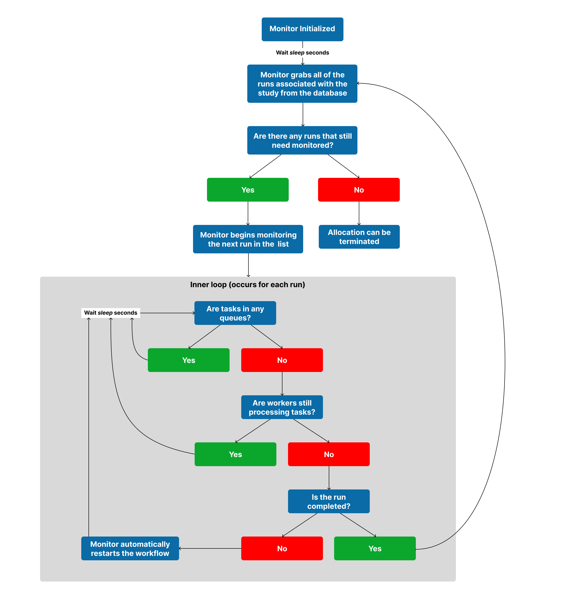
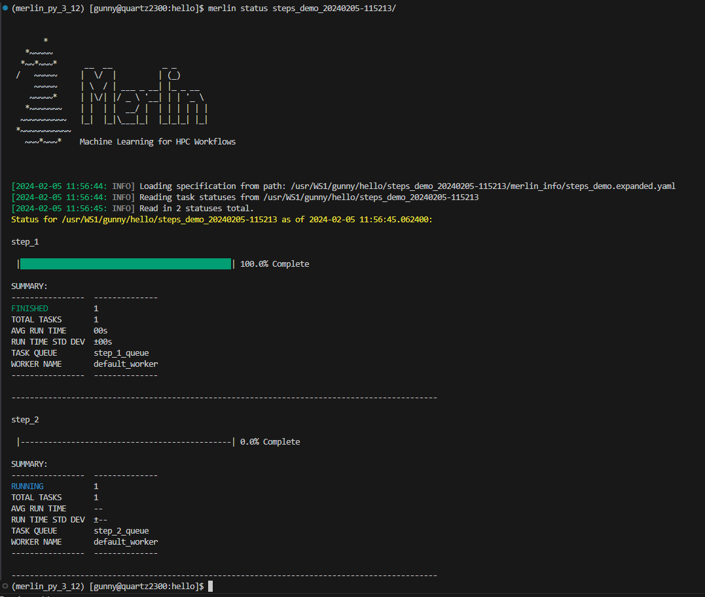
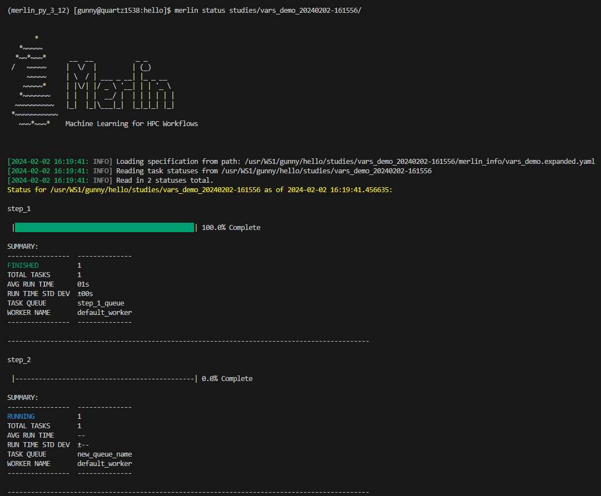
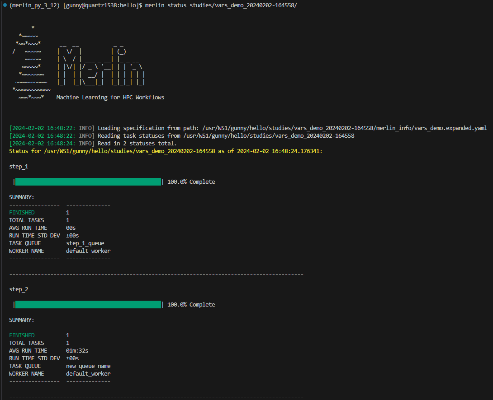

# Monitoring Studies for Persistent Allocations

Merlin's producer-consumer model ensures the longevity of workers until the batch allocation is terminated or the workers are manually killed by the user. In this framework, workers remain active, processing tasks within a workflow until the allocation concludes or they're deliberately terminated. Consequently, sustaining the vitality of the allocation is crucial during the processing phase, as it guarantees the uninterrupted execution of tasks by the workers.

To preserve an allocation throughout the lifecycle of a worklow, Merlin offers the [`merlin monitor`](../command_line.md#monitor-merlin-monitor) command. This command serves as a blocking process for a batch submission script, preserving the allocation's continuity while the workers process tasks.

**Usage:**

```bash
merlin monitor <spec file>
```

## How Does the Monitor Work?

The `merlin monitor` command takes a spec file as input, using it to identify the task queues and workers it needs to observe. This monitoring process involves two key actions:

1. Verifying the presence of tasks in the designated queues.
2. Confirming the ongoing processing of tasks by the assigned workers when the queues are empty.

The monitor comes with a [`--sleep` option](#sleep), which introduces a deliberate delay. Before the monitoring initiates, the monitor waits up to 10 times the specified sleep duration, providing users with a window to populate the task queues with the [`merlin run`](../command_line.md#run-merlin-run) command. Subsequently, it waits for the specified sleep duration between each check to determine if the queues have tasks (step 1 above). If no tasks are found, and no workers are processing tasks, the monitor concludes that the workflow has finished, allowing the allocation to end. This way, the monitor command acts as a blocking process, ensuring the continuous and effective management of tasks within the specified workflow.

The resulting flowchart of this process can be seen below.

<figure markdown>
  
  <figcaption>Monitor Flowchart</figcaption>
</figure>

## Using the Monitor

Adding the `merlin monitor` command to your workflow process is as simple as putting it at the end of your worker-startup script. The below templates showcase how this is done for [Slurm](../../faq.md#what-is-slurm) and [LSF](../../faq.md#what-is-lsf).

=== "Slurm"

    The below batch script can be submitted with:

    ```bash
    sbatch workers.sbatch <spec file>
    ```

    ```bash title="workers.sbatch"
    #!/bin/bash
    #SBATCH -N 1
    #SBATCH --ntasks-per-node=36
    #SBATCH -J Merlin
    #SBATCH -t 10:00
    #SBATCH -o merlin_workers_%j.out

    # Turn off core files to work aroung flux exec issue.
    ulimit -c 0

    YAML=default.yaml  # (1)

    if [[ $# -gt 0 ]]
    then
        YAML=$1
    fi

    echo "Specification File: $YAML"

    VENV_PATH=<set the path to the merlin venv here>

    # Activate the virtual environment
    source ${VENV_PATH}/bin/activate

    # Show the workers command
    merlin run-workers ${YAML} --echo

    # Start workers to run the tasks in the broker
    merlin run-workers ${YAML}

    # Keep the allocation alive until all workers stop
    merlin monitor ${YAML}
    ```

    1. Modifying this value to be the path to your spec file would make it so you didn't have to pass the path in at the command line when submitting this script. In other words, you could submit this script with `sbatch workers.sbatch`.

=== "LSF"

    The below batch script can be submitted with:

    ```bash
    bsub workers.bsub <spec file>
    ```

    ```bash title="workers.bsub"
    #!/bin/bash
    #BSUB -nnodes 1
    #BSUB -W 00:10    # hours:minutes
    #BSUB -J Merlin
    #BSUB -o merlin_workers_%J.out
    #BSUB -e merlin_workers_%J.err
    #BSUB -N

    # Turn off core files to work aroung flux exec issue.
    ulimit -c 0

    YAML=default.yaml  # (1)

    if [[ $# -gt 0 ]]
    then
        YAML=$1
    fi

    echo "Specification File: $YAML"

    VENV_PATH=<set the path to the merlin venv here>

    # Activate the virtual environment
    source ${VENV_PATH}/bin/activate

    # Show the workers command
    merlin run-workers ${YAML} --echo

    # Start workers to run the tasks in the broker
    merlin run-workers ${YAML}

    # Keep the allocation alive until all workers stop
    merlin monitor ${YAML}
    ```

    1. Modifying this value to be the path to your spec file would make it so you didn't have to pass the path in at the command line when submitting this script. In other words, you could submit this script with `bsub workers.bsub`.

## Options For the Monitor

There are three useful options that come with the `merlin monitor` command:

- [`--sleep`](#sleep): The delay between checks on the task queues
- [`--steps`](#steps): Only monitor specific steps in your workflow
- [`--vars`](#vars): Modify environment variables in a spec from the command line

### Sleep

The `--sleep` option in the `monitor` command allows users to specify a custom delay duration between consecutive inspections of the task queues. The default value for this option is 60 seconds.

As detailed in the ["How Does the Monitor Work?"](#how-does-the-monitor-work) section, the monitor periodically examines task queues to determine task presence. If the queues are currently occupied, the monitor will enter a sleep state for a designated duration before conducting the next inspection. Similarly, if the monitor discovers no tasks in the queues but identifies active workers processing tasks, it will initiate a sleep interval before re-evaluating both the queues and the workers. The `--sleep` option allows you to modify this sleep interval.

The value that you provide for the `--sleep` option will be an integer representing the number of seconds to sleep before the next inspection of the task queues and workers is conducted.

**Usage:**

```bash
merlin monitor <spec file> --sleep <number of seconds to sleep>
```

??? example "Example of Using `--sleep` With Monitor"

    In the below spec file we have one step that will run for 90 seconds:

    ```yaml title="sleep_demo.yaml"
    description:
        name: sleep_demo
        description: a very simple merlin workflow

    study:
        - name: step_1
          description: sleep for 90 seconds
          run:
            cmd: sleep 90
            task_queue: step_1_queue
    ```

    For this example we'll use a Slurm worker-launch script to start the workers. Notice on the last line that we're setting the sleep duration to be 30 seconds instead of the default 60 seconds:

    ```bash title="workers.sbatch" hl_lines="32"
    #!/bin/bash
    #SBATCH -N 1
    #SBATCH --ntasks-per-node=36
    #SBATCH -J Merlin
    #SBATCH -t 10:00
    #SBATCH -o merlin_workers_%j.out

    # Turn off core files to work aroung flux exec issue.
    ulimit -c 0

    YAML=sleep_demo.yaml

    if [[ $# -gt 0 ]]
    then
        YAML=$1
    fi

    echo "Specification File: $YAML"

    VENV_PATH=<set the path to the merlin venv here>

    # Activate the virtual environment
    source ${VENV_PATH}/bin/activate

    # Show the workers command
    merlin run-workers ${YAML} --echo

    # Start workers to run the tasks in the broker
    merlin run-workers ${YAML}

    # Keep the allocation alive until all workers stop
    merlin monitor ${YAML} --sleep 30
    ```

    Now let's run this study by submitting this worker launch script and sending the tasks to the broker with the [`merlin run`](../command_line.md#run-merlin-run) command:

    === "Submitting the Batch Script"

        ```bash
        sbatch workers.sbatch
        ```

    === "Sending Tasks to Broker"

        ```bash
        merlin run sleep_demo.yaml
        ```

    From the time stamps in our worker logs we can see that the custom 30 second sleep duration was applied:

    ```bash hl_lines="20-25 33-34"
    [2024-02-05 09:13:52,891: INFO] Connected to amqps://rabbitmerlin:**@cz-gunny-rabbitmerlin.apps.czapps.llnl.gov:31118/host4gunny
    [2024-02-05 09:13:52,911: INFO] mingle: searching for neighbors
    [2024-02-05 09:13:53,956: INFO] mingle: all alone
    [2024-02-05 09:13:53,996: INFO] celery@default_worker.%quartz1552 ready.
    [2024-02-05 09:13:54,028: INFO] Task merlin.common.tasks.expand_tasks_with_samples[78530a48-95f0-4b0e-90ca-7011e81a7808] received
    [2024-02-05 09:13:54,211: INFO] Task merlin.common.tasks.merlin_step[117b28c9-eacd-4e77-9771-01b4ebc29e01] received
    [2024-02-05 09:13:54,228: INFO] Executing step 'step_1' in '/usr/WS1/gunny/hello/sleep_demo_20240205-091232/step_1'...
    [2024-02-05 09:13:54,228: INFO] Directory does not exist. Creating directories to /usr/WS1/gunny/hello/sleep_demo_20240205-091232/step_1
    [2024-02-05 09:13:54,233: INFO] Writing status for step_1 to '/usr/WS1/gunny/hello/sleep_demo_20240205-091232/step_1/MERLIN_STATUS.json...
    [2024-02-05 09:13:54,235: INFO] Status for step_1 successfully written.
    [2024-02-05 09:13:54,235: INFO] Generating script for step_1 into /usr/WS1/gunny/hello/sleep_demo_20240205-091232/step_1
    [2024-02-05 09:13:54,238: INFO] Script: /usr/WS1/gunny/hello/sleep_demo_20240205-091232/step_1/step_1.sh
    Restart: None
    Scheduled?: True
    [2024-02-05 09:13:54,273: INFO] Writing status for step_1 to '/usr/WS1/gunny/hello/sleep_demo_20240205-091232/step_1/MERLIN_STATUS.json...
    [2024-02-05 09:13:54,276: INFO] Status for step_1 successfully written.
    [2024-02-05 09:13:54,276: INFO] Submitting script for step_1
    [2024-02-05 09:13:54,548: INFO] Task merlin.common.tasks.expand_tasks_with_samples[78530a48-95f0-4b0e-90ca-7011e81a7808] succeeded in 0.40144235407933593s: None
    [2024-02-05 09:14:16: INFO] Reading app config from file /g/g20/gunny/.merlin/app.yaml
    [2024-02-05 09:14:17: INFO] Monitor: found 0 jobs in queues and 1 workers alive
    [2024-02-05 09:14:18: INFO] Monitor: found tasks in queues and/or tasks being processed
    [2024-02-05 09:14:50: INFO] Monitor: found 0 jobs in queues and 1 workers alive
    [2024-02-05 09:14:51: INFO] Monitor: found tasks in queues and/or tasks being processed
    [2024-02-05 09:15:22: INFO] Monitor: found 0 jobs in queues and 1 workers alive
    [2024-02-05 09:15:23: INFO] Monitor: found tasks in queues and/or tasks being processed
    [2024-02-05 09:15:24,298: INFO] Execution returned status OK.
    [2024-02-05 09:15:24,304: INFO] Writing status for step_1 to '/usr/WS1/gunny/hello/sleep_demo_20240205-091232/step_1/MERLIN_STATUS.json...
    [2024-02-05 09:15:24,307: INFO] Status for step_1 successfully written.
    [2024-02-05 09:15:24,307: INFO] Step 'step_1' in '/usr/WS1/gunny/hello/sleep_demo_20240205-091232/step_1' finished successfully.
    [2024-02-05 09:15:24,498: INFO] Task merlin:chordfinisher[f442f13e-0436-4162-86ab-eaa28943f526] received
    [2024-02-05 09:15:24,501: INFO] Task merlin.common.tasks.merlin_step[117b28c9-eacd-4e77-9771-01b4ebc29e01] succeeded in 90.27513551106676s: 0
    [2024-02-05 09:15:24,507: INFO] Task merlin:chordfinisher[f442f13e-0436-4162-86ab-eaa28943f526] succeeded in 0.007889348082244396s: 'SYNC'
    [2024-02-05 09:15:54: INFO] Monitor: found 0 jobs in queues and 1 workers alive
    [2024-02-05 09:15:55: INFO] Monitor: ... stop condition met
    ```

### Steps

!!! warning

    It's essential to note that using this option might lead to the termination of the allocation while your study is still processing. This outcome occurs if any subsequent steps in your study were not included in the steps provided to the `--steps` option.

The `--steps` option in the `monitor` command allows you to specify particular steps for monitoring instead of the entire study. By providing specific steps, the monitor identifies the associated task queues and exclusively monitors those queues, disregarding others in the study.

**Usage:**

```bash
merlin monitor <spec file> --steps <space-delimited list of steps>
```

??? example "Example of Using `--steps` Option"

    In the spec file below, we have two steps `step_1` and `step_2` that each have thier own respective task queues `step_1_queue` and `step_2_queue`.

    ```yaml title="steps_demo.yaml"
    description:
        name: steps_demo
        description: a very simple merlin workflow

    study:
        - name: step_1
          description: say hello
          run:
            cmd: echo "hello!"
            task_queue: step_1_queue

        - name: step_2
          description: sleep for 90 seconds
          run:
            cmd: sleep 90
            depends: [step_1]
            task_queue: step_2_queue
    ```

    Let's say we just want to monitor `step_1` to make sure it finishes but we don't care if `step_2` finishes. We can convey this to our monitor by using the `--steps` option. This is shown in the worker-launch script below (for this example we'll use a Slurm batch script):

    ```bash hl_lines="32"
    #!/bin/bash
    #SBATCH -N 1
    #SBATCH --ntasks-per-node=36
    #SBATCH -J Merlin
    #SBATCH -t 10:00
    #SBATCH -o merlin_workers_%j.out

    # Turn off core files to work aroung flux exec issue.
    ulimit -c 0

    YAML=steps_demo.yaml

    if [[ $# -gt 0 ]]
    then
        YAML=$1
    fi

    echo "Specification File: $YAML"

    VENV_PATH=<set the path to the merlin venv here>

    # Activate the virtual environment
    source ${VENV_PATH}/bin/activate

    # Show the workers command
    merlin run-workers ${YAML} --echo

    # Start workers to run the tasks in the broker
    merlin run-workers ${YAML}

    # Keep the allocation alive until all workers stop
    merlin monitor ${YAML} --steps step_1
    ```

    After submitting this batch script and sending the task queues to the broker with:

    === "Submitting the Batch Script"

        ```bash
        sbatch workers.sbatch
        ```

    === "Sending Tasks to Broker"

        ```bash
        merlin run steps_demo.yaml
        ```

    ...we'll see from the status command and the logs that the allocation is terminated after `step_1` finishes but prior to `step_2` finishing.

    === "Status"

        Checking our Slurm queues with:

        ```bash
        squeue -u <user>
        ```

        We'll see our allocation is either in a cancelled state or just not there at all. This means our workers are no longer processing anything.

        Now if we check the status of our study, we'll see that `step_1` finished just fine but the status of `step_2` was never updated to a completed state since it never finished processing before the allocation was terminated:

        <figure markdown>
          
          <figcaption>Status Showing Only Step 1 Finishing</figcaption>
        </figure>

    === "Worker Logs"

        Focusing on the highlighted lines below, we'll see that `step_1` logs that it starts executing and that it finishes executing. For `step_2` we see a similar log for when it starts but we never see a log for when it finishes. Instead, it's execution is cut off by the monitor terminating the allocation since we told it to only monitor `step_1`.

        ```bash hl_lines="7 21 23 37-38"
        [2024-02-05 11:53:18,915: INFO] Connected to amqps://rabbitmerlin:**@cz-gunny-rabbitmerlin.apps.czapps.llnl.gov:31118/host4gunny
        [2024-02-05 11:53:18,943: INFO] mingle: searching for neighbors
        [2024-02-05 11:53:19,986: INFO] mingle: all alone
        [2024-02-05 11:53:20,017: INFO] celery@default_worker.%quartz205 ready.
        [2024-02-05 11:53:20,051: INFO] Task merlin.common.tasks.expand_tasks_with_samples[36b7c213-735f-443c-a593-21dd6fbdce82] received
        [2024-02-05 11:53:20,237: INFO] Task merlin.common.tasks.merlin_step[661180c7-9921-448d-ad4a-510163fe5dd3] received
        [2024-02-05 11:53:20,266: INFO] Executing step 'step_1' in '/usr/WS1/gunny/hello/steps_demo_20240205-115213/step_1'...
        [2024-02-05 11:53:20,267: INFO] Directory does not exist. Creating directories to /usr/WS1/gunny/hello/steps_demo_20240205-115213/step_1
        [2024-02-05 11:53:20,274: INFO] Writing status for step_1 to '/usr/WS1/gunny/hello/steps_demo_20240205-115213/step_1/MERLIN_STATUS.json...
        [2024-02-05 11:53:20,276: INFO] Status for step_1 successfully written.
        [2024-02-05 11:53:20,277: INFO] Generating script for step_1 into /usr/WS1/gunny/hello/steps_demo_20240205-115213/step_1
        [2024-02-05 11:53:20,281: INFO] Script: /usr/WS1/gunny/hello/steps_demo_20240205-115213/step_1/step_1.sh
        Restart: None
        Scheduled?: True
        [2024-02-05 11:53:20,326: INFO] Writing status for step_1 to '/usr/WS1/gunny/hello/steps_demo_20240205-115213/step_1/MERLIN_STATUS.json...
        [2024-02-05 11:53:20,331: INFO] Status for step_1 successfully written.
        [2024-02-05 11:53:20,331: INFO] Submitting script for step_1
        [2024-02-05 11:53:20,347: INFO] Execution returned status OK.
        [2024-02-05 11:53:20,357: INFO] Writing status for step_1 to '/usr/WS1/gunny/hello/steps_demo_20240205-115213/step_1/MERLIN_STATUS.json...
        [2024-02-05 11:53:20,362: INFO] Status for step_1 successfully written.
        [2024-02-05 11:53:20,362: INFO] Step 'step_1' in '/usr/WS1/gunny/hello/steps_demo_20240205-115213/step_1' finished successfully.
        [2024-02-05 11:53:20,427: INFO] Task merlin.common.tasks.merlin_step[29c33e4d-c2c4-4211-bd4d-ba0531f23581] received
        [2024-02-05 11:53:20,448: INFO] Executing step 'step_2' in '/usr/WS1/gunny/hello/steps_demo_20240205-115213/step_2'...
        [2024-02-05 11:53:20,448: INFO] Directory does not exist. Creating directories to /usr/WS1/gunny/hello/steps_demo_20240205-115213/step_2
        [2024-02-05 11:53:20,460: INFO] Writing status for step_2 to '/usr/WS1/gunny/hello/steps_demo_20240205-115213/step_2/MERLIN_STATUS.json...
        [2024-02-05 11:53:20,467: INFO] Status for step_2 successfully written.
        [2024-02-05 11:53:20,467: INFO] Generating script for step_2 into /usr/WS1/gunny/hello/steps_demo_20240205-115213/step_2
        [2024-02-05 11:53:20,483: INFO] Script: /usr/WS1/gunny/hello/steps_demo_20240205-115213/step_2/step_2.sh
        Restart: None
        Scheduled?: True
        [2024-02-05 11:53:20,507: INFO] Task merlin.common.tasks.expand_tasks_with_samples[36b7c213-735f-443c-a593-21dd6fbdce82] succeeded in 0.3326189829967916s: None
        [2024-02-05 11:53:20,511: INFO] Task merlin.common.tasks.merlin_step[661180c7-9921-448d-ad4a-510163fe5dd3] succeeded in 0.2548455507494509s: 0
        [2024-02-05 11:53:20,535: INFO] Writing status for step_2 to '/usr/WS1/gunny/hello/steps_demo_20240205-115213/step_2/MERLIN_STATUS.json...
        [2024-02-05 11:53:20,544: INFO] Status for step_2 successfully written.
        [2024-02-05 11:53:20,544: INFO] Submitting script for step_2
        [2024-02-05 11:54:13: INFO] Reading app config from file /g/g20/gunny/.merlin/app.yaml
        [2024-02-05 11:54:14: INFO] Monitor: found 0 jobs in queues and 1 workers alive
        [2024-02-05 11:54:15: INFO] Monitor: ... stop condition met
        ```

### Vars

The `--vars` option can be used to modify any variables defined in your spec file from the command line interface. This option can take a space-delimited list of variables and their assignments, and should be given after the input yaml file.

**Usage:**

```bash
merlin monitor <spec file> --vars <VAR_TO_MODIFY>=<VAL_TO_SET>
```

??? example "Example of Using `--vars` With Monitor"

    Say we have the following spec file with a variable `QUEUE_NAME` that's referenced in `step_2`:

    ```yaml title="vars_demo.yaml" hl_lines="7 22"
    description:
        name: vars_demo
        description: a very simple merlin workflow

    env:
        variables:
            QUEUE_NAME: step_2_queue

    study:
        - name: step_1
          description: say hello
          run:
            cmd: echo "hello!"
            task_queue: step_1_queue

        - name: step_2
          description: sleep for 90 seconds
          run:
            cmd: sleep 90
            depends: [step_1]
            task_queue: $(QUEUE_NAME)
    ```

    If we decided we wanted to modify this queue at the command line, we could accomplish this with the `--vars` option of the [`merlin run-workers`](../command_line.md#run-workers-merlin-run-workers) and [`merlin run`](../command_line.md#run-merlin-run) commands:

    === "Run Workers"

        In the below worker-startup script, we're not using the `--vars` option with the `monitor` command. This is for demonstrative purposes and will be modified later in this example.

        ```bash title="workers.sbatch" hl_lines="25-32"
        #!/bin/bash
        #SBATCH -N 1
        #SBATCH --ntasks-per-node=36
        #SBATCH -J Merlin
        #SBATCH -t 10:00
        #SBATCH -o merlin_workers_%j.out

        # Turn off core files to work aroung flux exec issue.
        ulimit -c 0

        YAML=vars_demo.yaml

        if [[ $# -gt 0 ]]
        then
            YAML=$1
        fi

        echo "Specification File: $YAML"

        VENV_PATH=<set the path to the merlin venv here>

        # Activate the virtual environment
        source ${VENV_PATH}/bin/activate

        # Show the workers command
        merlin run-workers ${YAML} --vars QUEUE_NAME=new_queue_name --echo

        # Start workers to run the tasks in the broker
        merlin run-workers ${YAML} --vars QUEUE_NAME=new_queue_name

        # Keep the allocation alive until all workers stop
        merlin monitor ${YAML}  # ***Purposefully not using the --vars argument yet***
        ```

        This can be submitted with:

        ```bash
        sbatch workers.sbatch
        ```

    === "Run"

        ```bash
        merlin run vars_demo.yaml --vars QUEUE_NAME=new_queue_name
        ```

    Using the above worker launch script that *does not* utilize the `--vars` option with the `monitor` our allocation would terminate after `step_1` completes. This is due to the fact that it will be watching the `step_1_queue` and `step_2_queue` task queues, but `step_2`'s tasks will be sent to the `new_queue_name` queue instead. We can see this behavior from the status of our study and the the end of the worker logs.

    === "Status"

        Checking our Slurm queues with:

        ```bash
        squeue -u <user>
        ```

        We'll see our allocation is either in a cancelled state or just not there at all. This means our workers are no longer processing anything.

        Now if we check the status of our study, we'll see that the status of `step_2` was never updated to a completed state:

        <figure markdown>
          
          <figcaption>Status Displaying Step 2 Never Finishes</figcaption>
        </figure>

    === "Worker Logs"

        Focusing on the highlighted lines below, we'll see that `step_1` logs that it starts executing and that it finishes executing. For `step_2` we see a similar log for when it starts but we never see a log for when it finishes. Instead, it's execution is cut off by the monitor terminating the allocation.

        ```bash hl_lines="7 21 23 37-38"
        [2024-02-02 16:16:51,152: INFO] Connected to amqps://rabbitmerlin:**@cz-gunny-rabbitmerlin.apps.czapps.llnl.gov:31118/host4gunny
        [2024-02-02 16:16:51,171: INFO] mingle: searching for neighbors
        [2024-02-02 16:16:52,211: INFO] mingle: all alone
        [2024-02-02 16:16:52,248: INFO] celery@default_worker.%quartz3 ready.
        [2024-02-02 16:16:52,275: INFO] Task merlin.common.tasks.expand_tasks_with_samples[6c4ea50a-9fe4-43ca-b2bc-47ef2a477a21] received
        [2024-02-02 16:16:52,449: INFO] Task merlin.common.tasks.merlin_step[09c2c700-fe97-4f18-9847-69615f3e4dfc] received
        [2024-02-02 16:16:52,467: INFO] Executing step 'step_1' in '/usr/WS1/gunny/hello/studies/vars_demo_20240202-161556/step_1'...
        [2024-02-02 16:16:52,467: INFO] Directory does not exist. Creating directories to /usr/WS1/gunny/hello/studies/vars_demo_20240202-161556/step_1
        [2024-02-02 16:16:52,470: INFO] Writing status for step_1 to '/usr/WS1/gunny/hello/studies/vars_demo_20240202-161556/step_1/MERLIN_STATUS.json...
        [2024-02-02 16:16:52,472: INFO] Status for step_1 successfully written.
        [2024-02-02 16:16:52,472: INFO] Generating script for step_1 into /usr/WS1/gunny/hello/studies/vars_demo_20240202-161556/step_1
        [2024-02-02 16:16:52,476: INFO] Script: /usr/WS1/gunny/hello/studies/vars_demo_20240202-161556/step_1/step_1.sh
        Restart: None
        Scheduled?: True
        [2024-02-02 16:16:52,502: INFO] Writing status for step_1 to '/usr/WS1/gunny/hello/studies/vars_demo_20240202-161556/step_1/MERLIN_STATUS.json...
        [2024-02-02 16:16:52,505: INFO] Status for step_1 successfully written.
        [2024-02-02 16:16:52,505: INFO] Submitting script for step_1
        [2024-02-02 16:16:52,516: INFO] Execution returned status OK.
        [2024-02-02 16:16:52,520: INFO] Writing status for step_1 to '/usr/WS1/gunny/hello/studies/vars_demo_20240202-161556/step_1/MERLIN_STATUS.json...
        [2024-02-02 16:16:52,522: INFO] Status for step_1 successfully written.
        [2024-02-02 16:16:52,522: INFO] Step 'step_1' in '/usr/WS1/gunny/hello/studies/vars_demo_20240202-161556/step_1' finished successfully.
        [2024-02-02 16:16:52,580: INFO] Task merlin.common.tasks.merlin_step[bffc5866-7d85-4e2b-9a20-b3d195183581] received
        [2024-02-02 16:16:52,594: INFO] Executing step 'step_2' in '/usr/WS1/gunny/hello/studies/vars_demo_20240202-161556/step_2'...
        [2024-02-02 16:16:52,594: INFO] Directory does not exist. Creating directories to /usr/WS1/gunny/hello/studies/vars_demo_20240202-161556/step_2
        [2024-02-02 16:16:52,598: INFO] Writing status for step_2 to '/usr/WS1/gunny/hello/studies/vars_demo_20240202-161556/step_2/MERLIN_STATUS.json...
        [2024-02-02 16:16:52,601: INFO] Status for step_2 successfully written.
        [2024-02-02 16:16:52,602: INFO] Generating script for step_2 into /usr/WS1/gunny/hello/studies/vars_demo_20240202-161556/step_2
        [2024-02-02 16:16:52,605: INFO] Script: /usr/WS1/gunny/hello/studies/vars_demo_20240202-161556/step_2/step_2.sh
        Restart: None
        Scheduled?: True
        [2024-02-02 16:16:52,613: INFO] Writing status for step_2 to '/usr/WS1/gunny/hello/studies/vars_demo_20240202-161556/step_2/MERLIN_STATUS.json...
        [2024-02-02 16:16:52,616: INFO] Status for step_2 successfully written.
        [2024-02-02 16:16:52,616: INFO] Submitting script for step_2
        [2024-02-02 16:16:52,639: INFO] Task merlin.common.tasks.expand_tasks_with_samples[6c4ea50a-9fe4-43ca-b2bc-47ef2a477a21] succeeded in 0.24488114699488506s: None
        [2024-02-02 16:16:52,652: INFO] Task merlin.common.tasks.merlin_step[09c2c700-fe97-4f18-9847-69615f3e4dfc] succeeded in 0.18764808497508056s: 0
        [2024-02-02 16:17:46: INFO] Reading app config from file /g/g20/gunny/.merlin/app.yaml
        [2024-02-02 16:17:47: INFO] Monitor: found 0 jobs in queues and 1 workers alive
        [2024-02-02 16:17:48: INFO] Monitor: ... stop condition met
        ```

    Now let's modify the worker-startup script to utilize the `--vars` option for the `monitor` so that it can watch the correct queues:

    ```bash title="workers.sbatch" hl_lines="32"
    #!/bin/bash
    #SBATCH -N 1
    #SBATCH --ntasks-per-node=36
    #SBATCH -J Merlin
    #SBATCH -t 10:00
    #SBATCH -o merlin_workers_%j.out

    # Turn off core files to work aroung flux exec issue.
    ulimit -c 0

    YAML=vars_demo.yaml

    if [[ $# -gt 0 ]]
    then
        YAML=$1
    fi

    echo "Specification File: $YAML"

    VENV_PATH=<set the path to the merlin venv here>

    # Activate the virtual environment
    source ${VENV_PATH}/bin/activate

    # Show the workers command
    merlin run-workers ${YAML} --vars QUEUE_NAME=new_queue_name --echo

    # Start workers to run the tasks in the broker
    merlin run-workers ${YAML} --vars QUEUE_NAME=new_queue_name

    # Keep the allocation alive until all workers stop
    merlin monitor ${YAML} --vars QUEUE_NAME=new_queue_name
    ```

    Re-submitting this workflow, we'll see that the study runs to completion before terminating.

    === "Status"

        Our status now shows that both steps finished successfully.

        <figure markdown>
          
          <figcaption>Status Displaying Both Steps Finish Successfully</figcaption>
        </figure>

    === "Worker Logs"

        Focusing on the highlighted lines below, we'll see that `step_1` and `step_2` both log that execution has started and finished. We'll also notice that prior to `step_2` finishing, the `monitor` checks the task queues/workers and determines it should keep the allocation alive. Once `step_2` is complete, we see that the monitor then terminates the allocation.

        ```bash hl_lines="8 22 24 37-38 42 46-47"
        [2024-02-02 16:46:21,634: INFO] Connected to amqps://rabbitmerlin:**@cz-gunny-rabbitmerlin.apps.czapps.llnl.gov:31118/host4gunny
        [2024-02-02 16:46:21,660: INFO] mingle: searching for neighbors
        [2024-02-02 16:46:22,704: INFO] mingle: all alone
        [2024-02-02 16:46:22,737: INFO] celery@default_worker.%quartz8 ready.
        [2024-02-02 16:46:22,766: INFO] Task merlin.common.tasks.expand_tasks_with_samples[96a9fe28-cbde-4232-8f42-653646fe032e] received
        [2024-02-02 16:46:22,947: INFO] Task merlin.common.tasks.merlin_step[ff620554-6d4d-4981-8488-bec1e718bc68] received
        [2024-02-02 16:46:23,156: INFO] Task merlin.common.tasks.expand_tasks_with_samples[96a9fe28-cbde-4232-8f42-653646fe032e] succeeded in 0.27051527600269765s: None
        [2024-02-02 16:46:23,240: INFO] Executing step 'step_1' in '/usr/WS1/gunny/hello/studies/vars_demo_20240202-164558/step_1'...
        [2024-02-02 16:46:23,241: INFO] Directory does not exist. Creating directories to /usr/WS1/gunny/hello/studies/vars_demo_20240202-164558/step_1
        [2024-02-02 16:46:23,265: INFO] Writing status for step_1 to '/usr/WS1/gunny/hello/studies/vars_demo_20240202-164558/step_1/MERLIN_STATUS.json...
        [2024-02-02 16:46:23,271: INFO] Status for step_1 successfully written.
        [2024-02-02 16:46:23,271: INFO] Generating script for step_1 into /usr/WS1/gunny/hello/studies/vars_demo_20240202-164558/step_1
        [2024-02-02 16:46:23,278: INFO] Script: /usr/WS1/gunny/hello/studies/vars_demo_20240202-164558/step_1/step_1.sh
        Restart: None
        Scheduled?: True
        [2024-02-02 16:46:23,329: INFO] Writing status for step_1 to '/usr/WS1/gunny/hello/studies/vars_demo_20240202-164558/step_1/MERLIN_STATUS.json...
        [2024-02-02 16:46:23,334: INFO] Status for step_1 successfully written.
        [2024-02-02 16:46:23,334: INFO] Submitting script for step_1
        [2024-02-02 16:46:23,350: INFO] Execution returned status OK.
        [2024-02-02 16:46:23,371: INFO] Writing status for step_1 to '/usr/WS1/gunny/hello/studies/vars_demo_20240202-164558/step_1/MERLIN_STATUS.json...
        [2024-02-02 16:46:23,379: INFO] Status for step_1 successfully written.
        [2024-02-02 16:46:23,379: INFO] Step 'step_1' in '/usr/WS1/gunny/hello/studies/vars_demo_20240202-164558/step_1' finished successfully.
        [2024-02-02 16:46:23,450: INFO] Task merlin.common.tasks.merlin_step[c1432f25-52c7-4967-9367-cff11b1b769c] received
        [2024-02-02 16:46:23,453: INFO] Executing step 'step_2' in '/usr/WS1/gunny/hello/studies/vars_demo_20240202-164558/step_2'...
        [2024-02-02 16:46:23,454: INFO] Directory does not exist. Creating directories to /usr/WS1/gunny/hello/studies/vars_demo_20240202-164558/step_2
        [2024-02-02 16:46:23,497: INFO] Writing status for step_2 to '/usr/WS1/gunny/hello/studies/vars_demo_20240202-164558/step_2/MERLIN_STATUS.json...
        [2024-02-02 16:46:23,508: INFO] Status for step_2 successfully written.
        [2024-02-02 16:46:23,508: INFO] Generating script for step_2 into /usr/WS1/gunny/hello/studies/vars_demo_20240202-164558/step_2
        [2024-02-02 16:46:23,525: INFO] Task merlin.common.tasks.merlin_step[ff620554-6d4d-4981-8488-bec1e718bc68] succeeded in 0.5617350109387189s: 0
        [2024-02-02 16:46:23,545: INFO] Script: /usr/WS1/gunny/hello/studies/vars_demo_20240202-164558/step_2/step_2.sh
        Restart: None
        Scheduled?: True
        [2024-02-02 16:46:23,615: INFO] Writing status for step_2 to '/usr/WS1/gunny/hello/studies/vars_demo_20240202-164558/step_2/MERLIN_STATUS.json...
        [2024-02-02 16:46:23,647: INFO] Status for step_2 successfully written.
        [2024-02-02 16:46:23,647: INFO] Submitting script for step_2
        [2024-02-02 16:47:16: INFO] Reading app config from file /g/g20/gunny/.merlin/app.yaml
        [2024-02-02 16:47:18: INFO] Monitor: found 0 jobs in queues and 1 workers alive
        [2024-02-02 16:47:19: INFO] Monitor: found tasks in queues and/or tasks being processed
        [2024-02-02 16:47:56,398: INFO] Execution returned status OK.
        [2024-02-02 16:47:56,509: INFO] Writing status for step_2 to '/usr/WS1/gunny/hello/studies/vars_demo_20240202-164558/step_2/MERLIN_STATUS.json...
        [2024-02-02 16:47:56,547: INFO] Status for step_2 successfully written.
        [2024-02-02 16:47:56,547: INFO] Step 'step_2' in '/usr/WS1/gunny/hello/studies/vars_demo_20240202-164558/step_2' finished successfully.
        [2024-02-02 16:47:59,780: INFO] Task merlin:chordfinisher[a338a16a-18ea-46a1-8593-5f9822cef5da] received
        [2024-02-02 16:47:59,783: INFO] Task merlin.common.tasks.merlin_step[c1432f25-52c7-4967-9367-cff11b1b769c] succeeded in 96.33197088190354s: 0
        [2024-02-02 16:47:59,787: INFO] Task merlin:chordfinisher[a338a16a-18ea-46a1-8593-5f9822cef5da] succeeded in 0.005227347952313721s: 'SYNC'
        [2024-02-02 16:48:20: INFO] Monitor: found 0 jobs in queues and 1 workers alive
        [2024-02-02 16:48:21: INFO] Monitor: ... stop condition met
        ```
