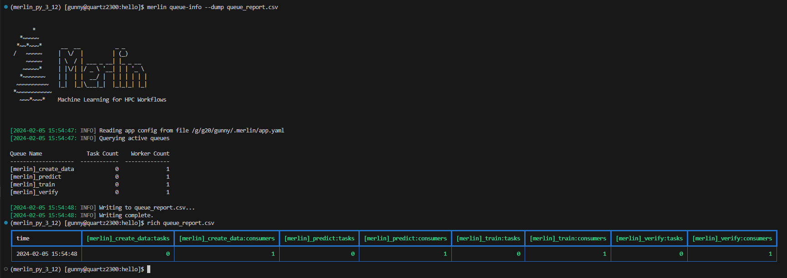

# Querying Queues and Workers

Managing task queues and monitoring the associated workers is a common necessity in many applications. To facilitate these interactions, Merlin offers two essential commands – [Queue Information](#queue-information) and [Query Workers](#query-workers).

This module will delve into the details of these commands, providing insights into how to effectively retrieve information about task queues and query the status of workers.

## Queue Information

Merlin provides users with the [`merlin queue-info`](../command_line.md#queue-info-merlin-queue-info) command to help monitor celery queues. This command will list queue statistics in a table format where the columns are as follows: queue name, number of tasks in the queue, number of workers connected to the queue.

The default functionality of this command is to display queue statistics for active queues. Active queues are any queues that have a worker watching them.

**Usage:**

```bash
merlin queue-info
```

??? example "Example Queue-Info Output With No Active Queues"

    <figure markdown>
      
      <figcaption>Output of Queue-Info When No Queues Are Active</figcaption>
    </figure>

??? example "Example Queue-Info Output With Active Queues"

    <figure markdown>
      
      <figcaption>Output of Queue-Info When There Are Queues Active</figcaption>
    </figure>

### Basic Options

The `queue-info` command comes equipped with some basic options:

- [`--dump`](#dump): Dump the queue information to a `.csv` or `.json` file
- [`--specific-queues`](#specific-queues): Only obtain queue information for queues you list here
- [`--task-server`](#task-server): Modify the task server value

#### Dump

Much like [the two status commands](./status_cmds.md), the `queue-info` command provides a way to dump the queue statistics to an output file.

=== "CSV Usage"

    ```bash
    merlin queue-info --dump queue_report.csv
    ```

=== "JSON Usage"

    ```bash
    merlin queue-info --dump queue_report.json
    ```

When dumping to a file that *does not* yet exist, Merlin will create that file for you and populate it with the queue statistics you requested.

When dumping to a file that *does* exist, Merlin will append the requested queue statistics to that file. You can differentiate between separate dump calls by looking at the timestamps of the dumps. For CSV files this timestamp exists in the `Time` column (see [CSV Dump Format](#csv-dump-format) below) and for JSON files this timestamp will be the top level key to the queue info entry (see [JSON Dump Format](#json-dump-format) below).

Using any of the `--specific-steps`, `--spec`, or `--steps` options will modify the output that's written to the output file.

##### CSV Dump Format

The format of a CSV dump file for queue information is as follows:

```bash
Time,[merlin]_<queue_name>:tasks,[merlin]_<queue_name>:consumers
```

The `<queue_name>:tasks` and `<queue_name>:consumers` columns will be created for each queue that's listed in the queue-info output at the time of your dump.

The image below shows an example of dumping the queue statistics of active queues to a csv file, and then displaying that csv file using the [rich-cli library](https://github.com/Textualize/rich-cli):

<figure markdown>
  
  <figcaption>An Example Showcasing How to do a CSV Dump of Active Queue Stats</figcaption>
</figure>

##### JSON Dump Format

The format of a JSON dump file for queue information is as follows:

```json
{ 
    "YYYY-MM-DD HH:MM:SS": {
        "[merlin]_queue_name": {
            "tasks": <integer>,
            "consumers": <integer>
        }
    }
}
```

The image below shows an example of dumping the queue info to a json file, and then displaying that json file using the [rich-cli library](https://github.com/Textualize/rich-cli):

<figure markdown>
  
  <figcaption>An Example Showcasing How to do a JSON Dump of Active Queue Stats</figcaption>
</figure>

#### Specific Queues

If you know exactly what queues you want to check on, you can use the `--specific-queues` option to list one or more queues to view.

**Usage:**

```bash
merlin queue-info --specific-queues <space-delimited list of queue names>
```

??? example "Example Queue-Info Output Using Specific-Queues With Active Queues"

    In the example below, we're querying the `train` and `predict` queues which both have a worker watching them currently (in other words, they are _**active**_).

    <figure markdown>
      
      <figcaption>Output of Queue-Info Using the Specific-Queues Option With Active Queues</figcaption>
    </figure>

If you ask for queue-info of inactive queues with the `--specific-queues` option, a table format will still be output for you.

??? example "Example Queue-Info Output Using Specific-Queues With Inactive Queues"

    In the example below, we're querying the `train` and `predict` queues which both *don't* have a worker watching them currently (in other words, they are _**inactive**_).

    <figure markdown>
      
      <figcaption>Output of Queue-Info Using the Specific-Queues Option With Inactive Queues</figcaption>
    </figure>

#### Task Server

To modify the task server from the command line you can use the `--task-server` option. However, the only currently available option for task server is celery so you most likely will not want to use this option.

**Usage:**

```bash
merlin queue-info --task-server <new task server>
```

### Specification Options

There are three options with the `--queue-info` command that revolve around using a spec file to query queue information:

- [`--spec`](#spec): Obtain queue information for all queues defined in a spec file
- [`--steps`](#steps): Obtain queue information for queues attached to certain steps in a spec file
- [`--vars`](#vars): Modify environment variables in a spec from the command line

!!! note

    The `--steps` and `--vars` options *must* be used alongside the `--spec` option. They *cannot* be used by themselves.

#### Spec

Using the `--spec` option allows you to query queue statistics for queues that only exist in the spec file you provide. This is the same functionality as the `merlin status` command prior to the release of Merlin v1.12.0.

**Usage:**

```bash
merlin queue-info --spec <spec file>
```

!!! example "Example Queue-Info Output Using the `--spec` Option"

    The below example will display queue information for all queues in the `hello.yaml` spec file.

    <figure markdown>
      
      <figcaption>Output of Queue-Info When Using the Specification Option</figcaption>
    </figure>

#### Steps

!!! warning

    This option *must* be used alongside the [`--spec`](#spec) option.

If you'd like to see queue information for queues that are attached to specific steps in your workflow, use the `--steps` option.

**Usage:**

```bash
merlin queue-info --spec <spec file> --steps <space-delimited list of step names>
```

!!! example "Example Queue-Info Output Using the `--steps` Option"

    Say we have a spec file with steps named `step_1` through `step_4` and each step is attached to a different task queue `step_1_queue` through `step_4_queue` respectively. Using the `--steps` option for these two steps gives us:

    <figure markdown>
      
      <figcaption>Output of Queue-Info When Using the Steps Option</figcaption>
    </figure>

#### Vars

!!! warning

    This option *must* be used alongside the [`--spec`](#spec) option.

The `--vars` option can be used to modify any variables defined in your spec file from the command line interface. This option can take a space-delimited list of variables and their assignments, and should be given after the input yaml file.

**Usage:**

```bash
merlin queue-info --spec <spec file> --vars <VAR_TO_MODIFY>=<VAL_TO_SET>
```

??? example "Example of Using `--vars` With Queue-Info"

    Say we have the following spec file with a variable `QUEUE_NAME` that's referenced in `step_2`:

    ```yaml title="vars_demo.yaml" hl_lines="7 22"
    description:
        name: vars_demo
        description: a very simple merlin workflow

    env:
        variables:
            QUEUE_NAME: step_2_queue

    study:
        - name: step_1
          description: say hello
          run:
            cmd: echo "hello!"
            task_queue: step_1_queue

        - name: step_2
          description: print a success message
          run:
            cmd: print("Hurrah, we did it!")
            depends: [step_1_*]
            shell: /usr/bin/env python3
            task_queue: $(QUEUE_NAME)
    ```

    If we decided we wanted to modify this queue at the command line, we could accomplish this with the `--vars` option of the [`merlin run`](../command_line.md#run-merlin-run) and [`merlin run-workers`](../command_line.md#run-workers-merlin-run-workers) commands:

    === "Run"

        ```bash
        merlin run vars_demo.yaml --vars QUEUE_NAME=new_queue_name
        ```

    === "Run Workers"

        ```bash
        merlin run-workers vars_demo.yaml --vars QUEUE_NAME=new_queue_name
        ```

    Now if we were to try to query the queue information without using the same `--vars` argument:
    
    ```bash
    merlin queue-info --spec vars_demo.yaml
    ```

    ...we see `step_1_queue` and `step_2_queue` but we wouldn't see `new_queue_name`:

    <figure markdown>
      
      <figcaption>Demo Output Showing The Missing 'new_queue_name' Queue</figcaption>
    </figure>

    This is due to the fact that when we modify a variable from the command line, the original spec file is not changed.

    With that being said, let's now run this again but this time we'll use the `--vars` option:

    ```bash
    merlin queue-info --spec vars_demo.yaml --vars QUEUE_NAME=new_queue_name
    ```

    ...which should show us a worker watching the `new_queue_name` queue:

    <figure markdown>
      
      <figcaption>Demo Output Showcasing 'new_queue_name' Appearing as Expected</figcaption>
    </figure>

## Query Workers