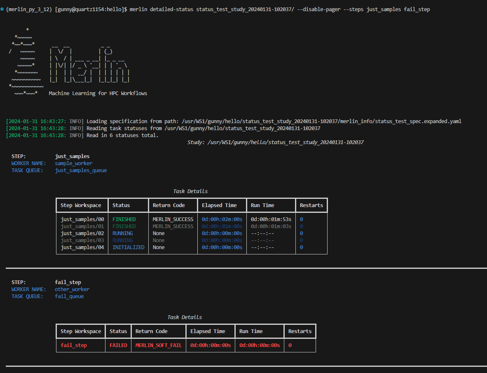

# The Status Commands

Monitoring the status of your studies is made accessible with two commands in Merlin: [`merlin status`](../command_line.md#status-merlin-status) and [`merlin detailed-status`](../command_line.md#detailed-status-merlin-detailed-status). [The Status Command](#the-status-command) offers a summary of your entire study's status, while [The Detailed-Status Command](#the-detailed-status-command) provides task-specific information that can be further filtered as needed.

## How They Work

As your study is progressing, Merlin will create `MERLIN_STATUS.json` files for each step behind the scenes. When states are modified, so are the
`MERLIN_STATUS.json` files. The `merlin status` and `merlin detailed-status` commands will read from these files and format the output in an easy-to-analyze manner.

For steps that contain samples, a `MERLIN_STATUS.json` file is created for each sample that's ran. As sets of samples finish running, Merlin will condense all of the `MERLIN_STATUS.json` files in that set of samples into one `MERLIN_STATUS.json` file. This helps to save space in the file system for all of the other important outputs that your studies provide.

The format of a `MERLIN_STATUS.json` file is as follows:

```json
{
    "step_name": {
        "parameters": {
            "cmd": {
                "TOKEN1": "value1",
                "TOKEN2": "value2",
                .
                .
                .
            },
            "restart": {
                "TOKEN1": "value1",
                "TOKEN2": "value2",
                .
                .
                .
            }
        },
        "task_queue": "name_of_queue",  // (1)
        "worker_name": "name_of_worker",
        "step_workspace": {
            "status": "<One of the 7 possible statuses>",  // (2)
            "return_code": "<One of the 8 possible return codes>",  // (3)
            "elapsed_time": "xd:xxh:xxm:xxs",
            "run_time": "xd:xxh:xxm:xxs",
            "restarts": <integer>
        }
    }
}
```

1. If you [run your study locally](../running_studies.md#local-runs), there will not be any entries for `task_queue` and `worker_name`.
2. See [Possible Statuses](#possible-statuses) below for more information.
3. See [Possible Return Codes](#possible-return-codes) below for more information.

In the `parameters` section here, the `cmd` parameters are parameters used in the `cmd` key of [the `run` property](../specification.md#the-run-property) in a step, and the `restart` parameters are parameters
used in the `restart` key of the `run` property in a step. Both of these values may be null if no parameters are used in either key.

If your step uses samples, a "step_workspace" entry for each sample will be created. In other words, you will have multiple "step_workspace" entries of the form "step_workspace/00", "step_workspace/01", "step_workspace/02", etc.

!!! example "`MERLIN_STATUS.json` Format With Samples"

    Say we have a workflow that generates 3 samples and a step named `just_samples` that utilizes them. This would result in a `MERLIN_STATUS.json` file that looks like so:

    ```json
    {
        "just_samples": {
            "parameters": {
                "cmd": null,
                "restart": null
            },
            "task_queue": "just_samples_queue",
            "worker_name": "sample_worker",
            "just_samples/00": {
                "status": "FINISHED",
                "return_code": "MERLIN_SUCCESS",
                "elapsed_time": "0d:00h:00m:00s",
                "run_time": "0d:00h:00m:00s",
                "restarts": 0
            },
            "just_samples/01": {
                "status": "FINISHED",
                "return_code": "MERLIN_SUCCESS",
                "elapsed_time": "0d:00h:00m:00s",
                "run_time": "0d:00h:00m:00s",
                "restarts": 0
            },
            "just_samples/02": {
                "status": "FINISHED",
                "return_code": "MERLIN_SUCCESS",
                "elapsed_time": "0d:00h:00m:00s",
                "run_time": "0d:00h:00m:00s",
                "restarts": 0
            }
        }
    }
    ```

## Possible Statuses

!!! note

    The `INITIALIZED` and `RUNNING` states do not have a colorblind symbol since they do not appear in the progress bar, just in the summary section of a step.

!!! note

    Colors here are chosen based on [Bang Wong's optimized color palette for color-blind individuals](https://www.nature.com/articles/nmeth.1618).

During the execution process of your step, there are 7 possible statuses that a task may hold:

| Status | Description | Color | Colorblind Symbol |
| ------ | ----------- | ----- | ----------------- |
| `INITIALIZED` | Tasks in the `INITIALIZED` state have been queued but have not began processing yet | <span style="color: #56b3e9"><div>light-blue</div><div>#56b3e9</div></span> | N/A |
| `RUNNING` | Tasks in the `RUNNING` state have began executing but have not yet entered a completed state ("completed states" are any of the states listed below) | <span style="color: #0072b2"><div>blue</div><div>#0072b2</div></span> | N/A |
| `FINISHED` | Tasks in the `FINISHED` state have successfully ran to completion | <span style="color: #009e74"><div>green</div><div>#009e74</div></span> | █ |
| `CANCELLED` | Tasks in the `CANCELLED` state have exited with the `$(MERLIN_STOP_WORKERS)` exit code (see [Step Return Variables](../variables.md#step-return-variables)) | <span style="color: #f0e442"><div>yellow</div><div>#f0e442</div></span> | / |
| `FAILED` | Tasks in the `FAILED` state have exited with the `$(MERLIN_SOFT_FAIL)` or `$(MERLIN_HARD_FAIL)` exit codes (see [Step Return Variables](../variables.md#step-return-variables)) | <span style="color: #d55e00"><div>red</div><div>#d55e00</div></span> | ⣿ |
| `DRY_RUN` | Tasks in the DRY_RUN state have successfully run in the [Dry Run](../running_studies.md#dry-runs) mode | <span style="color: #e69f00"><div>orange</div><div>#e69f00</div></span> | \\ |
| `UNKNOWN` | Tasks in the `UNKNOWN` state have exited with an unknown return code | <span style="color: #666666"><div>green</div><div>#666666</div></span> | ? |

## Possible Return Codes

!!! note

    The return codes here follow almost directly from the [Step Return Variables](../variables.md#step-return-variables). Only the `MERLIN_DRY_SUCCESS` nad `MERLIN_UNRECOGNIZED` return codes are unique here.

Once a task has completed running, there are 8 possible return codes that it could have:

| Return Code | Description |
| ----------- | ----------- |
| `MERLIN_SUCCESS` | This task finished successfully |
| `MERLIN_SOFT_FAIL` | This task failed but not badly enough to stop the workflow entirely |
| `MERLIN_HARD_FAIL` | This task failed and we now need to stop the entire workflow |
| `MERLIN_RESTART` | This task needs restarted; Next run will run the "restart" command in the step unless it's undefined |
| `MERLIN_RETRY` | This task needs to be retried; Will automatically re-run the "cmd" for the step |
| `MERLIN_STOP_WORKERS` | This task exited with a code to stop the workers |
| `MERLIN_DRY_SUCCESS` | This task successfully completed in the [Dry Run](../running_studies.md#dry-runs) mode |
| `MERLIN_UNRECOGNIZED` | This task finished with an unrecognized return code |

## Inputs

Both the [`merlin status`](../command_line.md#status-merlin-status) and the [`merlin detailed-status`](../command_line.md#status-merlin-status) commands can take either a yaml spec file or an output workspace as input.

=== "Status Usage"

    ```bash
    merlin status <spec or output workspace>
    ```

=== "Detailed-Status Usage"

    ```bash
    merlin detailed-status <spec or output workspace>
    ```

!!! example

    Say we have a spec file `hello_world.yaml` that we've ran which created an output workspace `hello_world_20230503-105137/`. We can check the status of our study with either option.

    === "Using the Spec File"

        ```bash
        merlin status hello_world.yaml
        ```

    === "Using the Output Workspace"

        ```bash
        merlin status hello_world_20230503-105137/
        ```

If you choose to provide an output study directory as input, Merlin will pull information from the expanded spec file located in the
`merlin_info/` directory.

!!! tip

    If you're not familiar with the `merlin_info/` directory, check out [The Basics of Interpreting Output](../interpreting_output.md#the-basics) to learn more.

If you choose to provide a spec file as input, Merlin will search the `OUTPUT_PATH` (see [Reserved Variables](../variables.md#reserved-variables) for more info on this variable) for possible studies associated with this spec. If there are multiple output directories associated with your spec file, then you will be prompted to select which study you'd like to view the status of, as is shown in the figure below.

<figure markdown>
  
  <figcaption>Prompt When Multiple Studies Are Found</figcaption>
</figure>

If you'd like to ignore this prompt, you can use the `--no-prompts` option. This will automatically select the most recent study for you.

**Usage:**

```bash
merlin status <spec file> --no-prompts
```

## The Status Command

The [`merlin status`](../command_line.md#status-merlin-status) command is designed to help you see the overall status of your entire study. It provides you a step-by-step view with progress bars and summary tables that will show you exactly how many tasks are in each state, how many tasks in total there are for a step, the average & standard deviation of the run times for tasks in a step, and which workers & task queues each step is associated with (if applicable).

This command requires you to select a study to view the status of. For more information on inputs to this command see [Inputs](#inputs) above.

**Usage:**

```bash
merlin status <spec or output workspace>
```

??? example "Example Status Output"

    <figure markdown>
      
      <figcaption>Output of Status Command</figcaption>
    </figure>

To help assist with colorblindness, Merlin provides the `--cb-help` option for the status command. This option will add symbols to the progress bar for different task statuses.

**Usage:**

```bash
merlin status <spec or output workspace> --cb-help
```

??? example "Example Colorblind-Assisted Status Output"

    <figure markdown>
      
      <figcaption>Output of Status Command With Colorblind Assistance Enabled</figcaption>
    </figure>

## The Detailed-Status Command

The [`merlin detailed-status`](../command_line.md#detailed-status-merlin-detailed-status) command is designed to help you see an in-depth status breakdown of each step in your study. It provides a task-by-task view with each task's workspace, status, return code, elapsed time, run time, and number of restarts available for you to see.

This command requires you to select a study to view the status of. For more information on inputs to this command see [Inputs](#inputs) above.

!!! note "Manpager Note"

    If the output of the detailed-status command looks something like this:

    <figure markdown>
      
      <figcaption>ASCII Error With Pager Functionality</figcaption>
    </figure>

    Then there are a couple things you can try to fix this problem:

    1. Set the `MANPAGER` or `PAGER` environment variable to be "less -r" and run again

        ```bash
        export MANPAGER="less -r"
        ```

    2. If the error isn't fixed after 1. above, then:

        a. You can disable the theme with the `--disable-theme` option (see [Disable Theme](#disable-theme) below).

        b. If you'd rather not disable the theme, the error usually stems from using the pager functionality, so you can try disabling that with the `--disable-pager` option (see [Disable Pager](#disable-pager) below). **Caution:** you may end up outputting a lot of information to the shell all at once when using this option.

By default, the `merlin detailed-status` command will pull up a pager window containing the status information that was requested. Merlin uses this pager functionality to ensure we don't overload the shell by displaying too many task statuses at one time.

**Usage:**

```bash
merlin detailed-status <spec or output workspace>
```

??? example "Example Detailed-Status Output Inside The Pager"

    <figure markdown>
      
      <figcaption>Output of Detailed-Status Inside the Pager</figcaption>
    </figure>

To see all of the options that can be used with the pager, press `h`. To exit the pager, press `q`.

Once you close the pager, the statuses you requested will not appear and you'll be redirected back to your normal shell view.

??? example "Example Detailed-Status Output Once Pager Is Closed"

    <figure markdown>
      
      <figcaption>Output of Detailed-Status When the Pager Is Closed</figcaption>
    </figure>

### Display Options

The merlin status command comes equipped with four options to help modify the display output: [`--disable-pager`](#disable-pager), [`--disable-theme`](#disable-theme), [`--layout`](#layout), and [`--no-prompts`](#no-prompts). These options can all be used together or by themselves.

#### Disable Pager

!!! warning

    The `--disable-pager` option could cause you to unintentionally output thousands of task statuses to stdout, which may overload the shell with output. Merlin tries to help prevent this with prompts for additional filters but you should still use caution.

The `--disable-pager` option allows you to turn off the pager functionality that is on by default. This will redirect the detailed-status output to stdout rather than the pager.

**Usage:**

```bash
merlin detailed-status <spec or output directory> --disable-pager
```

??? example "Example Detailed-Status Output With Pager Disabled"

    <figure markdown>
      
      <figcaption>Output of Detailed-Status With Pager Disabled</figcaption>
    </figure>

When using this option you may unintentionally output a lot of information to the shell which could cause problems. To help prevent issues from too much information being printed, Merlin will prompt you to further filter your output if there are more than 250 task statuses to display:

<figure markdown>
  
  <figcaption>Prompt Displayed When Too Many Tasks Are Found With Disable-Pager</figcaption>
</figure>

If you'd like to cancel the filter and the display entirely, press `c`. If you don't wish to filter and just want to display your tasks, press `n` (again, _**be cautious**_ when using this option). If you decide that filtering your tasks would be a better option, press `y` and you'll see the following filter options:

<figure markdown>
  
  <figcaption>Prompt Asking For You To Provide Filters</figcaption>
</figure>

!!! note

    If you put `E` or `EXIT` anywhere in the prompt, no filters will be applied and you'll be returned to the original prompt. For example, entering `FAILED, E, CANCELLED` will return you to the original prompt without filtering anything.


Here, the filters are equivalent to certain [Filter Options](#filter-options):

- Limiting the number of tasks to display = [`--max-tasks`](#max-tasks)
- Filtering by status = [`--task-status`](#task-status)
- Filtering by return code = [`--return-code`](#return-code)

It's possible to combine different filter types here. For example, a valid filter could be `FAILED, STOP_WORKERS` which would show any tasks with a `FAILED` status *and* any tasks with a `STOP_WORKERS` return code.

If you put `MAX_TASKS` anywhere in your filter, you'll receive another prompt asking you for an integer greater than 0 to set as the limit on the number of tasks to display:

<figure markdown>
  
  <figcaption>Prompt Asking For You To Provide A Max-Tasks Limit</figcaption>
</figure>

#### Disable Theme

The `--disable-theme` option allows you to disable the color scheme used in the output of the detailed-status command.

**Usage:**

```bash
merlin detailed-status <spec or output workspace> --disable-theme
```

!!! example "Example Detailed-Status Output With Theme Disabled"

    <figure markdown>
      
      <figcaption>Output of Detailed-Status With Theme Disabled</figcaption>
    </figure>

#### Layout

By default, the `merlin detailed-status` command displays tasks on a step-by-step basis. To change this and group all of the tasks together, you can use the `--layout table` option.

**Usage:**

```bash
merlin detailed-status <spec or output workspace> --layout <table or default>
```

!!! example "Example Detailed-Status Output With Table Layout"

    <figure markdown>
      
      <figcaption>Output of Detailed-Status With Table Layout</figcaption>
    </figure>

#### No Prompts

!!! warning

    _**Be cautious**_ when using this option with the `--disable-pager` option. You may accidentally output thousands of task statuses to the shell.

The `--no-prompts` option is an option to disable any prompts that might be displayed while using the `detailed-status` command. There are four possible ways to use this filter, each with a slightly different result:

- **Used with a workspace as input:** Nothing will happen here as there will be no prompts asking to select a study and no prompts asking you to filter tasks
- **Used with a spec as input:** Instead of prompting you to select a study, the most recent study will automatically be selected
- **Used with a workspace as input and the `--disable-pager` option enabled:** Any prompt that may have been displayed asking you to filter your output will be ignored
- **Used with a spec as input and the `--disable-pager` option enabled:** The most recent study will automatically be selected and any prompt that may have been displayed asking you to filter your output will be ignored

**Usage:**

```bash
merlin detailed-status <spec or output workspace> --no-prompts
```

### Filter Options

There are six filter options with the detailed-status command: [`--max-tasks`](#max-tasks), [`--return-code`](#return-code), [`--steps`](#steps), [`--task-queues`](#task-queues), [`--task-status`](#task-status), and [`--workers`](#workers). These filters can be used together or by themselves.

!!! note

    In the images that are in the sections below, the `--disable-pager` filter is used. This is simply to show all of the output of the detailed-status filters in one place. It is *not* required (nor is it recommended) when using the filter options.

    If you don't use the `--disable-pager` option but you get strange ASCII characters in the output of the pager, see the ["Manpager Note" above](#the-detailed-status-command) above for instructions on how to fix that.

#### Max Tasks

The `--max-tasks` filter allows you to limit how many tasks are displayed in the output. This filter takes in an integer as input which represents the maximum number of tasks you'd like to display.

**Usage:**

```bash
merlin detailed-status <spec or output workspace> --max-tasks <integer greater than 0>
```

!!! example "Example Detailed-Status Output With Max Tasks Filter"

    Here, we're setting the maximum number of tasks that can be displayed to 5:

    <figure markdown>
      
      <figcaption>Output of Detailed-Status With Max-Tasks Set to 5</figcaption>
    </figure>

#### Return Code

The `--return-code` filter allows you to search for tasks with a certain return code. This filter can take one or more [return codes](#possible-return-codes) as input. Valid inputs include: `SUCCESS`, `SOFT_FAIL`, `HARD_FAIL`, `STOP_WORKERS`, `RESTART`, `RETRY`, `DRY_SUCCESS`, and `UNRECOGNIZED`.

**Usage:**

```bash
merlin detailed-status <spec or output directory> --return-code <one or more valid return codes>
```

!!! example "Example Detailed-Status Output With Return Code Filter"

    Here, we're asking to see all tasks that completed with a `SOFT_FAIL` return code:

    <figure markdown>
      
      <figcaption>Output of Detailed-Status With Return-Code Set to 'SOFT_FAIL'</figcaption>
    </figure>

#### Steps

The `--steps` filter allows you to view status information about specific steps. This flag can take one or multiple steps as input. If a step provided cannot be found, that step will be removed from the filter.

**Usage:**

```bash
merlin detailed-status <spec or output directory> --steps <space-delimited list of step names>
```

!!! example "Example Detailed-Status Output With Steps Filter"

    Here, we're asking to see all task statuses from the `just_samples` and `fail_step` steps:

    <figure markdown>
      
      <figcaption>Output of Detailed-Status With The Steps Filter Set to 'just_samples' and 'fail_step'</figcaption>
    </figure>

#### Task Queues

The `--task-queues` filter allows you to view statuses of tasks in certain task queues. This filter can take one or more queues as input. If a queue provided cannot be found, that queue will be removed from the filter.

**Usage:**

```bash
merlin detailed-status <spec or output directory> --task-queues <space-delimited list of task queues>
```

!!! example "Example Detailed-Status Output With Task Queues Filter"

    Here, we're asking to see all task statuses of tasks in the `just_parameters_queue` and `cancel_queue` queues:

    <figure markdown>
      
      <figcaption>Output of Detailed-Status With The Task-Queues Filter Set to 'just_parameters_queue' and 'cancel_queue'</figcaption>
    </figure>

#### Task Status

The `--task-status` filter allows you to search for tasks with a certain status. This filter can take one or more statuses as input. Valid inputs include: `INITIALIZED`, `RUNNING`, `FINISHED`, `FAILED`, `CANCELLED`, `DRY_RUN`, and `UNKNOWN`.

**Usage:**

```bash
merlin detailed-status <spec or output directory> --task-status <space-delimited list of task statuses>
```

!!! example "Example Detailed-Status Output With Task Status Filter"

    Here, we're asking to see all task statuses that have a `FAILED` or `UNKNOWN` status:

    <figure markdown>
      
      <figcaption>Output of Detailed-Status With The Task-Status Filter Set to 'FAILED' and 'UNKNOWN'</figcaption>
    </figure>

#### Workers

The `--workers` filter allows you to search for tasks that are being run or were ran by certain celery workers. This filter can take one or more worker names as input. If a worker provided cannot be found, that worker will be removed from the filter.

**Usage:**

```bash
merlin detailed-status <spec or output directory> --workers <space-delimited list of worker names>
```

!!! example "Example Detailed-Status Output With Workers Filter"

    Here, we're asking to see all task statuses for tasks ran by the `sample_worker` worker:

    <figure markdown>
      
      <figcaption>Output of Detailed-Status With The Workers Filter Set to 'sample_worker'</figcaption>
    </figure>

## Dumping Status Info to Output Files

Both status commands in Merlin allow you to dump to an output file. This output file must be either a `.csv` or a `.json` file.

=== "JSON Dump"

    ```bash
    merlin status <spec or output workspace> --dump status_report.json
    ```

=== "CSV Dump"

    ```bash
    merlin status <spec or output workspace> --dump status_report.csv
    ```

When dumping to a file that *does not* yet exist, Merlin will create that file for you and populate it with the requested status info.

When dumping to a file that *does* exist, Merlin will append the requested status information to that file. You can differentiate between separate dump calls by looking at the timestamps of the dumps. For CSV files this timestamp exists in the `time_of_status` column (see [Status CSV Dump Format](#csv-dump-format) below) and for JSON files this timestamp will be the top level key to the status entry (see [Status JSON Dump Format](#json-dump-format) below).

If you use the `--dump` option with `merlin detailed-status` and *don't* provide any filters, this will provide the same output in the file you're dumping to as it would if you used `--dump` with `merlin status`.

If you use the `--dump` option with `merlin detailed-status` and you *do* provide filters, only the statuses that match your filters will be written to the dump file.

### CSV Dump Format

The format of a CSV dump file for statuses is as follows:

```bash
time_of_status,step_name,step_workspace,status,return_code,elapsed_time,run_time,restarts,cmd_parameters,restart_parameters,task_queue,worker_name
```

The image below shows an example of dumping the status info of tasks with `FAILED` task statuses to a CSV file, and then displaying that CSV file using the [rich-cli library](https://github.com/Textualize/rich-cli):

<figure markdown>
  
  <figcaption>An Example Showcasing How to do a Filtered CSV Dump and View its Contents</figcaption>
</figure>

### JSON Dump Format

The format of a JSON dump file for statuses is almost exactly the same as the [format of the `MERLIN_STATUS.json` files](#how-they-work). The only difference is that each entry begins with a date:

```json
{ 
    "YYYY-MM-DD HH:MM:SS": {
        "step_name": {
        "parameters": {
            "cmd": {
                "TOKEN1": "value1",
                "TOKEN2": "value2",
                "etc": "etc"
            },
            "restart": {
                "TOKEN1": "value1",
                "TOKEN2": "value2",
                "etc": "etc"
            }
        },
        "task_queue": "name_of_queue",
        "worker_name": "name_of_worker",
        "step_workspace": {
            "status": "<One of the 7 possible statuses>",
            "return_code": "<One of the 8 possible return codes>",
            "elapsed_time": "xd:xxh:xxm:xxs",
            "run_time": "xd:xxh:xxm:xxs",
            "restarts": <integer>
        }
        }
    }
}
```

The image below shows an example of dumping the status info of tasks with `FAILED` task statuses to a JSON file, and then displaying that JSON file using the [rich-cli library](https://github.com/Textualize/rich-cli):

<figure markdown>
  
  <figcaption>An Example Showcasing How to do a Filtered JSON Dump and View its Contents</figcaption>
</figure>

## Output Path and Task Server Options

The `--output-path` (or `-o` for short) option allows users to specify a new output path to search for studies in. This option is useful *only* when a spec is provided as the input. If this option is used when an output workspace is passed as input then it will be ignored.

**Usage:**

```bash  
merlin status <spec or output workspace> --output-path <path to a new output path>
```

??? example "Example Usage of the `--output-path` Option"

    Say we have the following study with an `OUTPUT_PATH` variable defined to be the current working directory:

    ```yaml title="hello_samples.yaml" hl_lines="8"
    description:
        name: hello_samples
        description: a very simple merlin workflow, with samples

    env:
        variables:
            N_SAMPLES: 3
            OUTPUT_PATH: .

    global.parameters:
        GREET:
            values : ["hello","hola"]
            label  : GREET.%%

    study:
        - name: step_1
        description: say hello
        run:
            cmd: |
                echo "$(GREET), $(NAME)!"

        - name: step_2
        description: print a success message
        run:
            cmd: print("Hurrah, we did it!")
            depends: [step_1_*]
            shell: /usr/bin/env python3

    merlin:
        resources:
            workers:
                demo_worker:
                    args: -l INFO --concurrency=1
                    steps: [all]
        samples:
            generate:
                cmd: python3 $(SPECROOT)/make_samples.py --filepath=$(MERLIN_INFO)/samples.csv --number=$(N_SAMPLES)
            file: $(MERLIN_INFO)/samples.csv
            column_labels: [NAME]
    ```

    Running this normally with:
    
    ```bash
    merlin run hello_samples.yaml
    ```
    
    creates a `hello_samples_<timestamp>/` output workspace in the current working directory. However, if we ran this with:

    ```bash
    merlin run hello_samples.yaml --vars OUTPUT_PATH=./studies
    ```

    This would create a `hello_samples_<timestamp>/` output workspace in a directory called `studies/` *without* modifying the original `hello_samples.yaml` file.

    In other words, we'd now have the following directory structure in our current working directory:

    ```bash
    current_working_dir/
    ├── hello_samples.yaml
    ├── hello_samples_<timestamp>/
    │   │   .
    │   │   .
    │   └── .
    └── studies/
        └── hello_samples_<timestamp>/
            │   .
            │   .
            └── .
    ```

    Now, let's say we check the status of a study using the `hello_samples.yaml` spec as input:

    ```bash
    merlin status hello_samples.yaml
    ```

    Since our original spec file was never modified, the `OUTPUT_PATH` variable there will still point to the current working directory. Therefore, the above command will look in the current working directory for studies. The output workspace located in the `studies/` directory will not be seen.

    If we'd like to see the status of the output workspace in the `studies` directory, we can use the `--output-path` option:

    ```bash
    merlin status hello_samples.yaml --output-path ./studies
    ```

    This will tell the status command to look in the `studies/` directory for potential output workspaces associated with the `hello_samples.yaml` script.

Additionally, to modify the task server from the command line you can use the `--task-server` option. However, the only currently available
option for task server is celery so you most likely will not want to use this option.

**Usage:**

```bash
merlin status <spec or output workspace> --task-server <new task server>
```
