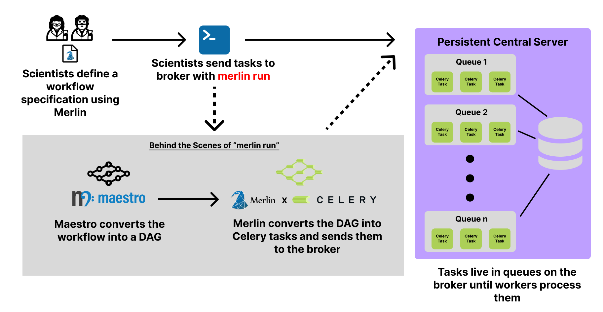
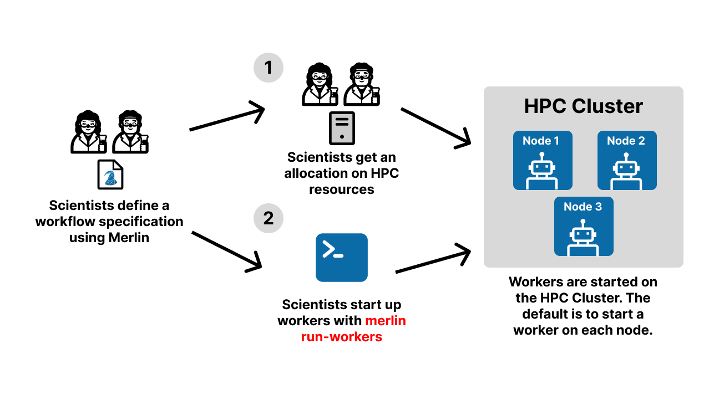
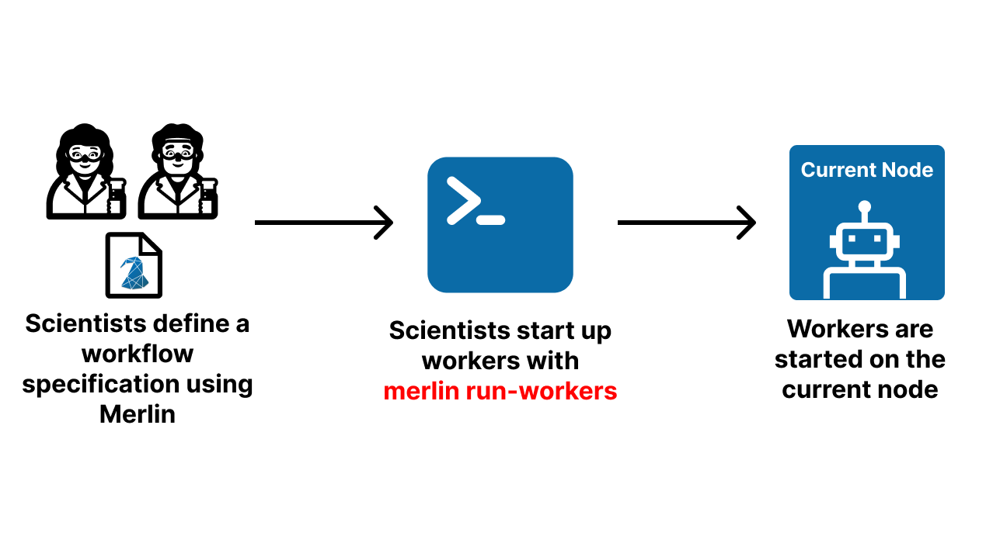
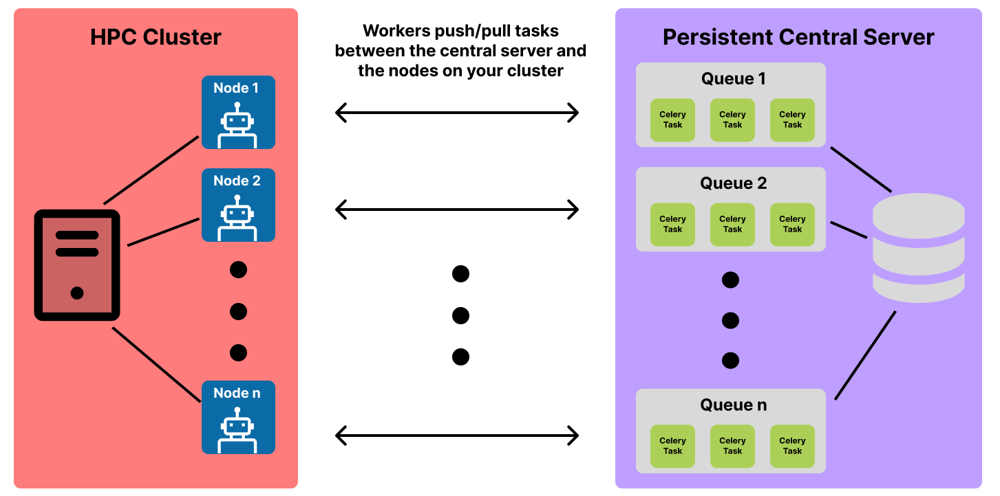
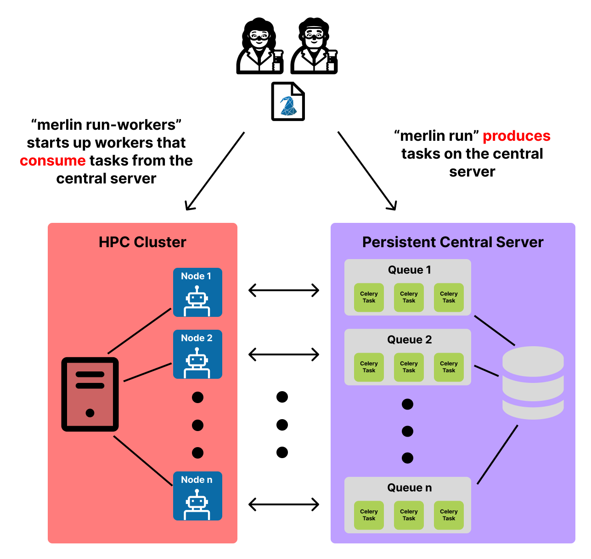
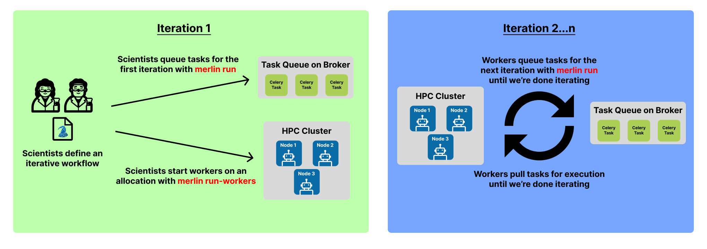

# Running Studies

Once you have created a [spec file](./specification.md) for your workflow, it can be ran either [locally](#local-runs) or in a [distributed manner](#distributed-runs).

Additionally, any [user variable](./variables.md#user-variables) created in your spec file can be [modified from the command line](#command-line-substitution).

Being able to run in a distributed manner and the support for command line substitution opens the door to [iterative runs](#iterative-runs) (see the [Iterative Demo](../examples/iterative.md) for a full demonstration of this process).

## Local Runs

!!! warning

    You should __*not*__ execute production runs locally. Instead, execute them [in a distributed manner](#distributed-runs).

    Local runs should be for testing workflow execution at very small scales.

At the start of this [User Guide](./index.md) it's mentioned that Merlin uses a producer consumer model that relies on a centralized server. Sometimes it may be faster and easier to test the execution of a workflow without using this centralized server. This is where local runs come in handy.

In a local run, tasks are executed sequentially in your current shell and are never sent to the broker. Therefore, workers do not need to be started for a local run to execute.

Local runs are typically used when designing a workflow. They help provide users a quick way to run through their study to ensure every step is executing as expected prior to doing larger production runs that should be done [in a distributed manner](#distributed-runs).

To run a study locally use the `--local` option of the [`merlin run`](./command_line.md#run-merlin-run) command.

```bash
merlin run --local my_specification.yaml
```

## Distributed Runs

!!! warning

    Distributed runs __*require*__ a connection to both the broker and results server. See the [Configuration](./configuration/index.md) page for instructions on how to set up these connections if you haven't done so already.

    If you can run `merlin info` and see no errors then your connection is working.

Most of the runs done in Merlin will likely be distributed runs. These runs require:

1. Tasks representing how to execute your workflow
2. Workers to coordinate and execute these tasks

In a distributed run, the [DAG](../faq.md#what-is-a-dag) created by [the `study` block](./specification.md#the-study-block) of your spec file is converted to [Celery tasks](https://docs.celeryq.dev/en/stable/userguide/tasks.html) which are then sent to queues that live on the [broker](./configuration/index.md#what-is-a-broker). To accomplish this Merlin provides the [`merlin run`](./command_line.md#run-merlin-run) command:

```bash
merlin run my_specification.yaml
```

The diagram below displays the basic flow of this process:

<figure markdown>
  
  <figcaption>High-Level Overview of "merlin run"</figcaption>
</figure>


Once tasks are queued on the broker, they will remain there until we initiate workers to process them.

You can specify workers in [the `merlin` block](./specification.md#the-merlin-block) of your spec file. To initiate these workers on your current node, you can use the [`merlin run-workers`](./command_line.md#run-workers-merlin-run-workers) command. However, workers are typically launched in parallel which will require an allocation on your preferred HPC system prior to using the `merlin run-workers` command.

=== "Launch In Parallel"

    A parallel batch allocation launch is configured to run a single worker per node. This worker will then launch a number of worker processes to manage the tasks. The number of worker processes that are launched depends on the `--concurrency` value provided to the workers and the number of nodes in your allocation that are running workers. In math terms: `num_workers = concurrency * num_nodes`. By default the concurrency value will be the number of CPUs on the node but this can be configured by users (see the [Configuring Celery Workers](./celery.md#configuring-celery-workers) section for more details).

    A full [Slurm](../faq.md#what-is-slurm) batch submission script to run the workflow on 3 nodes is shown below.

    ```bash title="workers.sbatch"
    #!/bin/bash
    #SBATCH -N 3
    #SBATCH -J Merlin
    #SBATCH -t 30:00
    #SBATCH -p pdebug
    #SBATCH --mail-type=ALL
    #SBATCH -o merlin_workers_%j.out

    # Assumes you are running this in the same dir as the yaml file.
    YAML_FILE=input.yaml

    # Source the merlin virtualenv (if using csh, change this to 'activate.csh' in the statement below)
    source <path to merlin venv>/bin/activate

    # Print out the workers command
    merlin run-workers ${YAML_FILE} --echo

    # Run the workers on the allocation
    merlin run-workers ${YAML_FILE}

    # Delay until the workers cease running
    merlin monitor
    ```

    This script can be submitted using:

    ```bash
    sbatch workers.sbatch
    ```

    Below is a visual demonstration of this worker startup process. Steps 1 and 2 in this diagram are both handled by the bash script given above.

    !!! note

        The robots in this diagram represent the workers that are started on each node of the allocation. This is the default behavior when workers are spun up. If you'd like to modify how many nodes a worker possesses, that can be customized in [the `resources` section](./specification.md#resources) of the `merlin` block in your spec file.

    <figure markdown>
      
      <figcaption>Flowchart for Starting Workers In Parallel</figcaption>
    </figure>

=== "Launch On The Current Node"

    !!! warning

        Launching workers on the current node should be done with caution as the default behavior is for them to occupy all CPUs on a node. This can be modified with the `--concurrency` value provided to the workers. See the [Configuring Celery Workers](./celery.md#configuring-celery-workers) section for more details.

    Workers can be launched on the current node by running:

    ```bash
    merlin run-workers my_specification.yaml
    ```

    Below is a visual demonstration of this worker startup process. The robot represents the workers started on the current node.

    <figure markdown>
      
      <figcaption>Flowchart for Starting Workers On The Current Node</figcaption>
    </figure>

The workers that you spin up will live on the node(s) of your allocation and communicate with both the broker (to pull tasks from the queues for execution) and the [results server](./configuration/index.md#what-is-a-results-backend) (to store task state information). The communication between the worker and the broker is two-way so that the worker can push new tasks to the server as the workflow executes and pull existing tasks from the server that need to be executed. Below is a visual representation of this communication:

<figure markdown>
  
  <figcaption>Communication Between Workers and the Central Server</figcaption>
</figure>

If we put everything from this section together, we can see the full picture of the producer-consumer model that Merlin utilizes in workflow runs:

<figure markdown>
  
  <figcaption>The Producer-Consumer Model for Merlin</figcaption>
</figure>

Once finished executing, workers can be stopped with the [`merlin stop-workers`](./command_line.md#stop-workers-merlin-stop-workers) command:

```bash
merlin stop-workers --spec my_specification.yaml
```

## Dry Runs

!!! tip

    It may be helpful to have an understanding of [The Basics](./interpreting_output.md#the-basics) of the study output workspace in order to fully grasp how dry runs work with Merlin.

!!! note

    If you wish to execute a workflow after dry-running it, simply use [`merlin restart`](./command_line.md#restart-merlin-restart) (to understand why this works, see the section below on [Restarting Workflows](#restarting-workflows)).

'Dry run' means telling workers to create a study's workspace and all of its necessary subdirectories and scripts (with variables expanded) without actually executing the scripts.

To dry-run a workflow, use `--dry` with [`merlin run`](./command_line.md#run-merlin-run):

=== "Locally"

    ```bash
    merlin run --local --dry <input.yaml>
    ```

=== "Distributed"

    ```bash
    merlin run --dry <input.yaml> ; merlin run-workers <input.yaml>
    ```

!!! example

    Say we have the following spec file:

    ```yaml title="dry_run_example.yaml"
    description:
        name: dry_run_example
        description: An example workflow to demonstrate the dry run functionality in Merlin

    study:
        - name: step_1
          description: Echo that we're in step_1
          run:
            cmd: echo "in step_1"

        - name: step_2
          description: Echo that we're in step_2
          run:
            cmd: echo "in step_2"
            depends: [step_1]
    ```

    We can execute a dry run of this command with:

    ```bash
    merlin run --local --dry dry_run_example.yaml
    ```

    This will provide us with a workspace like so:

    ```bash
    dry_run_example_<timestamp>/
    ├── merlin_info
    │   ├── dry_run_example.expanded.yaml
    │   ├── dry_run_example.orig.yaml
    │   └── dry_run_example.partial.yaml
    ├── step_1
    │   └── step_1.sh
    └── step_2
        └── step_2.sh
    ```

    Notice how there are no `.out`, `.err`, or `MERLIN_FINISHED` files. This is because the `.sh` scripts are generated but *not* executed.

You can also specify dry runs from the workflow specification file by setting the `dry_run` property of [the `batch` block](./specification.md#the-batch-block) to `True`:

```yaml
batch:
    dry_run: True
```

If this is set then you won't need the `--dry` option when you use `merlin run`.

!!! example

    Using the same example as above, we can modify the spec file by adding the `batch` block with `dry_run` set to `True`:

    ```yaml title="dry_run_example.yaml" hl_lines="5 6"
    description:
        name: dry_run_example
        description: An example workflow to demonstrate the dry run functionality in Merlin

    batch:
        dry_run: True

    study:
        - name: step_1
          description: Echo that we're in step_1
          run:
            cmd: echo "in step_1"

        - name: step_2
          description: Echo that we're in step_2
          run:
            cmd: echo "in step_2"
            depends: [step_1]
    ```

    Now we don't even need to specify the `--dry` option when we run the workflow:

    ```bash
    merlin run --local dry_run_example.yaml
    ```

    This will produce the same workspace setup as the previous example.

## Restarting Workflows

!!! note

    We recommend having an understanding of [The Basics](./interpreting_output.md#the-basics) of the study output workspace in order to fully grasp how restarting works with Merlin.

Certain tasks in your workflow may fail at times for various reasons. Often times this can be resolved by simply restarting the workflow and having the task run again.

Much like a normal run of a workflow, a restart can happen either locally or in a distributed manner.

=== "Distributed"

    !!! warning

        Make sure you have set up your [Configuration](./configuration/index.md) before doing a distributed restart.

    Workflows can be restarted using the [`merlin restart`](./command_line.md#restart-merlin-restart) command:

    ```bash
    merlin restart study_workspace_<timestamp>/
    ```

=== "Local"

    Workflows can be restarted locally using the `--local` option of the [`merlin restart`](./command_line.md#restart-merlin-restart) command:

    ```bash
    merlin restart study_workspace_<timestamp>/ --local
    ```

This command will re-queue all tasks in your workflow but will only execute the tasks that *do not* have a `MERLIN_FINISHED` file in their output workspace.

!!! example

    Say we had a workflow run where our third sample in `step_1` failed to run because of a timeout with Slurm, so `step_2` was never ran. Our resulting workspace from this run may look like:

    ```bash
    example_study/
    ├── merlin_info/
    │   ├── example_study.expanded.yaml
    │   ├── example_study.orig.yaml
    │   └── example_study.partial.yaml
    └── step_1/
        ├── 00
        │   ├──MERLIN_FINISHED
        │   ├── step_1.slurm.err
        │   ├── step_1.slurm.out
        │   └── step_1.slurm.sh
        ├── 01
        │   ├── MERLIN_FINISHED
        │   ├── step_1.slurm.err
        │   ├── step_1.slurm.out
        │   └── step_1.slurm.sh
        └── 02
            ├── step_1.slurm.err
            ├── step_1.slurm.out
            └── step_1.slurm.sh
    ```

    Restarting this workspace with:

    ```bash
    merlin restart example_study/
    ```

    ...would queue up all 3 samples again but only execute the third sample since it didn't have a `MERLIN_FINISHED` file. From there, the execution of the workflow would continue and `step_2` would be ran after the third sample finished processing.

## Command Line Substitution

Merlin allows for the command line substitution of [user variables](./variables.md#user-variables) defined in [the `env` block](./specification.md#the-env-block) of your spec file. This feature is applicable to any merlin command that supports the `--vars` option. To check which commands support the `--vars` option, either view the [Command Line Interface](./command_line.md) page or use the `--help` option with any Merlin command to see what options are available.

**Syntax**

```bash
merlin COMMAND --vars KEY1=value1 KEY2=value2
```

When CLI substitution is used, the `.orig.yaml` file in the `merlin_info/` subdirectory of the output workspace will not show the changes. Instead, you can see that the substitution happened by viewing the `.partial.yaml` and/or the `.expanded.yaml` files of the `merlin_info/` subdirectory.

??? example "Using CLI Substitution"

    In this example we'll use a spec file that calculates cylindrical tank flow rate with water as the liquid. Here we'll have two variables that we'll modify from the CLI, `RADIUS` and `HEIGHT`, to change the size of the tank:

    ```yaml title="cylindrical_flow_rate.yaml" hl_lines="7 8"
    description:
        name: cylindrical_flow_rate
        description: An example workflow to calculate cylindrical tank flow rate with water as the liquid.

    env:
        variables:
            RADIUS: 2  # Units are meters
            HEIGHT: 5  # Units are meters
            HEIGHT_DIFFERENCE: 1  # Assume a height difference for the flow (e.g., 1 meter)
            GRAV_ACCELERATION: 9.8  # Assume gravitational acceleration g = 9.8 m/s^2

    study:
        - name: calculate_flow_rate
          description: calculate the flow rate of the cylindrical tank
          run:
            cmd: |
                import math

                # Calculate volume of the cylindrical tank
                volume = math.pi * $(RADIUS)**2 * $(HEIGHT)

                # Calculate area of the opening
                opening_area = math.pi * $(RADIUS)**2

                # Calculate velocity of water flow
                velocity = math.sqrt(2 * $(GRAV_ACCELERATION) * $(HEIGHT_DIFFERENCE))

                # Calculate flow rate
                flow_rate = opening_area * velocity

                # Write results to output file
                with open(f"$(WORKSPACE)/flow_rate.out", "w") as flow_file:
                    flow_file.write(f"Volume of the cylindrical tank: {volume:.2f} cubic meters\nFlow rate of water: {flow_rate:.2f} cubic meters per second")
            shell: /usr/bin/env python3
    ```

    Running this normally with
    
    ```bash
    merlin run --local cylindrical_flow_rate.yaml
    ```

    ...provides us with the following output:

    ```title="flow_rate.out"
    Volume of the cylindrical tank: 62.83 cubic meters
    Flow rate of water: 55.63 cubic meters per second
    ```

    Now let's make the tank bigger from the command line:

    ```bash
    merlin run --local cylindrical_flow_rate.yaml --vars RADIUS=14 HEIGHT=20
    ```

    We can see how this substitution does *not* show up in the `.orig.yaml` file of the `merlin_info/` subdirectory of the output workspace but it *does* show up in the `.partial.yaml` and `.expanded.yaml` files:

    === "Orig"

        ```yaml title="cylindrical_flow_rate.orig.yaml" hl_lines="7 8"
        description:
            name: cylindrical_flow_rate
            description: An example workflow to demonstrate CLI substitution with Merlin. This workflow is calculating cylindrical tank flow rate with water as the liquid.

        env:
            variables:
                RADIUS: 2  # Units are meters
                HEIGHT: 5  # Units are meters
                HEIGHT_DIFFERENCE: 1  # Assume a height difference for the flow (e.g., 1 meter)
                GRAV_ACCELERATION: 9.8  # Assume gravitational acceleration g = 9.8 m/s^2
        ```
    
    === "Partial & Expanded"

        ```yaml hl_lines="12 13"
        description:
            name: cylindrical_flow_rate
            description: An example workflow to demonstrate CLI substitution with Merlin. This workflow is calculating cylindrical tank flow rate with water as the liquid.

        batch:
            type: local
            dry_run: false
            shell: /bin/bash

        env:
            variables:
                RADIUS: 14
                HEIGHT: 20
                HEIGHT_DIFFERENCE: 1
                GRAV_ACCELERATION: 9.8
        .
        .
        .
        ```

    As expected, this run will provide us with different output:

    ```title="flow_rate.out"
    Volume of the cylindrical tank: 12315.04 cubic meters
    Flow rate of water: 2726.05 cubic meters per second
    ```

## Iterative Runs

With the producer/consumer model from [Distributed Runs](#distributed-runs) and [Command Line Substitution](#command-line-substitution), suddenly iterative workflows with Merlin become possible.

Most iterative workflows can follow the same general template for iterating. These workflows can be created with three easy steps:

1. Adding a variable to track the current iteration number
2. Adding a variable to set the max number of iterations
3. Creating an iteration step in your workflow that starts the next iteration using command line substitution

Below is a demo spec file showcasing these steps:

```yaml title="example_iterative_wf.yaml"
description:
    name: example_iterative_wf_iter_$(ITER)
    description: An example iterative workflow

env:
    variables:
        ITER: 1  # (1)
        MAX_ITER: 10  # (2)

study:
    - name: iterate  # (3)
      description: Determine whether to iterate or to stop the workflow
      run:
        cmd: |
            # Check to see if we should stop iterating
            if [ $(ITER) -ge $(MAX_ITER) ] ; then
                echo "done"
            else
                # Up the iteration count by one
                next_iter=$(ITER)
                ((next_iter=next_iter+1))
                echo "Starting iteration " $next_iter

                # Move back to the SPECROOT so that the output of our next run isn't nested in the current run
                cd $(SPECROOT)

                # Use command line substitution to pass in the next iteration value
                merlin run $(SPECROOT)/example_iterative_wf.yaml --vars ITER=$next_iter
            fi
```

1. Set the initial iteration number to be 1
2. Set the max number of iterations to be 10
3. The iteration step should almost always be the last step in your workflow

!!! note

    For a more detailed example, see the [Iterative Demo](../examples/iterative.md).

With this setup, you'll only need to manually submit the first iteration of your workflow with [`merlin run`](./command_line.md#run-merlin-run):

```bash
merlin run example_iterative_wf.yaml
```

The following iterations will be queued by the workers when they process the `iterate` step and use the nested `merlin run` command.

Additionally, we only have to start our workers with [`merlin run-workers`](./command_line.md#run-workers-merlin-run-workers) one time before the first iteration:

```bash
merlin run-workers example_iterative_wf.yaml
```

Since they remain alive until we manually stop them with [`merlin stop-workers`](./command_line.md#stop-workers-merlin-stop-workers) the workers will continue to watch the queues on the broker until we tell them not to.

Putting everything together, this means the workers will act as both the producer and the consumer for this workflow. They will be producing tasks with the iterative call to `merlin run` and then consuming those tasks when they pull them from the queue(s) on the broker for execution.

Below is a visual representation of the iterative process.

<figure markdown>
  
  <figcaption>Processing Diagram for Iterative Workflows</figcaption>
</figure>